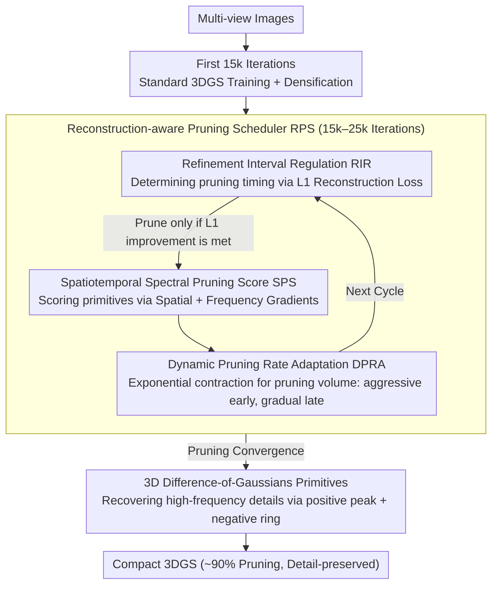

# Prune Wisely, Reconstruct Sharply: Compact 3D Gaussian Splatting via Adaptive Pruning and Difference-of-Gaussian Primitives

**Conference**: CVPR 2026  
**arXiv**: [2602.24136](https://arxiv.org/abs/2602.24136)  
**Authors**: Haoran Wang, Guoxi Huang, Fan Zhang, David Bull, Nantheera Anantrasirichai (University of Bristol)  
**Code**: Coming Soon  
**Area**: 3D Vision  
**Keywords**: 3D Gaussian Splatting, Model Pruning, Difference-of-Gaussians, Compact Representation, Novel View Synthesis

## TL;DR

This paper proposes an adaptive Reconstruction-aware Pruning Strategy (RPS) and 3D DoG primitives, achieving 90% Gaussian point reduction while maintaining rendering quality.

## Background & Motivation

3D Gaussian Splatting (3DGS) enables real-time high-fidelity rendering but typically requires a massive number of Gaussian primitives, leading to redundant representations and high resource consumption. Existing pruning methods utilize fixed pruning schedules and uniform refinement intervals, ignoring the dynamic nature of the reconstruction process. This results in unstable optimization: premature pruning removes essential primitives, while late pruning yields marginal gains. Furthermore, smooth Gaussian kernels struggle to capture fine details under compact configurations.

## Core Problem

1.  **When to prune**: Fixed pruning schedules fail to account for differences in reconstruction difficulty across different scenes.
2.  **How much to prune**: Fixed pruning ratios ignore the fact that redundancy changes throughout training.
3.  **How to evaluate importance**: Scoring based solely on the spatial domain overlooks information in the frequency domain that is critical for edges and textures.
4.  **How to maintain details**: The smoothness of standard Gaussian primitives limits detail representation after aggressive pruning.

## Method

### Overall Architecture

The proposed method addresses the dilemma of maintaining details while performing aggressive pruning (targeting 90%). The pipeline is divided into three phases: standard 3DGS training and densification for the first 15k iterations to build the scene; followed by the Reconstruction-aware Pruning Scheduler (RPS) to perform progressive "pruning-refinement" cycles until 25k iterations; and finally, the introduction of 3D-DoG primitives after pruning convergence to recover high-frequency details lost during pruning by optimizing the mixture ratio of the two primitive types. RPS answers "when, how much, and which to prune" via RIR, DPRA, and SPS components, while 3D-DoG addresses "how to preserve details post-pruning."

### Key Designs

**1. Refinement Interval Regulation RIR: Using reconstruction loss to decide when to prune instead of a fixed schedule**

Fixed iteration pruning ignores scene complexity; early pruning may delete necessary primitives, while late pruning is inefficient. RIR uses L1 reconstruction loss as a signal for adaptive triggering: the next pruning round is executed only when

$$L_1^{(t)} \leq \beta \cdot L_1^{(t-1)}, \quad \beta = 0.95$$

holds (indicating quality improvement). Otherwise, refinement continues until the condition is met or the maximum interval $Iter_{\max} = 2000$ is reached, with checks every 500 iterations. Thus, pruning timing follows the convergence rhythm of each individual scene.

**2. Dynamic Pruning Rate Adaptation DPRA: Pruning aggressively early and conservatively later**

Redundancy decreases as training progresses. Using a fixed ratio throughout is either insufficiently aggressive early on or over-prunes later. DPRA allows the target quantity for each round to follow an exponential contraction:

$$N^{(t)} = N_{\text{current}} - (N_0 - N_{\text{target}}) \cdot \frac{1}{2^t}, \qquad R^{(t)} = \frac{N_{\text{current}} - N^{(t)}}{N_{\text{current}}}$$

This results in large batches of redundancy being removed early, followed by minor refinements later, balancing compression efficiency with final quality.

**3. Spatiotemporal Spectral Pruning Score SPS: Incorporating frequency domain information into importance assessment**

Relying solely on spatial domain gradients can overlook high-frequency primitives essential for edges and textures. SPS combines spatial and frequency domain gradients for scoring:

$$\tilde{U}_i^* = \lambda_s \cdot \frac{(\nabla_{g_i} I_{\mathcal{G}})^2}{\|\tilde{U}\|_2} + \lambda_f \cdot \frac{(\nabla_{g_i} \text{FFT}(I_{\mathcal{G}}))^2}{\|\tilde{U}^f\|_2}$$

The frequency domain term is weighted by radial frequency $w(\omega) = (\|\omega\| / \omega_{\max})^{\gamma_f}$ to emphasize high frequencies, ensuring Gaussians supporting sharp structures are not pruned. This is the first instance of introducing FFT gradients for 3DGS importance evaluation.

**4. 3D Difference-of-Gaussians Primitives: Compensating for post-pruning detail loss via negative density rings**

Smooth Gaussian kernels inherently struggle to represent sharp details in sparse configurations. Inspired by DoG in classic image processing for edge detection, a new primitive is designed to model both positive and negative densities:

$$\text{DoG}(x) = G(x) - G_p(x)$$

The pseudo-Gaussian $G_p$ shares the center and rotation with the main Gaussian but has independent opacity factors $f^\alpha$ and scaling factors $[f_x^s, f_y^s, f_z^s]$. It introduces only 4 additional learnable parameters, and all factors $<1.0$ ensure the positive peak remains dominant. The "positive density peak + negative density ring" provides intrinsic contrast enhancement, increasing sensitivity to edges and textures. The associated density control activates DoG after pruning and iteratively monitors pseudo-Gaussian opacity $\alpha_p$; if it falls below a threshold, the DoG reverts to a standard Gaussian, adaptively balancing the ratio of the two primitive types.

## Key Experimental Results

| Method | Size (MB) ↓ | PSNR ↑ | SSIM ↑ | LPIPS ↓ | Training Time ↓ |
|------|------------|--------|--------|---------|-----------|
| 3DGS | 645.2 | 27.47 | 0.826 | 0.201 | 17m1s |
| MaskGaussian | 280.7 | 27.43 | 0.811 | 0.227 | 24m11s |
| PuP-3DGS | 90.6 | 26.67 | 0.786 | 0.271 | - |
| Speedy-Splat | 73.9 | 26.84 | 0.782 | 0.296 | 16m30s |
| **Ours** | **65.3** | **27.16** | **0.789** | **0.285** | **13m48s** |

*Mip-NeRF 360 Dataset, 90% Pruning Rate*

| Ablation Variants | RIR | DPRA | SPS | DoG | PSNR | SSIM | FPS |
|---------|-----|------|-----|-----|------|------|-----|
| 3DGS (100%) | ✗ | ✗ | ✗ | ✗ | 27.47 | 0.826 | 143.5 |
| V1 | ✓ | ✗ | ✗ | ✗ | 26.03 | 0.742 | 362.4 |
| V2 | ✓ | ✓ | ✗ | ✗ | 26.17 | 0.751 | 363.2 |
| V3 | ✓ | ✓ | ✓ | ✗ | 26.99 | 0.771 | 361.9 |
| **Full** | ✓ | ✓ | ✓ | ✓ | **27.16** | **0.789** | 289.0 |

## Highlights & Insights

- Adaptive pruning timing + dynamic ratios: Eliminates manual parameter tuning and adapts to varying scene complexities.
- SPS Frequency Domain Scoring: The first to integrate FFT gradients into 3DGS importance evaluation.
- 3D-DoG Negative Density Ring: Effectively utilizes the "edge enhancement" property of DoG to compensate for detail loss after pruning.
- Achieves quality close to the original after 90% pruning, with a 1.23× speedup in training and a 2× increase in inference FPS.

## Limitations & Future Work

- Slight performance degradation remains at 90% pruning in complex scenes like Bicycle.
- Temporary PSNR jitter occurs when DoG is activated (at 25k iterations), requiring subsequent iterations to recover.
- Testing on dynamic or large-scale scenes has not yet been conducted.
- Additional FFT calculations and DoG components have some impact on FPS (289 vs 362 FPS).

## Related Work & Insights

- vs **Mini-Splatting**: Mini-Splatting aggregates mixture weights for pruning scores, while SPS incorporates additional frequency domain information.
- vs **PuP-3DGS**: PuP evaluates spatial sensitivity but uses a fixed pruning schedule; the proposed method uses adaptive scheduling.
- vs **MaskGaussian**: MaskGaussian learns adaptive masks, but its model size is 4× larger than Ours.
- vs **LightGaussian**: LightGaussian is based on 2D projected area × opacity; the proposed method is more robust in the frequency domain.

## Related Papers

- DoG is the inspiration for edge detection in classic image processing (LoG approximation); its introduction into 3DGS primitive design represents cross-domain innovation.
- Frequency domain pruning scores can be generalized to other point-based representations (e.g., point cloud compression).
- Adaptive pruning strategies can be combined with model quantization and encoding methods to further compress storage.

## Rating

- Novelty: ⭐⭐⭐⭐ — DoG primitives and frequency domain scoring are innovative designs.
- Experimental Thoroughness: ⭐⭐⭐⭐ — Three standard datasets with detailed ablations.
- Writing Quality: ⭐⭐⭐⭐ — Clear structure with complete mathematical derivations.
- Value: ⭐⭐⭐⭐ — Provides practical significance for 3DGS compactification.

<!-- RELATED:START -->

## Related Papers

- [\[CVPR 2026\] SDGS: Spatial Difference Guided Gaussian Splatting for Simultaneous Localization and 3D Reconstruction](sdgs_spatial_difference_guided_gaussian_splatting_for_simultaneous_localization_.md)
- [\[CVPR 2026\] 3D Gaussian Splatting at Arbitrary Resolutions with Compact Proxy Anchors](3d_gaussian_splatting_at_arbitrary_resolutions_with_compact_proxy_anchors.md)
- [\[CVPR 2026\] CGHair: Compact Gaussian Hair Reconstruction with Card Clustering](cghair_compact_gaussian_hair_reconstruction_with_card_clustering.md)
- [\[CVPR 2026\] Off The Grid: Detection of Primitives for Feed-Forward 3D Gaussian Splatting](off_the_grid_detection_of_primitives_for_feed-forward_3d_gaussian_splatting.md)
- [\[CVPR 2026\] SpeeDe3DGS: Speedy Deformable 3D Gaussian Splatting with Temporal Pruning and Motion Grouping](speede3dgs_speedy_deformable_3d_gaussian_splatting_with_temporal_pruning_and_mot.md)

<!-- RELATED:END -->
