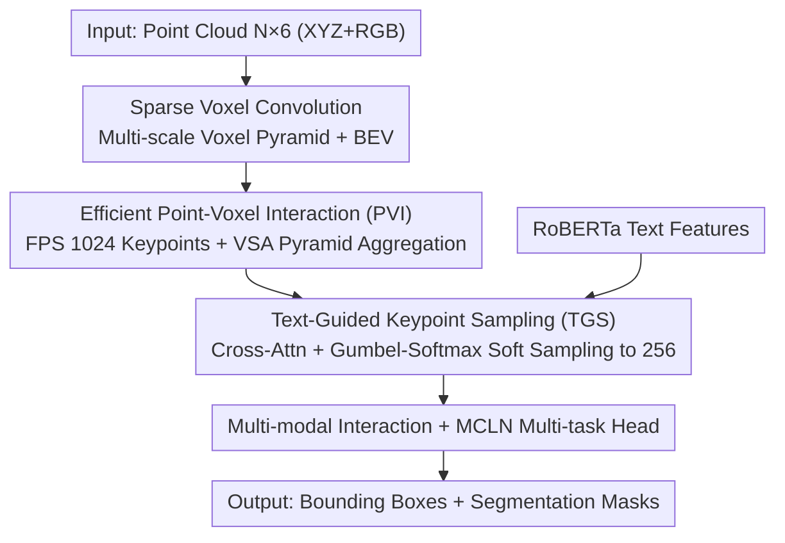

# PV-Ground: Text-Guided Point-Voxel Interaction for 3D Visual Grounding

**Conference**: CVPR 2026  
**Paper**: [CVF Open Access](https://openaccess.thecvf.com/content/CVPR2026/html/Shang_PV-Ground_Text-Guided_Point-Voxel_Interaction_for_3D_Visual_Grounding_CVPR_2026_paper.html)  
**Code**: https://github.com/AaNnWwTt/PV-Ground  
**Area**: 3D Vision  
**Keywords**: 3D Visual Grounding, Voxel Convolution, Keypoint Sampling, Text-guided, Multi-modal Fusion

## TL;DR
PV-Ground identifies that existing 3D visual grounding (3D VG) methods typically use point cloud backbones that aggressively downsample 50,000 points to 2048, creating a detail bottleneck. It introduces sparse voxel convolution to preserve high-resolution features and distills the voxel feature pyramid into compact keypoints for interaction. A text-guided differentiable soft sampling module is proposed to adaptively concentrate keypoints on task-relevant objects, improving grounding accuracy by approximately 5% on ScanRefer/ReferIt3D.

## Background & Motivation
**Background**: Typical models for 3D visual grounding (localizing target objects in a 3D scene given a free-form text query) consist of four parts: "3D Scene Encoder + Text Encoder + Multi-modal Interaction Module + Grounding Head." Most research has focused on backend multi-modal interaction—designing complex attention mechanisms, graph neural networks, or multi-task strategies—while frontend scene feature representation has long been overlooked.

**Limitations of Prior Work**: Mainstream methods still rely on point cloud backbones like PointNet++ for scene encoding. Subsequent multi-layer attention interactions computationally require **aggressive downsampling** of the original ~50,000 points to 2048 or fewer keypoints. While enabling attention, this downsampling creates a severe information bottleneck: fine-grained geometric details are lost, which is fatal for localizing small objects, partially occluded objects, or instances distinguishable only by subtle cues.

**Key Challenge**: Sparse voxel convolution is already mainstream in detection/segmentation, preserving high-resolution spatial details with efficient inference. However, direct application to 3D VG is problematic: the number of voxels in standard upsampling decoders grows **exponentially**, making dense high-resolution feature maps computationally infeasible for attention-based interaction with text. This creates a dilemma: point backbones "allow interaction but lose detail," while voxel backbones "preserve detail but prevent interaction."

**Goal**: Design an architecture that enjoys high-fidelity voxel representations while maintaining the computational convenience of keypoint-based multi-modal fusion.

**Key Insight**: The authors advocate that "voxels handle fidelity, while keypoints handle interaction." Sparse voxel convolution extracts a high-resolution scene feature pyramid, and a small set of compact keypoints serves as aggregation anchors to distill the pyramid. Furthermore, since 3D VG is a **text-conditioned** task, keypoints need not cover the entire scene uniformly; representation capability should be concentrated on regions relevant to the text description.

**Core Idea**: Integrate a voxel backbone with keypoint aggregation to bridge "fidelity $\leftrightarrow$ interaction," and use text-guided differentiable soft sampling to adaptively cluster keypoints around text-relevant objects, filtering out distractors.

## Method

### Overall Architecture
PV-Ground combines a voxel backbone with a keypoint aggregation-interaction mechanism. The input is an $N\times 6$ point cloud (XYZ + RGB), voxelized and fed into multi-layer sparse 3D convolutions. Each block downsamples with stride 2 to form a multi-scale **voxel feature pyramid** (with 8× downsampled features stacked along the Z-axis as BEV maps). Next, a set of keypoints is sampled via FPS as aggregation anchors to distill the voxel pyramid into compact keypoint features via Voxel Set Abstraction (VSA) in the Point-Voxel Interaction (PVI) module. Then, the Text-Guided Sampling (TGS) module uses RoBERTa text features to soft-sample 1024 uniform keypoints down to 256 **target-relevant** keypoints. Finally, these keypoints undergo deep multi-modal interaction and are fed into a multi-task head (following MCLN) to output bounding boxes and segmentation masks.

### Key Designs

**1. Efficient Point-Voxel Interaction (PVI): Distilling Voxel Pyramids into Compact Interactable Representations**

This is the core mechanism for bridging "fidelity" and "interactivity." The model voxelizes input points $P\in\mathbb{R}^{N\times 6}$ into a $L_v\times W_v\times H_v$ grid and extracts a voxel feature pyramid using sparse convolutions. To avoid direct cross-modal attention on dense voxel maps $F_{vox}$, Voxel-to-Keypoint aggregation is introduced: $N$ keypoints $P'\in\mathbb{R}^{N\times 3}$ are sampled via FPS to serve as anchors. For each keypoint $kp_i$, a spherical query of radius $r_l$ is defined at each pyramid layer $l$. Voxel features $\{v_j^l\}$ within the radius (satisfying $\lVert v_j^l - kp_i\rVert^2 < r_l$) are collected into set $S_i^l$ and processed via a PointNet: $f_i^l = \text{maxpool}(\text{MLP}(\mathcal{M}(S_i^l)))$, where $\mathcal{M}(\cdot)$ is random sampling of neighbor voxels. These are fused into a compact keypoint set $\mathcal{V}=\{f_i^g\}\in\mathbb{R}^{N\times C}$. Unlike "hard pruning" in TSP3D, this **soft aggregation** preserves information.

**2. Text-Guided Keypoint Sampling (TGS): Adaptive Clustering of Keypoints on Relevant Objects**

FPS samples keypoints uniformly, which is optimal for detection but sub-optimal for text-conditioned 3D VG. TGS redistributes keypoints toward text-relevant candidates. Initial point features $V$ and text features $T$ undergo cross-attention: $V_t = \text{CrossAtt}(V, \text{SelfAtt}(T))$. A fully connected layer then predicts sampling weights $SW\in\mathbb{R}^{N\times n}$. **Gumbel-Softmax** reparameterization is used to convert discrete sampling into differentiable soft assignment: $SW_{gs}=\text{softmax}((\log(SW)+g)/\tau)$. This allows $n \ll N$ target-relevant keypoints $P_k$ and $V_k$ to be derived through weighted soft-sampling. Unlike Top-K "hard selection" (e.g., EDA/3D-SPS), soft sampling allows the model to utilize all potential features and remain end-to-end trainable.

**3. Multi-task Regression Head: Reusing MCLN for Boxes and Masks**

The keypoint features $V_k$ from TGS can be integrated into existing point-based frameworks. This work adopts the decoder and prediction head from MCLN due to its strong performance and multi-task design, outputting both bounding boxes and segmentation masks. The authors also verified that feeding these keypoint features into other decoders (e.g., BUTD-DETR, EDA) yields consistent gains, proving PV-Ground is a plug-and-play frontend improvement.

### Loss & Training
The model is trained on a single RTX 4090 with a batch size of 10. Input point cloud XYZ is cropped to $[-8,-8,-0.2]\sim[8,8,3.8]$ m with a voxel resolution of 0.02 m. $N=1024$ initial keypoints are sampled via FPS, and VSA uses radii $r_l=[0.2,0.4,0.8,1.6]$ m. TGS soft-samples $n=256$ keypoints. The Gumbel temperature $\tau$ is set to $1.0$. Multi-task losses follow MCLN.

## Key Experimental Results

### Main Results
Using point-based MCLN as the main baseline (†) on ScanRefer, the gains in the single-stage pipeline are particularly significant:

| Dataset | Config | Method | Acc@0.25 | Acc@0.5 |
|--------|------|------|------|------|
| ScanRefer | Single-stage Overall | MCLN† | 54.30 | 42.64 |
| ScanRefer | Single-stage Overall | TSP3D | 56.45 | 46.71 |
| ScanRefer | Single-stage Overall | **PV-Ground** | **59.31 (+5.0)** | **47.77 (+5.1)** |
| ScanRefer | Two-stage Overall | MCLN† | 57.17 | 45.53 |
| ScanRefer | Two-stage Overall | **PV-Ground** | **59.87 (+2.7)** | **47.56 (+2.0)** |

On ReferIt3D: Single-stage Nr3D 51.3 vs. MCLN 45.7 (+5.6). For referring segmentation (ScanRefer), PV-Ground achieves 62.2/54.8 Acc@0.25/0.5 and 47.9 mIoU, outperforming MCLN (58.7/50.7, 44.7).

### Ablation Study
Single-stage ScanRefer, incrementally adding PVI and TGS (Baseline is point-based MCLN):

| ID | PVI | TGS | Grounding 0.25 | Grounding 0.5 | Seg mIoU |
|------|------|------|------|------|------|
| (a) | | | 54.30 | 42.64 | 43.49 |
| (b) | ✓ | | 56.33 | 45.19 | 44.75 |
| (c) | | ✓ | 58.15 | 47.23 | 46.72 |
| (d) | ✓ | ✓ | **59.31** | **47.77** | **47.73** |

### Key Findings
- **Modules are Complementary**: Adding only PVI (b) improves Acc@0.25 from 54.30 to 56.33. Adding only TGS (c) reaches 58.15. Combining both (d) yields 59.31.
- **TGS Contribution**: TGS contributes even more than PVI significantly. Using TGS even with a PointNet++ backbone (c) brings major gains, validating the importance of filtering distractors in text-conditioned tasks.
- **Gains in Difficult Scenarios**: Improvements are most pronounced in the "multiple" (distractor-heavy) setting where fine-grained details and de-noising are critical.
- **Visualization**: FPS seeds cover the entire scene uniformly, while TGS keypoints accurately cluster around described objects (sofa, door, sink, toilet).

## Highlights & Insights
- **Revisiting the Frontend**: While most research focuses on backend interaction, this work targets "scene feature representation," a long-neglected bottleneck.
- **Point-Voxel Synergy**: Voxel fidelity + Keypoint interactivity. Distilling exponentially expanding voxels into a fixed number of keypoints bypasses the computation limits of dense voxel-text attention.
- **Soft Sampling over Hard Selection**: Gumbel-Softmax enables differentiable allocation, allowing "unselected" points to still propagate gradients, mitigating irreversible information loss from Top-K pruning.
- **Plug-and-play Frontend**: The keypoint features can replace queries in existing decoders like BUTD-DETR or EDA to provide similar gains.

## Limitations & Future Work
- **Dependency on Existing Heads**: Decoding and regression reuse MCLN; the contribution is concentrated on representation rather than grounding head innovation.
- **Computational Overhead**: Voxel convolution + VSA + TGS adds complexity over point-only backbones. Detailed throughput/latency comparisons are limited.
- **Hyperparameter Sensitivity**: Robustness of parameters like keypoint count (1024 to 256) and temperature $\tau$ across diverse datasets requires further study.
- **Scene Scale**: Focused on indoor ScanNet; generalization to large-scale outdoor scenes or open-vocabulary descriptions remains to be seen.

## Related Work & Insights
- **vs. MCLN (Baseline)**: MCLN uses point backbones limited by aggressive downsampling; PV-Ground replaces the frontend for better fidelity and task-relevance.
- **vs. TSP3D**: TSP3D uses hard pruning of voxels which risks deleting small objects; PV-Ground uses soft aggregation and differentiable sampling.
- **vs. EDA / 3D-SPS**: These use Top-K hard selection; PV-Ground adapts differentiable soft assignment, allowing all points to participate in learning.
- **vs. PointNet++**: The core argument is that point backbone downsampling is a systemic bottleneck for 3D VG.

## Rating
- Novelty: ⭐⭐⭐⭐ First point-voxel framework for 3D VG + text-guided soft sampling.
- Experimental Thoroughness: ⭐⭐⭐⭐ Covers multiple datasets, tasks, and stages with clear ablations.
- Writing Quality: ⭐⭐⭐⭐ Compelling motivation and visualizations; formulas are complete.
- Value: ⭐⭐⭐⭐ Practical plug-and-play frontend that shifts the focus back to representation.

<!-- RELATED:START -->

## Related Papers

- [\[CVPR 2025\] Text-Guided Sparse Voxel Pruning for Efficient 3D Visual Grounding](../../CVPR2025/3d_vision/text-guided_sparse_voxel_pruning_for_efficient_3d_visual_grounding.md)
- [\[CVPR 2026\] EG-3DVG: Expression and Geometry Aware Grounding Decoder for 3D Visual Grounding](eg-3dvg_expression_and_geometry_aware_grounding_decoder_for_3d_visual_grounding.md)
- [\[CVPR 2026\] ORD: Object-Relation Decoupling for Generalized 3D Visual Grounding](ord_object-relation_decoupling_for_generalized_3d_visual_grounding.md)
- [\[CVPR 2026\] S$^2$-MLLM: Boosting Spatial Reasoning Capability of MLLMs for 3D Visual Grounding with Structural Guidance](s2-mllm_boosting_spatial_reasoning_capability_of_mllms_for_3d_visual_grounding_w.md)
- [\[CVPR 2026\] MonoVLM: Monocular 3D Visual Grounding with Vision Language Models](monovlm_monocular_3d_visual_grounding_with_vision_language_models.md)

<!-- RELATED:END -->
