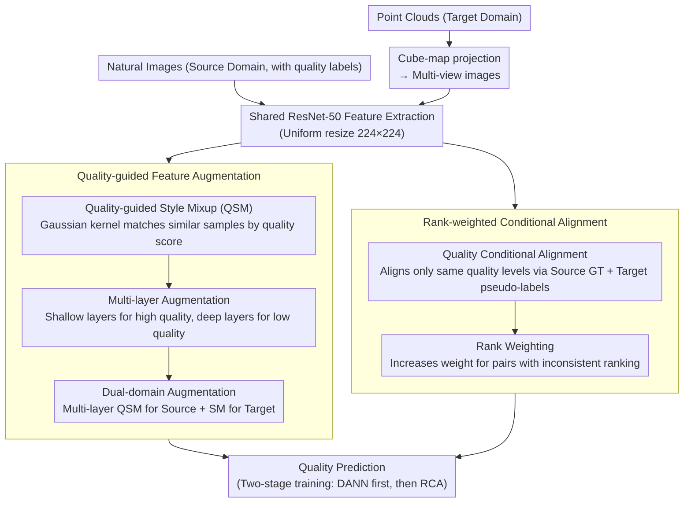

# QD-PCQA: Quality-Aware Domain Adaptation for Point Cloud Quality Assessment

**Conference**: CVPR 2026  
**arXiv**: [2603.03726](https://arxiv.org/abs/2603.03726)  
**Authors**: Guohua Zhang, Jian Jin, Meiqin Liu, Chao Yao, Weisi Lin (BJTU, NTU, USTB)  
**Code**: TBD  
**Area**: 3D Vision  
**Keywords**: Point cloud quality assessment, unsupervised domain adaptation, quality-aware feature alignment, cross-domain transfer

## TL;DR

Ours proposes QD-PCQA, a quality-aware domain adaptation framework that transfers quality assessment priors from the image domain to the point cloud domain through two strategies: Rank-weighted Conditional Alignment and Quality-guided Feature Augmentation.

## Background & Motivation

No-reference point cloud quality assessment (NR-PCQA) faces generalization challenges due to the scarcity of annotated data. Since the human visual system (HVS) perceives quality regardless of media type, unsupervised domain adaptation (UDA) can transfer labeled quality priors from the image domain to the point cloud domain. However, existing UDA-based PCQA methods (e.g., IT-PCQA) inherit feature alignment strategies directly from image classification, ignoring the specificities of quality assessment:

- **Quality-agnostic feature alignment**: Samples with similar semantics but different quality levels might be incorrectly aligned.
- **Quality-agnostic feature augmentation**: Style Mixup uses random blending without considering quality information.
- **Layer-agnostic feature augmentation**: Augmentation is only performed at the final layer, ignoring hierarchical complementarity.
- **Augmentation imbalance**: Only augmenting source domain features potentially widens the domain gap.

## Core Problem

The challenge lies in maintaining quality awareness during domain adaptation—ensuring both consistent quality levels during feature alignment and model sensitivity to quality ranking.

## Method

### Overall Architecture

QD-PCQA addresses the issues of annotation scarcity and poor generalization in NR-PCQA. The core idea is to transfer labeled quality priors from the image domain to the point cloud domain via UDA while maintaining "quality awareness." Specifically, 3D point clouds are projected onto six faces of a cube to generate multi-view images, which are resized to $224 \times 224$ along with natural images to share a ResNet-50 for feature extraction. During training, Quality-guided Feature Augmentation (QFA) enhances features based on quality scores, while Rank-weighted Conditional Alignment (RCA) performs quality-conditioned alignment, ensuring that source (image) quality knowledge is transferred to the target (point cloud) domain under consistent quality levels.

### Key Designs

**1. Quality-guided Feature Augmentation: Preserving quality information during augmentation**

Existing methods apply Style Mixup from image classification, which involves random blending, occurs only at the last layer, and augments only the source domain. This mixes samples of different qualities and widens the domain gap. QFA introduces three corrections: First, Quality-guided Style Mixup (QSM) replaces random pairing with a Gaussian kernel to find samples with similar quality scores:

$$P((x_s^{i^*}, y_s^{i^*}) \mid (x_s^i, y_s^i)) \propto \exp\!\Big(-\frac{(y_s^i - y_s^{i^*})^2}{2\tau^2}\Big)$$

The style statistics and labels are then mixed $f_s^{\text{mix}} = \sigma(f)^{\text{mix}} \frac{f_s^i - u(f_s^i)}{\sigma(f_s^i)} + u(f)^{\text{mix}}$, ensuring quality consistency after augmentation. Second, Multi-Layer Extension applies QSM hierarchically: Stage 1 matches high-quality samples (shallow layers are sensitive to low-level distortions), Stages 2-3 match medium-quality, and Stage 4 matches low-quality (deep layers capture high-level semantics). Third, Dual-Domain Augmentation applies multi-layer QSM to the source domain and standard SM to the target domain after Stage 4, mitigating imbalance and forcing the discriminator to extract more robust domain-invariant features.

**2. Rank-weighted Conditional Alignment: Aligning same quality levels and correcting ranking errors**

Standard global alignment may incorrectly align samples with similar semantics but different quality. RCA is built upon Conditional Operator Discrepancy (COD) but introduces a rank weighting matrix:

$$\tilde{\mathbf{K}}_X^{st}(i,j) = k(f_s^i, f_t^j) \cdot (1 + \mathbf{W}^{st}(i,j)), \qquad \mathbf{W}^{st}(i,j) = \max\big(0, -(\hat{y}_s^i - \hat{y}_t^j) \cdot \text{sign}(y_s^i - y_t^j)\big)$$

It uses source ground truth and target pseudo-labels as conditions to align features only within the same quality levels. Furthermore, it increases the weight for sample pairs where "predicted ranking is inconsistent with actual ranking," specifically correcting ranking biases during domain transfer.

### Loss & Training

A two-stage training strategy is adopted to avoid contaminating RCA with unreliable early pseudo-labels: Stage 1 (first 5000 iterations) uses only DANN for initial feature alignment without pseudo-labels; Stage 2 introduces RCA once the model stabilizes, utilizing more reliable pseudo-labels for fine-grained alignment. The total loss combines quality prediction, domain discrimination, and ranking:

$$\mathcal{L}_{\text{all}}^{\text{mix}} = \lambda_1 \mathcal{L}_P(\hat{y}_s^{\text{mix}}, y_s^{\text{mix}}) + \lambda_2 \mathcal{L}_D(f_s^{\text{mix}}, f_t^{\text{mix}}) + \lambda_3 \mathcal{L}_R(y_s, y_t, f_s, f_t)$$

The mixed version is applied with probability $p > 0.5$, otherwise the original version is used.

## Key Experimental Results

| Method | Mode | TID2013→SJTU-PCQA PLCC | SROCC | TID2013→WPC PLCC | SROCC |
|------|------|----------------------|-------|-----------------|-------|
| No Adapt | I-to-PC | 0.548 | 0.444 | 0.320 | 0.296 |
| DANN | I-to-PC | 0.596 | 0.512 | 0.325 | 0.296 |
| IT-PCQA | I-to-PC | 0.693 | 0.636 | 0.429 | 0.403 |
| COD | I-to-PC | 0.712 | 0.611 | 0.426 | 0.396 |
| **QD-PCQA** | **I-to-PC** | **0.842** | **0.753** | **0.563** | **0.572** |

| Method | KADID→SJTU-PCQA PLCC | SROCC | KADID→WPC PLCC | SROCC |
|------|---------------------|-------|---------------|-------|
| IT-PCQA | 0.703 | 0.641 | 0.432 | 0.402 |
| **QD-PCQA** | **0.843** | **0.724** | **0.553** | **0.534** |

*QD-PCQA outperforms IT-PCQA by approximately 21% (PLCC) on SJTU-PCQA.*

## Highlights & Insights

- **End-to-end quality awareness**: Quality scores guide the process from feature augmentation to feature alignment.
- **Rational hierarchical augmentation**: Leverages the complementary sensitivity of different layers to various quality levels.
- **Rank weighting mechanism**: Focuses on "rank-inconsistent" hard sample pairs, precisely correcting ranking biases in domain transfer.
- **Two-stage training**: Prevents the negative impact of unreliable early pseudo-labels on RCA.

## Limitations & Future Work

- Projecting point clouds into six orthogonal views may lose 3D structural information.
- Pseudo-label quality depends on the first-stage model performance; better pseudo-label generation strategies could be explored.
- Verification is limited to SJTU-PCQA and WPC datasets.
- Fixed quantiles (33%/67%) are used for quality layering; adaptive layering could be investigated.

## Related Work & Insights

- vs **IT-PCQA**: IT-PCQA only uses DANN for global alignment, ignoring quality conditions; QD-PCQA adds quality conditional alignment and rank weighting.
- vs **StyleAM**: StyleAM introduces SM but with random mixing; QD-PCQA uses QSM to maintain quality consistency.
- vs **COD**: COD performs conditional alignment but treats all sample pairs with equal weight; QD-PCQA emphasizes samples with ranking biases.

## Rating

- Novelty: ⭐⭐⭐⭐ — Quality-aware domain adaptation is a significant innovation in the PCQA field.
- Experimental Thoroughness: ⭐⭐⭐ — Limited datasets; lacks validation on large-scale point cloud datasets.
- Writing Quality: ⭐⭐⭐⭐ — Problems are clearly defined with well-motivated modules.
- Value: ⭐⭐⭐⭐ — Provides new insights for improving the generalization of PCQA.

<!-- RELATED:START -->

## Related Papers

- [\[CVPR 2026\] PR-IQA: Partial-Reference Image Quality Assessment for Diffusion-Based Novel View Synthesis](pr-iqa_partial-reference_image_quality_assessment_for_diffusion-based_novel_view.md)
- [\[AAAI 2026\] Multi-Modal Assistance for Unsupervised Domain Adaptation on Point Cloud 3D Object Detection](../../AAAI2026/3d_vision/multi-modal_assistance_for_unsupervised_domain_adaptation_on_point_cloud_3d_obje.md)
- [\[CVPR 2026\] Mamba Learns in Context: Structure-Aware Domain Generalization for Multi-Task Point Cloud Understanding](mamba_learns_in_context_structure-aware_domain_generalization_for_multi-task_poi.md)
- [\[CVPR 2026\] CLIPoint3D: Language-Grounded Few-Shot Unsupervised 3D Point Cloud Domain Adaptation](clipoint3d_language-grounded_few-shot_unsupervised_3d_point_cloud_domain_adaptat.md)
- [\[CVPR 2026\] MV2UV: Generating High-quality UV Texture Maps with Multiview Prompts](mv2uv_generating_high-quality_uv_texture_maps_with_multiview_prompts.md)

<!-- RELATED:END -->
