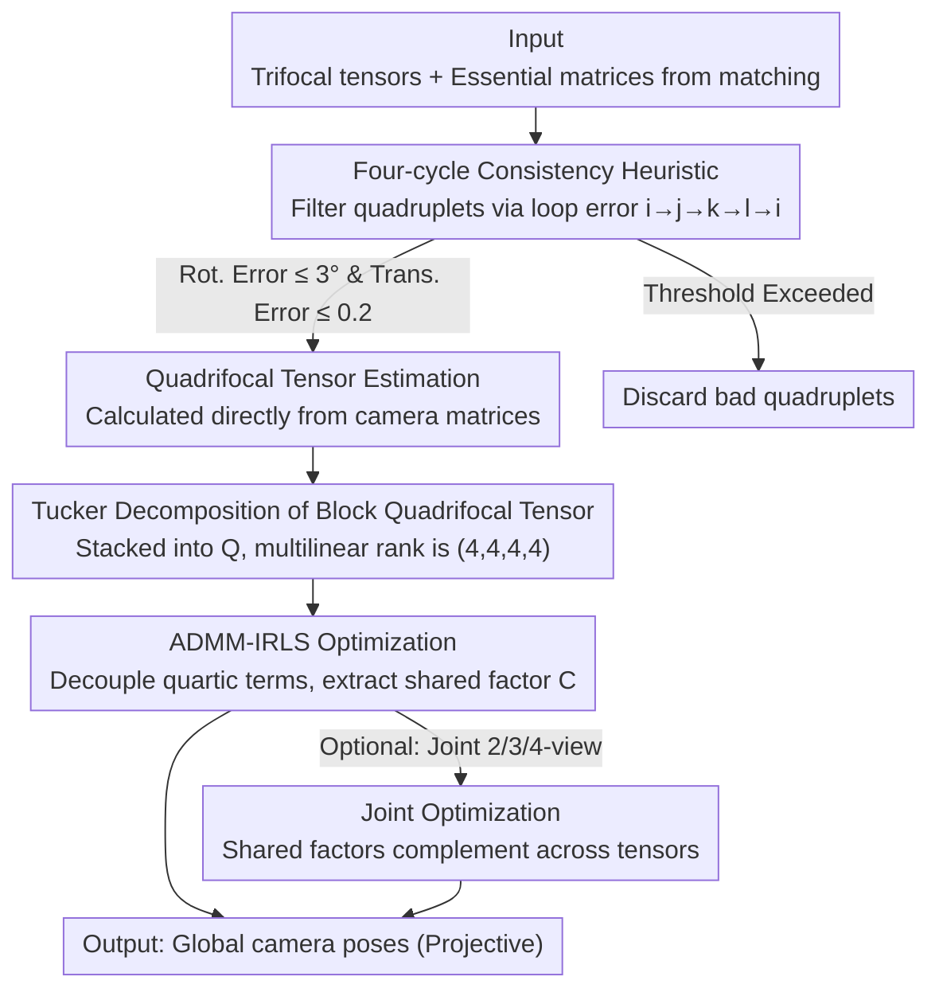

# QuadSync: Quadrifocal Tensor Synchronization via Tucker Decomposition

**Conference**: CVPR 2026  
**arXiv**: [2602.22639](https://arxiv.org/abs/2602.22639)  
**Code**: None  
**Area**: 3D Vision  
**Keywords**: Quadrifocal Tensor, Tucker Decomposition, Structure from Motion, Global Synchronization, Multi-view Geometry

## TL;DR

Ours proposes QuadSync, the first global synchronization algorithm for quadrifocal tensors. By constructing a block quadrifocal tensor and proving it admits a Tucker decomposition with multilinear rank $(4,4,4,4)$, the method utilizes an ADMM-IRLS optimization framework to recover camera poses from four-view measurements. It achieves superior synchronization accuracy compared to two-view and three-view methods in dense-view scenarios.

## Background & Motivation

### Background

Structure from Motion (SfM) is a core task in 3D computer vision. Traditional SfM pipelines include feature detection, matching, relative pose estimation, synchronization, and reconstruction. Global synchronization methods avoid the error accumulation issues of incremental approaches by processing all cameras simultaneously. Existing global methods are primarily based on two-view measurements (fundamental/essential matrices), with a few recent works based on trifocal tensors (e.g., TrifocalSync).

### Limitations of Prior Work

- **Limited Two-view Information**: Fundamental/essential matrices only encode geometric relationships between two views, providing relatively weak constraints.
- **Collinear Degeneracy**: When camera centers are collinear, the rank of the multi-view fundamental matrix $\mathcal{F}^n$ drops from 6 to 4, and the multilinear rank of the trifocal tensor also degenerates, causing pose recovery to fail.
- **Underutilized Higher-order Information**: Although quadrifocal tensors encode richer four-view geometry and contain both two-view and three-view information, they have long been considered to have "only theoretical significance and no practical value."

### Key Challenge

Higher-order tensors (quadrifocal tensors) theoretically contain stronger geometric constraints, encoding complete relationships between four views and encompassing two-view and three-view information. However, an effective synchronization theoretical framework and practical algorithms have been lacking.

### Goal

- Establish an algebraic constraint theory (low-rank decomposition structure) for block quadrifocal tensors.
- Globally recover camera poses from a set of quadrifocal tensors.
- Jointly utilize two, three, and four-view measurements to improve synchronization accuracy.

### Key Insight

From the perspective of Tucker decomposition, ours proves that the block quadrifocal tensor possesses a low-rank structure with multilinear rank $(4,4,4,4)$, where the factor matrices are precisely the stacked camera matrices. This transforms the synchronization problem into a constrained tensor decomposition optimization problem.

### Core Idea

Construct a block quadrifocal tensor $\mathcal{Q}^n \in \mathbb{R}^{3n \times 3n \times 3n \times 3n}$ and prove it admits a Tucker decomposition $\mathcal{Q}^n = \mathcal{G}_Q \times_1 C \times_2 C \times_3 C \times_4 C$, where $C \in \mathbb{R}^{3n \times 4}$ is the stacked camera matrix. Compared to two-view (rank 6) and three-view (multilinear rank $(6,4,4)$) cases, the four modes of the quadrifocal tensor share the same factor matrix $C$, and the core tensor $\mathcal{G}_Q$ is a fixed sparse tensor, providing the strongest constraints.

## Method

### Overall Architecture

1. **Input**: Trifocal tensors and essential matrices estimated from feature matching.
2. **Quadrifocal Tensor Estimation**: Filter reliable quadruplets using a four-cycle consistency heuristic from trifocal tensors, then calculate quadrifocal tensors directly from camera matrices.
3. **Block Quadrifocal Tensor Construction**: Stack all quadrifocal tensors into $\mathcal{Q}^n$ by index.
4. **QuadSync Optimization**: Solve for scales and camera matrices using an ADMM-IRLS framework.
5. **Joint Optimization (Optional)**: Simultaneously synchronize block quadrifocal, trifocal, and essential matrices.
6. **Output**: Global camera poses (projective reconstruction).

### Key Designs

**1. Tucker Decomposition of Block Quadrifocal Tensors: Translating synchronization into tensor decomposition**

The validity of the method relies on an algebraic fact: when all quadrifocal tensors are stacked into a block tensor $\mathcal{Q}^n$ according to view indices, it admits a clean Tucker decomposition. Each element of a quadrifocal tensor is essentially a $4 \times 4$ determinant formed by specific rows of four camera projection matrices $(Q_{ijkl})^{pqrs} = \det[P_i^p;\, P_j^q;\, P_k^r;\, P_l^s]$. Stacking these blocks yields:

$$\mathcal{Q}^n = \mathcal{G}_Q \times_1 C \times_2 C \times_3 C \times_4 C$$

All four modes share the same factor matrix $C \in \mathbb{R}^{3n \times 4}$ (the stacked camera matrices), while the core tensor $\mathcal{G}_Q \in \mathbb{R}^{4 \times 4 \times 4 \times 4}$ is a fixed sparse tensor with entries in $\{-1, 0, 1\}$. This implies that recovering camera poses is equivalent to extracting the shared factor $C$ from the block tensor. Crucially, the multilinear rank remains $(4,4,4,4)$ as long as cameras are not co-centric, making it superior to lower-order methods: two-view rank drops from 6 to 4 and three-view rank drops from $(6,4,4)$ to $(5,4,4)$ in collinear cases, whereas the quadrifocal rank structure is naturally immune to collinearity.

**2. ADMM-IRLS Optimization: Breaking quartic coupling into solvable subproblems**

With the decomposition established, the difficulty lies in solving for $C$ from noisy measurements with unknown scales. The problem is quartic in $C$ and non-convex due to the unknown scale $\Lambda$ for each block. Ours introduces auxiliary variables $C_1=C_2=C_3=C_4=B$ to decouple the terms and employs two iterative layers: an outer IRLS (Iteratively Re-weighted Least Squares) for robustness, converting the $L_1$ norm into weighted least squares to suppress outliers; and an inner ADMM to relax the constraints $C_i=B$ into an augmented Lagrangian. This transforms a difficult quartic non-convex problem into a sequence of stable subproblems with closed-form or simple convex solutions.

**3. Joint Optimization: Complementing views via shared camera matrices**

There is a practical trade-off: quadrifocal tensors provide the strongest constraints but are the hardest to estimate and most sparse; two-view data is abundant but provides the weakest constraints. Joint optimization synchronizes information from all three orders by sharing factors: the block quadrifocal and trifocal tensors share the camera matrix $C$, while trifocal and essential matrices share the line projection matrix $\mathcal{P}$. The objective is a weighted sum of three loss terms, normalized by the number of observed blocks to balance the different data scales. This allows higher-order constraints to ensure precision while lower-order data ensures coverage in sparse regions.

**4. Four-cycle Consistency Heuristic: Using trifocal tensors as a proxy for quality control**

Quadrifocal tensors lack a direct robust estimator like RANSAC. To prevent bad quadruplets from polluting the block tensor, ours uses trifocal tensors for indirect evaluation. Given four trifocal tensors $T_{ijk}, T_{jkl}, T_{kli}, T_{lij}$, the algorithm aligns projective coordinates along the loop $i \to j \to k \to l \to i$ and measures the inconsistency in rotation and translation upon returning to the start. Quadruplets with rotation error $>3^\circ$ or translation error $>0.2$ are discarded.

### Loss & Training

- **QuadSync Loss**: $\sum_{(i,j,k,l) \in \Omega} \| \Lambda_{ijkl} \tilde{\mathcal{Q}}^n_{ijkl} - \llbracket \mathcal{G}_Q; C, C, C, C \rrbracket_{ijkl} \|_F$ ($L_1$ norm to reduce outlier impact).
- **Constraint**: Scales $\Lambda$ are symmetric and normalized $\|\Lambda\|_F^2 = 1$ (to avoid trivial solutions).
- **Initialization**: Use HOSVD to extract the first 4 singular vectors as initial estimates of the camera matrix.
- **Hyperparameters**: $\rho = 0.01$ (QuadSync), 4 IRLS iterations, 1 ADMM iteration per IRLS; $\rho = 0.00001$ for Joint Opt with 2 IRLS iterations.

## Key Experimental Results

### Main Results

**Table 1: Mean Position Error on ETH3D Dataset (11 Scenes)**

| Method | Best/Near-best Scenes | Background |
| :--- | :--- | :--- |
| NRFM | - | Two-view fundamental matrix sync |
| MPLS+LUD | - | Stepwise Rot + Position sync |
| MPLS+BATA | - | Rot + Robust position sync |
| TrifocalSync | - | Trifocal tensor sync |
| MPLS+Cycle-Sync | - | Rot + Higher-order cycle sync (SOTA) |
| **QuadSync** | **7/11** | Quadrifocal tensor sync |
| **Joint Opt.** | **7/11** | Joint 2/3/4-view sync |

**Table 2: Mean Position Error on EPFL Dataset (6 Scenes)**

| Method | Best/Near-best Scenes | Background |
| :--- | :--- | :--- |
| TrifocalSync | - | Three-view baseline |
| MPLS+Cycle-Sync | - | Current SOTA |
| **QuadSync** | **4/6** | Best performance in dense views |
| **Joint Opt.** | **4/6** | Complementary to QuadSync |

### Ablation Study

- **Density Dependence**: When the observation rate of quadrifocal tensors is $>70\%$, QuadSync/Joint Opt significantly outperforms SOTA; performance drops when rate is $<30\%$.
- **Collinear Configuration**: On the near-collinear `plant_scene_1` sub-sequence of ETH3D SLAM, QuadSync successfully recovers poses while two-view methods (fundamental matrix) fail completely.
- **Random Sampling Acceleration**: Randomly sampling $m = O(1)$ columns for row updates of $C_i$ significantly accelerates the process without loss of accuracy, as low-rank is independent of camera count.

### Key Findings

1. Quadrifocal tensor synchronization consistently outperforms or matches all baselines in position accuracy on dense view graphs (observation rate $>70\%$).
2. Joint optimization further utilizes complementary information from different orders, compensating for QuadSync's scarcity in some sparse scenes.
3. Quadrifocal tensors are naturally immune to collinear degeneracy—the multilinear rank $(4,4,4,4)$ is unaffected by camera collinearity.
4. HOSVD initialization is empirically sufficient despite the non-convexity, avoiding the complex initialization required by two-view methods.

## Highlights & Insights

1. **Solid Theoretical Contribution**: Completely establishes the Tucker decomposition theory for block quadrifocal tensors, proving algebraic properties like multilinear rank, projection rank, and scale determinability.
2. **Collinearity Immunity**: This is the most fundamental advantage over two-view and three-view methods—the four modes of the quadrifocal tensor share the same factor matrix symmetrically, preventing degradation in collinear cases.
3. **Elegant Structure of Increasing Constraints**: $\text{codim}(Q) = \Omega(n^4) > \text{codim}(T) = \Omega(n^3) > \text{codim}(E) = \Omega(n^2)$. Higher-order measurements provide exponentially growing constraints on the low-rank manifold.
4. **Unified Perspectives in Joint Framework**: Integrates synchronization of 2/3/4-view tensors into a single optimization problem via shared factor matrices, elegantly leveraging information of various orders.

## Limitations & Future Work

1. **Dependence on Dense View Graphs**: Estimating quadrifocal tensors requires enough inlier features shared across four views; performance drops in sparse scenes.
2. **Indirect Quadrifocal Estimation**: Currently estimated indirectly via trifocal tensors, which introduces noise. Robust direct estimation from point/line correspondences remains an open problem.
3. **High Computational Cost**: The block quadrifocal tensor is a 4th-order tensor of size $3n \times 3n \times 3n \times 3n$, with $O(n^4)$ variables, which is challenging for large-scale scenes.
4. **Lack of Distributed Methods**: While the paper mentions scaling via distributed sync, a complete solution is not provided.
5. **Limited Validation**: Experiments are limited to calibrated cameras; performance in uncalibrated scenarios is unknown.

## Related Work & Insights

- **TrifocalSync** [35]: The direct predecessor, establishing Tucker decomposition and sync for block trifocal tensors. QuadSync is its natural 4th-order extension.
- **COLMAP/GLOMAP** [42, 39]: Mainstream SfM pipelines; ours can serve as a replacement for their synchronization modules.
- **Cycle-Sync** [32]: Recent SOTA for position sync using higher-order cycle consistency. Shared philosophy but does not directly operate on high-order tensors.
- **NRFM** [45]: Classic multi-view fundamental matrix synchronization (rank 6 constraint), the 2nd-order counterpart to QuadSync.
- **Insight**: The trend of using higher-order geometric quantities (trifocal $\to$ quadrifocal) for stronger constraints is clear. Can this be extended to 5th-order? Or integrated with learned feature matchers like GlueStick?

## Rating

⭐⭐⭐⭐ Strong theoretical contribution, establishing the first algebraic framework for quadrifocal tensor synchronization and proving its utility. However, reliance on dense views and indirect estimation limits current large-scale application.

<!-- RELATED:START -->

## Related Papers

- [\[CVPR 2026\] Reparameterized Tensor Ring Functional Decomposition for Multi-Dimensional Data Recovery](reparameterized_tensor_ring_functional_decomposition_for_multi-dimensional_data_.md)
- [\[CVPR 2026\] Learning Convex Decomposition via Feature Fields](learning_convex_decomposition_via_feature_fields.md)
- [\[CVPR 2026\] LuxRemix: Lighting Decomposition and Remixing for Indoor Scenes](luxremix_lighting_decomposition_and_remixing_for_indoor_scenes.md)
- [\[CVPR 2026\] Multi-modal Frequency Decomposition Network for Semantic Scene Completion](multi-modal_frequency_decomposition_network_for_semantic_scene_completion.md)
- [\[CVPR 2026\] X-Part: High Fidelity And Structure Coherent Shape Decomposition And Completion](x-part_high_fidelity_and_structure_coherent_shape_decomposition_and_completion.md)

<!-- RELATED:END -->
