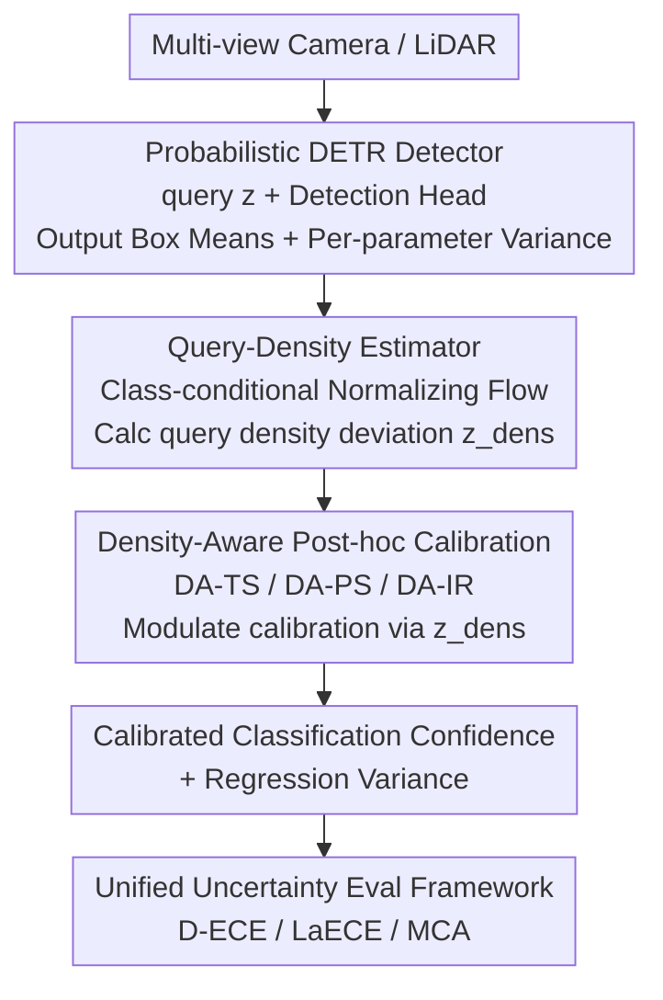

# Query2Uncertainty: Robust Uncertainty Quantification and Calibration for 3D Object Detection under Distribution Shift

**Conference**: CVPR 2026  
**arXiv**: [2605.05328](https://arxiv.org/abs/2605.05328)  
**Code**: https://tillbeemelmanns.github.io/query2uncertainty/ (Available)  
**Area**: 3D Vision / Autonomous Driving / Uncertainty Estimation  
**Keywords**: 3D Object Detection, Post-hoc Calibration, Distribution Shift, Feature Density, Normalizing Flows

## TL;DR
Addressing the "overconfidence and calibration failure" of DETR-style 3D detectors under distribution shifts (e.g., rain or snow), this paper utilizes Normalizing Flows to estimate the feature density of object queries. This density signal is injected into post-hoc calibrators like Temperature Scaling, Platt Scaling, and Isotonic Regression, allowing calibration intensity to adaptively adjust based on "how far the query is from the training distribution." This approach simultaneously calibrates classification confidence and 3D box regression variance, outperforming standard post-hoc methods on both nuScenes (in-distribution) and MultiCorrupt (distribution shift).

## Background & Motivation

**Background**: Autonomous driving perception stacks output 3D boxes detected from LiDAR or multi-view cameras, providing semantic classes, centers, sizes, and orientations to downstream modules like tracking, collision avoidance, and V2X fusion. To treat these predictions as probabilistic signals for fusion, detectors must provide not only boxes but also "trustworthy uncertainty"—where confidence reflects detection accuracy and variance reflects localization precision.

**Limitations of Prior Work**: Modern deep detectors are generally **overconfident**, showing a severe misalignment between confidence and true accuracy. **Post-hoc calibration** (e.g., Temperature Scaling (TS), Platt Scaling, Isotonic Regression) is the most common remedy—remapping outputs using a calibration set without retraining the model. However, these methods assume that test data is independent and identically distributed (i.D.) relative to the calibration data. Under **distribution shifts** (e.g., rain, snow, sensor degradation), static calibrators apply identical corrections to all inputs, causing performance to revert to uncalibrated levels.

**Key Challenge**: Post-hoc calibrators are "globally static," learning statistical corrections for in-distribution data. Distribution shifts imply that different samples deviate from the training distribution to varying degrees, requiring different levels of correction. There is a fundamental conflict between static correction and sample-level shift adaptivity. While "feature density" has been used in image classification to make calibration OOD-sensitive, **density-aware logic has not yet been applied to probabilistic 3D box detection to simultaneously calibrate classification and regression uncertainty**.

**Goal**: This work addresses three sub-problems: (1) Lack of a unified benchmark to evaluate classification and regression uncertainty quality in 3D detection; (2) Finding a compact feature to characterize "how far a sample is from the training distribution"; (3) Injecting this shift signal into existing calibrators for stability under both IID and OOD conditions.

**Key Insight**: The authors observe that **object queries** in DETR-style detectors are ideal carriers for density estimation. Each query is a position-aware, category-aware compact latent vector ($D=256$) that drives the prediction of class, location, size, and orientation. Estimating density in the query feature space reveals "how much a detection hypothesis resembles a true positive from the training set."

**Core Idea**: Use Normalizing Flows to fit class-conditional densities on **true positive query features**. During inference, the query's density deviation `z_dens` is used as a modulation signal injected into TS/PS/IR calibrators. This allows the calibration amount to adapt "on-demand"—remaining sharp and confident in high-density (familiar) regions while automatically becoming conservative in low-density (shifted) regions.

## Method

### Overall Architecture
Query2Uncertainty does not modify the detector backbone but adds a "density-aware calibration" attachment to standard DETR-style 3D detectors. The framework consists of three parts: A **probabilistic detector** extracts tokens from multi-view cameras (PETR encoder) or LiDAR point clouds (SECOND encoder), which interact with learnable object queries in a decoder-only transformer. The final decoder layer outputs refined queries `z`. A detection head predicts class scores, box mean parameters, and the **variance for each parameter** (a 16-dimensional box $b$ with uncertainty). In parallel, a **Query-Density Estimator** fits a Normalizing Flow to true positive query features from the training set. During testing, it calculates a normalized density for the current query `z`, measuring its deviation from the training distribution. Finally, the **Density-Aware Post-hoc Calibration module** injects this density signal into both classification and regression calibration.

To measure "uncertainty quality," the authors established a **unified evaluation framework** based on nuScenes, defining calibration error metrics for both classification and regression.

### Key Designs

**1. Unified Uncertainty Evaluation Framework: Establishing metrics for 3D detection**

The authors introduced a suite of metrics on the nuScenes benchmark. For classification, they use **D-ECE** (Detection Expected Calibration Error) and **LaECE** (Location-Aware ECE). D-ECE discretizes confidence into $B=25$ bins, calculating the weighted difference between average confidence $\bar{s}_b$ and precision $\bar{\pi}_b$ (where true positives are determined by nuScenes Euclidean center-distance rules): $\text{D-ECE}=\sum_b w_b|\bar{s}_b-\bar{\pi}_b|$. LaECE incorporates localization quality: matched detections contribute $lq_j=1-\min(d_j,\tau)/\tau$ (where $\tau=2\text{m}$), while false positives contribute $0$, penalizing high-confidence but poorly localized predictions. For regression, **MCA** (Miscalibration Area) is used. For normalized residuals $r_i=(y_{i,\text{gt}}-\mu_i)/\sigma_i$, it integrates the difference between nominal coverage $p$ and empirical coverage $\hat{c}(p)$: $\text{MCA}=\int_0^1|\hat{c}(p)-p|\,dp$. Metrics are **averaged across categories** to account for nuScenes' class imbalance.

**2. Probabilistic DETR Detector + KL Divergence Regression Head**

To calibrate regression uncertainty, the detector must first **output** variance. The box is parameterized as 16-dimensional $b=(\hat{x},\hat{y},\hat{z},\hat{\ell},\hat{w},\hat{h},\hat{\theta},\hat{v}_x,\hat{v}_y,\sigma^2_x,\dots,\sigma^2_h,\kappa_\theta)$. An independent MLP head predicts the (log) variance of each parameter, supervised by **heteroscedastic KL divergence loss**. For center $(x,y,z)$, assuming independent Gaussians, the loss minimizes the KL divergence between the predicted Gaussian $\mathcal{N}(\mu,\sigma^2)$ and the ground truth Dirac distribution:

$$L_{xyz}=\frac{1}{2}\sum_{i\in\{x,y,z\}}\left[(\hat{x}_i-x_{0,i})^2 e^{-u_i}+u_i\right]$$

where $u_i=\log\sigma_i^2$. Dimensions $(\ell,w,h)$ are predicted in log-space. Orientation is modeled using a von-Mises distribution with concentration $\kappa=e^{-u_\theta}=1/\sigma_\theta^2$.

**3. Query-Density Estimator: Quantifying OOD distance via Normalizing Flows**

During training, the authors cache **query vectors from the final decoder layer matched to true positives** ($D=256$). For **each class**, a **RealNVP Normalizing Flow** (32 affine coupling blocks) is fitted to minimize the negative log-likelihood: $L_{\text{flow}}=-\frac1M\sum_i\log q(z_i)$. 

During inference, for a given query $z$, the class-conditional log-density $\log q_c(z)$ is computed and aggregated into a marginal density $\log q(z)=\log\sum_c\exp(\log q_c(z)+\log\hat{\omega}_c)$ using empirical priors $\hat{\omega}_c$. This is normalized to $[0,1]$ using training set quantiles: $\log q(z)'=\text{clip}\big((\log q(z)-Q_{0.001})/(Q_{0.999}-Q_{0.001})\big)$. This density measures "how much a detection looks like a training true positive."

**4. Density-Aware Post-hoc Calibration: Injecting z_dens into TS/PS/IR**

The density is converted into a **standardized deviation** relative to the calibration set: $z_{\text{dens}}(z)=(\log q(z)'-\hat{\mu})/\hat{\sigma}$. This is injected into three calibrators:

- **DA-TS** (Density-Aware Temperature Scaling): Temperature varies per instance $T(z)=T\cdot\Phi_\gamma(s_T z_{\text{dens}}(z))$, where $\Phi_\gamma(x)=1+\gamma\tanh(x)$ maps the signal to $[1-\gamma,1+\gamma]$ to prevent temperature explosion from density outliers.
- **DA-PS** (Density-Aware Platt): $z_{\text{dens}}$ is injected into both scale and shift: $\ell'(z)=\ell\cdot\Phi_\gamma(s_{\text{scale}}z_{\text{dens}})+b\cdot\Phi_\gamma(s_{\text{shift}}z_{\text{dens}})$.
- **DA-IR** (Density-Aware Isotonic): A new feature $u(z)=w_s\,p(z)+w_d\,z_{\text{dens}}(z)+b$ is constructed, and isotonic regression is fitted on $u$.

For regression, predicted variances are first corrected via an affine transformation and then scaled by the density-aware term $\sigma'^2(z)=\hat\sigma^2\cdot\Phi_{\gamma_\sigma}(s_\sigma z_{\text{dens}}(z))$.

### Loss & Training
The detector uses the KL divergence loss for box parameters and variance. The Normalizing Flow is trained separately for 60 epochs (Adam + linear decay). During the calibration phase, the detector is frozen. The nuScenes validation set is split into calibration (40%) and test (60%) sets. Calibration parameters are optimized using **Differential Evolution (20,000 iterations)** to minimize NLL (classification) or MCA (regression).

## Key Experimental Results

Dataset: nuScenes (ID) + MultiCorrupt (OOD, 10 types of corruption × 3 severities). Detectors: PETR (Camera) + SECOND (LiDAR). Lower is better (%) for all metrics.

### Main Results

**In-Distribution — Classification Calibration (Selected, PETR / SECOND)**

| Method | PETR D-ECE↓ | PETR LaECE↓ | SECOND D-ECE↓ | SECOND LaECE↓ |
|------|------|------|------|------|
| Uncal. | 8.556 | 27.211 | 15.509 | 17.378 |
| IR Cls. (Strongest baseline) | 2.999 | 22.869 | 1.867 | 9.078 |
| **DA-IR Cls. (Ours)** | **2.955** | 22.550 | **1.839** | 8.877 |
| DA-IR Glb. (Ours) | 7.209 | 24.015 | 5.217 | 10.982 |

The density-aware versions outperform corresponding post-hoc methods in almost all configurations. On SECOND, the global calibration DA-IR Glb. significantly reduces D-ECE from 9.900 (IR) to 5.217.

**In-Distribution — Regression Calibration (MCA, PETR / SECOND)**

| Method | PETR MCA_xyz↓ | PETR MCA_lwh↓ | SECOND MCA_xyz↓ | SECOND MCA_lwh↓ |
|------|------|------|------|------|
| KL [56] (Uncalibrated head) | 4.384 | 4.620 | 4.692 | 4.627 |
| TS Cls. (Strongest baseline) | 1.692 | 2.139 | 1.533 | 1.919 |
| **DA-TS Cls. (Ours)** | **1.538** | 2.141 | **1.518** | **1.758** |

**Distribution Shift — Classification Calibration (MultiCorrupt Mean)**

| Method | PETR D-ECE↓ | PETR LaECE↓ | SECOND D-ECE↓ | SECOND LaECE↓ |
|------|------|------|------|------|
| Uncal. | 13.040 | 29.059 | 22.490 | 21.558 |
| IR Cls. | 7.449 | 24.333 | 7.076 | 11.093 |
| **DA-IR Cls. (Ours)** | **7.211** | **22.212** | **6.895** | **9.273** |

Under shift, standard post-hoc methods nearly revert to uncalibrated levels, whereas the density-aware version maintains a clear advantage.

### Ablation Study

| Configuration / Comparison | Key Metric | Description |
|------|---------|------|
| Density: GMM vs NF (PETR, Shift) | D-ECE 7.430 → 7.211 | NF slightly outperforms GMM in capturing latent distributions |
| Density: GMM vs NF (SECOND) | D-ECE 6.997 → 6.777 | NF is consistently superior |
| NF Overhead | Latency 0.58ms → 8.99ms | Performance gains come at the cost of higher latency (A100, bs=300) |
| Global vs Class (Glb. vs Cls.) | Cls. is generally superior | Class-wise calibration is essential given nuScenes' imbalance |
| Semantic Shift: Boston→Singapore | D-ECE 10.109 → 3.645 | Performance improvement remains stable under semantic shift |

### Key Findings
- **Density signals contribute most under distribution shift**: While gains are modest in-distribution, density-aware methods significantly outperform static baselines under MultiCorrupt shifts.
- **Sampling and training-time methods fail in 3D**: MCD/DE suffer because DBSCAN clustering over-merges dense small objects in nuScenes. TCD's dependence on IoU is problematic in 3D where IoU often hits zero for small targets.
- **Class-wise calibration (Cls.) is superior**: Addressing nuScenes' class imbalance via per-class calibration prevents rare classes from being overshadowed.
- **NF vs. GMM**: NF provides better calibration but increases latency from 0.58ms to 8.99ms.

## Highlights & Insights
- **Object Query as Density Carrier**: Queries are position/category-aware low-dimensional ($D=256$) latent variables. Estimating density here is more effective than on raw images/points.
- **Density as a "Modulation Signal"**: Using a bounded gain $\Phi_\gamma(x)=1+\gamma\tanh(x)$ prevents outliers from destabilizing the calibration.
- **Unified Classification and Regression**: The work addresses both paths using the same density signal and provides a much-needed 3D uncertainty evaluation benchmark.
- **Engineering DA-IR**: For non-parametric Isotonic Regression, density is integrated by combining it with confidence into a new feature before fitting.

## Limitations & Future Work
- **NF Inference Latency**: 8.99ms (bs=300) is significantly higher than GMM's 0.58ms; real-time deployment may require lighter estimators.
- **Architecture Dependency**: The method relies on DETR/query-style architectures and has not been validated on anchor-based or center-point detectors.
- **Training Coverage**: Density estimation relies on true positive queries in the training set. If the training distribution is narrow, the system might become overly conservative in any new scenario.
- **Optimization Cost**: Using Differential Evolution for 20,000 iterations is robust but computationally expensive during the calibration phase.

## Related Work & Insights
- **vs. Standard Post-hoc (TS / PS / IR)**: These are globally static and fail under shift; this work adds sample-level adaptivity via $z_{\text{dens}}$.
- **vs. Sampling Methods (MC Dropout / Ensembles)**: Sampling is computationally heavy and struggles with clustering dense small objects in 3D; this method uses a single forward pass with a lightweight density module.
- **vs. Training-time Calibration (CalDETR / TCD)**: These focus on 2D and fail to handle 3D small-target IoU issues or class imbalance; this work is post-hoc, requires no retraining, and is class-aware.
- **vs. Image Classification Density Work**: This work extends the "feature density for OOD-sensitive calibration" concept to 3D boxes and dual-track (classification + regression) calibration.

## Rating
- Novelty: ⭐⭐⭐⭐ Solid combination of density-aware logic with 3D detection and a unified benchmark.
- Experimental Thoroughness: ⭐⭐⭐⭐⭐ Comprehensive coverage across detectors, IID/OOD settings, and ablation studies.
- Writing Quality: ⭐⭐⭐⭐ Clear motivation and complete formulas, though the density of symbols requires careful reading.
- Value: ⭐⭐⭐⭐⭐ Directly addresses safety-critical uncertainty in autonomous driving with a practical, plug-and-play attachment.

<!-- RELATED:START -->

## Related Papers

- [\[CVPR 2026\] Zoo3D: Zero-Shot 3D Object Detection at Scene Level](zoo3d_zero-shot_3d_object_detection_at_scene_level.md)
- [\[CVPR 2026\] Few-Shot Incremental 3D Object Detection in Dynamic Indoor Environments](few-shot_incremental_3d_object_detection_in_dynamic_indoor_environments.md)
- [\[CVPR 2026\] Wavelet-Driven 3D Anomaly Detection under Pose-Agnostic and Sparse-View](wavelet-driven_3d_anomaly_detection_under_pose-agnostic_and_sparse-view.md)
- [\[CVPR 2026\] Towards Intrinsic-Aware Monocular 3D Object Detection](towards_intrinsic-aware_monocular_3d_object_detection.md)
- [\[CVPR 2026\] HeroGS: Hierarchical Guidance for Robust 3D Gaussian Splatting under Sparse Views](herogs_hierarchical_guidance_for_robust_3d_gaussian_splatting_under_sparse_views.md)

<!-- RELATED:END -->
