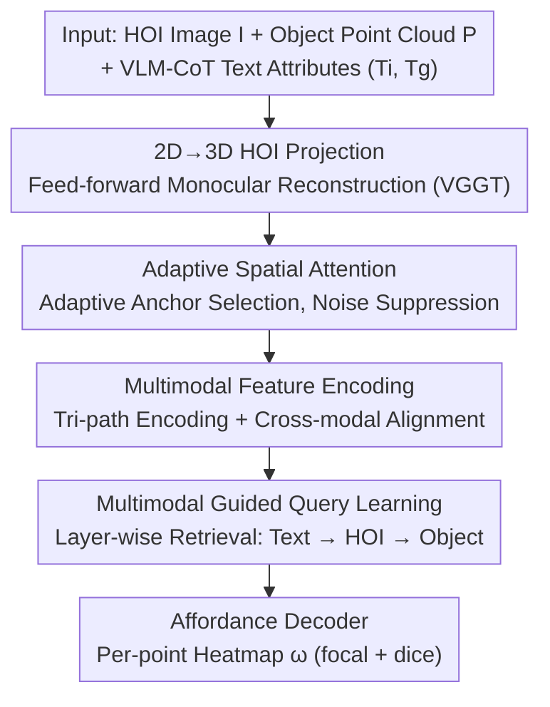

# QueryMe: Query-Driven Open-Vocabulary 3D Object Affordances Grounding from Multimodal Evidence

**Conference**: CVPR 2026  
**Paper**: [CVF Open Access](https://openaccess.thecvf.com/content/CVPR2026/html/Zhao_QueryMe_Query-Driven_Open-Vocabulary_3D_Object_Affordances_Grounding_from_Multimodal_Evidence_CVPR_2026_paper.html)  
**Code**: TBD  
**Area**: 3D Vision  
**Keywords**: Open-vocabulary affordance, 3D object functional regions, Multimodal query, HOI images, Cross-domain generalization

## TL;DR
QueryMe projects a single Human-Object Interaction (HOI) image into 3D space via feed-forward monocular reconstruction, then utilizes a set of learnable query vectors to retrieve evidence in a fixed "Text → 3D HOI → Object Point Cloud" sequence. This enables the localization of object functional regions in an open-vocabulary setting, achieving a 4.19% higher AUC on unseen affordances compared to the previous SOTA, GREAT.

## Background & Motivation
**Background**: The goal of open-vocabulary 3D object affordance grounding is to label corresponding operable regions on an object point cloud given any semantic description (e.g., "cut," "hold"). Recent methods generally combine point cloud geometry with semantic labels or introduce additional multimodal cues like text descriptions, HOI images, and 2D projections of point clouds to enhance priors.

**Limitations of Prior Work**: Most existing methods bind object categories and geometric structures seen during training, leading to poor generalization when encountering unseen objects or functions. Furthermore, they often rely on a single modality (only vision or only text), failing to form a coherent cross-modal representation. Crucially, when affordance knowledge is learned directly from 2D HOI images, a significant domain gap exists between 2D image distributions and 3D object functions, making it difficult to reliably transfer knowledge to 3D.

**Key Challenge**: Models lack "geometric invariance" modeling (instability when shapes of the same category vary significantly) and "analogical reasoning" capabilities (inability to generalize multiple uses for the same object). The root cause is the poorly handled 2D→3D cross-domain mapping—interaction priors learned directly in 2D become distorted when applied to 3D point clouds.

**Goal**: (1) Bridge the domain gap between 2D HOI and 3D objects; (2) Enable the model to generalize to both unseen objects and unseen affordances; (3) Genuinely fuse visual, linguistic, and geometric cues into a single cross-modal representation.

**Key Insight**: Cognitive psychology suggests that human object recognition progresses from "general geometry to high-level functional attributes." Based on this, the authors design a 3D query mechanism that "retrieves" geometric regions usually interacted with by humans, conditioned on the object, rather than explicitly matching the object to predefined regions. With the maturity of feed-forward monocular reconstruction (VGGT), mapping 2D HOI images into a 3D feature space has become feasible.

**Core Idea**: First, reconstruct the HOI image into 3D via feed-forwarding. Then, use a set of learnable queries sampled from the object geometry to perform cross-modal attention retrieval in a fixed modal order, localizing functional regions as "query hits" rather than "classification predictions."

## Method

### Overall Architecture
The input consists of an object point cloud $P \in \mathbb{R}^{N\times3}$, a single HOI RGB image $I$, and two types of text attributes produced by a VLM through Chain-of-Thought (CoT)—interaction attributes $T_i$ (e.g., "hold the cup body with hands to pour water") and geometric attributes $T_g$ (e.g., "the cup handle is easy to grip due to its ergonomic curve"). The model $M$ outputs a per-point affordance heatmap $\omega = M(H, T, P)$.

The pipeline consists of four steps: ① Mapping the HOI image $I$ into 3D using feed-forward reconstruction (VGGT) to obtain $H \in \mathbb{R}^{N\times6}$ containing coordinates and features; ② **Adaptive Spatial Attention** to select key interaction anchors within the reconstructed 3D HOI space, which contains substantial noise and background; ③ **Multimodal Feature Encoding** using independent encoders for text, 3D HOI, and point clouds to extract features and perform cross-modal alignment; ④ **Multimodal Guided Query Learning** using learnable queries to retrieve evidence layer-by-layer in the order of "Text → HOI → Object," finally feeding into an affordance decoder to generate the heatmap.

### Key Designs

**1. 2D→3D HOI Projection: Transferring Interaction Priors to 3D to Eliminate Domain Gap**

Addressing the pain point where learning affordance directly from 2D HOI images distorts when transferred to 3D, QueryMe does not learn interactions in the 2D image domain. Instead, it uses the feed-forward monocular reconstruction method VGGT to map a single HOI image into a set of 3D HOI points $H \in \mathbb{R}^{N\times6}$ with coordinates, ensuring interactions occur in the same 3D metric space as the object point cloud. Thus, the geometric structure of hand-object interaction (how and where the hand fits the object) can be directly learned and abstracted. In ablation studies, replacing this branch with ResNet18 for 2D feature extraction caused the Unseen Affordance AUC to plummet from 74.00 to 60.50, the largest drop among all components, confirming that 3D projection is the foundation for generalization.

**2. Adaptive Spatial Attention: Suppressing Reconstruction Noise via Adaptive Anchors**

The 3D HOI space reconstructed via feed-forward methods is inherently noisy and retains irrelevant background. Processing all points is both computationally expensive and introduces "dirty" data. This module (also called Auto-Adaptive Spatial Anchor Selection) first retains a subset $P_s$ ($N_s = pN$) through global sampling with ratio $p$, encodes each sampled point coordinate into a $d$-dimensional feature using a lightweight MLP, and then uses 1D convolution to model spatial continuity and local topology along the sampled sequence (avoiding explicit graph construction). After convolution aggregation, an importance predictor scores each sampled point $s_j$. Finally, scores are interpolated back to all original points using inverse distance weighting $w_{ij} = \frac{1}{|p_i - p_j|^2 + \varepsilon}$: $\hat{s}_i = \frac{\sum_j w_{ij} s_j}{\sum_j w_{ij}}$. This "sampling-scoring-interpolation" approach ensures smoothness of proximity importance and maintains structural consistency while concentrating computation on geometrically and semantically salient interaction regions. Removing it drops the Unseen Affordance AUC from 74.00 to 67.85.

**3. Multimodal Feature Encoding: Tri-path Encoding + Cross-modal Alignment**

On the text side, two RoBERTa models with identical structures but independent parameters encode interaction attributes $T_i$ and geometric attributes $T_g$. A lightweight bidirectional cross-attention is inserted to allow mutual attendance, resulting in a refined representation $T' = \{T'_i, T'_g\}$. The 3D HOI encoder takes top-$k$ candidate points $P_k = \{p_i \mid \text{rank}(\hat{s}_i) \le k\}$ based on importance scores, then feeds a uniform sample into a two-layer PointNet++ to extract hierarchical geometric features $H'_o$. An interaction-aware representation $H'_i = \text{CrossAttn}(T'_i, H'_o)$ is obtained using interaction text $T'_i$ as the query and $H'_o$ as the key/value. The object point cloud is encoded by a hierarchical PointNet++ and fused with geometric text $T'_g$ via cross-attention to obtain $P'$. These three outputs $T', H', P'$ constitute the multimodal memory for subsequent queries.

**4. Multimodal Guided Query Learning: Layer-wise Retrieval in Fixed Modal Order**

This is the core of reformulating "open-vocabulary affordance" as "query hits." First, a set of positions $pos \in \mathbb{R}^{K\times3}$ is extracted from the object point cloud via Farthest Point Sampling (FPS). An equal number of zero-initialized learnable queries $q_0 \in \mathbb{R}^{K\times d}$ are created, and positions are injected via an MLP position encoder $\phi_{pos}$. (The authors found that 3D RoPE provided almost no gain on fixed single-frame point clouds, whereas MLP encoding favored locality and optimization smoothness). The number of queries corresponds one-to-one with FPS points. In each layer, queries perform cross-attention on the multimodal memory $M = \{T', H', P'\}$ in a **fixed order: $T' \to H' \to P'$**. This injects text priors first, then 3D HOI cues, and finally point cloud intermediate features, realizing a "coarse-to-fine" learning of functions and interaction positions. At the end of each layer, positions are re-injected and self-attention is performed to abstract the object's intrinsic geometric structure (Residual + LayerNorm). Finally, the queries interact with point cloud features $P'$, and a sigmoid produces per-point affordance: $\omega = \sigma(f[\text{Attention}(q, P')])$.

### Loss & Training
Supervision is applied to the per-point heatmap. The total loss is the sum of focal loss and Dice loss: $L_{total} = L_{focal} + L_{dice}$. No explicit supervision on affordance categories is required. Training lasts 50 epochs with a batch size of 8, a learning rate of $1\times10^{-5}$ on two NVIDIA L20 GPUs. VGGT is used for geometric extraction, and PointNet++ serves as the 3D backbone.

## Key Experimental Results

The dataset used is PIADv2 (a mixture of 3DIR / 3DAffordanceNet / Objaverse, covering 43 object categories and 24 affordance categories), divided into three settings following the GREAT/LASO protocol: Seen (In-distribution), Unseen Object (unseen objects, known functions), and Unseen Affordance (unseen functions, zero-shot). Evaluation metrics include AUC, aIoU, SIM (↑ higher is better), and MAE (↓ lower is better).

### Main Results

| Setting | Metric | GREAT (Prev. SOTA) | QueryMe | Gain |
|------|------|------|------|------|
| Seen | AUC↑ | 91.99 | **92.34** | +0.35 |
| Seen | aIoU↑ | 38.03 | **39.39** | +1.36 |
| Unseen Object | AUC↑ | 79.57 | **83.03** | +3.46 |
| Unseen Object | aIoU↑ | 20.16 | **21.76** | +1.60 |
| Unseen Affordance | AUC↑ | 69.81 | **74.00** | +4.19 |
| Unseen Affordance | SIM↑ | 0.290 | **0.316** | +0.026 |

QueryMe leads across almost all metrics in the Seen and two Unseen settings, with the gap widening significantly in Unseen scenarios (Unseen Affordance AUC +4.19%), validating the generalization benefits brought by 3D projection and multimodal queries. The only exception is a slight increase in MAE for Unseen Objects (0.109→0.118); the authors explain that the query mechanism assigns small activation scores to a few non-functional points near the affordance region, which, given only 2048 points per cloud, amplifies point-wise errors like MAE without affecting overall localization accuracy.

### Ablation Study

| Configuration | Unseen-Aff AUC↑ | Unseen-Aff SIM↑ | Description |
|------|------|------|------|
| Query only (no multimodal evidence) | 67.42 | 0.291 | AUC drops 6.58 vs full model |
| + Object | 69.69 | 0.306 | Add object point cloud |
| + Object + HOI | 71.48 | 0.296 | Add 3D HOI |
| **All modalities (Obj+HOI+Text)** | **74.00** | **0.316** | Full model |
| w/o Cross-Attention | 68.93 | 0.266 | Remove text-HOI/point cloud fusion |
| w/o Adaptive Spatial Attention | 67.85 | 0.274 | Remove adaptive anchors |
| w/o 3D HOI (replaced by 2D ResNet18) | 60.50 | 0.240 | Largest drop |

### Key Findings
- **3D HOI projection is the biggest contributor**: Replacing 3D HOI with 2D ResNet18 features caused the Unseen Affordance AUC to drop from 74.00 to 60.50, indicating that learning interaction geometry in 3D rather than 2D is the key to generalization.
- **Tri-modal progression yields gains**: Moving from Obj → +HOI → +Text shows monotonic improvement, proving that the query mechanism extracts complementary evidence from each modality. Removing all three causes Seen/Unseen-Obj/Unseen-Aff AUC to drop by 3.82/5.54/6.58 respectively, with larger drops in Unseen settings.
- **Adaptive anchors are effective for noise suppression**: Removing them drops Unseen Affordance AUC by about 6 points, verifying that background noise in the reconstruction space interferes with geometric learning.

## Highlights & Insights
- **Reformulating affordance grounding from "classification" to "query retrieval"**: Using a set of queries sampled according to geometry to hit functional regions naturally supports open-vocabulary tasks and avoids binding to predefined categories.
- **2D→3D HOI projection is the masterstroke**: Utilizing mature feed-forward monocular reconstruction (VGGT) to bring interactions into a 3D metric space allows for direct analogical reasoning based on geometric similarity. This "reconstruct-then-learn-interaction" approach can be transferred to other tasks requiring cross-2D/3D domain adaptation (e.g., grasp prediction, contact point estimation).
- **Fixed modal retrieval order (Text → HOI → Object)** serves as a simple yet effective "coarse-to-fine" curriculum: first setting the tone with semantic priors, then tightening with interaction cues, and finally anchoring to the object geometry.

## Limitations & Future Work
- **Slight increase in MAE on Unseen Objects**: Queries assign small activations to some non-functional points near the target region; sparse point clouds (2048 points) amplify this per-point error, leaving room for improvement in heatmap boundary precision.
- **Dependency on feed-forward reconstruction quality**: The entire pipeline relies on VGGT reconstruction. While Adaptive Spatial Attention mitigates noise and background, severe reconstruction distortion (due to extreme views or heavy occlusion) will limit the performance upper bound. ⚠️ The paper does not provide a quantitative relationship between reconstruction quality and final accuracy.
- **Dependency on VLM-produced CoT text attributes**: Interaction and geometric attributes come from the VLM's Chain-of-Thought; thus, text quality is strongly correlated with VLM capability, and performance may drop on object categories poorly covered by the VLM.

## Related Work & Insights
- **vs GREAT**: GREAT uses LLM + geometric awareness for open-vocabulary grounding. QueryMe adopts its CoT text attributes and three-tier evaluation protocol but changes interaction learning from implicit geometric priors to "explicit 3D HOI projection + multimodal query retrieval," improving Unseen Affordance AUC by 4.19%.
- **vs LASO / IAG**: Both improve generalization by better integrating visual and text cues but remain limited by fixed training taxonomies and manual geometric priors. QueryMe adds analogical reasoning through its query mechanism and 3D HOI geometry, leading across Unseen settings.
- **vs 3D-AffordanceLLM / DAG**: These also attempt to use large model/diffusion priors to bridge the 2D-3D domain gap. QueryMe differs by not relying on generative rendering, instead performing lightweight query retrieval directly in the reconstructed 3D HOI space, resulting in a more compact structure.

## Rating
- Novelty: ⭐⭐⭐⭐ Reformulating affordance as multimodal query retrieval and using feed-forward reconstruction for 2D→3D HOI projection is a novel combination, though individual technologies are mostly mature assembled modules.
- Experimental Thoroughness: ⭐⭐⭐⭐ The three-tier split + four metrics + dual ablation (modalities/components) is comprehensive, though only validated on the single PIADv2 benchmark.
- Writing Quality: ⭐⭐⭐⭐ The motivation-method-experiment chain is clear, and formulas/algorithmic pseudocode are complete, though some symbols (e.g., reconstruction dimensions) are slightly inconsistent in layout.
- Value: ⭐⭐⭐⭐ Significant improvements in unseen affordance grounding provide practical value for functional region localization in embodied manipulation and VLA.

<!-- RELATED:START -->

## Related Papers

- [\[CVPR 2026\] Ov3R: Open-Vocabulary Semantic 3D Reconstruction from RGB Videos](ov3r_open-vocabulary_semantic_3d_reconstruction_from_rgb_videos.md)
- [\[CVPR 2026\] OnlinePG: Online Open-Vocabulary Panoptic Mapping with 3D Gaussian Splatting](onlinepg_online_open-vocabulary_panoptic_mapping_with_3d_gaussian_splatting.md)
- [\[CVPR 2026\] HAMMER: Harnessing MLLMs via Cross-Modal Integration for Intention-Driven 3D Affordance Grounding](hammer_harnessing_mllms_via_cross-modal_integration_for_intention-driven_3d_affo.md)
- [\[CVPR 2026\] ORD: Object-Relation Decoupling for Generalized 3D Visual Grounding](ord_object-relation_decoupling_for_generalized_3d_visual_grounding.md)
- [\[CVPR 2026\] JOPP-3D: Joint Open Vocabulary Semantic Segmentation on Point Clouds and Panoramas](jopp3d_joint_open_vocabulary_semantic_segmentation.md)

<!-- RELATED:END -->
