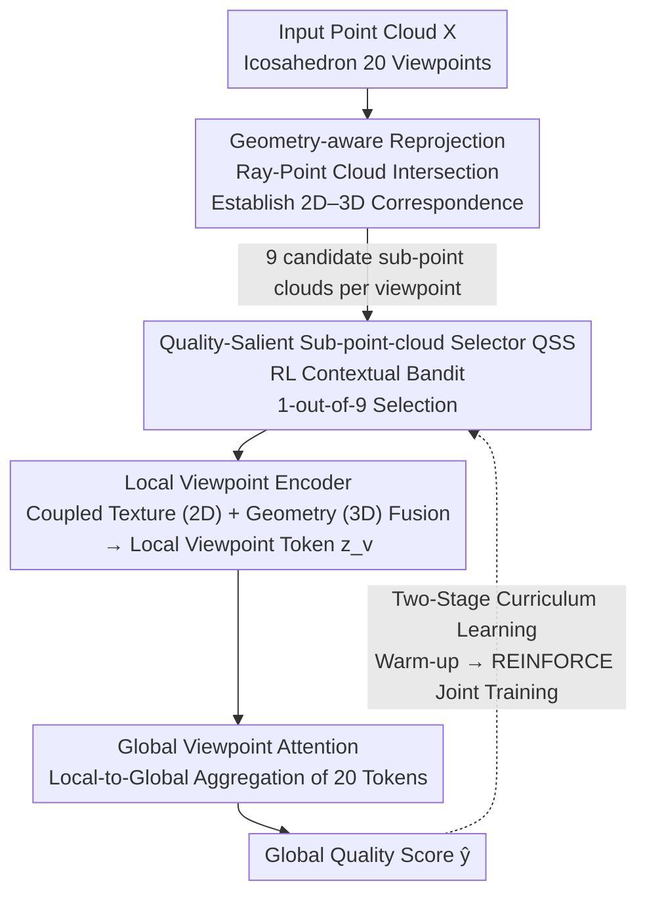

# R3-PCQA: Ray-Reprojection-Reinforcement for No-Reference 3D Point Cloud Quality Assessment

**Conference**: CVPR 2026  
**Paper**: [CVF Open Access](https://openaccess.thecvf.com/content/CVPR2026/html/Seo_R3-PCQA_Ray-Reprojection-Reinforcement_for_No-Reference_3D_Point_Cloud_Quality_Assessment_CVPR_2026_paper.html)  
**Code**: None  
**Area**: 3D Vision  
**Keywords**: Point cloud quality assessment, No-reference quality assessment, Reinforcement learning, Multi-view fusion, Human visual system  

## TL;DR
R3-PCQA explicitly encodes three human visual perception mechanisms for 3D objects (viewpoint dependence, selective attention, and multi-view integration) into a no-reference point cloud quality assessment pipeline. It establishes precise 2D-3D correspondences via ray-point cloud intersection, adaptively selects the most critical local sub-point clouds using a reinforcement learning contextual bandit, and performs local-to-global aggregation via global viewpoint attention, achieving state-of-the-art performance across three benchmarks: SJTU-PCQA, WPC, and WPC2.0.

## Background & Motivation
**Background**: Point clouds are increasingly common in autonomous driving, LiDAR perception, and AR/VR, but distortions are introduced during acquisition, compression, transmission, and rendering. No-Reference Point Cloud Quality Assessment (NR-PCQA) aims to predict Mean Opinion Scores (MOS) without reference to pristine point clouds. Recent mainstream approaches are multimodal methods, which utilize both 2D projected images and 3D point clouds, such as MM-PCQA (late fusion) and MFT-PCQA (Transformer fusion).

**Limitations of Prior Work**: Almost all of these methods treat 2D projections and 3D point clouds as two **independent modalities** and merge them using straightforward feature concatenation. This approach has two fundamental flaws. First, it fails to establish a **geometric correspondence** between 2D and 3D, making it impossible to depict how 3D spatial distortions manifest on 2D projections and vice versa, thereby omitting the viewpoint-dependent perception mechanism. Second, it performs uniform global averaging, ignoring the **selective attention** of the human eye—humans do not score all regions of an object uniformly but are instead dominated by locally degraded and detail-sparse regions in their overall judgment.

**Key Challenge**: The Human Visual System (HVS) processes 3D stimuli holistically, treating surface geometry and texture as **perceptually inseparable**. However, existing methods decouple them in implementation, resulting in "multi-view" pipelines that do not reflect true cognitive multi-view integration.

**Goal**: Design an evaluation framework that explicitly models three major HVS mechanisms: (1) viewpoint-dependent processing, (2) selective attention, and (3) multi-view integration.

**Key Insight**: The key observation is that "there should be a precise spatial correspondence between 2D pixels and 3D sub-point clouds." By projecting rays from the viewpoints of a regular icosahedron and calculating the intersection of these rays with the point cloud, they can anchor each key 2D pixel to its corresponding 3D local sub-point cloud visible from that viewpoint. This couples texture distortion (fine-grained 2D) and geometric distortion (coarse-grained 3D) onto the same viewpoint.

**Core Idea**: Replace the naive concatenation of 2D/3D as independent modalities with "ray-reprojection-based 2D-3D correspondence + reinforcement learning-based quality-salient sub-point cloud selection + global viewpoint attention aggregation" to truly simulate the human eye's perception of 3D objects.

## Method

### Overall Architecture
R3-PCQA is an end-to-end NR-PCQA framework. Given a point cloud $X$, it first projects the point cloud from $V=20$ uniform viewpoints of an icosahedron to obtain 2D images $I_v$, and establishes precise 2D pixel-to-3D sub-point cloud correspondences at each viewpoint via **geometry-aware reprojection** (obtaining $N=9$ candidate sub-point clouds per viewpoint). These candidates are sent to the **local viewpoint encoder**, in which an embedded **QSS (Quality-Salient Sub-point-cloud Selector)** utilizes a reinforcement learning policy network to select only **one** sub-point cloud most likely to determine quality from the 9 candidates, based on the 2D context of that viewpoint. The geometric features of the selected sub-point cloud are fused with the 2D texture features to generate a "local viewpoint token" $z_v$. Finally, **global viewpoint attention** adaptively aggregates the tokens of all viewpoints to predict the global quality score $\hat{y}$. The entire model is trained using **two-stage curriculum learning**: first warming up (with QSS disabled, randomly selecting sub-point clouds) to let the encoder learn general representations, then activating QSS for joint policy training via REINFORCE.

### Key Designs

**1. Geometry-Aware Reprojection: Establishing Accurate 2D–3D Correspondence via Ray-Point Cloud Intersection**

The root cause of naive fusion lies in the misalignment of 2D and 3D—it is unknown which 3D point cloud region a pixel in the projection image corresponds to. This paper addresses this in two steps. **Projection**: The point cloud is placed within an icosahedron with cameras positioned at the center of each face, yielding $V=20$ uniformly distributed viewpoints. Each viewpoint projects $X$ to a 2D RGB image $I_v$ and saves the camera intrinsic parameters $K_v$ and extrinsic parameters $[R_v|t_v]$, denoting the world-to-camera matrix as $c_v = K_v[R_v|t_v]$. **Reprojection**: K-means clustering is conducted on valid depth pixels in $I_v$ to acquire $N=9$ cluster centers $\{p_{v,n}\}$ as candidate pixels (ensuring both efficiency and spatial coverage within the viewpoint). For each $p_{v,n}$, back-projection is performed using $K_v^{-1}$, and rotation via $R_v^{\top}$ yields the unit direction $d_{v,n}$. A ray $r_{v,n}(s)=o_v+s\,d_{v,n}$ is cast from the camera center $o_v$. Within a distance threshold $\rho$ to the ray, the seed point closest to the camera is defined as:

$$x_{v,n}=\underset{x\in X}{\arg\min}\left(\|x-o_v\|_2 : \min_{s\ge 0}\|x-r_{v,n}(s)\|_2\le\rho\right).$$

Then, KNN is applied to the seed point to extract a sub-point cloud of $M=8192$ points: $X_{v,n}=\mathrm{KNN}(x_{v,n};X,M)$. Consequently, each viewpoint obtains $N$ groups of $(p_{v,n}, X_{v,n})$ that rigidly bind a 2D pixel with its visible 3D sub-point cloud from that viewpoint. Texture distortion (from 2D) and geometry distortion (from 3D) are thereby coupled at the same spatial location rather than being processed separately and then concatenated.

**2. Quality-Salient Sub-point-cloud Selector QSS: Selecting the Most Crucial Region via Reinforcement Learning**

The human eye does not examine the entire object uniformly but focuses on the most obviously degraded parts. Existing methods, however, either average globally or evaluate local areas using criteria unrelated to perceptual quality. QSS models the decision of "selecting 1 out of 9 candidate sub-point clouds at each viewpoint" as a **contextual bandit** (marking the first introduction of RL to PCQA). Three key components: **Context** $H_v$ is a set of $11\times11$ local patches cropped from the intermediate feature map of the 2D encoder $\mathcal{E}^{\text{rgb}}$, centered on each candidate pixel $p_{v,n}$. **Action space** $A_v$ consists of actions $a_{v,n}$, each corresponding to selecting the $n$-th sub-point cloud. **Policy** $\pi_\theta(a_{v,n}|H_v)$ outputs the selection probability. The policy network first embeds each patch using a CNN and then captures relationships between candidates using Multi-Head Self-Attention (MSA), with a policy head outputting logits $s_v$. A temperature-softened softmax computes the distribution: $\pi_\theta(a_{v,n}|H_v)=\mathrm{Softmax}(s_v/\tau)$. During training, actions are sampled from this distribution for exploration, whereas $\arg\max$ is taken during inference for exploitation. Selecting only one instead of evaluating all nine reduces computational cost, focuses on regions highly correlated with quality, and suppresses noise from irrelevant areas. Ablation studies show that RL-based selection is more accurate and requires fewer FLOPs compared to two baselines that run on all sub-point clouds.

**3. Coupled Geometry-Texture Local Viewpoint Encoder: Fusing Coarse Geometric and Fine Texture Distortions into a Single Token**

Once the sub-point cloud $X_{v,n^*}$ is selected, the 3D geometric encoder $\mathcal{E}^{\text{pc}}$ extracts its geometric features $F^{\text{pc}}_v$ (emphasizing coarse-grained geometric distortion), and the 2D visual encoder $\mathcal{E}^{\text{rgb}}$ extracts texture features $F^{\text{rgb}}_v$ from the projected image $I_v$ (emphasizing fine-grained texture distortion), making the two modalities complementary. These features are concatenated and fed into an MLP fusion layer to obtain $F_v=\text{Fusion}(F^{\text{rgb}}_v\oplus F^{\text{pc}}_v)$. Concurrently, a local regressor predicts a local quality score $\hat{y}^{\text{local}}_v$ as an auxiliary task, which is concatenated with $F_v$ to form the local viewpoint token $z_v=\hat{y}^{\text{local}}_v\oplus F_v$. Encoder parameters are shared across all viewpoints to learn viewpoint-invariant, generalizable representations, while also improving parameter efficiency. This design instantiates the "viewpoint-dependent processing" concept, where each token couples geometric and texture evidence at the exact same spatial location.

**4. Global Viewpoint Attention: Adaptive Local-to-Global Aggregation to Automatically Learn Viewpoint Importance**

With 20 local tokens, how are they aggregated into a global score? Stacking them forms the matrix $Z=[z_1,\dots,z_V]^{\top}\in\mathbb{R}^{V\times(D+1)}$. An initial global context token is obtained via average pooling: $g=\frac{1}{V}\sum_v z_v$. Multi-head attention is then performed using $g$ as the query and $Z$ as key/value to yield a refined context $\tilde{g}$ and attention weights $\{\alpha_v\}$. Finally, the global score is predicted: $\hat{y}=\text{GlobalRegressor}(\tilde{g}\oplus g)$. Since each token contains both $\hat{y}^{\text{local}}_v$ and $F_v$, this constitutes true local-to-global aggregation where the model automatically learns which viewpoints are more critical to quality assessment and weights them accordingly. Visualization shows that this attention dynamically adapts based on object quality: for medium-to-high quality objects (MOS > 40), it correlates negatively (assigning higher weights to lower-quality viewpoints, resembling a "weakest-link" effect dominated by the worst viewpoint); for low-quality objects (MOS < 40), it correlates positively or weakly negatively (averaging multiple views rather than relying solely on the single worst view since distortion is ubiquitous).

**5. Two-Stage Curriculum Learning + REINFORCE with Credit Assignment Reward**

Training the policy network and encoder simultaneously from the start causes gradient instability, high variance, and convergence difficulties due to the initial random policy; thus, curriculum learning is used. **Warm-up Stage**: The QSS is disabled, and one candidate sub-point cloud is randomly selected per viewpoint, allowing the local encoder to first learn stable, general representations under the loss $\mathcal{L}_{\text{warm-up}}=\mathcal{L}_{\text{global}}+\mathcal{L}_{\text{local}}$, where $\mathcal{L}_{\text{global}}=\frac{1}{B}\sum_b(\hat{y}_b-y_b)^2$ is the primary objective, and $\mathcal{L}_{\text{local}}=\frac{1}{BV}\sum_{b,v}(\hat{y}^{\text{local}}_{b,v}-y_b)^2$ serves as weak supervision using the overall MOS as a coarse label for each viewpoint to regularize and prevent overfitting while providing interpretability. **Joint Training Stage**: The QSS is activated, introducing the policy gradient loss $\mathcal{L}_{\text{joint}}=\mathcal{L}_{\text{global}}+\mathcal{L}_{\text{local}}+\mathcal{L}_{\text{policy}}$. The reward is based on global prediction accuracy:

$$r_b=\exp\left(-\frac{s\cdot|\hat{y}_b-y_b|}{\sigma}\right)\in[0,1],$$

where $\sigma=15$ is the intrinsic error scale of the normalized prediction error, and $s=100$ is a scaling factor considering the MOS range. The key **credit assignment** distributes the reward to each viewpoint based on the global attention weights: $r_{b,v}=r_b\cdot\alpha_{b,v}$. If a viewpoint is assigned a high attention weight (contributing more to the global prediction), its policy receives a stronger learning signal to select the sub-point cloud that best captures the distortion. The final policy loss is:

$$\mathcal{L}_{\text{policy}}=-\frac{1}{BV}\sum_{b,v}\log\pi_\theta(a_{b,v,n^*}|H_{b,v})\cdot r_{b,v},$$

where $r_{b,v}$ is detached from the computation graph and treated as a constant (standard REINFORCE procedure).

### Loss & Training
- Warm-up: $\mathcal{L}_{\text{warm-up}}=\mathcal{L}_{\text{global}}+\mathcal{L}_{\text{local}}$, with QSS disabled and random sub-point cloud selection.
- Joint Training: $\mathcal{L}_{\text{joint}}=\mathcal{L}_{\text{global}}+\mathcal{L}_{\text{local}}+\mathcal{L_{\text{policy}}}$, with QSS activated and the policy trained via REINFORCE.
- Key Hyperparameters: $V=20$ viewpoints, $N=9$ candidates, $M=8192$ sub-point cloud points, $\sigma=15$, $s=100$, and softmax temperature $\tau$.

## Key Experimental Results

### Main Results
Cross-validation (9/5/4 folds respectively, approximately 8:2 split) is conducted on three databases: SJTU-PCQA (9 reference / 378 degraded samples), WPC (20 reference / 740), and WPC2.0 (16 reference / 400, V-PCC compressed). Evaluation metrics include SRCC↑, PLCC↑, and RMSE↓. Compared with 14 methods (7 full-reference FR + 7 no-reference NR), R3-PCQA consistently achieves SOTA across all three databases.

| Dataset | Metric | R3-PCQA | Prev. SOTA (MM-PCQA / GMS-3DQA) | Gain |
|--------|------|---------|-----------------------------------|------|
| SJTU-PCQA | SRCC | **0.9401** | 0.9108 (GMS-3DQA) | +0.029 |
| SJTU-PCQA | PLCC | **0.9606** | 0.9226 (MM-PCQA) | +0.038 |
| WPC | SRCC | **0.9017** | 0.8414 (MM-PCQA) | +0.060 |
| WPC | PLCC | **0.8882** | 0.8556 (MM-PCQA) | +0.033 |
| WPC2.0 | SRCC | **0.8693** | 0.8272 (GMS-3DQA) | +0.042 |
| WPC2.0 | PLCC | **0.8650** | 0.8218 (GMS-3DQA) | +0.043 |

**Cross-dataset Generalization** (PLCC, trained on one entire dataset and tested on another): Best in 3 out of 4 cross-dataset scenarios. Achieving 0.920 for WPC→WPC2.0 and 0.721 for WPC→SJTU, both outperforming MM-PCQA. Only SJTU→WPC is slightly lower (0.273 vs. MM-PCQA's 0.351), which the authors attribute to SJTU having the smallest size, whose object categories and distortion generation processes differ significantly from those of WPC, resulting in a pronounced domain gap.

### Ablation Study
Conducted on the largest benchmark, WPC, using 5-fold cross-validation.

| Configuration | SRCC | PLCC | Description |
|------|------|------|------|
| 3D Point Cloud Only | 0.7334 | 0.7405 | Coarse geometric distortion only |
| 2D Projection Only | 0.8868 | 0.8746 | Fine texture distortion only (already surpasses most baselines) |
| 2D + 3D Fusion (Full) | **0.9017** | **0.8882** | Complementary dual modalities |

| Loss Combination | SRCC | PLCC | Description |
|----------|------|------|------|
| Only $\mathcal{L}_{\text{global}}$ | 0.8644 | 0.8716 | Baseline |
| $+\mathcal{L}_{\text{local}}$ | 0.8806 | 0.8666 | Added weak supervision per viewpoint |
| $+\mathcal{L}_{\text{policy}}$ | 0.8880 | 0.8853 | Added policy learning |
| All three used (Full) | **0.9017** | **0.8882** | All components contribute |

| Sub-point Cloud Selection Method | SRCC | PLCC | GFLOPs↓ | Description |
|--------------|------|------|---------|------|
| Fusion-910 (concatenating all 910×9) | 0.8846 | 0.8694 | 182.93 | Strict comparison with identical input size |
| Fusion-8192 (average pooling of all sub-point clouds) | 0.8816 | 0.8731 | 479.32 | Retains all points |
| Ours (RL selects 1) | **0.9017** | **0.8882** | 232.36 | Selects quality-salient regions |

### Key Findings
- **Modality complementarity with 2D dominance**: 2D alone (0.8868) significantly outperforms 3D alone (0.7334), indicating that fine-grained texture distortion is more informative; however, fusing both yields optimal performance, validating the complementarity of coarse geometry and fine texture.
- **RL selection is both accurate and efficient**: Selecting only 1 sub-point cloud is more accurate than concatenating or pooling all 9, while its FLOPs are positioned in between, proving that "focusing on key regions" is superior to "looking at everything."
- **Adaptive attention based on quality**: Medium-to-high quality objects are dominated by the worst viewpoints (weakest-link theory), while low-quality objects integrate multiple viewpoints—learning an intuitive strategy without any explicit supervision.
- **Policy separability**: Prior to training, the contexts $H'_v$ of selected and unselected sub-point clouds are mixed together in PCA; after training, they become clearly separable, indicating that the policy indeed learns to identify quality-salient regions.

## Highlights & Insights
- **Engineering all three HVS mechanisms step-by-step**: Viewpoint dependence $\rightarrow$ geometry-aware reprojection, selective attention $\rightarrow$ RL-based sub-point cloud selection, and multi-view integration $\rightarrow$ global viewpoint attention. The design maps perfectly to the motivation, avoiding empty claims of "aligning with human perception".
- **Establishing 2D–3D correspondence via ray-point cloud intersection**: Pointing 2D key pixels directly to 3D sub-point clouds using well-established ray casting from rendering/geometry cleanly resolves the long-standing alignment issue of multi-modal features. This correspondence scheme is transferrable to other point cloud tasks requiring 2D-3D correlation (e.g., point cloud segmentation quality, compression distortion localization).
- **First to introduce RL to PCQA, using contextual bandits instead of full MDPs**: In quality assessment, deciding "where to look" is intrinsically a single-step decision, making bandit modeling both lightweight and appropriate. The credit assignment based on global attention weights ($r_{b,v}=r_b\cdot\alpha_{b,v}$) is a clever design that delivers a stronger training signal to more critical viewpoints.
- **Curriculum learning tames RL instability**: Warming up to stabilize representations before activating the policy serves as a practical recipe for embedding RL into supervised regression frameworks, which can be reused in other architectures featuring "main-task supervision + sub-module RL selection".

## Limitations & Future Work
- **Dependence on a fixed icosahedron with 20 viewpoints + 9 candidates per viewpoint**: The number of viewpoints, candidates, and sub-point cloud size $M=8192$ are all fixed hyperparameters. Whether they are optimal for point clouds of different scales or sparseness is not discussed.
- **The parameters $\sigma=15$ and $s=100$ in the reward function are manually tuned constants based on the MOS range**: These may require retuning when changing datasets or annotation scales, and a sensitivity analysis is lacking.
- **Poor performance of all methods when trained on SJTU**: The cross-dataset scenario SJTU$\rightarrow$WPC is actually inferior to MM-PCQA, indicating that the advantages of this framework on small datasets can be offset by domain gaps, and its generalization to completely new object categories remains limited.
- **Computational overhead**: The preprocessing pipeline (20 viewpoints $\times$ projection + ray intersection + KNN) is quite heavy. Although the paper provides inference FLOPs, it lacks report on actual preprocessing time, casting doubt on its real-time applicability.
- **Future improvements**: making the number of viewpoints/candidates adaptive to object complexity; extending the contextual bandit into multi-step selection (e.g., coarse viewpoint selection followed by sub-point cloud selection); explicitly modeling perceptual uncertainty in the reward.

## Related Work & Insights
- **vs. MM-PCQA**: MM-PCQA performs late concatenation/fusion of 2D projections and 3D point clouds without geometric correspondence. In contrast, R3-PCQA first establishes accurate 2D–3D correspondences using ray-reprojection before fusion, and only fuses features on quality-salient sub-point clouds. It achieves comprehensive leads in SRCC/PLCC across all three databases (WPC SRCC of 0.9017 vs. 0.8414).
- **vs. GMS-3DQA / MFT-PCQA**: Although also multi-modal/multi-view, they mostly rely on uniform sampling or simple Transformer integration, lacking "selective attention." R3-PCQA explicitly selects critical sub-point clouds via RL, which ablation studies prove superior to concatenating or pooling all sub-point clouds.
- **vs. PointNet++ styled downsampling**: Traditional FPS/KNN hierarchical sampling aims to process dense point clouds efficiently while preserving geometry. In contrast, the KNN sub-point cloud extraction in this paper is designed to obtain local neighborhoods around anchor seed points determined by the rays for quality assessment, serving a different purpose.
- **Insight**: Quality assessment tasks (image, video, 3D) generally face the contradiction of "analyzing everything is too expensive, while averaging discards key degraded regions." R3-PCQA's "contextual bandit + attention credit assignment" provides a transferable paradigm for "adaptive selection of key regions."

## Rating
- Novelty: ⭐⭐⭐⭐⭐ First to introduce RL (contextual bandits) into PCQA, and the concept of establishing 2D–3D correspondences via ray-reprojection is clean.
- Experimental Thoroughness: ⭐⭐⭐⭐ Three databases + cross-dataset validation + three sets of ablation studies + two types of visualization makes it solid; however, sensitivity analysis for key hyperparameters (number of viewpoints, $\sigma$/$s$, $M$) is missing.
- Writing Quality: ⭐⭐⭐⭐⭐ Clear logical progression with point-to-point alignment between motivations, mechanisms, and designs, mapping the three HVS mechanisms throughout the paper.
- Value: ⭐⭐⭐⭐ Achieves SOTA on three NR-PCQA databases with good generalization. The "adaptive key-region selection" paradigm is highly referable for general quality assessment tasks, though the preprocessing is heavy and its real-time applicability remains to be validated.

<!-- RELATED:START -->

## Related Papers

- [\[CVPR 2026\] QD-PCQA: Quality-Aware Domain Adaptation for Point Cloud Quality Assessment](qd-pcqa_quality-aware_domain_adaptation_for_point_cloud_quality_assessment.md)
- [\[CVPR 2026\] PR-IQA: Partial-Reference Image Quality Assessment for Diffusion-Based Novel View Synthesis](pr-iqa_partial-reference_image_quality_assessment_for_diffusion-based_novel_view.md)
- [\[CVPR 2026\] No Calibration, No Depth, No Problem: Cross-Sensor View Synthesis with 3D Consistency](no_calibration_no_depth_no_problem_cross-sensor_view_synthesis_with_3d_consisten.md)
- [\[CVPR 2026\] Underground Plant Exploration: Non-Destructive 3D Root Assessment with GPR Based on Point Graph Neural Network](underground_plant_exploration_non-destructive_3d_root_assessment_with_gpr_based_.md)
- [\[CVPR 2026\] SuP: Sub-cloud Driven Point Cloud Registration](sup_sub-cloud_driven_point_cloud_registration.md)

<!-- RELATED:END -->
