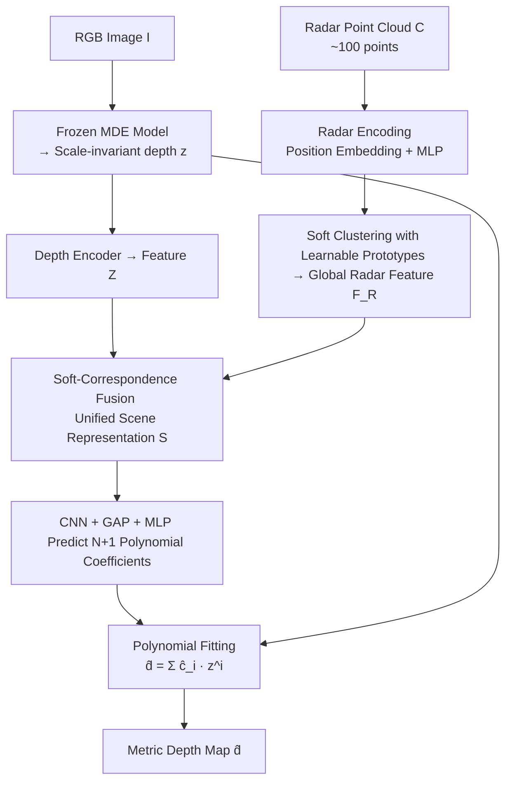

# Radar-Guided Polynomial Fitting for Metric Depth Estimation

**Conference**: CVPR 2026  
**arXiv**: [2503.17182](https://arxiv.org/abs/2503.17182)  
**Code**: None  
**Area**: 3D Vision  
**Keywords**: Radar-Camera Depth Estimation, Metric Depth, Polynomial Fitting, Monocular Depth Prior, Monotonicity Regularization

## TL;DR
POLAR reformulates the task of "transforming scale-invariant monocular depth estimation (MDE) into metric depth using sparse radar points" as a **polynomial fitting** problem. It utilizes radar features to predict a set of polynomial coefficients to apply non-uniform, depth-dependent corrections to MDE depth (instead of traditional global scale-and-shift affine transforms). This approach reduces MAE/RMSE by 24.9%/33.2% on average across three datasets while achieving real-time performance (40 fps) with minimal computational overhead.

## Background & Motivation
**Background**: Foundation models for pure Monocular Depth Estimation (MDE) (e.g., DepthAnything, UniDepth) are trained on massive datasets and can effectively infer **relative depth structures**. However, they inherently produce "scale-invariant" depth—recovering 3D information from a single 2D image is an ill-posed problem lacking absolute metric scale. To obtain metric depth, mainstream approaches introduce ranging sensors (lidar/radar). Lidar point clouds are dense and accurate but expensive, power-hungry, and unstable in adverse weather. Radar (specifically mmWave) provides only about a hundred points per frame and is noisy, but it is inexpensive, energy-efficient, robust to rain/fog, and is already standard in production vehicles, making it a more practical choice.

**Limitations of Prior Work**: Existing radar-camera methods almost exclusively assume that there is only a global scale (and shift) difference across the entire scene, applying a global **affine transform** $\hat{a}z+\hat{b}$. However, the authors point out a neglected fact: MDE models reconstruct depth well **within individual objects or local regions** but often **misplace the relative depths between different objects**. Once three or more regions are placed at incorrect relative depths, no single scale-and-shift can align them simultaneously because an affine transformation curve is a straight line with **zero inflection points**, lacking the degree of freedom to apply different correction strengths at different depth intervals.

**Key Challenge**: Correcting cross-regional misalignments requires a transformation that can perform **non-uniform** stretching/compression at different depth ranges. However, directly regressing the scale for every pixel (degrees of freedom $\approx 10^6$) when constrained by only a few hundred radar points ($\approx 10^2$) makes the system severely under-determined and unstable, potentially harming existing correct structures. Conversely, too few degrees of freedom (Affine, 2) results in over-constraint.

**Key Insight + Core Idea**: Find the middle ground between "Affine (2 DoF, under-expressive)" and "Per-pixel scale ($10^6$ DoF, under-determined)" by doctoralizing the transformation as an $N$-th order **polynomial** of the MDE depth $z$: $\hat{d}=\sum_{i=0}^{N}\hat{c}_i z^i$. The degrees of freedom are exactly $N+1$ coefficients, which is empirically close to the magnitude of radar points, making the problem "well-posed." Low-order terms handle global scale, while high-order terms introduce up to $N-2$ **inflection points** to rectify cross-regional misalignments. The coefficients are predicted by multimodal radar+MDE features and constrained by a first-order derivative regularization to maintain local monotonicity. In short: **Use radar-predicted polynomial coefficients to replace global affine transforms and non-uniformly warp scale-invariant depth into metric depth.**

## Method

### Overall Architecture
The input to POLAR is an RGB image $I$ and a frame of synchronized radar point cloud $C\in\mathbb{R}^{N_C\times 3}$, and the output is a metric depth map $\hat{d}$. The pipeline performs one core task: **predicting a set of polynomial coefficients to fit the scale-invariant depth $z$ from a frozen MDE into metric depth**. This is executed in four steps: (1) Use a frozen MDE foundation model $M$ to derive scale-invariant depth $z$ as a geometric prior, bypassing the need for large-scale radar-camera paired data; (2) Encode the sparse point cloud and use a set of **learnable prototypes** for soft-clustering into global radar features $F_R$; (3) Fuse MDE depth features $Z$ and radar features $F_R$ via **soft-correspondence attention** into a unified scene representation $S$; (4) Process $S$ through a shallow CNN + Global Average Pooling (GAP) into a scene vector, followed by an MLP predicting $N+1$ polynomial coefficients $\hat{c}$, and finally compute the weighted sum of powers of $z$ to obtain $\hat{d}$. The entire network is **single-stage** and does not require explicit radar-pixel association learning, making it fast and efficient.

### Key Designs

**1. Polynomial Fitting: Using Inflection Points to Fix Cross-Region Misalignments**

This is the core contribution. The authors upgrade the "scale-invariant to metric" transformation from affine $\hat{a}z+\hat{b}$ to an $N$-th order polynomial:

$$\hat{d}(x,y)=\sum_{i=0}^{N}\hat{c}_i\cdot z(x,y)^i.$$

Geometrically, an affine transformation is a straight line with zero inflection points, meaning it can only scale the entire depth field by the same coefficient. In contrast, the second derivative of an $N$-th order polynomial $f''(z^*)=\sum_{i=2}^{N}i(i{-}1)\hat{c}_i (z^*)^{i-2}=0$ can have up to $N-2$ roots, i.e., up to $N-2$ **inflection points**. This allows curvature to flip at different depth segments, providing the capability to decide which depth ranges need more correction and which should remain nearly intact. Low-order coefficients (including scale and shift) manage the global scale, while high-order coefficients manage local corrections—fixing both low-frequency cross-object misalignments and sharpening high-frequency errors at object boundaries. The coefficient signs are interpretable: positive high-order coefficients push a depth interval further, while negative ones pull it closer. crucially, this constrains the degrees of freedom from the pixel level ($10^6$) down to $N+1$ (near radar point counts), making the fitting well-posed with negligible computational cost.

**2. Radar Aggregation via Learnable Prototypes: Extracting Stable Patterns from Sparse and Noisy Point Clouds**

Radar point clouds contain only about a hundred points and are plagued by noise, multipath effects, and elevation ambiguity. Direct encoding and pooling (as in RadarNet or RadarCam) are easily skewed by outliers. POLAR first attaches sinusoidal 3D position embeddings to each point, passes them through an MLP $\psi_r$ to get point features $F_r$, and then introduces a set of **learnable prototypes** $P\in\mathbb{R}^{N_P\times c_r}$ as "centroids" for **soft-clustering**:

$$D_{ij}=\|P_j-\Phi_r(F_r)_i\|^2,\quad F_R=\sigma(-D/\tau)\,\Psi_r(F_r),$$

where $\sigma$ is the softmax function. Each radar point is assigned to prototypes based on feature similarity and aggregated into a global scene description $F_R$. This allows the prototypes to learn "recurring spatial/geometric patterns" in radar configurations, performing **selective aggregation** that identifies meaningful patterns while suppressing the influence of outliers.

**3. Soft-Correspondence Fusion: Aligning Radar Metric Cues with MDE Geometric Structure**

To predict coefficients, the absolute scale from the radar must be fused with the dense geometric structure from the MDE. MDE depth maps $z$ are passed through a depth encoder $f_z$ to obtain features $Z$. These features inherit the invariance (robustness to lighting, appearance, and viewpoint) of large-scale training, encoding **object-level geometry** more stably than pixel colors. The authors then learn a **soft spatial correspondence** (essentially cross-attention) between $Z$ and radar features $F_R$:

$$S=\mathrm{softmax}\!\left(\frac{(Z+E)\,(\Phi_R(F_R))^T}{\sqrt{c_r}}\right)\Psi_R(F_R),$$

where $E$ is a learnable 2D position embedding. This step matches radar configurations to "stably visible shapes/surfaces" rather than fluctuating pixel colors. The resulting representation $S$ contains both structural and metric anchors, serving as the basis for coefficient prediction. $S$ is further compressed into a scene vector $\bar S$ via a shallow CNN $f_s$ and GAP, and finally an MLP $\psi_s$ outputs $\hat{c}=\psi_s(\bar S)\in\mathbb{R}^{N+1}$.

**4. First-order Monotonicity Regularization: Constraining High-Order Polynomials**

While high-order polynomials are expressive, the function space is vast. Without constraints, they easily produce **non-monotonic** transformations—reversing the "near-to-far" depth order within an object or oscillating violently on noisy radar points. In addition to L1+L2 supervision, a third term constrains the first derivative of the predicted depth with respect to $z$ to be close to 1:

$$\mathcal{L}=\lambda_1\|\hat{d}-d\|_1+\lambda_2\|\hat{d}-d\|_2^2+\lambda_m\Big\|\mathbf{1}_{H\times W}-\frac{\mathrm{d}\hat{d}}{\mathrm{d}z}\Big\|_1,\qquad \frac{\mathrm{d}\hat{d}}{\mathrm{d}z}=\sum_{i=1}^{N}i\,\hat{c}_i\,z^{i-1}.$$

The intuition is that within a local region, pixels with larger initial depths should not yield smaller metric depths. This acts as an **approximate piecewise monotonic increasing** constraint (similar to an inductive bias in isotonic regression). It balances "preserving local order" with "allowing cross-regional correction."

### Loss & Training
The loss is the weighted sum of the three terms above: $L_1$ and $L_2$ ensure approximation of the ground truth, while $\lambda_m$ ensures monotonicity. The MDE backbone (e.g., UniDepth) is frozen; only the radar branch, fusion module, and coefficient prediction head are trained. The polynomial degree $N$ is a hyperparameter (default 8). Training is efficient—only 33.16 minutes per epoch on a single A6000.

## Key Experimental Results

### Main Results
Evaluated on nuScenes, ZJU-4DRadarCam (ZJU), and View-of-Delft (VoD) datasets with maximum evaluation distances of 50/70/80m using MAE/RMSE. Representative results at 80m:

| Dataset (80m) | Metric | POLAR | Prev. SOTA | Gain |
|--------|------|------|----------|------|
| nuScenes | MAE / RMSE | **1407.8 / 3193.5** | TacoDepth 1492.4 / 3324.8 | ↓ |
| ZJU | MAE / RMSE | **629.6 / 1171.3** | RadarCam 1183.5 / 3229.0 | Significant ↓ |
| VoD | MAE / RMSE | **1500.1 / 3951.8** | RadarCam 2227.4 / 5385.8 | Significant ↓ |

On average, compared to the strongest baseline, MAE/RMSE decreased by 4.4%/3.7% on nuScenes, 38.5%/57.5% on ZJU, and 31.8%/38.5% on VoD. The cross-dataset average improvement was MAE ↓24.9% and RMSE ↓33.2%.

**Efficiency** (nuScenes, single A6000):

| Metric | POLAR | TacoDepth | RadarCam-Depth |
|------|-------|-----------|----------------|
| Inference Latency (ms) | **24.81** | 29.30 | 315.64 |
| GFLOPs | **89.70** | 139.87 | 619.02 |
| Training (min/epoch) | **33.16** | — | 86.38 |

Inference at 24.81 ms ≈ 40.3 fps (15.3% faster than TacoDepth and 92.1% faster than RadarCam), with 39.5% fewer GFLOPs than TacoDepth. POLAR is simultaneously the most accurate, fastest, and most resource-efficient.

### Ablation Study
| Configuration (nuScenes / VoD, MAE) | nuScenes | VoD | Description |
|------|---------|------|------|
| Full Model | 1407.8 | 1500.1 | — |
| w/o monotonicity loss | 1921.1 | 1924.5 | Reverting to non-constrained polynomial, largest drop |
| w/o soft-correspondence (use cross-attn) | 2238.8 | 2147.9 | Replacing soft-correspondence with standard attn |
| Direct decoding (regression) | 1968.0 | 1855.9 | Per-pixel regression instead of polynomial |
| w/o learnable prototypes | 1615.5 | 1619.3 | Replacing soft clustering with self-attention |

Polynomial degree sensitivity (nuScenes / ZJU MAE): Degree 1 (Affine) 2156.8 / 1078.2 → Degree 8 **1407.8 / 629.6** (Optimal) → Degree 10 1463.7 / 643.3.

### Key Findings
- **Monotonicity regularization is the most significant contributor**: Removing it causes nuScenes MAE to jump from 1407.8 to 1921.1, proving that maintaining local depth order is critical for stabilizing high-order polynomials.
- **Degrees of freedom have a "sweet spot"**: Performance improves from Affine (Degree 1) up to Degree 8, then degrades at Degree 10 due to high-order oscillations.
- **Polynomial formulation is superior**: Direct per-pixel decoding performs significantly worse because the constraints (radar points) are far fewer than the degrees of freedom (pixels), leading to an under-determined system.

## Highlights & Insights
- **Reformulating "Sensor Fusion Completion" as "Polynomial Scene Fitting"**: The most elegant move is using a scalar function $\hat{d}=\sum\hat{c}_i z^i$ to unify scale-shift (Degree 1) and per-pixel regression (Degree $\infty$). By selecting the degree, the authors precisely control degrees of freedom to make an under-determined problem well-posed.
- **Inflection Points = Interpretable Correction Knobs**: Interpreting cross-region misalignment correction as "producing inflection points where curvature should flip" allows for a rare interpretable perspective on depth correction.
- **First-order Derivative as a Soft Isotonic Constraint**: Using $\|\mathbf{1}-\mathrm{d}\hat d/\mathrm{d}z\|_1$ as a differentiable regularization tames high-order oscillations without strictly forcing monotonicity (allowing necessary cross-region reordering).
- **Frozen MDE + Lightweight Head**: Freezing an expensive large model as a geometric prior and training only a minimal head is the key to achieving both accuracy and efficiency.

## Limitations & Future Work
- The polynomial degree is a hyperparameter that requires per-dataset tuning; an adaptive degree selection mechanism is currently lacking.
- While the first-order derivative regularization suppresses oscillations, the authors suggest stronger constraints could further stabilize higher-order fitting.
- Mechanism: The method uses a **global** scalar mapping $z\mapsto\hat d$—meaning the same $z$ value at different image locations will be mapped to the same depth. If two regions have similar MDE depths but very different ground truths, a single polynomial curve cannot separate them. This makes the method dependent on the MDE's ability to estimate relative depth within objects correctly.
- Evaluation was limited to driving scenarios; generalization to indoor, low-speed, or non-vehicle radar configurations is unverified.

## Related Work & Insights
- **vs. Global Affine (Scale-and-shift methods)**: These assume a single scale+offset for the entire scene (zero inflection points) and cannot fix misalignments between more than two regions. POLAR breaks this upper bound.
- **vs. RadarCam-Depth (Per-pixel scale map)**: RadarCam regresses a scale per pixel ($10^6$ DoF), which is under-determined given sparse radar points, often destroying MDE structures or missing entire buildings. POLAR constrains DoF to $N+1$.
- **vs. RadarNet / GET-UP (Completion/Direct Decoding)**: These involve multi-stage training and explicit association learning, which are complex and slow (GET-UP takes 445ms). POLAR's direct coefficient prediction is real-time (24.81ms).
- **vs. Lidar Depth Completion**: Directly applying lidar methods to radar performs poorly due to radar being several orders of magnitude sparser and noisier.

## Rating
- Novelty: ⭐⭐⭐⭐⭐ First to formulate radar-camera metric depth as polynomial scene fitting, unifying affine and per-pixel extremes via inflection points.
- Experimental Thoroughness: ⭐⭐⭐⭐ Extensive datasets, distances, and ablation; lacks cross-domain (indoor) validation.
- Writing Quality: ⭐⭐⭐⭐⭐ Geometric intuition (inflection points, DoF ratios) is clearly explained.
- Value: ⭐⭐⭐⭐⭐ Most accurate, fastest, and most efficient; highly suitable for real-time vehicle deployment.

<!-- RELATED:START -->

1. **UniDepth**: Universal Monocular Metric Depth Estimation (CVPR 2024)
2. **Depth Anything**: Unleashing the Power of Large-Scale Unlabeled Data (CVPR 2024)
3. **RadarCam-Depth**: Sparse-to-Dense Depth Completion using mmWave Radar (CVPR 2023)

<!-- RELATED:END -->

## Related Papers

- [\[CVPR 2026\] The Midas Touch for Metric Depth](the_midas_touch_for_metric_depth.md)
- [\[CVPR 2026\] MD2E: Modeling Depth-to-Edge Cues for Monocular Metric Depth Estimation](md2e_modeling_depth-to-edge_cues_for_monocular_metric_depth_estimation.md)
- [\[CVPR 2026\] UniDAC: Universal Metric Depth Estimation for Any Camera](unidac_universal_metric_depth_estimation_for_any_camera.md)
- [\[CVPR 2026\] LiteSense: Lifting Lightweight ToF with RGB for High-Resolution Metric Depth Estimation](litesense_lifting_lightweight_tof_with_rgb_for_high-resolution_metric_depth_esti.md)
- [\[CVPR 2026\] Depth Hypothesis Guided Iterative Refinement for Event-Image Monocular Depth Estimation](depth_hypothesis_guided_iterative_refinement_for_event-image_monocular_depth_est.md)

<!-- RELATED:END -->
