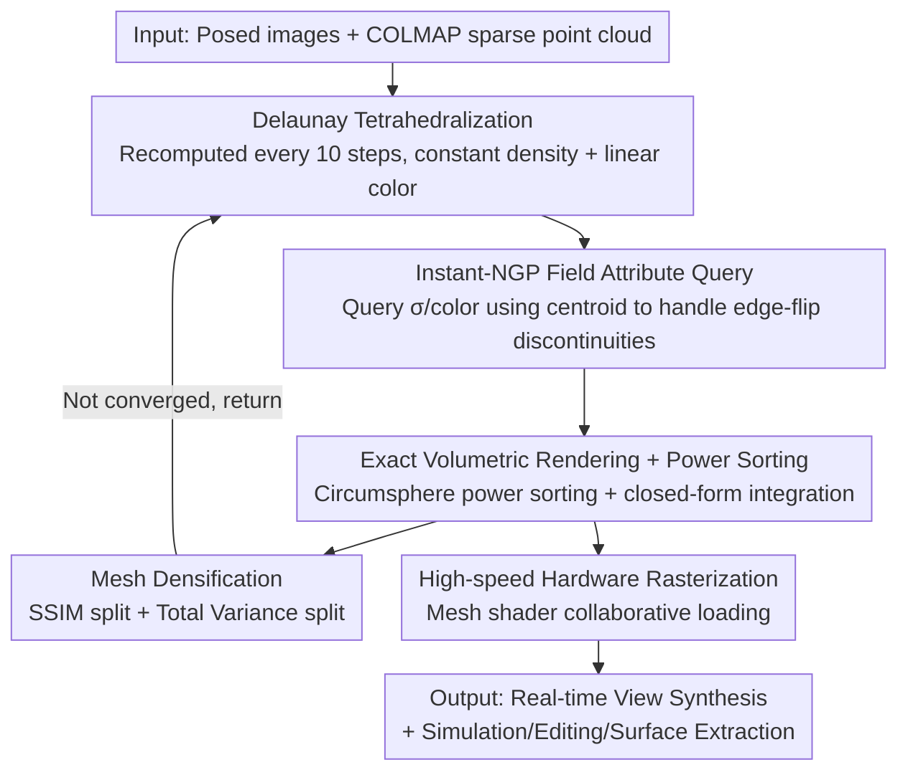

# Radiance Meshes for Volumetric Reconstruction

**Conference**: CVPR 2026  
**Paper**: [CVF Open Access](https://openaccess.thecvf.com/content/CVPR2026/html/Mai_Radiance_Meshes_for_Volumetric_Reconstruction_CVPR_2026_paper.html)  
**Code**: TBD (Paper provides desktop/Web rasterizer and ray-tracing reference implementations)  
**Area**: 3D Vision  
**Keywords**: Radiance Fields, Delaunay Tetrahedralization, Volumetric Rendering, Hardware Rasterization, Real-time View Synthesis

## TL;DR
Radiance Mesh represents radiance fields by partitioning the scene into tetrahedral units with "constant density + linear color" using Delaunay tetrahedralization. In conjunction with exact volumetric rendering sorted by circumsphere power and a novel mesh shader rasterizer, it achieves real-time view synthesis that is faster than 3DGS and popping-free, while maintaining comparable quality and being naturally compatible with graphics ecosystems for simulation, editing, and surface mesh extraction.

## Background & Motivation
**Background**: Radiance fields have become the mainstream for 3D reconstruction since NeRF. Model design has long been dominated by a trade-off: representations that render fast (like opaque triangle meshes) are difficult to optimize, while those that optimize stably (like MLPs) render slowly. 3DGS is a strong compromise on this curve, offering fast rendering and easy integration into existing graphics pipelines.

**Limitations of Prior Work**: 3DGS still faces four major drawbacks: ① its volumetric rendering approximation for high frame rates causes popping (primitives flickering as the viewpoint changes); ② splatting is difficult under complex camera models like ultra-wide or fisheye; ③ splats are hard to edit; ④ although faster than most radiance fields, it is still significantly slower than traditional mesh-based real-time rendering. The recent Radiant Foam (RadFoam) uses an optimizable 3D Voronoi partition for fast ray tracing, but Voronoi cells have 15.5 faces on average, requiring dozens of triangles per face for rasterization, which is overly expensive; furthermore, calculating cell transparency requires traversing all neighbors in the fragment shader to find the back-face distance, which is very costly.

**Key Challenge**: The goal is to "use hardware triangle rasterizers/ray tracers (natively supported by graphics ecosystems) while performing exact volumetric rendering (popping-free)." However, geometric representations that allow direct optimization of vertex positions suffer from topological changes (edge flips) when points move, leading to discontinuous mappings from vertex positions to mesh topology, which disrupts optimization—this is why RadFoam previously considered but abandoned Delaunay.

**Goal**: To use a representation natively composed of triangles with a fixed face count, capable of exact volumetric rendering, and allowing unconstrained vertex optimization, thereby achieving both the "speed of meshes" and the "optimizability of radiance fields."

**Key Insight**: The dual of a Voronoi diagram is a Delaunay tetrahedralization, where all units are tetrahedra (4 triangular faces, fixed count), natively supported by hardware. When points move, one only needs to recalculate the triangulation every few steps, allowing unconstrained vertex optimization. The key is to solve the topological discontinuity caused by edge flips.

**Core Idea**: Assign "constant density + linearly varying color" to each Delaunay tetrahedron to form a radiance mesh. Parameterize non-spatial attributes like density and color using an Instant-NGP field in the style of Zip-NeRF (rather than binding them to vertices), ensuring the field remains smooth and optimizable even during topological flips.

## Method

### Overall Architecture
The input consists of a set of posed images and a sparse initial point cloud (COLMAP SfM). During optimization, the scene is represented by a set of 3D points $\{v_i\}$ and an Instant-NGP data structure $G_\theta$. Every 10 steps, the Delaunay tetrahedralization of $\{v_i\}$ is recomputed to obtain a set of non-overlapping tetrahedra $\{T_k\}$. Since points are moving and tetrahedra are dynamically created or destroyed, $G_\theta$ is queried for each tetrahedron's density $\sigma_k$, spherical harmonic base color $c^0_k$, and linear color gradient $\nabla c_k$. During rendering, tetrahedra are sorted by circumsphere power, closed-form volumetric integration is performed for each ray within each tetrahedron, and pixel colors are blended front-to-back using a hardware rasterizer. Mesh densification is performed during optimization using two types of split scores to capture details.

### Key Designs

**1. Radiance Mesh Representation: Constant Density + Linear Color Delaunay Tetrahedra**

To resolve the conflict between wanting native triangles with fixed face counts and exact volumetric rendering, this paper assigns a constant density $\sigma_k$ and a linearly varying color field to each Delaunay tetrahedron $T_k$. The color of any internal point $p$ is $c_k(p) = c^0_k + \nabla c_k \cdot (p - O_k)$, where $O_k$ is the circumcenter or centroid. Because density is constant and color is linear, the volumetric rendering integral for a ray passing through the tetrahedral interval $[t^{in}_k, t^{out}_k]$ has a **closed-form solution**:
$$\Delta C_k = \int_{t^{in}_k}^{t^{out}_k} e^{-\sigma_k(t-t^{in}_k)} c_k(r(t))\,\sigma_k\,dt$$
This relies only on entry/exit colors and density, eliminating the need for numerical integration sampling. Tetrahedra are sorted front-to-back relative to the camera origin $o$ using circumsphere power $P(T) = \|O(T) - o\|_2^2 - R(T)^2$ via radix sort, and then blended using hardware hardware as $C = \sum_k w_k \Delta C_k,\ w_k = \prod_{l<k}(1-\alpha_l)$. Since the representation consists entirely of triangles with fixed counts, it can directly utilize hardware triangle rasterizers/ray tracers to achieve exact visibility, fundamentally eliminating popping and photometric inconsistencies caused by 3DGS sorting approximations.

**2. Instant-NGP Field Attribute Query: Resolving Edge-flip Discontinuity via Centroid**

Binding density and color directly to vertices is problematic: when slight vertex movements trigger edge flips, sudden topological changes make barycentric-interpolated colors discontinuous, breaking optimization (the "No Instant-NGP" ablation collapses). This work instead optimizes a **field** parameterized by Instant-NGP + mip-NeRF 360 contraction functions, queried via a central point for each tetrahedron. Since tetrahedra are volumes and NGP processes points, a Zip-NeRF-style pre-filtered downweighting $b_k \leftarrow \phi(R_k) \circ G_\theta(O_k)$ is used with the circumradius $R_k$, followed by a shallow head to output $\sigma_k, c^0_k, \nabla c_k$. Two central point candidates were tested: the **circumcenter**, which coincides for tetrahedra during a flip (making the function continuous) but has poor numerical stability for thin tetrahedra; and the **centroid**, which is discontinuous but numerically more stable. Centroid-based queries performed better (PSNR 27.89 vs. 27.79) when combined with $R_k$ downweighting. Color gradients are also constrained by an activation to prevent negative colors and use a single-channel (mono) gradient to save 30% shader memory reads.

**3. Mesh Densification: Dual Criteria of SSIM split + Total Variance split**

Similar to 3DGS, which adds or removes primitives based on rendering contributions, this work performs densification (adding points). Every 500 steps, two types of scores are calculated on $M$ sampled training images to select tetrahedra for "splitting." ① **SSIM split** $S_k$ (based on Error-Based Densification) back-projects per-pixel SSIM errors to primitives weighted by $w_k \alpha_k$, taking the mean of the top-2 errors across views; $S_k > 0.5$ primitives are selected. This governs most decisions but fails for thin structures with initially low density. ② **Total Variance split** $T_k$ treats each tetrahedron as an estimator of internal radiation, calculating the weighted variance $\sigma^2_k$ of the residual $\delta = C - C_{gt}$, multiplied by the total error weight; $T_k > 2.0$ units are selected specifically for thin structures. Instead of uniform sampling, insertion points are chosen near the ray intersection of the two highest-error views.

**4. High-speed Hardware Rasterization: Mesh Shader Collaborative Loading**

To render tetrahedral volumes with hardware triangle rasterizers, previous approaches emitted 2-3 triangles and interpolated transparency, but emitting variable geometry is slow. This work instead emits **redundant but static** geometry (each face duplicated twice, each vertex duplicated per connected tetrahedron count), utilizing the rasterization pipeline's culling and interpolating distances to the back-face rather than transparency. Without mesh shaders, this degrades to an instanced shader where each tetrahedron is loaded 4 times. With mesh shaders, a thread block can collaboratively generate mesh data, using warp shuffles to share loaded data so each tetrahedron is loaded only once. Ablations show significant progressive speedups from "tile-based → instanced → mesh shader."

### Loss & Training
The field $G_\theta$ and point set $\{v_i\}$ are optimized using standard volumetric reconstruction loss. Delaunay tetrahedralization is reconstructed every 10 steps, and densification occurs every 500 steps. The differentiable renderer is implemented in Slang.D as tile-based for cross-vertex/fragment derivative tracking; the Vulkan renderer uses C++/Slang to support mesh shaders; and the Web viewer uses JavaScript+WebGPU for instanced rendering.

## Key Experimental Results

Evaluated on 9 mip-NeRF 360 scenes + 4 DeepBlending/Tanks&Temples scenes, comparing against 3DGS, EVER, SVRaster, RadFoam, and Triangle Splatting. GPU-hr is measured on RTX4090, and FPS is measured at test resolutions (including frame buffer display time).

### Main Results (Quality + Speed)

| Dataset | Metric | 3DGS | RadFoam | Ours |
|--------|------|------|---------|------|
| mip360 Outdoor | PSNR↑ | 24.63 | 23.90 | 24.64 |
| mip360 Indoor | PSNR↑ | 31.05 | 30.66 | 30.31 |
| T&T+DB | PSNR↑ | 26.65 | 19.20 | 26.53 |
| mip360 Outdoor | FPS↑ | 145 | 234 | **240** |
| mip360 Indoor | FPS↑ | 251 | 162 | **384** |
| T&T+DB | FPS↑ | 535 | 353 | 475 |

In terms of quality, this work comprehensively exceeds the most similar baseline, RadFoam (especially on T&T+DB, where RadFoam nearly fails with 19.20 PSNR vs. Ours 26.53), and approaches 3DGS. In terms of speed, it is generally faster than all baselines, outperforming original 3DGS by 32% at 1440p. For Ray tracing, it is 17% faster than RadFoam on indoor scenes. Memory-wise, it supports ~15 million tetrahedra whereas RadFoam OOMs at ~3.3 million.

### Ablation Study (bicycle + room scenes)

| Config | PSNR↑ | SSIM↑ | LPIPS↓ | Note |
|------|------|------|------|------|
| Full Model | **27.89** | **0.830** | **0.301** | — |
| No SSIM Splitting | 26.92 | 0.751 | 0.417 | Biggest drop, loss of texture detail |
| No Total Var Splitting | 27.59 | 0.825 | 0.312 | Loss of thin structures |
| No Instant-NGP (Vertex Binding) | 27.25 | 0.787 | 0.360 | Optimization collapse due to edge-flips |
| Constant Color | 27.68 | 0.813 | 0.324 | Minor decrease |
| No Downweighting | 27.68 | 0.826 | 0.307 | Minor decrease |
| No Centroid (Circumcenter) | 27.79 | 0.826 | 0.310 | Poor numerical conditions |

### Key Findings
- **SSIM split makes the highest contribution**: Removing it results in a PSNR drop from 27.89 to 26.92, primarily affecting textures; total variance split handles thin structures.
- **The Instant-NGP field is indispensable**: Binding attributes directly to vertices leads to optimization failure during edge-flips (PSNR drop of 0.64), proving that parameterizing attributes via a field is key to resolving topological discontinuity.
- **Shader implementation dictates speed**: "Tile-based → instanced hardware rasterizer → mesh shader" yield significant progressive speedups; mesh shaders provide the highest performance by eliminating redundant primitive loading.

## Highlights & Insights
- **Leveraging the dual of Voronoi (Delaunay) as a radiance field representation**: While RadFoam avoided Delaunay due to topological discontinuity, this work uses an Instant-NGP field to absorb these discontinuities, gaining the benefits of fixed-face-count triangles that are hardware-friendly.
- **Constant density + linear color → closed-form volumetric integral**: This provides the mathematical basis for "exact volumetric rendering + hardware rasterization," which is cleaner than 3DGS's approximation and eliminates popping.
- **System-level optimization via mesh shader collaborative loading**: Using static redundant geometry + warp shuffle to shared loads makes tetrahedral rasterization faster than 3DGS and ensures portability across Desktop/Web/Ray Tracing.
- **True triangle mesh output**: Naturally integrates with graphics ecosystems for PBD/xPBD physical simulation, Boolean editing, watertight surface mesh extraction, and rendering with distorted camera models.

## Limitations & Future Work
- **High training overhead**: GPU-hr is significantly higher than most baselines (e.g., 4.515 vs. 3DGS 0.609 for outdoor) due to frequent Delaunay reconstruction and NGP querying.
- **Quality slightly trails 3DGS/SVRaster**: Indoor PSNR (30.31) is lower than 3DGS (31.05); gaps remain for extreme quality requirements.
- **Centroid query discontinuity is mitigated but not eliminated**: Using centroid over the continuous circumcenter relies on filtering to hide discontinuities, which may still be problematic for extremely thin tetrahedra.
- **Dependence on COLMAP and periodic re-tetrahedralization**: Bound by initial sparse clouds and reconstruction frequency (every 10 steps), which are constraints for ultra-large-scale scenes.

## Related Work & Insights
- **vs RadFoam**: RadFoam uses 3D Voronoi + ray tracing with 15.5 faces per unit; this work uses its dual Delaunay (4 faces), enabling hardware rasterization with higher quality and stability (Ours 26.53 vs. RadFoam's failure on T&T+DB) and ~4.5x higher memory capacity.
- **vs 3DGS**: 3DGS has slightly higher quality but suffers from popping and camera model limitations; this work provides exact visibility (no popping), is 32% faster at 1440p, and uses native meshes for easier editing/simulation.
- **vs EVER / SVRaster**: Both offer exact volumetric rendering but are slower and less portable; this work achieves higher speed while maintaining exact integration and ensuring portability across platforms.

## Rating
- Novelty: ⭐⭐⭐⭐⭐ Delaunay tetrahedra as radiance fields, resolving topological discontinuity via NGP, and mesh shader optimization represents a clear and innovative path.
- Experimental Thoroughness: ⭐⭐⭐⭐ Solid multi-dataset comparisons and ablations, though training overhead and quality gap analysis could be deeper.
- Writing Quality: ⭐⭐⭐⭐ Complete derivations and rich illustrations; higher formula density with system details provided in supplements.
- Value: ⭐⭐⭐⭐⭐ Popping-free real-time radiance fields with native triangle mesh output across Desktop/Web/Ray Tracing has significant practical and engineering value.

<!-- RELATED:START -->

1. (2024) [RadFoam: Real-Time Photorealistic Ray Tracing of Volumetric Models](https://arxiv.org/abs/2403.04128)
2. (2023) [3D Gaussian Splatting for Real-Time Radiance Field Rendering](https://repo-lpgh.github.io/gaussian-splatting/)
3. (2024) [SVRaster: Spheroid Volumetric Rasterization for Real-Time View Synthesis](https://arxiv.org/abs/2403.18181)
4. (2021) [Instant Neural Graphics Primitives with a Multiresolution Hash Encoding](https://nvlabs.github.io/instant-ngp/)

<!-- RELATED:END -->

## Related Papers

- [\[CVPR 2026\] Color-Encoded Illumination for High-Speed Volumetric Scene Reconstruction](color-encoded_illumination_for_high-speed_volumetric_scene_reconstruction.md)
- [\[CVPR 2026\] Volumetric Functional Maps](volumetric_functional_maps.md)
- [\[CVPR 2025\] Volumetric Surfaces: Representing Fuzzy Geometries with Layered Meshes](../../CVPR2025/3d_vision/volumetric_surfaces_representing_fuzzy_geometries_with_layered_meshes.md)
- [\[CVPR 2026\] MozzaVID: Mozzarella Volumetric Image Dataset](mozzavid_mozzarella_volumetric_image_dataset.md)
- [\[CVPR 2026\] SMVRT: Implicit Human 3D Modeling Using Sparse Multi-View Volumetric Reconstruction with Transformer Fusion](smvrt_implicit_human_3d_modeling.md)

<!-- RELATED:END -->
