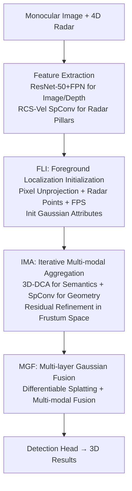

# RaGS: Unleashing 3D Gaussian Splatting from 4D Radar and Monocular Cue for 3D Object Detection

**Conference**: CVPR 2026  
**Paper**: [CVF Open Access](https://openaccess.thecvf.com/content/CVPR2026/html/Bai_RaGS_Unleashing_3D_Gaussian_Splatting_from_4D_Radar_and_Monocular_CVPR_2026_paper.html)  
**Code**: https://github.com/shawnnnkb/RaGS  
**Area**: 3D Vision / Autonomous Driving  
**Keywords**: 4D mmWave Radar, Camera Fusion, 3D Gaussian Splatting, 3D Object Detection, BEV

## TL;DR
RaGS models the scene as a continuous 3D Gaussian field. It initializes Gaussians using monocular foreground cues, iteratively absorbs radar geometry and image semantics to "move" Gaussians towards foreground objects, and finally renders multi-layer BEV features for detection. It achieves SOTA on three 4D radar-camera benchmarks: VoD, TJ4DRadSet, and OmniHD-Scenes.

## Background & Motivation
**Background**: 4D millimeter-wave radar provides distance, velocity, and height information while remaining robust in adverse weather. Cameras provide high-resolution semantics. Their complementarity makes them a powerful combination for 3D perception in autonomous driving. Current radar-camera fusion methods are mainly categorized into instance-based (using 2D proposals followed by radar feature alignment) and BEV-based (projecting multi-modal features into a fixed-grid Bird’s-Eye-View space for global reasoning).

**Limitations of Prior Work**: Instance-based methods depend on 2D detection quality and are constrained by cascaded structures, lacking global scene understanding. BEV-based methods use predefined voxel grids and fixed anchors to sample image semantics, wasting significant computation on background aggregation due to rigid and inflexible grid resolutions.

**Key Challenge**: 3D object detection is inherently **sparse** (foreground objects occupy only a small fraction of the scene) yet requires global scene understanding. Dense representations with fixed grids are naturally misaligned with this sparsity—dense modeling of the entire scene is required for global perception, but 90% of the computation is spent on irrelevant background.

**Goal**: To find a flexible representation that dynamically concentrates resources on sparse foregrounds while maintaining global scene perception for fusing 4D radar and monocular images.

**Key Insight**: 3D Gaussian Splatting (3DGS) is a compact, continuous, and anisotropic scene representation that is inherently sparse, differentiable, and physically interpretable. Originally used for neural rendering, the authors observe that its "dynamic resource allocation and adaptive attention" align perfectly with the sparsity requirements of detection tasks. Previously, GS was almost exclusively used for rendering or occupancy prediction; its potential for multi-modal fusion and detection remains unexplored.

**Core Idea**: Replace fixed BEV grids with a continuous 3D Gaussian field to fuse radar and images. Gaussians adaptively aggregate toward foreground objects (object-centric precision) while maintaining global perception through continuous probability distributions, eventually rendering into BEV features for the detection head.

## Method

### Overall Architecture
RaGS follows a cascaded pipeline: monocular images and 4D radar are first encoded into features. The **FLI** module initializes the positions of a set of 3D Gaussians using monocular foreground cues. Then, the **IMA** module iteratively aggregates image semantics and radar geometry/velocity onto the Gaussians, while updating their positions toward foreground objects. Finally, the **MGF** module renders multi-level Gaussians into multi-scale BEV features, which are fused with radar pillars for the detection head. Each Gaussian is described by explicit physical attributes (position $\mathbf{P}$, rotation $\mathbf{R}$, scale $\mathbf{S}$, opacity $\mathbf{O}$) and an implicit feature embedding $\mathbf{F}^\text{I}$.

### Key Designs

**1. FLI (Foreground Localization Initialization): Anchoring Gaussians on the Foreground**

Fixed-grid methods fill the entire BEV space with sampling points, causing heavy redundancy. Purely learnable embeddings only fit statistical priors of the dataset. FLI uses **monocular cues** to initialize Gaussian positions: it selects top-K foreground pixels from segmentation logits $\mathbf{L}$ and metric depth $\mathbf{D}$, unprojecting pixel $(u,v)$ with depth $d$ into 3D: $\mathbf{P}_\text{unproj} = d\cdot \mathbf{K}^{-1}(u,v,1)^T$, where $\mathbf{K}$ is the camera intrinsic matrix. It then supplements these with 4D radar points $\mathbf{P}_\text{radar}$ and candidate points $\mathbf{P}_\text{sample}$ generated via Farthest Point Sampling (FPS) in frustum space to ensure coverage. The combined positions are $\mathbf{P}=\text{Concat}(\mathbf{P}_\text{unproj},\mathbf{P}_\text{sample},\mathbf{P}_\text{radar})\in\mathbb{R}^{N\times3}$. Metric depth is obtained via weighted sum of depth probabilities: $D=\sum_{d=1}^{D}P_d\cdot d$. These initialized Gaussians are concentrated on the sparse foreground within the FOV.

**2. IMA (Iterative Multi-modal Aggregation): Moving Gaussians via Semantic and Geometric Interaction**

Initialized Gaussians provide "coarse localization" and require semantic/geometric refinement. IMA iterates through three steps: ① **Semantic Aggregation**: Instead of projecting Gaussians to 2D for deformable attention, image features $\mathbf{F}^\text{2D}$ and depth probabilities $\mathbf{D}^\text{prob}$ are combined via outer product to form a **depth-aware 3D image feature space**. 3D Deformable Cross-Attention (3D-DCA) is then performed: $\mathbf{F}^\text{I}=\sum_{n=1}^{T}\mathbf{A}_n\mathbf{W}\cdot\phi(\mathbf{F}^\text{2D}\otimes\mathbf{D}^\text{prob}, \mathcal{P}(\mathbf{P})+\Delta\mathbf{q})$, where $\phi$ is trilinear interpolation and $\Delta\mathbf{q}$ is a learnable offset. ② **Geometric Aggregation**: Each Gaussian is treated as a voxel $\mathbf{V}^\text{gs}$, concatenated with radar pillars $\mathbf{V}^\text{radar}$ (replicated along height), and processed via sparse convolution: $\mathbf{F}^\text{I}\leftarrow\mathbf{V}^\text{gs}=\text{Spconv}(\text{Concat}(\mathbf{V}^\text{gs},\mathbf{V}^\text{radar}))[:N]$. RCS-velocity-aware pillars provide physical constraints and motion cues. ③ **Position Refinement**: Gaussians are re-projected to frustum space, and an MLP predicts a residual $\Delta\mathbf{p}=(\Delta h,\Delta w,\Delta d)=\text{MLP}(\text{Concat}(\mathbf{F}^\text{I},\mathcal{P}(\mathbf{P})))$ based on implicit features and projected positions. The updated positions are transformed back to 3D: $\mathbf{P}\leftarrow\mathcal{P}^{-1}(\mathcal{P}(\mathbf{P})+\Delta\mathbf{p})$.

**3. MGF (Multi-layer Gaussian Fusion): Rendering the Gaussian Field to Multi-scale BEV**

IMA produces $M$ sets of Gaussians at different levels. MGF performs **differentiable Gaussian splatting** on each Gaussian $G_i=(\mu_i,\Sigma_i,O_i,\mathbf{F}^\text{I}_i)$ into the BEV space. The feature at BEV pixel $\mathbf{q}$ is the weighted accumulation of projected Gaussians: $\sum_n O_{i,n}\exp(-\tfrac{1}{2}(\mathbf{q}-\mu_{i,n})^\top\Sigma_{i,n}^{-1}(\mathbf{q}-\mu_{i,n}))\mathbf{F}^\text{I}_{i,n}$, implemented via a CUDA rasterizer. The last $L$ layers are rendered to multi-layer BEV features $\{\mathbf{F}^{(l)}_\text{bev}\}$ and fused into $\mathbf{F}^\text{gs}$, followed by a Cross-Modal Fusion (CMF) module with radar pillars $\mathbf{F}^\text{pillar}$ to produce the final feature $\mathbf{F}^\text{BEV}$.

### Loss & Training
The strategy involves two stages: a pre-training phase using depth and perspective segmentation losses $\mathcal{L}_\text{pretrain}=\mathcal{L}_\text{depth}+\mathcal{L}_\text{seg}$; and a joint training phase combining the 3D detection loss $\mathcal{L}_\text{det}$ with rendering auxiliary losses (frustum depth rendering and BEV segmentation rendering): $\mathcal{L}_\text{total}=\mathcal{L}_\text{det}+\lambda(\mathcal{L}_\text{depth\_render}+\mathcal{L}_\text{seg\_render})$, with $\lambda=0.1$. Rendered depth is supervised by LiDAR, and BEV segmentation is guided by occupancy data.

## Key Experimental Results

### Main Results

| Dataset | Metric | Prev. SOTA | Ours | Gain |
|--------|------|----------|------|------|
| OmniHD-Scenes | mAP / ODS | 34.88 / 43.00 (RCFusion/BEVFusion) | 35.88 / 43.45 | +1.00 / +0.45 |
| TJ4DRadSet | AP3D / APBEV | 41.82 / 47.16 (SGDet3D) | 41.95 / 51.04 | +0.13 / +3.88 |
| VoD (val) | mAPEAA / mAPDC | 59.75 / 77.42 (SGDet3D) | 61.86 / 81.63 | +2.11 / +4.21 |
| VoD vs DETR-like | mAPEAA | 54.44 (RaCFormer) | 61.86 | +7.42 |

On VoD, compared to the strong BEV baseline LXL, Ours improves mAPEAA / mAPDC by +5.55 / +8.70 respectively. The inference speed is 10.5 FPS (higher than LXL's 6.1 and RCFusion's 9.0).

### Ablation Study

| Config | mAPEAA | mAPDC | Description |
|------|--------|-------|------|
| Baseline (Radar only) | 55.33 | 72.32 | 4D radar baseline |
| + FLI | 57.40 | 75.80 | Added foreground initialization |
| + FLI + IMA | 59.12 | 76.68 | Added iterative aggregation |
| + FLI + IMA + MGF (Full) | 59.45 | 76.98 | Full model |

### Key Findings
- **Modular Contribution**: IMA provides the largest gain (+1.72 mAPEAA) by iteratively refining the multi-modal features and positions.
- **Optimal Gaussian Count $N$**: Increasing $N$ from 3,200 to 12,800 improves mAPEAA from 54.77 to 59.45. Further increases to 19,200 yield negligible gains (59.47), indicating 12,800 Gaussians are sufficient for sparse foreground coverage.
- **Robustness**: Ours maintains 56.66 mAPEAA under $\pm5^\circ/\pm0.5m$ calibration noise (vs. LXL's 50.25) and shows consistent leads of 4-5 points in simulated adverse weather (rain, fog, low light).

## Highlights & Insights
- **3DGS as a Fusion Medium**: Ours is the first to prove that Gaussian fields can serve as multi-modal aggregators. Explicit physical attributes make the fusion interpretable compared to purely implicit query-based frameworks like DETR-like models.
- **Sparsity Alignment**: The core insight is the natural match between the sparsity of detection tasks and the sparsity of GS representations. This allows computation to be dynamically directed toward foreground objects.
- **Depth-aware 3D Image Space**: Aggregating features in a 3D-projected space instead of on a 2D plane preserves geometric consistency, which is valuable for any task requiring the interaction of 3D queries with image features.

## Limitations & Future Work
- **Multi-view Initialization**: For panoramic scenarios like OmniHD-Scenes, more sophisticated initialization priors are still being explored, as monocular initialization may not be optimal for surround-view.
- **Dependency on Segmentation/Depth**: Gaussian positions rely on segmentation logits and monocular depth quality. Performance may degrade if these estimates fail due to occlusions or extreme distances.
- **LiDAR Supervision for Training**: The depth rendering loss requires LiDAR supervision during training, although the model can be deployed with only radar and camera.
- **Future Directions**: Exploring multi-view consistent geometric priors for initialization and introducing temporal Gaussians for cross-frame consistency to further reduce redundancy.

## Related Work & Insights
- **vs Instance-based (CenterFusion / CRAFT)**: These rely on 2D proposals and lack global context; Ours uses a continuous Gaussian field for both object-centric precision and global perception.
- **vs BEV-based (RCFusion / LXL)**: These use fixed grids that are computationally wasteful; Ours adaptively moves Gaussians to relevant areas.
- **vs DETR-based (FUTR3D / RaCFormer)**: Purely implicit queries lack physical interpretability; Gaussians provide explicit attributes as an interpretable fusion medium.

## Rating
- Novelty: ⭐⭐⭐⭐⭐ 
- Experimental Thoroughness: ⭐⭐⭐⭐⭐ 
- Writing Quality: ⭐⭐⭐⭐ 
- Value: ⭐⭐⭐⭐ 

<!-- RELATED:START -->

## Related Papers

- [\[CVPR 2026\] R4Det: 4D Radar-Camera Fusion for High-Performance 3D Object Detection](r4det_4d_radar-camera_fusion_for_high-performance_3d_object_detection.md)
- [\[CVPR 2026\] RPGFusion: 4D Radar Prior-Guided Multi-Modal Fusion for 3D Detection](rpgfusion_4d_radar_prior-guided_multi-modal_fusion_for_3d_detection.md)
- [\[ICCV 2025\] CVFusion: Cross-View Fusion of 4D Radar and Camera for 3D Object Detection](../../ICCV2025/autonomous_driving/cvfusion_cross-view_fusion_of_4d_radar_and_camera_for_3d_object_detection.md)
- [\[CVPR 2026\] ParkGaussian: Surround-view 3D Gaussian Splatting for Autonomous Parking](parkgaussian_surround-view_3d_gaussian_splatting_for_autonomous_parking.md)
- [\[CVPR 2026\] ReManNet: A Riemannian Manifold Network for Monocular 3D Lane Detection](remannet_a_riemannian_manifold_network_for_monocular_3d_lane_detection.md)

<!-- RELATED:END -->
