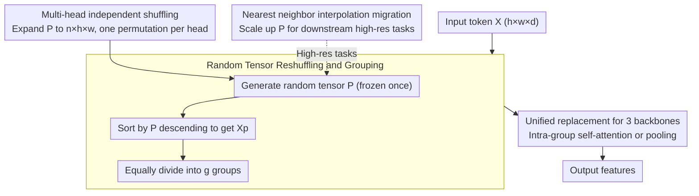

# Random Wins All: Rethinking Grouping Strategies for Vision Tokens

**Conference**: CVPR 2026  
**arXiv**: [2603.00486](https://arxiv.org/abs/2603.00486)  
**Authors**: Qihang Fan, Yuang Ai, Huaibo Huang, Ran He (CASIA)  
**Code**: [GitHub](https://github.com/qhfan/random)  
**Area**: 3D Vision  
**Keywords**: Vision Transformer, Token Grouping, Random Grouping, Attention Mechanism, Efficiency Optimization

## TL;DR

Ours proposes a minimalist random grouping strategy to replace various carefully designed token grouping methods in Vision Transformers. It achieves almost comprehensive superiority over all baselines across image classification, object detection, semantic segmentation, point cloud segmentation, and VLMs. The success is explained through four dimensions: positional information, head feature diversity, global receptive field, and fixed grouping patterns.

## Background & Motivation

- **Background**: The self-attention mechanism of Transformers has $O(n^2)$ quadratic complexity. Vision token grouping is a mainstream solution for complexity reduction. Designs have evolved from simple window partitioning (Swin Transformer) to semantic-aware tree-based grouping (Quadtree) and bi-level routing (BiFormer), becoming increasingly complex while decreasing inference efficiency.
- **Limitations of Prior Work**: Is such elaborate grouping design truly necessary? Complex clustering and routing operations hinder deployment efficiency, and it is unclear if performance gains truly stem from the grouping strategy itself.
- **Key Insight**: A minimalist random grouping strategy—merely performing random permutation and equal division of tokens—outperforms original complex grouping methods on almost all tasks and baselines with faster inference.
- **Goal**: Propose the Random Grouping Strategy and analyze the underlying reasons for its success based on four key design elements.

## Method

### Overall Architecture

This paper addresses a fundamental question: are the increasingly fancy token grouping methods (windows, quadtrees, bi-level routing) in Vision Transformers necessary? The answer is provocative: shuffling tokens randomly and dividing them into equal groups is sufficient to beat meticulously designed schemes. The process consists of three steps: generating a random tensor, reshuffling tokens according to it, and dividing the sequence into equal groups for intra-group self-attention or pooling. Once generated, the random tensor is frozen; all images and training steps use the same permutation, making the pattern "random" yet "fixed." Beyond this core, three designs are integrated: multi-head independent shuffling for diverse global combinations, nearest neighbor interpolation to migrate fixed-size tensors to high-resolution tasks, and a unified replacement for three backbone types (plain, partition-based, and pooling-based). Requiring no clustering or routing, it serves as a plug-and-play replacement for modules in Swin, CSwin, Quadtree, BiFormer, PVTv2, Focal, and others, including point cloud and VCM models.

### Key Designs

**1. Random Tensor Reshuffling: Breaking Local Biases**

Existing methods prioritize spatial locality (adjacent tokens grouped together), which restricts the receptive field. In contrast, for input $X \in \mathbb{R}^{h \times w \times d}$, a random tensor $P \in \mathbb{R}^{h \times w}$ is sampled. Tokens are sorted by $P$ in descending order to form $X_p$, which is then divided into equal groups. Random sorting ensures that tokens within a group originate from non-adjacent positions, providing a global receptive field at the cost of a simple sort operation. $P$ is fixed after initialization; using the same order across all images allows the model to learn reusable features on a stable grouping structure.

**2. Multi-head Independent Shuffling: Head Diversity**

If all heads share the same $P$, the grouping is identical, wasting the diversity of multi-head attention. Ours expands the random tensor to $n \times h \times w$ ($n$ heads), assigning an independent permutation to each head. Consequently, different heads within the same layer combine global tokens differently. Ablation shows that reverting to a shared $P$ causes Random-Swin-T to drop from 82.7% to 80.5%, highlighting multi-head shuffling as a key performance driver.

**3. Nearest Neighbor Interpolation Migration: Handling Variable Resolutions**

The size of $P$ is fixed during classification pre-training, but downstream tasks like detection (800×1333) or segmentation (512×512) use higher resolutions. $P$ is scaled using nearest neighbor interpolation. This is preferred over bilinear interpolation because grouping is a discrete assignment—token indices are integers. Linear interpolation would smooth labels into intermediate values, blurring grouping boundaries, whereas nearest neighbor preserves the discrete structure of the permutation.

**4. Unified Replacement for Three Backbone Types: Architecture Agnostic**

To demonstrate universality, backbones are classified into three types. For Plain backbones (e.g., DeiT), random grouping is applied to global tokens to reduce $O(n^2)$ attention to $O((n/g)^2)$. For Partition-based backbones (e.g., Swin, BiFormer), original window or routing modules are replaced. For Pooling-based backbones (e.g., PVTv2, Focal), spatial grouping before token pooling is substituted. Ours modifies only the grouping mechanism while keeping other structures intact, consistently delivering gains in both accuracy and speed.

## Key Experimental Results

### Main Results: ImageNet-1K Image Classification

| Model | Params (M) | FLOPs (G) | Throughput (img/s) | Top-1 Acc (%) |
|------|-----------|-----------|---------------|---------------|
| DeiT-T | 6 | 1.3 | 6433 | 72.2 |
| **Random-DeiT-T** | 6 | 1.1 | 6682 | **73.1 (+0.9)** |
| DeiT-S | 22 | 4.6 | 3122 | 79.8 |
| **Random-DeiT-S** | 22 | 4.3 | 3313 | **80.9 (+1.1)** |
| DeiT-B | 87 | 17.6 | 1226 | 81.8 |
| **Random-DeiT-B** | 87 | 17.0 | 1348 | **82.5 (+0.7)** |
| Swin-T | 28 | 4.5 | 1738 | 81.3 |
| **Random-Swin-T** | 28 | 4.5 | 1866 | **82.7 (+1.4)** |
| Swin-S | 50 | 8.7 | 1186 | 83.0 |
| **Random-Swin-S** | 50 | 8.7 | 1248 | **83.9 (+0.9)** |
| Swin-B | 88 | 15.4 | 864 | 83.5 |
| **Random-Swin-B** | 88 | 15.4 | 902 | **84.4 (+0.9)** |
| Quadtree-b2 | 24 | 4.5 | 467 | 82.7 |
| **Random-Quadtree-b2** | 21 | 4.3 | 1926 | **83.4 (+0.7)** |
| BiFormer-B | 57 | 9.8 | 544 | 84.3 |
| **Random-BiFormer-B** | 57 | 9.6 | 667 | **85.1 (+0.8)** |
| PVTv2-B2 | 25 | 4.0 | 1663 | 82.0 |
| **Random-PVTv2-B2** | 21 | 4.2 | 1678 | **82.7 (+0.7)** |
| Focal-B | 90 | 16.0 | 248 | 83.8 |
| **Random-Focal-B** | 88 | 15.5 | 887 | **84.5 (+0.7)** |

### Main Results: COCO Object Detection and Instance Segmentation

| Backbone | Mask R-CNN AP^b | AP^m | RetinaNet AP^b |
|----------|----------------|------|----------------|
| Swin-T | 43.7 | 39.8 | 41.7 |
| **Random-Swin-T** | **46.0 (+2.3)** | **41.9 (+2.1)** | **44.3 (+2.6)** |
| Swin-S | 45.7 | 41.1 | 44.5 |
| **Random-Swin-S** | **48.0 (+2.3)** | **43.2 (+2.1)** | **46.6 (+2.1)** |
| Swin-B | 46.9 | 42.3 | 45.0 |
| **Random-Swin-B** | **49.1 (+2.2)** | **44.6 (+2.3)** | **47.4 (+2.4)** |
| PVTv2-B2 | 45.3 | 41.2 | 44.6 |
| **Random-PVTv2-B2** | **47.1 (+1.8)** | **42.4 (+1.2)** | **46.0 (+1.4)** |

### Main Results: ADE20K Semantic Segmentation

| Model | UperNet 160K mIoU (%) |
|------|-----------------------|
| Swin-T | 44.5 |
| **Random-Swin-T** | **46.8 (+2.3)** |
| Swin-S | 47.6 |
| **Random-Swin-S** | **48.9 (+1.3)** |
| CSwin-B | 51.1 |
| **Random-CSwin-B** | **52.2 (+1.1)** |
| BiFormer-B | 51.0 |
| **Random-BiFormer-B** | **52.0 (+1.0)** |

### Ablation Study: Four Key Factors

| Ablation Item | Model | Acc (%) | Change |
|--------|------|---------|------|
| **Positional Information** | Random-Swin-T | 82.7 | - |
| 　Remove PE | Random-Swin-T w/o PE | 79.3 | **-3.4** |
| 　Comparison: Swin-T w/o PE | - | 80.1 | -1.6 |
| **Head Diversity** | Random-Swin-T (Multi-P) | 82.7 | - |
| 　Shared P across all heads | Random-Swin-T (Single P) | 80.5 | **-2.2** |
| **Global Receptive Field** | Random-Swin-T (Global) | 82.7 | - |
| 　Limit to local regions | Random-Swin-T (Regional) | 81.5 | **-1.2** |
| **Fixed Grouping Patterns** | Random-Swin-T (Fixed P) | 82.7 | - |
| 　New P per image | Fully Random Swin-T | 76.4 | **-6.3** |

### Key Findings

1. **Random grouping outperforms elaborate designs**: Across 3 backbones × 6+ architectures × 5 tasks, random grouping consistently surpasses original designs while being faster.
2. **Larger gains in downstream tasks**: On COCO detection, Random-Swin-T gains +2.3 AP^b and +2.6 RetinaNet AP^b, exceeding its classification gains.
3. **Significant speed advantage**: Random-Quadtree-b2 achieves 1926 img/s vs. 467 img/s for the original, a 4.1x speedup, while improving accuracy by +0.7%.
4. **Fixed patterns are crucial**: Fully Random grouping (new P per image) causes a catastrophic -6.3% drop, indicating that models require consistent patterns to learn stable features.
5. **Multi-modal generalization**: Reduced latency by 23% (88ms to 68ms) and increased mIoU by +0.2 in Point Transformer v3. Performance improved across all benchmarks in LLaVA-1.5/1.6.

## Highlights & Insights

- **Counter-intuitive discovery**: Simple random grouping is superior to elaborate strategies, challenging the "more complex is better" mindset. The primary contribution is the profound understanding of grouping design space.
- **Guidance from four factors**: Positional information, head diversity, global receptive field, and fixed patterns provide clear design criteria for future Transformer efficiency optimization.
- **Engineering value**: By using only sorting and partitioning without clustering or routing, the method is deployment-friendly and ideal for industrial applications.
- **Elegant roadmap**: The progressive ablation from fully random (71.2%) to exceeding Swin-T (82.7% vs 81.3%) vividly demonstrates the impact of each design element.

## Limitations & Future Work

- Random grouping provides smaller gains on architectures that already possess global receptive fields (e.g., CSwin-T gain is only +0.4%), suggesting its advantage stems mainly from global RF and head diversity.
- Fixed random tensor shapes depend on training resolution; migration to larger resolutions via interpolation might lose some quality of randomness.
- Seed sensitivity is not discussed; it is unclear if different random initializations lead to significant performance variance.

## Related Work & Insights

- **Swin Transformer** [ICCV 2021]: Replaced by Random Grouping, suggesting local windows are sub-optimal.
- **BiFormer** [CVPR 2023]: Complexity of bi-level routing is surpassed by simple randomness, uncovering "over-design" issues.
- **Point Transformer v3** [CVPR 2024]: Demonstrates that grouping strategies in point cloud scenarios are also replaceable by random grouping, showing cross-modal universality.

## Rating

| Dimension | Rating (1-10) | Explanation |
|------|------------|------|
| Novelty | 9 | Minimalist yet counter-intuitive discovery challenging the token grouping direction. |
| Technical Depth | 8 | Deep and systematic four-factor analysis with well-designed ablations. |
| Experimental Thoroughness | 9 | Comprehensive validation across 6 backbones, 5 tasks, and 3 modalities. |
| Writing Quality | 8 | Clear logic, progressing smoothly from phenomena to explanations. |
| Value | 9 | Plug-and-play, deployment-friendly, and highly practical. |
| **Total Score** | **8.6** | A paradigm-shifting work challenging complex designs with extreme simplicity. |

<!-- RELATED:START -->

## Related Papers

- [\[CVPR 2026\] Scenes as Tokens: Multi-Scale Normal Distributions Transform Tokenizer for General 3D Vision-Language Understanding](scenes_as_tokens_multi-scale_normal_distributions_transform_tokenizer_for_genera.md)
- [\[CVPR 2026\] Simple but Effective Triplet-Based Compression Strategies for Compact Visual Localization](simple_but_effective_triplet-based_compression_strategies_for_compact_visual_loc.md)
- [\[CVPR 2026\] AVGGT: Rethinking Global Attention for Accelerating VGGT](avggt_rethinking_global_attention_for_accelerating_vggt.md)
- [\[CVPR 2026\] Fast Markov Random Field Optimisation for Topologically Noisy 3D Shape Matching](fast_markov_random_field_optimisation_for_topologically_noisy_3d_shape_matching.md)
- [\[CVPR 2026\] TokenGS: Decoupling 3D Gaussian Prediction from Pixels with Learnable Tokens](tokengs_decoupling_3d_gaussian_prediction_from_pixels_with_learnable_tokens.md)

<!-- RELATED:END -->
