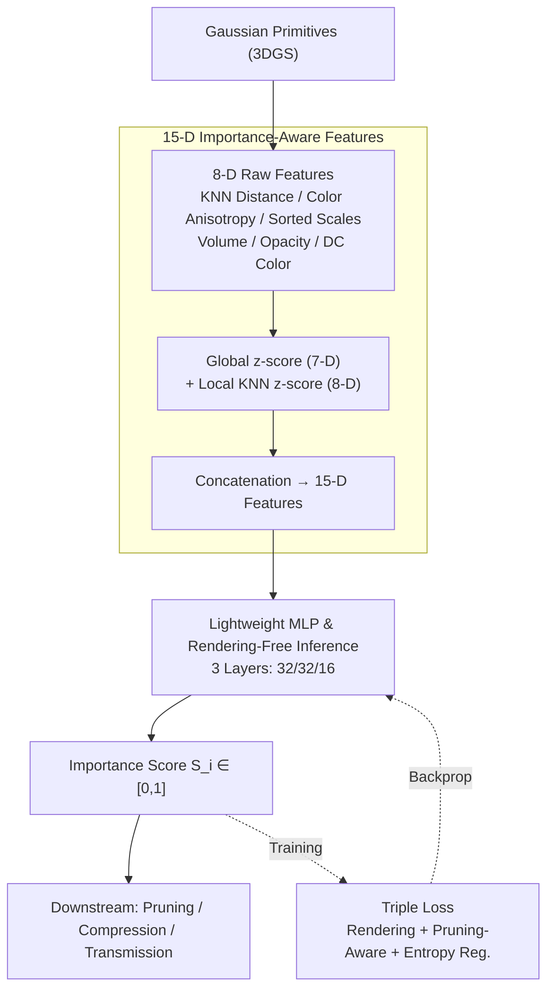

# RAP: Fast Feedforward Rendering-Free Attribute-Guided Primitive Importance Score Prediction for Efficient 3D Gaussian Splatting Processing

**Conference**: CVPR 2026  
**arXiv**: [2602.19753](https://arxiv.org/abs/2602.19753)  
**Authors**: Kaifa Yang, Qi Yang, Yiling Xu, Zhu Li (SJTU, UMKC)  
**Code**: [GitHub](https://github.com/yyyykf/RAP)  
**Area**: 3D Vision  
**Keywords**: 3D Gaussian Splatting, Importance Evaluation, Rendering-free Inference, Feedforward Prediction, Pruning

## TL;DR

RAP is proposed as a rendering-free, feedforward importance scoring method for Gaussian primitives. It extracts 15-dimensional features from intrinsic attributes and local neighborhood statistics, using a lightweight MLP to predict importance scores. Once trained, it generalizes to unseen scenes without additional optimization.

## Background & Motivation

Among the vast number of primitives generated by 3DGS, contribution levels vary significantly. Estimating primitive importance is crucial for pruning, compression, and transmission. Existing methods have notable limitations:

- **Attribute-based heuristics** (e.g., opacity thresholding): Overly simplistic, ignoring occlusions and interactions between primitives.
- **Rendering-based methods** (e.g., LightGaussian, EAGLES): Dependent on multi-view rendering, with time complexity scaling linearly with the number of views; sensitive to view selection and requiring specialized rasterizers.
- **Learning-based methods** (e.g., learnable masks): Coupled with specific reconstruction frameworks, requiring retraining whenever a scene is modified.

## Core Problem

Can importance be predicted directly from the intrinsic attributes of Gaussian primitives, bypassing rendering to achieve fast, plug-and-play, and generalizable importance evaluation?

## Method

### Overall Architecture

RAP aims to assign an importance score to every Gaussian primitive in 3DGS for downstream pruning, compression, and transmission, and it deliberately avoids the slow, view-dependent "render-and-compare" pipeline. The entire workflow consists of two steps: first, extracting a 15-dimensional feature vector for each Gaussian from its own attributes and local neighborhood statistics; second, using a lightweight MLP to regress these features into an importance score $S_i \in [0,1]$ in one pass. This MLP is trained once on 10 scenes and requires **no rendering** during inference for any unseen scenes. The triple loss provides supervision only during the training phase.

### Key Designs

**1. 15-D Importance-Aware Features: Encoding "Prunability" into Attribute Statistics**

Attribute-based heuristics are too coarse, while rendering-based methods are time-consuming. RAP's premise is that redundant primitives leave traces in their attributes. It first calculates 8-dimensional raw features for each Gaussian:

$$\mathbf{F}_i^{raw} = \{d_i, A_i, s_{0,i}, s_{1,i}, s_{2,i}, V_i, o_i, C_i\}$$

Where $d_i$ is the average KNN distance (measuring spatial isolation), $A_i$ is color anisotropy (standard deviation of RGB sampled from $M$ directions), $s_{0,i}\le s_{1,i}\le s_{2,i}$ are sorted scales (ensuring rotation invariance), $V_i = s_0 \times s_1 \times s_2$ is the Gaussian volume, $o_i$ is opacity, and $C_i$ is the DC color (zero-order SH mean). Then, both global and local normalization are applied: global z-score $f_i^{(G)} = \frac{f_i - \mu^{(G)}}{\sigma^{(G)}}$ provides scene-level reference, while local KNN z-score $f_i^{(L)} = \frac{f_i - \mu_i^{(L)}}{\sigma_i^{(L)}}$ emphasizes local contrast (DC color uses local normalization only). Features are truncated and scaled to $[0,1]$. The resulting 15-D vector is compact and discriminative for pruning.

**2. Lightweight MLP & Rendering-Free Inference: Train Once, Reuse Across Scenes**

Learnable mask methods tie importance to a specific reconstruction. RAP replaces this with a framework-decoupled 3-layer MLP (hidden widths 32/32/16). Since features depend on intrinsic attributes rather than a specific render, this MLP is plug-and-play. During inference, it triggers no rasterization, achieving speeds 3–7$\times$ faster than rendering-based methods.

### Loss & Training

Supervision is provided by three complementary losses. **Rendering Loss** softly re-weights opacity and scale $\tilde{o}_i = o_i S_i,\ \tilde{\mathbf{s}}_i = \mathbf{s}_i S_i$ before rendering, forcing the network to assign higher scores to primitives with higher image contributions:

$$\mathcal{L}_{\text{render}} = (1-\lambda_{\text{dssim}}) \mathcal{L}_1 + \lambda_{\text{dssim}} \mathcal{L}_{\text{D-SSIM}}$$

**Pruning-aware Loss** $\mathcal{L}_{\text{prune}} = (\text{mean}(S_i) - S_{\text{target}})^2$ pulls the average score toward a target value to avoid trivial solutions. **Distribution Regularization** maximizes the entropy of scores $\mathcal{L}_{\text{entropy}} = 1 - \text{EntropyNorm}(S)$ (approximated via a soft histogram with $B=250$ bins), ensuring scores are distributed across $[0,1]$. Training involves 15,000 iterations on 10 scenes from DL3DV-10K.

## Key Experimental Results

| Method | Mip-Outdoor BD-Rate | Mip-Indoor | Deep Blending | Tanks&Temples |
|------|-------------------|------------|---------------|---------------|
| LightGS | -35.21% | -31.15% | -30.72% | -37.98% |
| MesonGS | -34.89% | -30.34% | -28.84% | -36.12% |
| EAGLES | -41.28% | -24.98% | -29.87% | -30.01% |
| PUP-3DGS | -22.54% | -8.70% | -19.46% | +7.06% |
| **RAP** | **-42.63%** | **-33.90%** | **-36.76%** | **-40.11%** |

*BD-Rate relative to opacity baseline; lower is better.*

| Dataset | Opacity | LightGS | MesonGS | C3DGS | PUP-3DGS | **RAP** |
|--------|---------|---------|---------|-------|----------|---------|
| Mip-Indoor Compute Time (s) | 1.27 | 22.71 | 14.84 | 15.96 | 21.22 | **5.72** |
| Tanks&Temples Compute Time (s) | 2.53 | 18.62 | 17.53 | 9.22 | 20.50 | **6.66** |

## Highlights & Insights

- **Rendering-Free Inference**: Predicting importance requires no rendering after training, making it 3-7$\times$ faster than alternatives.
- **Plug-and-Play**: Decoupled from specific reconstruction or compression frameworks; easily integrated into any 3DGS pipeline.
- **Strong Generalization**: Trained on only 10 scenes but performs exceptionally across 13 scenes from Mip-NeRF 360/Deep Blending/Tanks&Temples.
- **Sophisticated Triple Loss**: Complements fidelity (rendering loss), non-triviality (pruning loss), and distribution (entropy regularization).
- **Observation-Driven Feature Design**: Systematically extracts spatial, appearance, and scale cues based on redundancy patterns.

## Limitations & Future Work

- Trained on only 10 scenes; generalization to urban-scale or more diverse environments remains unverified.
- High-order SH coefficient information is not utilized in the 15-D features.
- KNN distance calculation introduces some overhead ($K=128$).
- Applicability to dynamic scenes or edited Gaussians needs further evaluation.

## Related Work & Insights

- **vs. LightGaussian**: LightGS uses 2D projection area $\times$ absolute opacity, requiring rendering; RAP is attribute-driven and rendering-free.
- **vs. PUP-3DGS**: PUP relies on Hessian gradient analysis and underperforms relative to the opacity baseline on Tanks&Temples (+7.06% BD-Rate); RAP shows steady gains.
- **vs. EAGLES/MesonGS**: These utilize hybrid opacity and volume; while their quality is high, their computation time is 3-7$\times$ that of RAP.
- **vs. Compact-3DGS**: Learnable mask methods are framework-coupled and require retraining; RAP is trained once for cross-scene use.

## Rating

- Novelty: ⭐⭐⭐⭐ — Rendering-free importance prediction is a practical and novel direction.
- Experimental Thoroughness: ⭐⭐⭐⭐⭐ — Extensive testing across multiple datasets and tasks (post-pruning, during-training pruning, and compression).
- Writing Quality: ⭐⭐⭐⭐ — The motivation for observation-driven feature design is clearly articulated.
- Value: ⭐⭐⭐⭐ — Highly practical for the deployment and optimization of 3DGS.

## Related Papers

- [\[CVPR 2026\] Fast SceneScript: Fast and Accurate Language-Based 3D Scene Understanding via Multi-Token Prediction](fast_scenescript_fast_and_accurate_language-based_3d_scene_understanding_via_mul.md)
- [\[CVPR 2026\] Let it Snow! Animating 3D Gaussian Scenes with Dynamic Weather Effects via Physics-Guided Score Distillation](let_it_snow_animating_3d_gaussian_scenes_with_dynamic_weather_effects_via_physic.md)
- [\[CVPR 2026\] PRIMU: Uncertainty Estimation for Novel Views in Gaussian Splatting from Primitive-Based Representations of Error and Coverage](primu_uncertainty_estimation_for_novel_views_in_gaussian_splatting_from_primitiv.md)
- [\[CVPR 2026\] Cross-Instance Gaussian Splatting Registration via Geometry-Aware Feature-Guided Alignment](cross-instance_gaussian_splatting_registration_via_geometry-aware_feature-guided.md)
- [\[CVPR 2026\] UIKA: Fast Universal Head Avatar from Pose-Free Images](uika_fast_universal_head_avatar_from_pose-free_images.md)

<!-- RELATED:END -->

<!-- RELATED:START -->

## Related Papers

- [\[CVPR 2026\] Cross-Instance Gaussian Splatting Registration via Geometry-Aware Feature-Guided Alignment](cross-instance_gaussian_splatting_registration_via_geometry-aware_feature-guided.md)
- [\[CVPR 2026\] FastGS: Training 3D Gaussian Splatting in 100 Seconds](fastgs_training_3d_gaussian_splatting_in_100_seconds.md)
- [\[CVPR 2026\] Spectral Defense Against Resource-Targeting Attack in 3D Gaussian Splatting](spectral_defense_against_resource-targeting_attack_in_3d_gaussian_splatting.md)
- [\[CVPR 2026\] Rethinking Pose Refinement in 3D Gaussian Splatting under Pose Prior and Geometric Uncertainty](rethinking_pose_refinement_in_3d_gaussian_splatting_under_pose_prior_and_geometr.md)
- [\[CVPR 2026\] GAI-GS: A Wireless Channel Prediction Framework Injecting Ray-Object Interaction into 3DGS via Geometric Algebra Attention](a_geometric_algebra-informed_3dgs_framework_for_wireless_channel_prediction.md)

<!-- RELATED:END -->
