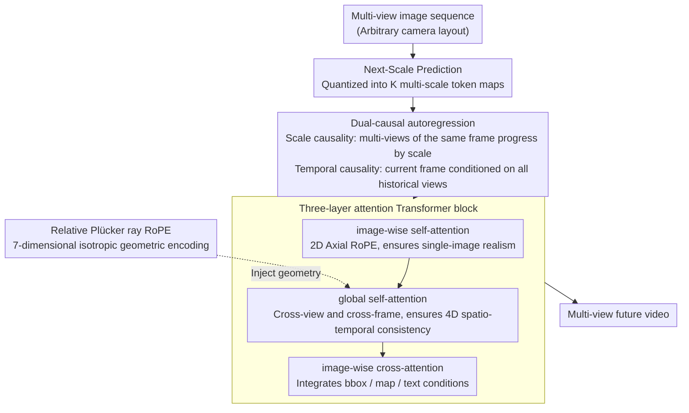

# RayNova: Scale-Temporal Autoregressive World Modeling in Ray Space

**Conference**: CVPR 2026  
**arXiv**: [2602.20685](https://arxiv.org/abs/2602.20685)  
**Authors**: Yichen Xie, Chensheng Peng, Mazen Abdelfattah, Yihan Hu et al. (Applied Intuition, UC Berkeley)  
**Code**: [Project Page](https://raynova-ai.github.io/)  
**Area**: 3D Vision  
**Keywords**: World Models, Multi-view Video Generation, Autoregressive, Plücker Rays, Autonomous Driving

## TL;DR

Ours proposes RayNova, a geometry-agnostic multi-view world model based on dual-causal (scale + temporal) autoregression. By utilizing relative Plücker ray positional encoding, it enables unified 4D spatio-temporal reasoning, achieving SOTA multi-view video generation performance on nuScenes.

## Background & Motivation

World Foundation Models (WFM) aim to simulate the physical evolution of the real world. Existing methods suffer from fundamental limitations:

1.  **Spatio-temporal Decoupled Design**: Spatial processing uses multi-view adjacency while temporal processing uses video generation techniques separately, limiting adaptability to new camera configurations and rapid motion.
2.  **Strong 3D Prior Dependence**: Dependence on explicit 3D representations like Point Clouds or BEV limits generalization in open-world scenarios.
3.  **Fixed Camera Configuration Binding**: Most methods assume a fixed sensor layout and adjacency relationships.

## Core Problem

How to construct a world model that generalizes to arbitrary camera configurations and motions while maintaining physical plausibility with minimal inductive bias?

## Method

### Overall Architecture

RayNova aims to build a multi-view world model that is not tied to specific camera configurations or dependent on explicit 3D priors like Point Clouds/BEV, capable of generating physically plausible futures under arbitrary sensor layouts and rapid motions. It places world modeling entirely within a "ray space" autoregressive framework: multi-view images of each frame are first quantized into multi-scale tokens and then generated step-by-step along two causal chains: "scale" and "temporal". Each generation step is completed by a three-layer attention block, where geometric information is injected entirely through relative Plücker ray positional encoding rather than any 3D representation.

### Key Designs

**1. Next-Scale Prediction: Decomposing Image Generation into Coarse-to-Fine Scale Autoregression**

The generation backbone of RayNova follows visual autoregressive models: each image is first quantized into $K$ multi-scale token maps $X_{1:K}$, then generated scale-by-scale from coarse to fine, with each scale conditioned on the coarser scales:

$$p(X_1, \ldots, X_K) = \prod_{k=1}^K p(X_k | X_1, \ldots, X_{k-1})$$

This coarse-to-fine sequential generation provides a natural progressive structure for the subsequent "scale + temporal" dual causality.

**2. Dual-Causal Autoregression: Unifying 4D Spacetime via Scale and Temporal Causal Chains**

Most existing world models decouple space and time—handling space via multi-view adjacency and time via video generation techniques—resulting in poor performance under new camera configurations or rapid motion. RayNova unifies both into two causal chains: **Scale Causality** allows all views of the same frame to be modeled jointly (as they describe the same 3D space), progressing by scale:

$$p(X_1^{1:V}, \ldots, X_K^{1:V}) = \prod_{k=1}^K p(X_k^{1:V} | X_1^{1:V}, \ldots, X_{k-1}^{1:V})$$

**Temporal Causality** ensures the current frame is conditioned on all views of all historical frames, without assuming strong dependencies between frames of the same camera:

$$p(X_{1:K}^{1:V,1:T}) = \prod_{t=1}^T \prod_{k=1}^K p(X_k^{1:V,t} | X_{1:k-1}^{1:V,1:t})$$

Avoiding the bias that "adjacent frames of the same camera are most relevant" is key to its adaptation to arbitrary camera layouts.

**3. Isotropic Spatio-temporal Representation: Relative Plücker Ray RoPE instead of Explicit 3D Priors**

This is the core of RayNova's geometry-agnosticism. Instead of relying on Point Clouds/BEV, it calculates a Plücker ray $\mathbf{p}_k^{v,t} = (\mathbf{m}, \mathbf{d}, t) \in \mathbb{R}^7$ (where $\mathbf{m} = \mathbf{o}^{v,t} \times \mathbf{d}_k^{v,t}$) for each token and extends Rotary Positional Encoding (RoPE) to this 7D space:

$$\mathbf{R} = \begin{bmatrix} \mathbf{R_m} & 0 & 0 \\ 0 & \mathbf{R_d} & 0 \\ 0 & 0 & \text{RoPE}_{d/4}(t) \end{bmatrix}$$

The attention score only considers the **relative** positions between tokens $a_{i,j} = \mathbf{q}_i^T \mathbf{R}_\Delta^{i,j} \mathbf{k}_j$ (where $\mathbf{R}_\Delta^{i,j} = \mathbf{R}_i^T \mathbf{R}_j$). Since the encoding is isotropic across all scales/views/frames and is relative, the model naturally extrapolates to camera configurations outside the training distribution, which is why it remains robust even under 4m displacements.

**4. Three-layer Attention Transformer: Decoupling Realism, Consistency, and Controllability**

Each block uses three layers of attention for distinct roles: **image-wise self-attention** with 2D Axial RoPE processes each image independently to ensure single-image realism; **global self-attention** integrates cross-view and cross-frame attention with Plücker ray RoPE to ensure 4D spatio-temporal consistency; **image-wise cross-attention** integrates conditional signals. For conditions, bboxes project 8 corners into image space for encoding with T5 text embeddings, while maps are sampled as 3D points, projected, and encoded using PointNet.

### Loss & Training

The greatest enemy of long video generation is distribution drift. RayNova counters this with recursive training: frame-by-frame forward/backward propagation with unified updates after gradient accumulation; caching latent features (rather than KV) saves 50% GPU memory while retaining gradients for KV projection layers; and injecting random bit-flip noise into visual token inputs to simulate inference errors, aligning the training distribution with real autoregressive inference.

## Key Experimental Results

| Method | Resolution | FID ↓ | FVD ↓ | Throughput ↑ (img/s) |
|------|--------|-------|-------|----------------|
| MagicDrive | 224×400 | 16.2 | - | 1.76 |
| DriveDreamer | 256×448 | 14.9 | 341 | 0.37 |
| Panacea | 256×512 | 17.0 | 139 | 0.67 |
| **Ours (RayNova)** | **384×672** | **10.5** | **91** | **1.96** |

| Evaluation Dimension | Method | Metric (Relative to Oracle) |
|---------|------|-------------------|
| Object Conditioning (StreamPETR) | Panacea | 32.1 NDS (68%) |
| | **Ours** | **41.9 NDS (89%)** |
| Object Conditioning (SparseFusion) | X-Drive | 69.6 NDS (95%) |
| | **Ours** | **72.0 NDS (99%)** |
| Novel View Synthesis FID (shift 4m) | StreetGaussian | 67.44 |
| | **Ours** | **17.48** |

## Highlights & Insights

-   **Geometry-agnostic Design**: Does not rely on 3D priors like Point Clouds/BEV/Depth, achieving geometric awareness solely through relative ray positional encoding.
-   **Dual-Causal Autoregression**: A unified scale+temporal causal framework that is more flexible than decoupled spatio-temporal attention.
-   **Strong Novel-View Generalization**: Zero-shot adaptation to unseen camera configurations, with an FID of only 17.48 under 4m displacement vs 67.44 for StreetGaussian.
-   **Efficient Generation**: Throughput of 1.96 img/s significantly exceeds diffusion model baselines (0.37-1.76).
-   **Heterogeneous Data Compatibility**: Can mix training data with different sensor configurations, resolutions, and frame rates.

## Limitations & Future Work

-   Use of image-based VAE may affect FID/FVD metrics.
-   Training data volume (~60 hours) is still limited compared to some private data methods.
-   Recursive training requires longer training times.
-   Map-conditioned 3D point projection lacks height information.
-   Experiments only validated in driving scenarios; indoor or other scenes remain unverified.

## Related Work & Insights

-   vs **Panacea**: Panacea assumes strong multi-frame dependencies per camera, limited to specific configurations; RayNova is fully decoupled, FVD 91 vs 139.
-   vs **X-Drive**: X-Drive uses Point Clouds as 3D priors; RayNova requires no 3D representation.
-   vs **StreetGaussian/OmniRe**: Explicit 3D representations degrade sharply under large camera offsets (FID 67+); RayNova remains robust (17.48).
-   vs **BEVWorld**: BEV representations are tied to specific height planes; RayNova's ray space is more universal.

-   The design of relative Plücker ray encoding can be extended to other generative tasks requiring geometric awareness.
-   Dual-causal autoregression provides a unified framework for multi-modal/multi-resolution generation.
-   Recursive training for distribution drift has implications for other long-sequence generation tasks.
-   The integration with VAR (Visual Autoregressive Model) is noteworthy.

## Rating

-   Novelty: ⭐⭐⭐⭐⭐ — Dual-causal autoregression + relative ray positional encoding is a brand-new design paradigm.
-   Experimental Thoroughness: ⭐⭐⭐⭐ — Multi-dimensional evaluation (quality/conditioning/novel view/motion), though limited to driving scenarios.
-   Writing Quality: ⭐⭐⭐⭐⭐ — Rigorous mathematical derivation and excellent illustrations.
-   Value: ⭐⭐⭐⭐⭐ — Defines a new direction for geometry-agnostic world models.

<!-- RELATED:START -->

## Related Papers

- [\[CVPR 2026\] P3Sim: Perceptual 3D Simulation with Physical World Modeling](perceptual_3d_simulation_with_physical_world_modeling.md)
- [\[CVPR 2026\] PointNSP: Autoregressive 3D Point Cloud Generation with Next-Scale Level-of-Detail Prediction](pointnsp_autoregressive_3d_point_cloud_generation_with_next-scale_level-of-detai.md)
- [\[CVPR 2026\] OLATverse: A Large-scale Real-world Object Dataset with Precise Lighting Control](olatverse_a_large-scale_real-world_object_dataset_with_precise_lighting_control.md)
- [\[CVPR 2026\] Revisiting Monocular SLAM with Spatio-Temporal Scene Modeling](revisiting_monocular_slam_with_spatio-temporal_scene_modeling.md)
- [\[CVPR 2026\] WonderZoom: Multi-Scale 3D World Generation](wonderzoom_multi-scale_3d_world_generation.md)

<!-- RELATED:END -->
