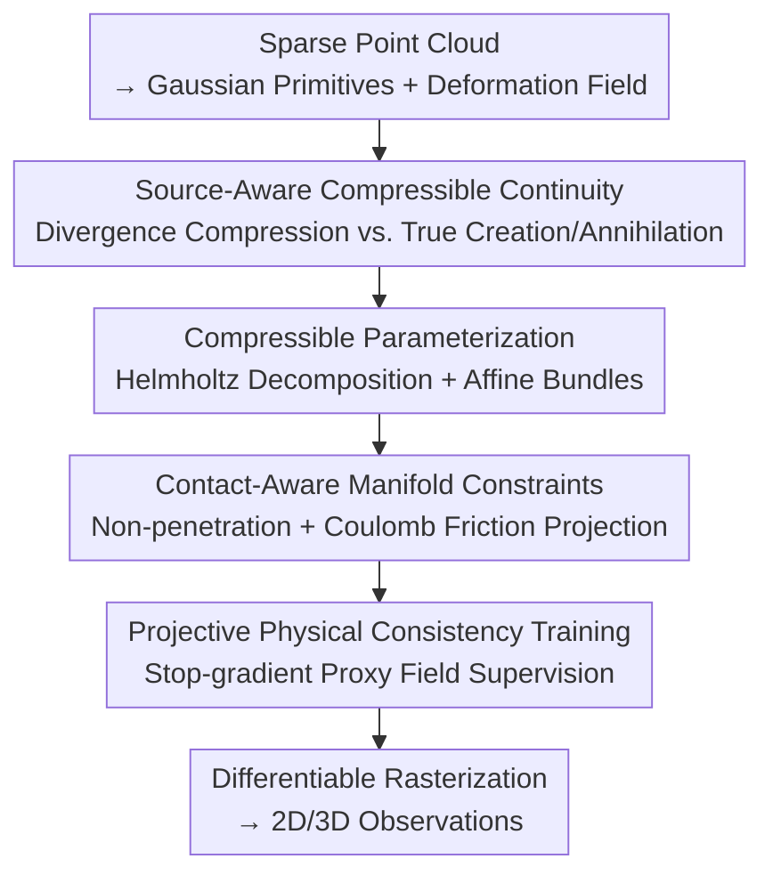

# Real-Time Dynamic Scene Rendering with Controlled Compressibility and Contact Awareness

**Conference**: CVPR 2026  
**Paper**: [CVF Open Access](https://openaccess.thecvf.com/content/CVPR2026/html/Shi_Real-Time_Dynamic_Scene_Rendering_with_Controlled_Compressibility_and_Contact_Awareness_CVPR_2026_paper.html)  
**Code**: None  
**Area**: 3D Vision  
**Keywords**: Dynamic Scene Rendering, 4D Gaussian Splatting, Compressible Flow, Contact Constraints, Physical Priors

## TL;DR
Addressing artifacts at contact/occlusion boundaries caused by the common "incompressible, source-free" motion assumption in dynamic 3D Gaussian Splatting, this paper introduces a projection framework utilizing a "source-aware continuity equation + implicit surface contact constraints." By projecting network-predicted velocity fields onto a physically feasible set for supervised training, it achieves higher fidelity and real-time speeds on Plenoptic Video (33.84 dB PSNR, 120 FPS) and D-NeRF (35.24 dB PSNR, 300 FPS).

## Background & Motivation

**Background**: Mainstream dynamic scene novel view synthesis encodes time into NeRF deformation fields or extends 3D Gaussian Splatting (3DGS) to 4D by estimating frame-by-frame motion/velocity fields for each Gaussian primitive. To stabilize optimization, many methods introduce kinematic priors (piecewise rigid, affine components) or use "continuity equation residual" matching to reduce reliance on explicit optical flow supervision.

**Limitations of Prior Work**: Existing methods almost entirely default to **source-free, volume-preserving (incompressible)** motion. Consequently, they fail to express "non-volume-preserving" effects common in reality, such as compression/expansion, exposure drift, or object appearance/disappearance. Furthermore, contact and friction are rarely modeled—non-penetration and tangential slip at interfaces are either ignored or approximated with soft penalties, leading to artifacts like streaking and smearing near occlusion boundaries and contact surfaces.

**Key Challenge**: Once "source terms" are permitted, the divergence of the velocity field $\nabla\!\cdot u$ (density changes due to volume compression) and true "creation/annihilation" become **partially indistinguishable** (weak identifiability) under image evidence. Simultaneously, contact sets change discretely over time, rendering the objective function non-smooth. Decoupling these two issues while maintaining numerical well-behavedness and real-time solvability is an entangled problem.

**Goal**: Without performing explicit physical simulation, enable dynamic rendering to express compressible motion and appearance changes while satisfying non-penetration and Coulomb friction at contact interfaces, ensuring each internal sub-problem remains linear/convex and fast to solve in batches.

**Key Insight**: Transform "motion estimation" into a "projection with physical priors." Explicitly add a source/sink field $q$ into the continuity equation, then project the network velocity onto a feasible set defined by both compressibility priors and contact constraints, using the projected field as a supervision signal.

**Core Idea**: Construct a set of closed-form solvable convex projection sub-problems using a "source-augmented continuity equation + implicit surface contact cones" to decompose unidentifiable density changes into "divergence-induced compression" vs. "true creation/annihilation," while enforcing physical feasibility at contact points.

## Method

### Overall Architecture
Starting from the first frame's sparse SfM point cloud, the scene is encoded into a set of Gaussian primitives evolving over space-time, driven by a learnable deformation field. At each frame, the authors do not directly trust the network-provided velocity. Instead, they **project** the velocity onto a physically feasible set using "source-aware compressible flow" and "contact-aware manifold priors" to obtain a proxy velocity field $\tilde v$ and a proxy source field $\tilde q$. These two projected fields supervise the network via stop-gradients (projection loss + continuity consistency loss). Finally, Gaussian primitives are rendered into 2D/3D observations through differentiable rasterization. The internal projections of the pipeline maintain linear least squares or small-scale second-order cone programming (SOCP), enabling batch solving and real-time performance.

### Key Designs

**1. Source-Aware Compressible Continuity: Decoupling "Compression-induced Density Change" and "True Creation/Annihilation"**

Source-free, incompressible transport assumptions cannot explain real-world volume compression and appearance drift. The authors explicitly add a source/sink field $q$ ($q>0$ for creation, $q<0$ for annihilation) to the continuity equation: $\partial_t\psi + u\cdot\nabla\psi + \psi\,\nabla\!\cdot u = q$, where $\psi$ is the transported quantity (pixel intensity/density/opacity). Thus, changes in $\psi$ are attributed either to "transport + volume compression caused by divergence $\nabla\!\cdot u$" or to "true increase/decrease via $q$," rather than being forced entirely onto the velocity field. In the image plane, the authors minimize the frame-wise source-aware continuity residual $\rho(u,q)=\sum_i[s_i + g_i^\top u(x_i) + \psi_i(\nabla\!\cdot u)(x_i) - q(x_i)]^2$ (with $s_i=\partial_t\psi$, $g_i=\nabla\psi$). In 3D, Gaussian primitives are expressed as $\psi_t(x)=\sum_i m_i^t\,\delta(x-\gamma_i^t)$, yielding the kinematic relation $u(\gamma_i^t)\approx\dot\gamma_i^t$ and mass balance $\dot m_i^t + m_i^t(\nabla\!\cdot u) \approx q$. Mass variables only enter the continuity sub-problem and remain decoupled from the color branch, keeping the solving for $u,q$ linear. To ensure identifiability between $\nabla\!\cdot u$ and $q$, a **global mass budget** and a **zero-mean gauge** are added, alongside a curriculum strategy that progressively introduces compressibility and source terms during training.

**2. Compressible Parameterization: Restricting "Volume Change" to Controllable Directions via Helmholtz Decomposition + Affine Bundles**

Allowing arbitrary compressibility in velocity leads to ill-posedness (poor condition numbers in normal equations due to low texture or spectral overlap). The authors apply Helmholtz decomposition to velocity: $u = u_\tau + P\nabla\Phi$, where $u_\tau$ is the divergence-free (incompressible) part ($\nabla\!\cdot u_\tau\equiv 0$). All volume changes are carried by the potential flow component $P\nabla\Phi$ and projected onto a predefined orthogonal subspace $\mathcal{E}=\mathrm{span}(V)$, so $\nabla\!\cdot u=\mathrm{tr}(P\nabla^2\Phi)$ occurs only along controlled directions, significantly improving identifiability. Simultaneously, local motion is approximated with an **affine bundle**: $u(x)=\Omega(t)x + E_0(t)x + \kappa(t)x + b(t)$, **decoupling** rotation (anti-symmetric $\Omega$), volume-preserving shear (traceless symmetric $E_0$), isotropic scaling (scalar $\kappa$, $\nabla\!\cdot u=d\kappa$), and translation $b$. The compression amount is regularized by $\lambda_\kappa\kappa^2$. The final coefficients are solved via linear least squares with $\lambda_{\mathrm{comp}}\|\alpha\|_2^2$ regularization, maintaining efficient closed-form solutions while explicitly controlling the expressive power of compressible transport and sources.

**3. Contact-Aware Manifold Constraints: Writing Non-penetration and Coulomb Friction as Per-sample Projections via Implicit Surfaces**

Neglecting contact/friction causes artifacts at boundaries, but explicit collision detection is non-smooth and combinatorially explosive. The authors represent constraint surfaces implicitly as $\phi_k(x,t)=0$, defining the unit normal $n_k=\nabla\phi_k/\|\nabla\phi_k\|$, tangential projection $P_{T,k}=I-n_kn_k^\top$, and surface normal velocity $b_k=-\partial_t\phi_k/\|\nabla\phi_k\|$. An active contact set $\mathcal{A}(x,t)=\{k:|\phi_k|\le\varepsilon\}$ is identified via tolerance $\varepsilon$. For each sample, the target velocity is projected onto the feasible set $\mathcal{C}=\bigcap_{k\in\mathcal{A}}\mathcal{C}_k$: sticking is a KKT linear system with equality constraints ($u^*=v-A^\top(AA^\top)^{-1}(Av-b)$); non-penetration is a single inequality projection; Coulomb friction is a projection onto a second-order cone $\{\|x\|\le\mu t\}$, unifying sticking/sliding. Multiple contacts form a small SOCP solved in batches or via successive convex projection iterations. To obtain smoother fields, a constrained least squares fit for a local affine $u(x)=Ax+b$ can be performed in the neighborhood. This replaces rigid directional priors with physically meaningful manifold constraints.

**4. Projective Physical Consistency Training: Stop-gradient Proxy Fields + Physical Consistency Loss**

Allowing gradients to pass between the network and projection fields directly can be unstable. The authors adopt an alternating scheme: first, compute the projected proxy velocity $\tilde v$ and proxy source $\tilde q$ using stop-gradients, then update the network parameters $v_\theta$ in the outer loop. The core is the projection loss $\mathcal{L}_{\mathrm{proj}}=\sum_i w_i\|v_\theta(x_i)-\tilde v(x_i)\|_2^2$, where gradients are received only by $v_\theta$ per Danskin’s theorem ($\tilde v, \tilde q$ are truncated). Additionally, a per-pixel continuity consistency loss $\mathcal{L}_{\mathrm{CE}}$ penalizes violations of the source-augmented transport law, and a geometric loss $\mathcal{L}_{\mathrm{geo}}$ aligns projected motion with observations when trajectories/mass are available. Contact is handled by a non-penetration soft penalty $\mathcal{L}_{\mathrm{nopen}}$ and a friction soft penalty $\mathcal{L}_{\mathrm{fric}}$. Consequently, training objectives remain aligned with transport, mass balance, and contact conditions while the outer optimization remains stable.

### Loss & Training
The total loss is a weighted sum of projection loss $\mathcal{L}_{\mathrm{proj}}$, continuity consistency $\mathcal{L}_{\mathrm{CE}}$, geometric/velocity consistency $\mathcal{L}_{\mathrm{geo}}$, non-penetration $\mathcal{L}_{\mathrm{nopen}}$, and friction $\mathcal{L}_{\mathrm{fric}}$. Training follows a curriculum: starting source-free and incompressible, then gradually enabling compressibility and source terms. Contact detection includes hysteresis and falls back to non-penetration if sticking fails, preventing solver chattering. Implementation is in PyTorch on a single RTX 3090; Plenoptic takes ~14,000 steps, D-NeRF ~20,000 steps (Gaussian growth stops after 15,000).

## Key Experimental Results

### Main Results

Plenoptic Video (6 real scenes, 1352×1014):

| Method | PSNR↑ | SSIM↑ | LPIPS↓ | Training↓ | FPS↑ |
|------|-------|-------|--------|-------|------|
| K-Planes | 30.73 | 0.93 | 0.07 | 190 min | 0.10 |
| MixVoxels | 30.85 | 0.96 | 0.21 | 91 min | 16.70 |
| RealTime4DGS | 29.95 | 0.92 | 0.16 | 8 h | 72.80 |
| Deformable4DGS | 28.42 | 0.92 | 0.17 | 72 min | 39.93 |
| **Ours** | **33.84** | **0.965** | **0.07** | **35 min** | **120.00** |

PSNR is ~+3.0 dB higher than the strongest previous results, training is ~5.4× faster than K-Planes and 15×+ faster than HyperReel, with 120 FPS inference speed (1.6× RealTime4DGS).

D-NeRF (8 monocular sequences, 800×800):

| Method | PSNR↑ | SSIM↑ | LPIPS↓ | Training↓ | FPS↑ |
|------|-------|-------|--------|-------|------|
| TiNeuVox | 32.87 | 0.97 | 0.04 | 28 min | 1.60 |
| Deformable4DGS | 32.99 | 0.97 | 0.05 | 13 min | 104.00 |
| Deformable3DGS | 39.31 | 0.99 | 0.01 | 26 min | 85.45 |
| **Ours** | 35.24 | 0.99 | 0.02 | **6 min** | **300.00** |

Ours achieves +2.37 dB over TiNeuVox, +4.17 dB over K-Planes, with 6 min training and 300 FPS inference. While Deformable3DGS has a higher PSNR (39.31), its training/inference is slower; this method targets "interactive real-time + competitive quality."

### Ablation Study

Module-wise ablation on D-NeRF (Table 3):

| ID | Compressible Flow | Contact Constraints | Projection | PSNR↑ | SSIM↑ | LPIPS↓ | time↓ |
|----|---------|---------|------|-------|-------|--------|-------|
| a | | | | 28.97 | 0.90 | 0.19 | 16 min |
| b | ✓ | | | 32.50 | 0.97 | 0.05 | 16 min |
| c | | ✓ | | 30.30 | 0.95 | 0.07 | 16 min |
| d | ✓ | ✓ | | 34.80 | 0.98 | 0.03 | 13 min |
| e | ✓ | ✓ | GP | 35.00 | 0.99 | 0.03 | 8 min |
| f | ✓ | ✓ | LL | **35.24** | 0.99 | 0.02 | **6 min** |

GP = Per-Gaussian primitive projection, LL = Local linear field projection.

### Key Findings
- **Source-aware compressible flow provides the largest contribution**: Enabling it (a→b) increases PSNR by +3.53 dB and reduces LPIPS by 74%, as intensity changes are correctly attributed to divergence rather than flow alone, suppressing stretching/smearing artifacts.
- **Contact constraints are effective individually**: Enabling them (a→c) gives +1.33 dB and 63% LPIPS reduction without adding degrees of freedom.
- **LL projection outperforms GP**: Per-primitive GP projection has tight consistency but weak cross-primitive coupling. LL is superior in quality-efficiency and leads to faster training (6 min vs. 8 min). Both maintain linear internal solutions and stop-gradient training.

## Highlights & Insights
- **Turning "Unidentifiable" into "Constraint-led"**: Density changes from divergence vs. true creation/annihilation are normally confounded under images. The authors enforce identifiability using mass budgets + zero-mean gauges + curriculum—a classic paradigm of physical constraints improving ill-posed inverse problems, transferable to optical flow or fluid reconstruction.
- **Physical priors as closed-form/convex projections**: Sticking to KKT linear, non-penetration to single inequality projection, and friction to second-order cone projection enables physically meaningful, real-time batch solving, avoiding the non-smoothness and complexity of explicit collision simulation.
- **Stop-gradient + Danskin's Theorem**: This ensures that "projection supervision," an implicit optimization layer, is stable to train. This technique is universal for any framework that "solves a sub-problem before supervising the network."

## Limitations & Future Work
- The authors acknowledge that image domain derivatives amplify noise, necessitating multi-scale smoothing and robust losses at the cost of attenuating high-frequency motion. Unreliable contact detection can hinder learning, requiring hysteresis and fallback mechanisms.
- The method relies heavily on the quality of implicit constraint surfaces $\phi_k$. Robustly extracting approximate SDF surfaces/normals from noisy monocular sequences is non-trivial. The compressible subspace $\mathcal{E}$ requires pre-specification and may lack flexibility for unknown motion patterns.
- Future work includes end-to-end learning of constraint surfaces, adaptive selection/expansion of the compressible subspace, and validation on larger-scale real contact scenarios.

## Related Work & Insights
- **vs. Deformable4DGS / RealTime4DGS**: While they extend 3DGS to dynamic scenes, they lack physical modeling. This work adds source-aware compressibility and contact manifold projections to the velocity field, resulting in more realistic boundaries and higher fidelity (Plenoptic +3 dB).
- **vs. Continuity-driven velocity prior methods**: Similar in using continuity residuals, but this work explicitly decouples "compression" from "creation/annihilation" via source terms and adds second-order cone projections for contact/friction, whereas older methods assume source-free, volume-preserving motion.
- **vs. Deformable3DGS**: While Deformable3DGS has higher PSNR (39.31 on D-NeRF), it is slower. This paper prioritizes real-time interaction (300 FPS) while maintaining competitive image quality.

## Rating
- Novelty: ⭐⭐⭐⭐ Unifying source-aware compressible flow + implicit surface contact cones into a 3DGS projection framework is novel with solid physical motivation.
- Experimental Thoroughness: ⭐⭐⭐⭐ Uses two standard dynamic benchmarks with complete module-wise ablation, though quantitative validation on contact-intensive scenes is slightly limited.
- Writing Quality: ⭐⭐⭐ Clear motivation but dense equations; the method section is derivation-heavy and poses some readability challenges.
- Value: ⭐⭐⭐⭐ Real-time + physically plausible rendering has practical value for AR/VR, digital twins, and robotics.

<!-- RELATED:START -->

## Related Papers

- [\[CVPR 2026\] SAMosaic3D: Modular Scene Assembly for Real-Time 3D Segment Anything](samosaic3d_modular_scene_assembly_for_real-time_3d_segment_anything.md)
- [\[CVPR 2026\] Changes in Real Time: Online Scene Change Detection with Multi-View Fusion](changes_in_real_time_online_scene_change_detection_with_multi-view_fusion.md)
- [\[CVPR 2026\] Space-Time Forecasting of Dynamic Scenes with Motion-aware Gaussian Grouping](space-time_forecasting_of_dynamic_scenes_with_motion-aware_gaussian_grouping.md)
- [\[CVPR 2026\] Consistent Instance Field for Dynamic Scene Understanding](consistent_instance_field_for_dynamic_scene_understanding.md)
- [\[CVPR 2026\] KV-Tracker: Real-Time Pose Tracking with Transformers](kv-tracker_real-time_pose_tracking_with_transformers.md)

<!-- RELATED:END -->
