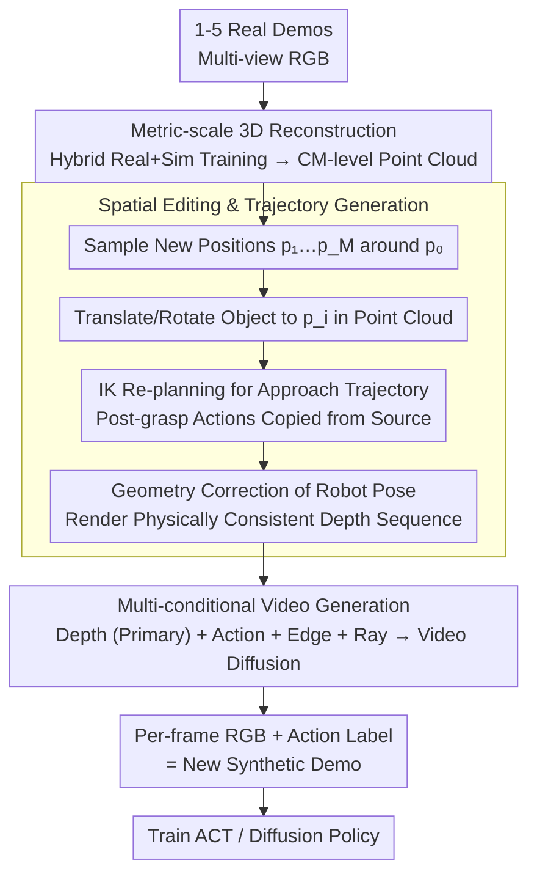

# Real2Edit2Real: Generating Robotic Demonstrations via a 3D Control Interface

**Conference**: CVPR 2026  
**arXiv**: [2512.19402](https://arxiv.org/abs/2512.19402)  
**Code**: [https://real2edit2real.github.io/](https://real2edit2real.github.io/) (Available, Project Page)  
**Area**: 3D Vision / Robot Learning / Data Augmentation  
**Keywords**: Robotic Demonstration Generation, 3D Editing, Video Generation, Data Augmentation, Spatial Generalization

## TL;DR

Ours proposes the Real2Edit2Real framework, a three-stage pipeline comprising "3D reconstruction → point cloud editing for new trajectories → depth-guided video generation for synthetic demonstrations." It generates massive diverse manipulation demos from only 1-5 real demonstrations, achieving or exceeding the performance of policies trained on 50 real demonstrations, representing a 10-50x improvement in data efficiency.

## Background & Motivation

**Background**: Robot manipulation learning is shifting from traditional control to data-driven visuomotor policies. While powerful architectures like ACT, Diffusion Policy, and $\pi_0$ have emerged, their performance relies heavily on large-scale and diverse demonstration data. Specifically, spatial generalization—where the policy functions correctly when objects are at different locations/orientations—requires demonstrations collected across numerous spatial configurations.

**Limitations of Prior Work**: (1) Collecting real robotic demonstrations is extremely expensive; each new configuration requires manual operation or teleoperation. (2) Pure 2D data augmentation (e.g., random cropping, color jittering) cannot change the 3D spatial position of objects, offering limited help for spatial generalization. (3) 3D simulators (e.g., Isaac Gym) can generate data, but the sim-to-real gap severely hinders transfer. (4) Existing video generation methods produce visually realistic videos but lack precise 3D spatial control, failing to guarantee physically feasible trajectories.

**Key Challenge**: The need for vast demonstration data in diverse 3D configurations vs. the prohibitively high cost of real data collection. The core challenge lies in achieving high visual fidelity while maintaining spatial precision.

**Goal**: Design a framework that takes a small number (1-5) of real demonstrations and automatically generates high-quality demonstrations in new spatial configurations—sufficiently robust to train policies with strong generalization.

**Key Insight**: 3D spatial editing and 2D visual generation can work in tandem. First, precisely edit object positions and gripper trajectories in 3D point cloud space (ensuring geometric correctness), then use a conditional video generation model to render the edited 3D scene into realistic multi-view videos (ensuring visual fidelity). Depth maps serve as the bridge between these worlds—acting as both a reliable output of 3D editing and a precise control signal for video generation.

**Core Idea**: Use 3D editing to guarantee spatial correctness and depth-guided video generation to guarantee visual realism, utilizing the depth map as the 3D control interface.

## Method

### Overall Architecture

Real2Edit2Real addresses a specific problem: given only 1-5 real demonstrations, how to generate hundreds of new demos covering different object positions. Its mechanism separates spatial correctness from visual realism: 3D point clouds handle positioning, while 2D video generation handles rendering, with depth maps acting as the interface.

The pipeline consists of three stages. First, the scene is reconstructed from multi-view RGB source demos into a 3D point cloud with metric scale. Second, the target object is moved to new positions within the point cloud, robot trajectories are recalculated via Inverse Kinematics (IK) with geometric correction, and a sequence of physically consistent depth maps is rendered. Third, these depth maps, along with actions, edges, and ray maps, are fed into a video diffusion model to generate realistic multi-view videos where each RGB frame is paired with its corresponding action label.

### Key Designs

**1. Metric-scale 3D Reconstruction: Making "10cm Right" Physically Valid**

Pure 2D image editing (e.g., inpainting) suffers from geometric inconsistency; objects "moved" in a pixel space might not have a valid 3D pose. This method reconstructs the scene into a point cloud with **metric scale**. The 3D coordinates correspond directly to real-world centimeter measurements, meaning instructions like "move the cup 10cm right" have exact physical meaning. The reconstruction model is a feed-forward network co-trained on real and simulated data to ensure reliable metric geometry for robotic manipulation scenarios.

**2. Depth-Reliable Spatial Editing & Trajectory Generation**

To automate spatial augmentation, the framework defines a sampling space around the original object position $p_0$. For each new position $p_i$, the object is translated/rotated in the point cloud. The "approach" trajectory is recalculated using IK to reach $p_i$, while post-grasp movements (lifting, placing) are copied from the source demo as they are invariant relative to the object. **Geometry correction** is performed to ensure robot joint angles are kinematically feasible before rendering the final depth sequence.

**3. Multi-conditional Video Generation: Four Control Signals**

To prevent artifacts like texture flickering, the video diffusion model uses four control signals:
- **Depth maps**: The primary signal for spatial layout via ControlNet-style injection.
- **Action signals**: Encode joint angles/end-effector poses to ensure motion consistency with the planned trajectory.
- **Edge maps**: Maintain sharp geometric boundaries for objects.
- **Ray maps**: Encode camera parameters to ensure geometric alignment across multiple views.

### Loss & Training

The video generation model is trained using a standard denoising diffusion objective:

$$\mathcal{L} = \mathbb{E}_{t, \epsilon}\big[\,\|\epsilon - \epsilon_\theta(x_t, t, c)\|^2\,\big]$$

Where the condition $c$ includes depth, action, edge, and ray map signals. The manipulation policies (ACT or Diffusion Policy) are then trained end-to-end on the generated datasets.

## Key Experimental Results

### Main Results

| Task | Source Demos | Training Data Source | Success Rate (%) ↑ |
|------|---------|-------------|-------------|
| Mug to Basket | 50 (Real) | Real Data Only | ~70-80 |
| Mug to Basket | 1 | Real2Edit2Real Gen | **~75-85** |
| Pour Water | 50 (Real) | Real Data Only | ~65-75 |
| Pour Water | 5 | Real2Edit2Real Gen | **~65-80** |
| Lift Box | 50 (Real) | Real Data Only | ~70 |
| Lift Box | 3 | Real2Edit2Real Gen | **~70-75** |
| Scan Barcode | 50 (Real) | Real Data Only | ~60-70 |
| Scan Barcode | 5 | Real2Edit2Real Gen | **~65-75** |

### Ablation Study

| Condition Config | Video Quality (FVD ↓) | Policy Success Rate ↑ |
|---------|-----------------|-------------|
| Depth Only | Medium | Medium |
| Depth + Action | Improved | Improved |
| Depth + Action + Edge | Further Improved | Further Improved |
| **Depth + Action + Edge + Ray** | **Best** | **Best** |
| Without Geometry Correction | Decreased | Significantly Decreased |

### Key Findings

- **Significant Data Efficiency**: 1-5 source demos + Real2Edit2Real $\approx$ 50 real demos, a 10-50x efficiency gain.
- **Depth as a Critical Interface**: Depth is better than RGB for 3D control as it encodes spatial layout naturally and is robust to lighting/texture.
- **Geometry Correction is Mandatory**: Failing to recalibrate the robot's kinematics for new positions leads to physical inconsistency and policy failure.

## Highlights & Insights

- **Elegant 3D-2D Bridge**: Combining 3D editing precision with 2D rendering fidelity via depth maps is a robust design pattern for robotics.
- **The "Real-to-Generated-to-Real" Paradigm**: By starting with real data rather than simulators, the generated data resides closer to the real domain, mitigating sim-to-real issues.
- **Systematic Multi-condition Control**: Each signal has a distinct role—spatial (depth), motion (actions), structure (edges), and perspective (rays).

## Limitations & Future Work

- Requires multi-view recording for the source demonstrations; 3D reconstruction may fail with single-view input.
- Video generation inference is slow; large-scale generation requires significant GPU resources.
- Spatial editing is confined to the static background seen in the source demos.
- Current scope is limited to tabletop manipulation; mobile or dexterous manipulation remains unexplored.

## Related Work & Insights

- **vs MimicGen**: MimicGen requires a full simulator to transform demos; Ours works directly from real data.
- **vs GenAug**: GenAug performs 2D augmentations; Ours enables true 3D spatial changes.
- **Insight**: This framework could extend to autonomous driving (generating trajectories for diverse road conditions from few real drives).

## Rating

- **Novelty**: ⭐⭐⭐⭐ (Strong 3D control interface concept)
- **Experimental Thoroughness**: ⭐⭐⭐⭐ (Valid across multiple tasks and architectures)
- **Writing Quality**: ⭐⭐⭐⭐ (Clear pipeline and logical flow)
- **Value**: ⭐⭐⭐⭐⭐ (Directly addresses the data bottleneck in robotics)

<!-- RELATED:START -->

## Related Papers

- [\[CVPR 2026\] ArtLLM: Generating Articulated Assets via 3D LLM](artllm_generating_articulated_assets_via_3d_llm.md)
- [\[CVPR 2026\] OLATverse: A Large-scale Real-world Object Dataset with Precise Lighting Control](olatverse_a_large-scale_real-world_object_dataset_with_precise_lighting_control.md)
- [\[CVPR 2026\] PaNDaS: Learnable Shape Interpolation Modeling with Localized Control](pandas_learnable_shape_interpolation_modeling_with_localized_control.md)
- [\[CVPR 2026\] HyperMVP: Hyperbolic Multiview Pretraining for Robotic Manipulation](hyperbolic_multiview_pretraining_for_robotic_manipulation.md)
- [\[CVPR 2026\] ConsisVLA-4D: Advancing Spatiotemporal Consistency in Efficient 3D-Perception and 4D-Reasoning for Robotic Manipulation](consisvla-4d_advancing_spatiotemporal_consistency_in_efficient_3d-perception_and.md)

<!-- RELATED:END -->
