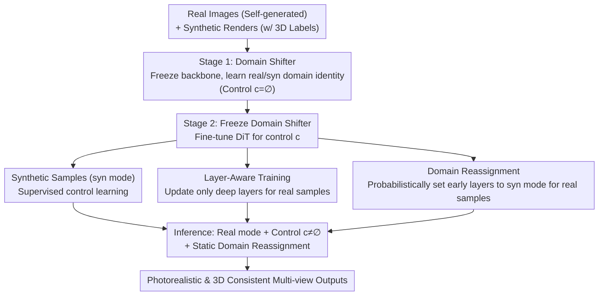

# Realiz3D: 3D Generation Made Photorealistic via Domain-Aware Learning

**Conference**: CVPR 2026  
**arXiv**: [2605.13852](https://arxiv.org/abs/2605.13852)  
**Code**: None (Visualization results available on project page)  
**Area**: 3D Vision / Diffusion Models  
**Keywords**: Domain Adaptation, 3D Controllable Generation, Multi-view, Domain Shifter, Domain Leakage

## TL;DR
Addressing the issue where photorealism is lost when fine-tuning diffusion models on synthetic 3D renders to achieve 3D controllability, this paper decouples "domain identity (real/synthetic)" from "3D control signals" using a lightweight Domain Shifter (low-rank residual adapter). Combined with layer-aware training and domain reassignment, the control capability is transferred from the synthetic domain to the real domain. This results in strong 3D consistency and significantly higher photorealism in both multi-view texture generation and text-to-multi-view tasks.

## Background & Motivation

**Background**: To enable diffusion models to support precise geometry, material, and viewpoint control (multi-view, normal maps, camera poses, etc.), the mainstream approach involves pre-training on billions of real images followed by fine-tuning on a small set of synthetic 3D asset renders, as only synthetic data provides accurate 3D annotations (normals, positions, cameras).

**Limitations of Prior Work**: Synthetic renders lack realism, creating a severe domain gap with real photographs. Direct fine-tuning on synthetic data imparts control but causes catastrophic forgetting of real image appearance; even mixed-domain training only alleviates rather than cures this forgetting. This results in an inescapable trade-off between photorealism (from real images) and controllability (from synthetic 3D data).

**Key Challenge**: The paper identifies the root cause of photorealism degradation: during fine-tuning, the model couples the "presence of control signals" with "synthetic appearance." Since only synthetic samples carry non-empty control $c\neq\varnothing$, the model implicitly learns that "whenever a control signal is given, the output should look synthetic," a phenomenon termed **domain leakage**. During inference, applying control inevitably leads to artificial-looking results.

**Goal**: To train a controllable diffusion model that generates images that are both photorealistic and geometrically consistent across views given 3D control signals. This is decomposed into two sub-problems: (1) stripping domain identity from control signals to prevent domain leakage; (2) transferring control learned only on synthetic data to the real domain where control annotations are absent.

**Key Insight**: Borrowing two structural observations of diffusion models—early timesteps and early network layers primarily determine low-frequency structure (shared/domain-agnostic), while late timesteps/deep layers determine high-frequency appearance (where the domain gap is largest). Since early layers act as a natural "cross-domain bridge," control can be anchored in early layers while real appearance is anchored in deep layers.

**Core Idea**: First, explicitly and independently of control signals, learn a binary "domain covariate" (real/synthetic) injected via a Domain Shifter. Subsequently, learn 3D control so that it no longer entangles with synthetic appearance. Consequently, switching to "real mode + control signal" during inference achieves both photorealism and controllability.

## Method

### Overall Architecture
The input to Realiz3D is a text-to-image Diffusion Transformer (DiT) pre-trained on real images, a synthetic dataset with 3D annotations $\{\{x_{\text{syn}}^v\}_{v=1}^V, c\}$, and a real image set $\{x_{\text{real}}, \varnothing\}$ without control signals (the real data is self-generated by the base model using synthetic descriptions to ensure fairness). The output is a controllable generator capable of producing multi-view, photorealistic, and 3D-consistent images under the "real mode + control signal" configuration. Multi-view generation is achieved by concatenating $V=4$ views into a $2\times2$ grid with inter-view self-attention; real data uses a single-image mode (intra-view attention).

The method consists of two stages using only **standard diffusion loss**:

- **Stage 1 (Decoupling Domain and Control)**: The DiT backbone is frozen while only the Domain Shifter is trained using real and synthetic images (both with empty control $c=\varnothing$) to distinguish between real/synthetic domains, modeling $q_\theta(x\mid e_{\text{domain}}, \varnothing)$. The concept of "domain" is thus learned independently of control.
- **Stage 2 (Fine-tuning with Representation Binding)**: The Domain Shifter is frozen while the DiT backbone is fine-tuned to learn control (only present in synthetic data), modeling $q_\theta(\{x^v\}\mid e_{\text{domain}}, c)$. Simultaneously, **Representation Binding** (= layer-aware training + domain reassignment) transfers control from the synthetic to the real domain.
- **Inference**: By switching the Domain Shifter to real mode $e_{\text{domain}}=e_{\text{real}}$ and providing control $c\neq\varnothing$, real and controllable images are generated. Static domain reassignment for early layers/timesteps can further enhance control.

### Key Designs

**1. Domain Shifter: Encoding domain identity via low-rank residuals to block domain leakage**

This is the core for decoupling "domain" and "control." It addresses the issue where fine-tuning makes the model equate "presence of control" with "synthetic appearance." The Domain Shifter is a lightweight module containing two learnable domain embeddings $e_{\text{syn}}, e_{\text{real}}\in\mathbb{R}^d$ and a shared low-rank transformation that adds domain identity as a residual to the latent representation $X$:

$$\tilde{X} = X + \mathcal{D}(\text{domain}) = X + W_{\text{left}} W_{\text{right}}\, e_{\text{domain}},$$

where $W_{\text{left}}\in\mathbb{R}^{d\times r}$ and $W_{\text{right}}\in\mathbb{R}^{r\times d}$ form a rank $r\ll d$ projection. This residual is added to all tokens within a block, acting as a low-rank bias modulated by domain identity. Similar to LoRA, it has sufficient capacity to "shift to neighboring modes" in latent space while remaining stable. Crucially, it is trained separately in **Stage 1** (backbone frozen, control empty), ensuring the domain concept is learned independently before Stage 2 learns control.

**2. Layer-Aware Training: Updating only deep layers for real samples to preserve photorealism**

If Stage 2 only fine-tuned on synthetic data, switching to real mode during inference often results in control failure or artificial aesthetics due to the backbone drifting toward synthetic statistics. To counter this, real samples are re-introduced, but since they lack control supervision, direct training could interfere with learned control representations. Based on the "early layers for structure, deep layers for appearance" observation, the authors mandate: when training with real samples, **only update later diffusion blocks (appearance-related) and freeze early blocks (structure-related)**. Specifically, for each real data iteration, DiT blocks $B\in[0, B_i]$ are frozen, with $i$ randomly sampled from $[0, \tau_B]$.

**3. Domain Reassignment: Feeding real samples into synthetic feature space for control transfer**

To stabilize control transfer, **Domain Reassignment** is employed: with probability $p_B$, when processing real samples, early DiT blocks ($B\in[0, B_j]$) are **reassigned to synthetic mode** ($e_{\text{domain}}\leftarrow e_{\text{syn}}$). This design is **asymmetric**: real samples are integrated into the synthetic feature space where explicit control supervision exists. Consequently, early layers learn shared structural representations capable of carrying control, while deep layers remain anchored to real appearance. Layer-Aware Training and Domain Reassignment together form **Representation Binding**.

**4. Inference-time Domain Reassignment: Rebalancing photorealism and controllability without re-training**

During inference, photorealistic controllable generation is possible by setting $e_{\text{real}}$ and $c\neq\varnothing$. However, control can be further strengthened. Since generation under $e_{\text{syn}}$ is more faithful to control, a **partial, non-random** domain reassignment is used: pre-selected early layers and early timesteps are set to synthetic mode, while deep layers and late timesteps maintain real mode. This allows users to balance realism and controllability at test time.

## Key Experimental Results

### Main Results

**Multi-view Texture Generation (Tab. 1)** — Realiz3D vs. various adaptation methods:

| Method | PSNR↑ | LPIPS↓ | FID_B↓ | KID_B↓ | FID_I↓ | KID_I↓ | CLIP↑ |
|------|-------|--------|--------|--------|--------|--------|-------|
| Syn Only (Full fine-tune) | **25.76** | **0.0831** | 168.21 | 0.0240 | 218.29 | 0.0431 | 0.2628 |
| Syn + Real (Mixed) | 25.63 | 0.0833 | 164.37 | 0.0226 | 214.84 | 0.0411 | 0.2629 |
| Domain Adapter (r32) | 25.61 | 0.0843 | 164.17 | 0.0223 | 215.80 | 0.0408 | 0.2610 |
| Domain Switcher (2-Stage) | 24.94 | 0.0888 | 157.89 | 0.0185 | 210.18 | 0.0350 | 0.2644 |
| **Realiz3D (Ours)** | 24.78 | 0.0865 | **141.90** | **0.0121** | **200.24** | **0.0291** | 0.2674 |

Realism metrics (FID_B/KID_B, FID_I/KID_I) lead significantly: FID_I drops from 218.29 (Syn Only) to 200.24. Meanwhile, 3D consistency (PSNR 24.78) remains competitive with the synthetic-only baseline.

**Text-to-Multi-view Generation (Tab. 3)**:

| Method | PSNR↑ | FID_B↓ | KID_B↓ | FID_I↓ | KID_I↓ | CLIP↑ |
|------|-------|--------|--------|--------|--------|-------|
| Syn Only | **19.66** | 168.60 | 0.0204 | 215.57 | 0.0363 | 0.2541 |
| TRELLIS (large, 3D-native) | - | 181.92 | 0.0275 | 224.22 | 0.0441 | 0.2495 |
| **Realiz3D (Ours)** | 19.02 | **122.01** | **0.0056** | **196.01** | **0.0171** | **0.2629** |

### Ablation Study
Stepwise addition of components based on Tab. 2 (DS=Domain Shifter, LA Train=Layer-Aware Training, Reassign=Domain Reassignment, Sampling=Inference-time Domain Reassignment):

| # | Config | Training | PSNR↑ | FID_B↓ | FID_I↓ | Note |
|---|------|------|-------|--------|--------|------|
| (1) | DiT + DS | Joint | 25.53 | 166.93 | 216.63 | Joint training: minimal realism gain |
| (3) | DiT + DS (Stage 2 w/ Real) | 2-Stage | 23.97 | **137.23** | **198.44** | Strongest realism, but control (PSNR) drops |
| (8) | **Ours (Full)** | 2-Stage | 24.78 | 141.90 | 200.24 | Best trade-off |

### Key Findings
- **Two-stage training is a prerequisite for photorealism**: Joint training of DS and backbone fails to improve realism significantly, confirming the "separate domain from control" motivation.
- **Real data and layer-based strategies are both essential**: Introducing real data in Stage 2 maximizes realism but sacrifices control. Layer-Aware Training and Domain Reassignment recover control while maintaining realism.
- **Acknowledged Gap**: Control capability remains slightly lower than synthetic-only baselines because consistency metrics are sensitive to synthetic pixel-level details and occasional deviations for photorealism.

## Highlights & Insights
- **Re-diagnosing "Loss of realism" as "Domain Leakage"**: The insight that the issue is not the synthetic appearance itself, but the model's association of control with that appearance, simplifies the solution to decoupling.
- **Leveraging Diffusion Hierarchy**: Using the "early blocks for structure, deep blocks for appearance" rule to bridge domains is a versatile strategy for any transfer task involving labeled low-quality domains and unlabeled high-quality domains.
- **Dual-purpose Domain Reassignment**: Used for regularization during training and for balancing realism/control during inference without re-training.

## Limitations & Future Work
- **Control strength slightly below synthetic baselines**: Models occasionally prioritize realism over strict geometric signals.
- **Reliance on empirical layer assumptions**: Thresholds for layer freezing and reassignment require tuning.
- **Self-generated real data**: The realism ceiling is limited by the base model's own capabilities.

## Related Work & Insights
- **vs Wonder3D**: Unlike Wonder3D, which jointly trains domain vectors and requires paired data, Realiz3D uses an independent two-stage process and does not require paired samples, preventing mode collapse.
- **vs Mixed-domain fine-tuning**: Simply mixing real data only mitigates forgetting; Realiz3D's explicit decoupling and layer-aware strategies provide a more fundamental solution to domain leakage.

## Rating
- Novelty: ⭐⭐⭐⭐⭐ (Novel diagnosis of domain leakage and decoupling solution).
- Experimental Thoroughness: ⭐⭐⭐⭐ (Competitive baselines, thorough ablation; lacks real photo supervision).
- Writing Quality: ⭐⭐⭐⭐⭐ (Clear logic, honest discussion of trade-offs).
- Value: ⭐⭐⭐⭐ (Practical, lightweight, and transferable to other DiT-based tasks).

<!-- RELATED:START -->

## Related Papers

- [\[CVPR 2026\] Learning Hierarchical Hyperbolic Mixture Model for Part-aware 3D Generation](learning_hierarchical_hyperbolic_mixture_model_for_part-aware_3d_generation.md)
- [\[CVPR 2026\] Photo3D: Advancing Photorealistic 3D Generation through Structure-Aligned Detail Enhancement](photo3d_advancing_photorealistic_3d_generation_through_structure-aligned_detail_.md)
- [\[CVPR 2026\] QD-PCQA: Quality-Aware Domain Adaptation for Point Cloud Quality Assessment](qd-pcqa_quality-aware_domain_adaptation_for_point_cloud_quality_assessment.md)
- [\[CVPR 2026\] Mamba Learns in Context: Structure-Aware Domain Generalization for Multi-Task Point Cloud Understanding](mamba_learns_in_context_structure-aware_domain_generalization_for_multi-task_poi.md)
- [\[CVPR 2026\] FreeScale: Scaling 3D Scenes via Certainty-Aware Free-View Generation](freescale_scaling_3d_scenes.md)

<!-- RELATED:END -->
