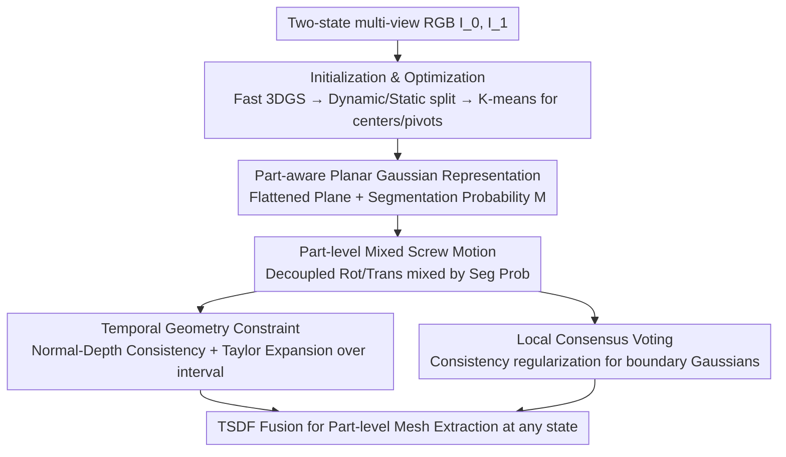

# REArtGS++: Generalizable Articulation Reconstruction with Temporal Geometry Constraint via Planar Gaussian Splatting

**Conference**: CVPR 2026  
**Paper**: [CVF Open Access](https://openaccess.thecvf.com/content/CVPR2026/html/Wu_REArtGS_Generalizable_Articulation_Reconstruction_with_Temporal_Geometry_Constraint_via_Planar_CVPR_2026_paper.html)  
**Code**: Project Page https://sites.google.com/view/reartgs2/home  
**Area**: 3D Vision / Articulated Object Reconstruction / Gaussian Splatting  
**Keywords**: Articulated Objects, Joint Parameter Estimation, Planar Gaussian Splatting, Screw Motion, Temporal Geometry Constraint

## TL;DR
REArtGS++ reconstructs part-level surface meshes and estimates joint parameters of unseen articulated objects (e.g., drawers, refrigerators) using only multi-view RGB images from any two states, without predefining joint types or relying on external models. By modeling each joint as a decoupled screw motion and extending "normal-depth consistency constraints" from discrete states to the entire motion interval via Planar Gaussians and first-order Taylor expansion, it achieves SOTA performance on PARIS and ArtGS-Multi, especially showing significant advantages for screw joints and multi-part objects.

## Background & Motivation
**Background**: Articulated objects (containing movable parts connected by joints) are ubiquitous in robotics and embodied AI, but are harder to reconstruct than static objects—requiring both part-level meshes and joint parameter estimation. Early works like ASDF and DITTO used expensive 3D supervision for generative models and lacked generalization; PARIS achieved "category-agnostic" two-state modeling using NeRF; ArtGS and REArtGS further introduced explicit 3D Gaussian Splatting (3DGS) for fast and realistic reconstruction.

**Limitations of Prior Work**: The authors observed two critical flaws in ArtGS/REArtGS. First, they **depend on joint type priors**—requiring extra pipelines and thresholds to determine if a joint is revolute or prismatic, typically defaulting to a binary choice. For **screw joints** (simultaneous rotation and translation) or multi-part objects, incorrect type priors lead to severe failures in joint axis estimation (REArtGS's Axis Ang error exceeds 87 on certain multi-part objects). Second, **supervision from only two states makes it difficult to impose temporal geometry constraints**—joint parameters and Gaussian primitives are optimized jointly, and the lack of geometric constraints for unseen intermediate states hampers joint estimation. While REArtGS used SDFs to enhance geometric constraints, SDFs are static mappings and cannot perform temporal regularization.

**Key Challenge**: Articulated reconstruction requires simultaneous learning of "part segmentation + joint parameters + geometric surfaces," which are coupled during optimization. Existing methods are constrained by joint type priors and can only enforce geometric constraints at discrete states, leaving the geometry of intermediate states $t\in[0,1]$ unsupervised.

**Goal**: (1) Eliminate joint type priors and unify the modeling of arbitrary rigid body motions (rotation/translation/screw); (2) Extend geometric consistency constraints from discrete states to the entire motion interval without additional supervision.

**Key Insight**: Utilize **Planar Gaussians** (flattening 3D Gaussians into 2D planes to obtain accurate normals and unbiased depth) to establish a geometric foundation, then leverage **first-order Taylor expansion** to approximate "normal-depth consistency" across the continuous temporal interval, bypassing the restriction of discrete-state constraints.

**Core Idea**: Model each joint as a **decoupled screw motion** (learning rotation and translation separately without predefining types), using part segmentation probabilities as **motion mixture weights** to jointly optimize part Gaussians and joint parameters; meanwhile, use **temporal geometry constraints** to ensure geometric self-consistency across the entire interval.

## Method

### Overall Architecture
The input consists of multi-view RGB images of an unseen articulated object in any two states $I_0, I_1$ (without depth supervision). The output is part-level surface meshes and joint parameters (rotation angle, axis, pivot point, translation) for any state $t\in[0,1]$. Process: First, **initialize** by rapidly training initial Gaussians for both states, distinguishing dynamic/static Gaussians via Chamfer distance, and clustering part centers/pivots via K-means; then use a **part-aware planar Gaussian representation** to flatten Gaussians and assign each a segmentation probability; apply **part-level mixed screw motion** to mix decoupled screw motions into each Gaussian; during optimization, incorporate **temporal geometry constraints** (normal-depth consistency spread via Taylor expansion) and **local consensus voting** (to fix blurred segmentations at boundaries); finally, extract part-level meshes at any state using TSDF fusion.

### Key Designs

**1. Part-aware Planar Gaussian Representation: Solidifying geometry before temporal constraints**

Standard 3DGS kernels are anisotropic ellipsoids, where rendered normals and depths are insufficiently accurate for geometric constraints. Following PGSR, REArtGS++ introduces a scale loss $\mathcal{L}_{\text{scale}}=\frac{1}{N_\mathcal{G}}\sum_i\|\min(s_1,s_2,s_3)\|$ to flatten each Gaussian along its shortest axis into a 2D plane. This allows for accurate normal $\mathbf{N}$ as the shortest axis and unbiased depth $\mathbf{D}(\rho)=\frac{d}{\mathbf{N}(\rho)\mathbf{K}^{-1}\tilde\rho}$ (intersection of ray and plane). Each Gaussian is assigned a segmentation probability $\mathbf{M}=\{m_1,...,m_k\}$. Intuition: "The closer a Gaussian is to a part center, the higher its probability of belonging." Learnable part centers $(O,V,\Lambda)$ are used to calculate Mahalanobis distance $\gamma_i$, combined with an MLP-learned residual to obtain $\mathbf{M}_i$. Accurate normals and depth are prerequisites for the temporal geometry constraint.

**2. Part-level Mixed Screw Motion: Unified modeling of rotation/translation/screw**

REArtGS models motion as simple interpolation; ArtGS uses dual quaternions but lacks explicit pivot modeling. Both fail on screw motions and require joint type priors. REArtGS++ **decouples** each joint parameter $\omega$ into rotation and translation, setting $\omega=\{q(\theta,a),o,t\}$ as entirely learnable (where $q$ is joint quaternion, $o$ is pivot, $t$ is translation), naturally covering any $SE(3)$ rigid motion. The motion of each Gaussian is a **mixture** of part motions: $\mu_i(t)=\sum_{j=1}^{k} m_j\big[R_j(\mathbf{q}(t))(\mu_i-o_j)+o_j+t_j(t)\big]$, where $\mathbf{M}$ serves as weights. To avoid singularities, a canonical state $t^*=0.5$ is defined, mapping angles to $[-\pi/2,\pi/2]$ with linear interpolation. This allows part segmentation $\mathbf{M}$ and joint parameters to be optimized jointly.

**3. Temporal Geometry Constraint: Expanding consistency via Taylor expansion**

Standard consistency (aligning rendered normal $\mathbf{N}$ with $\bar{\mathbf{N}}$ from depth gradients) only works for discrete states. REArtGS++ uses first-order Taylor expansion to approximate normal changes over time: $\mathbf{N}(\omega,t)\approx \mathbf{N}(\omega,t_0)+\lim_{t\to t_0}\frac{\mathrm{d}\mathbf{N}(\omega,t)}{\mathrm{d}t}(t-t_0)$, where $t_0=0,1$. The gradient term is approximated via finite difference $\nabla\mathbf{N}(\omega,t_0)\approx\frac{N(\omega,t)-N(\omega,t^*)}{t-t^*}$. Using the canonical state $t^*$ saves computation and minimizes motion error accumulation. The final constraint is $\mathcal{L}_{\text{geo}}=(1-\nabla\mathbf{I}(t_0))\big(\|\bar{\mathbf{N}}(\omega,t_0)-\mathbf{N}(\omega,t_0)\|+\|\nabla\bar{\mathbf{N}}(\omega,t_0)-\nabla\mathbf{N}(\omega,t_0)\|\big)$, using image gradients $\nabla\mathbf{I}$ to mask edges. This is key to "spreading" geometric consistency across time.

**4. Local Consensus Voting: Refining boundary segmentations**

Distance-based segmentation $\mathbf{M}$ often produces ambiguous probabilities at part boundaries. REArtGS++ identifies boundary Gaussians where the neighborhood belongs mostly to other parts ($\ge\beta=0.2$) and applies K-means to divide them into $4\times k$ local regions. Each region computes a voting distribution $\mathbf{M}_{\text{vote}}$ weighted by distance to the region center. A KL divergence loss $\mathcal{L}_{\text{vote}}=\sum\frac{1}{| \mathcal{N}_n|}D_{\text{KL}}(\mathbf{M}_{\text{vote}}\|M_i)$ pulls each boundary Gaussian toward its local consensus, injecting **spatial context** to resolve overlap ambiguity.

### Loss & Training
The total objective is $\mathcal{L}=\lambda_{\text{render}}\mathcal{L}_{\text{render}}+\lambda_{\text{scale}}\mathcal{L}_{\text{scale}}+\lambda_{\text{center}}\mathcal{L}_{\text{center}}+\lambda_{\text{geo}}\mathcal{L}_{\text{geo}}+\lambda_{\text{vote}}\mathcal{L}_{\text{vote}}$. Initialization involves training vanilla 3DGS on two states, splitting dynamic/static points via Chamfer distance $\Delta x_i > \tau_x$, and initializing part centers/pivots via K-means. Part-level meshes are extracted using a TSDF fusion (voxel size 0.04) on Gaussians assigned to each part $j$ where $\max(\mathcal{G}_i = m_j)$.

## Key Experimental Results

### Main Results
Three datasets: PARIS (10 PartNet-Mobility objects), ArtGS-Multi (5 multi-part + 2 screw objects), and real-world (5 objects). Metrics: CD (Chamfer Distance $\times10^3$) for whole/static/moving (w/s/m) parts, Axis Ang (°), Axis Pos (mm), and Part Motion.

| Dataset | Metric | REArtGS++ | REArtGS | ArtGS | Notes |
|---------|--------|-----------|---------|-------|-------|
| PARIS Synthetic (Mean) | CD-w ↓ | **3.25** | 4.49 | 4.78 | ~27.6% lower than REArtGS |
| PARIS Synthetic (Mean) | Axis Ang ↓ | **0.01** | 0.04 | 0.02 | Most accurate axis est. |
| ArtGS-Multi (Multi-part) | Axis Ang ↓ | **0.55** | 49.43 | 25.08 | Significant lead |
| ArtGS-Multi (Multi-part) | Axis Pos ↓ | **0.50** | 230.31 | 96.49 | Error reduced by 2 orders |
| Screw Joint Objects | Axis Ang ↓ | **0.07** | 67.13 | 64.93 | Primary advantage |

On multi-part objects, ArtGS/REArtGS fail significantly when joint type priors are mispredicted (e.g., Table 31249); REArtGS++ is far more robust as it requires no type estimation.

### Ablation Study

| Configuration | Axis Ang ↓ | Axis Pos ↓ | CD-m ↓ | Key Insight |
|---------------|-----------|-----------|--------|-------------|
| Full Model | **0.41** | **1.18** | **2.38** | Baseline |
| w/o Planar GS | 5.18 | 21.38 | 7.57 | Geometry degrades |
| w/o Screw Motion | 22.78 | 88.26 | 29.68 | Screw joints fail |
| w/o Initialization | 33.47 | 71.74 | 126.03 | Most critical component |
| w/o $\mathcal{L}_{\text{vote}}$ | 2.66 | 15.10 | 10.38 | Blurred boundaries |
| w/o $\mathcal{L}_{\text{geo}}$ | 4.04 | 16.08 | 5.70 | Missing temporal consistency |

### Key Findings
- **Initialization and Screw Modeling are most impactful**: Removing initialization causes CD-m to skyrocket from 2.38 to 126.03. Removing decoupled screw motion causes Axis Ang to jump from 0.41 to 22.78, proving "no type prior + decoupled screw" is essential for complex joints.
- **Reference state for temporal constraints**: Using the canonical state $t^*$ for finite differences is effective; using random intermediate states ("w/ random $\Delta t$") degrades performance (Axis Ang 5.83) due to unoptimized motion introducing noise.
- **Screw joints benefit most**: For the 2 captured screw objects, REArtGS++ (Axis Ang 0.07) outperforms REArtGS (67.13) and ArtGS (64.93), shifting from "unusable" to "accurate."

## Highlights & Insights
- **Taylor Expansion Spreads Geometry**: Approximating the temporal derivative of normals at the canonical state $t^*$ enforces consistency across the continuous motion interval. This avoids motion error accumulation while saving memory—a clever strategy for dynamic reconstruction with sparse supervision.
- **Decoupled Screw Motion + Mixture Weights**: Treating joints as separate rotation/translation components and using segmentation as weights eliminates joint type priors, making the system more generalizable and robust for multi-part objects.
- **Planar Gaussians as Foundation**: Flattening Gaussians to obtain accurate normal/depth is the prerequisite for temporal consistency, demonstrating that representation quality dictates constraint granularity.
- **Local Voting for Boundary Refinement**: A lightweight spatial consensus mechanism that resolves segmentation ambiguity in overlapping regions.

## Limitations & Future Work
- **Dependency on multi-view and poses**: Requires 60-100 posed RGB images per state, which is costly; not applicable to single-view or unknown pose scenarios.
- **Real-world performance gap**: Errors on real-world data are significantly higher than synthetic (e.g., CD-w > 10), showing limited robustness to noise or textureless surfaces.
- **Taylor Approximation Limits**: For extremely large or highly non-linear joint movements, the first-order approximation might be insufficient ⚠️.
- **Part count $k$**: Requires the number of parts to be known or correctly determined by the initial clustering.

## Related Work & Insights
- **vs REArtGS**: REArtGS relies on joint type priors and static SDF geometry. REArtGS++ uses decoupled screw motion and Taylor temporal constraints, reducing PARIS CD-w by 27.6% and multi-part Axis Ang from 49.43 to 0.55.
- **vs ArtGS**: ArtGS suffers from pivot-translation entanglement and type priors. REArtGS++ decouples these components, drastically improving screw joint accuracy (Axis Ang 0.07 vs 64.93).
- **vs PARIS / DTA**: PARIS uses implicit NeRF, which struggles with multi-part awareness and smooth dynamic surfaces. REArtGS++ offers faster, more accurate part-level meshes via explicit planar Gaussians.
- **vs PGSR**: Inherits PGSR's planar Gaussian consistency but generalizes it from static single-state to time-continuous dynamic reconstruction.

## Rating
- Novelty: ⭐⭐⭐⭐ Solid combination of decoupled screw motion and Taylor-based temporal constraints, though built on the REArtGS/PGSR framework.
- Experimental Thoroughness: ⭐⭐⭐⭐⭐ Three datasets, challenging custom screw/multi-part sets, and detailed ablations.
- Writing Quality: ⭐⭐⭐⭐ Clear logic and complete formulas.
- Value: ⭐⭐⭐⭐ High utility for part-level reconstruction and joint estimation in robotics/embodied AI, solving previous failures on screw and multi-part objects.

<!-- RELATED:START -->

<!-- Paper links would go here -->

<!-- RELATED:END -->

## Related Papers

- [\[CVPR 2026\] Particulate: Feed-Forward 3D Object Articulation](particulate_feed-forward_3d_object_articulation.md)
- [\[CVPR 2026\] Uni3R: Unified 3D Reconstruction and Semantic Understanding via Generalizable Gaussian Splatting from Unposed Multi-View Images](uni3r_unified_3d_reconstruction_and_semantic_understanding_via_generalizable_gau.md)
- [\[CVPR 2026\] ST4R-Splat: Spatio-Temporal Referring Segmentation in 4D Gaussian Splatting](st4r-splat_spatio-temporal_referring_segmentation_in_4d_gaussian_splatting.md)
- [\[CVPR 2026\] Minimal Constraint Relaxation for Multiview Autocalibration](minimal_constraint_relaxation_for_multiview_autocalibration.md)
- [\[CVPR 2026\] IDESplat: Iterative Depth Probability Estimation for Generalizable 3D Gaussian Splatting](idesplat_iterative_depth_probability_estimation_for_generalizable_3d_gaussian_sp.md)

<!-- RELATED:END -->
