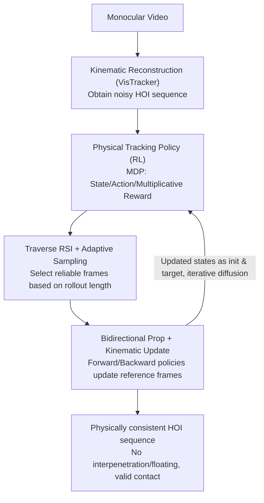

# Recovering Physically Plausible Human-Object Interactions from Monocular Videos

**Conference**: CVPR 2026  
**arXiv**: [2606.05359](https://arxiv.org/abs/2606.05359)  
**Code**: https://dingbang777.github.io/RePHO/ (Project Page)  
**Area**: 3D Vision / Human-Object Interaction Reconstruction / Physical Simulation  
**Keywords**: HOI Reconstruction, Monocular Video, Physical Simulation, Reinforcement Learning, Contact Consistency

## TL;DR
RePHO takes "visually plausible but physically flawed" Human-Object Interaction (HOI) sequences estimated from monocular videos and reenacts them in a physical simulator using reinforcement learning policies. By leveraging "adaptive sampling + bidirectional propagation + online kinematic target updates," it identifies reliable frames from extremely noisy initial values and progressively diffuses physical validity. This results in physically consistent HOI sequences without interpenetration, floating, or jitter, significantly outperforming existing methods on BEHAVE and InterCap datasets.

## Background & Motivation
**Background**: Reconstructing full-body Human-Object Interactions (HOI) from monocular RGB video is a long-standing challenge in 3D vision. Recently, kinematic-based methods like VisTracker have been able to recover visually impressive human and object trajectories from videos, using templates to track contact relationships.

**Limitations of Prior Work**: These methods are inherently "kinematic"—they directly regress poses without explicitly modeling contact forces, gravity, or collisions. Consequently, results often suffer from physical violations: objects floating in the air, interpenetration between the human and object, and motion jitter. Even works that add "physics-aware losses" to penalize contact violations only apply soft constraints, which do not achieve true physical feasibility.

**Key Challenge**: To obtain physically consistent results, the most direct way is to feed motions into a physical simulator and train an RL control policy to replicate the interaction (as seen in works like InterMimic). However, these RL-based HOI frameworks assume the input is clean Motion Capture (MoCap) data. Monocular reconstructions suffer from severe pose drift, jitter, and divergence during occlusions or fast movements. Training RL directly on such noisy sequences causes rollouts to terminate immediately due to "missing contact" or "floating objects," making learning impossible.

**Goal**: To train a policy capable of stably replicating interactions in a physical simulator without relying on clean MoCap, given only noisy monocular reconstructions, thereby "physicalizing" the noisy kinematic results.

**Key Insight**: The authors observe that while noisy sequences are unreliable overall, they still contain reliable signals—frames with clear contact or slow object motion are often estimated accurately. Empirically, the accuracy of the contact mode in the initial frame is strongly correlated with how long early RL rollouts last. By automatically identifying these reliable frames as anchors and diffusing the physically plausible states reenacted from them throughout the sequence, the entire sequence can be "recovered" from the noise.

**Core Idea**: Starting from reliable frames, train a physical tracking policy using **adaptive sampling** to select reliable initialization frames, and use **bidirectional propagation + online kinematic updates** to gradually diffuse physically plausible contact states across the entire sequence, allowing the policy to learn stable and realistic interactions even under extremely noisy inputs.

## Method

### Overall Architecture
RePHO is a two-stage pipeline. The **first stage** uses the off-the-shelf kinematic method VisTracker to reconstruct global HOI trajectories $M=\{\mathbf{q}_t^h, \mathbf{q}_t^o\}_{t=1}^T$ (human parameterized by SMPL-H, object by 6DoF pose) from input video, though this estimate is often noisy. The **second stage** treats this noisy kinematics as both the "initial state" and the "tracking target." An RL tracking policy is trained in a physics simulator to imitate it: at each time $t$, the policy observes the current physical state $s_t^s$ and a set of future reference states $\{\hat s_{t,t+k}\}_{k\in\mathbf{K}}$, and outputs an action $a_t$ to drive the humanoid toward the next kinematic target while maintaining physical feasibility. A physically grounded HOI sequence is obtained by rolling out over time.

The difficulty of the second stage lies entirely in the "noisy initial values." To address this, two mechanisms are introduced: first, **Traverse RSI + Adaptive Sampling** identifies reliable frames from the entire timeline to prioritize rollouts from clean frames; second, **Bidirectional Propagation + Kinematic Updates** allow forward and backward policies to write back physically plausible states to the reference frames, which then serve as both new initializations and new tracking targets, diffusing physical consistency across the sequence.

### Key Designs

**1. HOI Tracking Policy in Physics Simulator: Re-framing Reconstruction as an MDP Problem**

To address the lack of physics in kinematic results, RePHO models HOI tracking as a Markov Decision Process (MDP), allowing the simulator's contact forces, gravity, and collisions to naturally guarantee physical feasibility. The **state** $\mathbf{s}_t=\{s_t^s, s_t^g\}$ consists of the current physical state and future kinematic references. The physical state $s_t^s$ includes joint rotation/position/linear velocity/angular velocity $\{\theta, p, \dot p, \omega\}$ for both human and object, plus two geometric/tactile cues: $d_t$ (vector from human joints to the nearest point on the object surface) and $c_t$ (binary contact indicators). A key design choice is that the authors **only provide contact indicators for the hands**, as minimal contact guidance is necessary for stable HOI tracking. Contact points on the object, other body parts, and ground contacts are **not provided**, leaving them to be learned automatically by the RL policy through adaptive sampling. The target state $s_t^g=\{\hat s_{t,t+k}\}_{k\in\mathbf{K}}$ represents future references as offsets relative to the current physical state (using $\ominus$ for rotations and subtraction for positions), normalized by the human root position and orientation. The **action** $a_t\in\mathbb{R}^{51\times3}$ represents index mapping target rotations for 51 actuated joints, used as PD control targets converted into joint torques by the simulator.

The **reward** uses a product rather than a weighted sum:

$$r_t = r_t^{h}\cdot r_t^{o}\cdot r_t^{c}\cdot r_t^{d}\cdot r_t^{e}$$

where $r_t^h, r_t^o$ penalize pose/position/velocity errors; the contact term $r_t^c$ aligns obtained contact states $c_t$ with references $\hat c_t$ and penalizes the distance between object contact points and paired joints; the distance term $r_t^d$ reduces human-object proximity deviation $\|d_t - \hat d_t\|$; and the energy term $r_t^e$ penalizes sudden movements and contact forces. Each term is of the form $\exp(-\lambda E)$. The advantage of the multiplicative form is that if any term fails, the overall reward goes to zero, forcing the policy to satisfy all constraints simultaneously rather than hiding violations with high scores in other areas.

**2. Traverse RSI + Adaptive Sampling: Identifying Reliable Frames as Anchors**

To address the issue of rollouts failing immediately when initialized from noisy frames, the authors modified Reference State Initialization (RSI). Standard RSI randomly selects a frame and sets the simulator to that reference pose to improve tracking in later stages. Here, the goal is to **first identify which frames are reliable**. In early RL stages, **Traverse RSI** is used to **uniformly sample** initialization frames across the entire timeline. After a few epochs, a clear divergence appears: rollouts initialized from reliable frames (clear contact, slow motion) last longer, while those from noisy frames fail almost instantly. The authors maintain a buffer of rollout lengths for each frame and use **adaptive sampling** to gradually increase the probability of sampling clean frames, biasing RSI toward frames that provide stable and effective learning. This allows the policy to "vote" for reliable anchors without extra frame-quality annotations.

**3. Bidirectional Propagation + Online Kinematic Updates: Diffusing Physical Validity**

Identifying reliable frames is insufficient—once rollouts succeed near clean frames, the resulting states are **physically more plausible than the original VisTracker estimates** (especially regarding contact configurations). These successful simulated states are recorded in a buffer and **written back** to overwrite the originally noisy kinematic reference frames. Subsequent rollouts are initialized from these improved states and use them as **new tracking targets**. The reference frames are sampled with weights based on rollout success statistics (remaining length + reward).

A key insight is that propagation can occur **backwards** as well as forwards. By reversing the video, a physically valid contact configuration can be propagated to earlier frames. Thus, **two policies are trained simultaneously**: a forward policy tracking chronologically and a backward policy tracking in reverse. Both are initialized from InterMimic policy checkpoints. The transition in one temporal direction may be easier than the other (e.g., "putting an object down" is easier than "picking it up" from a noisy start); thus, a backward "put down" provides a high-quality tracking target for a forward "pick up." This bidirectional propagation expands and covers the entire sequence until both policies consistently reconstruct the HOI.

### Loss & Training
- The second stage uses RL to optimize the multiplicative reward $r_t$ above. Actions are rolled out in the simulator via PD control.
- Forward and backward policies are fine-tuned from InterMimic pre-trained checkpoints on single sequences.
- Training phases: Early Traverse RSI uniform sampling to probe reliable frames → Adaptive sampling biased toward clean frames → Bidirectional propagation + online kinematic reference updates based on "remaining rollout length + reward."

## Key Experimental Results

### Main Results
Evaluated on BEHAVE (35 subject-03 test segments) and InterCap (38 test segments), comparing against kinematic SOTA VisTracker (the source of initialization). Metrics include 3D accuracy (CD-H/CD-O, PA Chamfer Distance, cm) and physics-aware metrics: ContRate-h (hand contact detection rate, ↑), ContDist-h/w (hand/body contact distance, cm, ↓), Pen (penetration depth, cm, ↓), ObjFloat (object floating ratio, ↓), and ObjJerk (object jitter/jerk, ↓).

| Dataset | Method | CD-H↓ | CD-O↓ | ContRate-h↑ | ContDist-h↓ | Pen↓ | ObjFloat↓ | ObjJerk↓ |
|---------|--------|-------|-------|-------------|-------------|------|-----------|----------|
| BEHAVE | VisTracker | **5.39** | **8.73** | 0.52 | 7.78 | 6.64 | 0.30 | 524.9 |
| BEHAVE | **RePHO** | 6.82 | 11.06 | **0.89** | **4.33** | **3.91** | **0.10** | **188.5** |
| InterCap | VisTracker | **6.39** | **11.07** | 0.48 | 10.22 | 3.11 | 0.49 | 508.2 |
| InterCap | **RePHO** | 7.04 | 12.32 | **0.81** | **4.84** | **1.76** | **0.06** | **151.2** |

The cost is a slight decrease in CD (3D accuracy) by ~1.4 cm, but all interaction-related and physics-aware metrics are significantly improved: on BEHAVE, contact rate increases 0.52 → 0.89, penetration decreases 6.64 → 3.91, jitter 524.9 → 188.5, and floating 0.30 → 0.10.

Comparison with physics-based SOTA InterMimic (both using VisTracker estimates as input; plus SR-B / SR-F success rate metrics):

| Dataset | Method | SR-B↑ | SR-F↑ | CD-H↓ | CD-O↓ | ContRate-h↑ |
|---------|--------|-------|-------|-------|-------|-------------|
| BEHAVE | InterMimic (direct) | 0 | 3.8 | – | – | – |
| BEHAVE | InterMimic (finetune) | 17.1 | 26.7 | 7.10 | 12.48 | 0.82 |
| BEHAVE | **RePHO** | **51.4** | **60.0** | **6.74** | **10.50** | **0.87** |
| InterCap | InterMimic (direct) | 0 | 8.8 | – | – | – |
| InterCap | InterMimic (finetune) | 21.1 | 29.5 | 6.32 | 12.29 | 0.70 |
| InterCap | **RePHO** | **52.6** | **57.1** | 6.45 | 10.54 | **0.71** |

Direct inference of pre-trained InterMimic on noisy VisTracker reconstructions is nearly unusable (SR-B=0); even with fine-tuning, the success rate is only 17-21%. RePHO raises SR-B to 51-53% and SR-F to 57-60%, demonstrating its robust handling of noisy kinematic inputs.

> Metric definitions: **SR-B** (Success Rate-Binary) = whether the policy can reconstruct the entire sequence without failure; **SR-F** (Success Rate-Frame) = longest continuous sequence of successful frames / total sequence length (rollouts < 2s ignored).

### Ablation Study
Ablation of the three designs on BEHAVE (SR-B / SR-F):

| Adaptive Sampling | Kinematic Update | Bidirectional Prop | SR-B↑ | SR-F↑ | Description |
|:---:|:---:|:---:|:---:|:---:|------|
| ✗ | ✗ | ✗ | 11.4 | 24.5 | Naive Training |
| ✓ | ✗ | ✗ | 14.3 | 40.4 | + Adaptive Sampling |
| ✓ | ✓ | ✗ | 17.1 | 43.5 | + Online Kinematic Update |
| ✓ | (✓) | ✓ | 40.0 | 59.4 | Update used only for init, not target |
| ✓ | ✓ | (✓) | 48.5 | 59.7 | Bidirectional using single policy |
| ✓ | ✓ | ✓ | **51.4** | **60.0** | Full RePHO |

### Key Findings
- **Progressive gains from three mechanisms**: Naive training SR-B is only 11.4. Adding adaptive sampling → 14.3; adding kinematic updates → 17.1; and finally adding bidirectional propagation jumps to 51.4. Bidirectional propagation is the largest contributor to success rate.
- **Updates must serve as "tracking targets"**: If updated states are used only for initialization but not to replace the tracking target (row 4), SR-B drops from 51.4 to 40.0. This is because if the policy continues to imitate noisy references, it fails to learn actions like "picking up a box" which lack contact in the noisy version.
- **Bidirectional > Unidirectional**: Implementing bidirectional prop with a single policy (row 5) yields SR-B 48.5, slightly lower than dual-policy's 51.4, confirming the complementary value of easier transitions in opposite temporal directions.

## Highlights & Insights
- **Policy "Voting" for Reliable Frames**: Using "rollout duration" as an unannotated proxy for frame reliability and magnifying clean frame weights via adaptive sampling elegantly converts a difficult frame-quality labeling problem into a naturally emerging statistic.
- **Bidirectional Prop + Online Target Rewriting**: Overwriting noisy references with physically plausible states from successful rollouts allows the simulator to act as a "denoiser," diffusing physical consistency from anchors. This "self-updating dataset" paradigm could be transferred to other sequence reconstruction tasks with noisy initial values (e.g., hand-object manipulation, robot imitation learning).
- **Multiplicative Reward**: Coupling human, object, contact, distance, and energy via multiplication forces the policy to satisfy all constraints simultaneously, as any single violation zeros the total score.
- **Real-to-Sim Bridge**: The authors aim for a vision where robot HOI skills are learned from internet-scale human videos. Transforming noisy video reconstructions into simulation-ready physically consistent motions is a key step in bridging the real-to-sim data pipeline.

## Limitations & Future Work
- **Two-stage Pipeline Bound by Initialization**: The approach serializes video → kinematics → physical refinement. While updates improve initial values, the overall success rate is still limited by the quality of the initial 4D reconstruction.
- **Simplified Scenes**: Each segment only handles a single object with relatively weak contact dynamics; multi-object, multi-person, or highly intense interactive scenes are not yet covered.
- **Precision Tradeoff**: Physicalization results in a ~1.4 cm decrease in Chamfer precision, which may be a concern for applications sensitive to pure geometric accuracy.
- **Evaluation Caveat**: Physical metrics are only calculated on frames within successful continuous rollout segments; failed segments are excluded.
- **Template Dependency**: The initialization via VisTracker relies on object templates; generalization to template-free or unseen object categories remains unverified.

## Related Work & Insights
- **vs VisTracker (Kinematic SOTA, the initialization)**: VisTracker uses SIF-Net and HVOP-Net for occlusion tracking. It is coherent but purely kinematic, lacking physics, leading to severe floating/penetration. RePHO treats its output as noisy initialization and refines it in a simulator.
- **vs InterMimic (Physical HOI Tracking SOTA)**: InterMimic is pre-trained on clean MoCap and uses a unified reward but assumes clean input. It fails on noisy monocular reconstructions (SR-B=0). RePHO fills the gap of how to train RL stably on noisy monocular reconstructions.
- **vs Physics-Aware Losses**: Such methods use soft penalties in kinematic optimization without modeling hard physical constraints like contact force or gravity. RePHO uses the simulator as a hard constraint to eliminate violations by design.
- **vs Standard RSI**: Standard RSI is for downstream tracking improvement; Traverse RSI uses uniform sampling + rollout statistics to diagnose frame reliability.

## Rating
- Novelty: ⭐⭐⭐⭐⭐ Using "rollout duration as reliability signal + bidirectional propagation to rewrite tracking targets" to solve RL training on noisy monocular reconstructions is a creative solution to a real pain point.
- Experimental Thoroughness: ⭐⭐⭐⭐ Evaluated on two standard benchmarks against kinematic and physical SOTAs with clear ablations; limited by single-object scenes and the exclusion of failed frames from physical metrics.
- Writing Quality: ⭐⭐⭐⭐⭐ Motivation is well-explained and flows logically from identifying signals in noise to diffusion.
- Value: ⭐⭐⭐⭐⭐ Significant for the real-to-sim pipeline and learning robot HOI skills from human videos.

<!-- RELATED:START -->

## Related Papers

- [\[CVPR 2026\] RHINO: Reconstructing Human Interactions with Novel Objects from Monocular Videos](rhino_reconstructing_human_interactions_with_novel_objects_from_monocular_videos.md)
- [\[CVPR 2026\] PhysHO: Physics-Based Dynamic 3D Gaussian Human and Object from Monocular Video](physho_physics-based_dynamic_3d_gaussian_human_and_object_from_monocular_video.md)
- [\[CVPR 2026\] ArtHOI: Taming Foundation Models for Monocular 4D Reconstruction of Hand-Articulated-Object Interactions](arthoi_taming_foundation_models_for_monocular_4d_reconstruction_of_hand-articula.md)
- [\[CVPR 2026\] NeoVerse: Enhancing 4D World Model with in-the-wild Monocular Videos](neoverse_enhancing_4d_world_model_with_in-the-wild_monocular_videos.md)
- [\[CVPR 2026\] CARI4D: Category Agnostic 4D Reconstruction of Human-Object Interaction](cari4d_category_agnostic_4d_reconstruction_of_human_object_interaction.md)

<!-- RELATED:END -->
