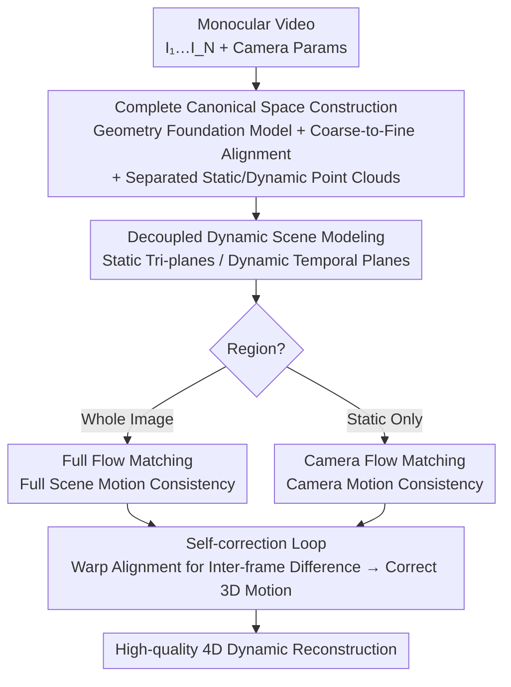

# ReFlow: Self-correction Motion Learning for Dynamic Scene Reconstruction

**Conference**: CVPR 2026  
**Paper**: [CVF Open Access](https://openaccess.thecvf.com/content/CVPR2026/html/Liang_ReFlow_Self-correction_Motion_Learning_for_Dynamic_Scene_Reconstruction_CVPR_2026_paper.html)  
**Code**: Project Page (noted in paper, specific address TBD)  
**Area**: 3D Vision  
**Keywords**: Monocular dynamic reconstruction, 4D reconstruction, Self-correction flow matching, 3D Gaussian Splatting, Motion supervision

## TL;DR
ReFlow proposes a "self-correction" monocular dynamic scene reconstruction framework that uses inter-frame video differences to directly supervise 3D motion without external optical flow or tracking priors. Combined with complete canonical space initialization and static-dynamic decoupling, it achieves new Prev. SOTA performance on NVIDIA Monocular and Nerfies-HyperNeRF (average PSNR 28.20 dB on NVIDIA).

## Background & Motivation

**Background**: Monocular dynamic scene reconstruction (recovering time-varying 3D structures from a single video) has advanced rapidly with 3D Gaussian Splatting (3DGS). Mainstream approaches model temporal changes using time-varying Gaussians or deformation fields.

**Limitations of Prior Work**: Existing methods face two primary challenges. First, initialization is incomplete—most use SfM (like COLMAP) designed for static scenes, resulting in point clouds that lack dynamic regions and fail to distinguish between static and dynamic points, creating an entangled and incomplete initial representation. Second, there is over-reliance on external motion priors—to stabilize dynamic reconstruction, many methods introduce pre-computed optical flow or point tracking as "pseudo-ground truth" to force 3D motion to align with these external estimates.

**Key Challenge**: External motion priors are a double-edged sword. Generated by independent pipelines, they may contain errors; if the optical flow estimator fails in regions of fast motion, occlusion, or weak texture, errors propagate through hard constraints into the reconstruction. For instance, MotionGS decomposes flow into motion and camera flows but remains strictly bound to the quality of external labels. The fundamental contradiction is that **reconstruction quality is capped by the precision of external estimators**.

**Goal**: The authors aim to unlock 4D dynamic scenes solely through 2D observations without any external motion guidance. This is broken down into two sub-problems: (i) providing reliable initialization for dynamic regions and decoupling static/dynamic representations; (ii) constraining 3D motion without external optical flow.

**Key Insight**: The authors leverage a simple observation—pixel differences between consecutive frames are caused by ground-truth 3D motion. If the reconstructed 3D motion is correct, projecting it into 2D flow to warp the previous frame should align perfectly with the subsequent frame. In other words, the video itself provides the motion supervision signal.

**Core Idea**: Replace "external optical flow priors" with "inter-frame video differences" to supervise 3D motion, forming a self-correction closed loop: inaccurate motion leads to warped frames deviating from observations, and this deviation pushes the motion toward the correct solution.

## Method

### Overall Architecture
ReFlow is a unified monocular dynamic reconstruction pipeline. Inputs are monocular videos $V=\{I_i\}_{i=1}^N$ with camera parameters; the output is a 4D scene representation that distinguishes static/dynamic components with correctly learned motion. The pipeline involves three steps: constructing a complete canonical space, modeling decoupled static/dynamic components, and learning motion via self-correction flow matching. The first two steps build the "foundation" for motion learning (addressing incomplete and entangled initialization).

### Key Designs

**1. Complete Canonical Space Construction: Completing and Decoupling Foundations**

To address the limitations of COLMAP, the authors use a geometry foundation model to regress per-pixel 3D coordinates from image pairs and enforce consistency across a global connectivity graph. For long videos, they employ **coarse-to-fine hierarchical alignment** to handle $O(N^2)$ memory growth and sparse co-visibility. The video is divided into $K$ non-overlapping segments; keyframes are used to optimize a coarse global structure (minimizing $\min \sum_{(a,b)} \mathcal{L}_{align}(X_a^a, X_b^a, C_a^a, C_b^a)$) followed by local refinement within segments. The resulting unified geometry is back-projected and aggregated into **separated static point clouds $P^{3D,stat}$ and dynamic point clouds $P^{3D,dyn}$** using dynamic masks $M_i^{dyn}$.

**2. Decoupled Dynamic Scene Modeling: Tailored Representations**

With separated point clouds, the authors assign different representations to each category. Dynamic objects use a reference frame with the largest mask coverage as $P^{3D,dyn}$, while static regions fuse current and keyframe point clouds into $P^{3D,stat}_{fusion}$ for better coverage. Static components use tri-plane features $F_s=\{F^{xy},F^{xz},F^{yz}\}$ to decode time-invariant Gaussian parameters $G_s:\{\mu_s,s_s,q_s,\sigma_s,c_s\}=D_s(x,y,z;F_s)$. Dynamic components add temporal planes $F_t=\{F^{xt},F^{yt},F^{zt}\}$ to allow position and rotation to vary over time $G_d:\{\mu_d(t),s_d,q_d(t),\sigma_d,c_d\}=D_d(x,y,z,t;F_s,F_t)$.

**3. Self-correction Flow Matching: Video as Self-supervision**

This is the core of ReFlow. The "3D-2D alignment" is implemented as a pixel-level warp: 3D motion is projected into 2D flow, which warps $I_1$ toward $I_2$ for comparison. Two types of flow are defined: **Full Flow** $F_{full}=\text{FlowRender}(G_{t1},G_{t2},P_1,P_2)$ representing total displacement, and **Camera Flow** $F_{cam}=\text{CamFlowRender}(G_{t1},P_1,P_2)$ isolating camera motion by assuming a static scene. Two constraints are defined for each: motion consistency loss $\mathcal{L}_{mc}=\mathcal{L}_{photo}(I_1^{warped},I_2)$ and cross-time rendering loss $\mathcal{L}_{cr}=\mathcal{L}_{photo}(\hat{I}_1^{warped},I_2)$. **Full Flow Matching** supervises the whole scene, while **Camera Flow Matching** targets only static regions to prevent the model from misinterpreting lighting or view-dependent artifacts as motion.

### Loss & Training
The total objective is supervised solely by the video on frame pairs $(I_1,I_2)$:

$$\mathcal{L} = \mathcal{L}_{baseline} + \lambda_{ff}\mathcal{L}_{fullflow}(I_1,I_2) + \lambda_{ff}\mathcal{L}_{camflow}(I_1^{static},I_2^{static})$$

Where $\mathcal{L}_{baseline}$ includes photometric loss and plane regularization, $\mathcal{L}_{fullflow}=\lambda_{mc}\mathcal{L}_{mc}+\lambda_{cr}\mathcal{L}_{cr}$, and $\mathcal{L}_{camflow}$ follows the same form for static regions. Training is conducted in two stages: a coarse stage freezing the dynamic deformation field to prioritize camera flow on static regions, and a fine stage for joint optimization.

## Key Experimental Results

### Main Results
On the NVIDIA Monocular dataset, ReFlow leads across all metrics. Below are the means and representative scenes compared against the SOTA MoDec-GS:

| Dataset/Scene | Metric | Ours | MoDec-GS | Deformable-3DGS |
|------|------|--------|----------|-----------------|
| NVIDIA Mean | PSNR↑ | **28.20** | 26.63 | 25.86 |
| NVIDIA Mean | SSIM↑ | **0.903** | 0.879 | 0.888 |
| NVIDIA Mean | LPIPS↓ | **0.103** | 0.160 | 0.132 |
| Balloon2 | PSNR↑ | **29.01** | 27.15 | 26.48 |
| Umbrella | PSNR↑ | **27.21** | 25.02 | 26.18 |

ReFlow also outperforms others on Nerfies-HyperNeRF, achieving PSNR 25.97 on the Nerfies subset and 26.15 on HyperNeRF, surpassing MotionGS (24.80) and MoDec-GS (25.02) without using any external optical flow.

### Ablation Study
On NVIDIA Monocular: CompInit.=Complete Canonical Initialization, Sep.=Decoupled Modeling, FullFM=Full Flow Matching, CamFM=Camera Flow Matching:

| Configuration | PSNR↑ | Description |
|------|-------|------|
| Baseline | 25.81 | 4DGS baseline |
| #1 FM only (Sparse Init) | 26.45 | Flow Matching added to baseline, Gain +0.64 dB |
| #2 w/o align (Raw points) | 24.50 | -0.71 dB compared to baseline due to misaligned geometry |
| #3 + Hierarchical Align | 26.60 | Consistent canonical space, Gain +0.79 dB |
| #4 + Static/Dynamic Sep. | 27.00 | Gain +1.19 dB (vs. Baseline) |
| #5 + Full Flow Matching | 27.85 | Gain +0.85 dB over #4 |
| Ours (+ CamFM) | **28.20** | Further improvement in static regions |

### Key Findings
- **Alignment is the foundation**: Directly using unaligned raw point clouds (#2) is worse than the baseline, indicating that geometric priors must be aligned to be beneficial.
- **Flow matching requires the right foundation**: Full Flow Matching contributes (+0.85 dB) significantly only after static-dynamic separation, proving that motion-aware representations are crucial for self-correction.
- **Self-correction flow is intrinsically strong**: Even with sparse initialization (#1), FM provides a +0.64 dB boost, showing the mechanism is architecture-agnostic.

## Highlights & Insights
- **Paradigm shift to "Video as Supervision"**: Treating inter-frame differences as motion correction signals avoids the error propagation of external estimators.
- **Decoupling as a constraint prerequisite**: Separating static regions allows Camera Flow to provide clean supervision where only camera motion should exist, preventing the misinterpretation of view-dependent artifacts as motion.
- **Transferability**: The "project 3D motion → warp → compare → correct" logic can theoretically be integrated into any 4D representation using deformation or velocity fields as a prior-free motion regularizer.

## Limitations & Future Work
- Dependency on the quality of per-pixel 3D coordinates and masks from foundation models—failures in extreme scenarios could affect separation.
- Scalability to ultra-long videos and the impact of segment granularity for hierarchical alignment require further study.
- Generalization to large-scale outdoor environments with rapid motion remains to be verified beyond controlled datasets.

## Related Work & Insights
- **vs MotionGS**: MotionGS relies on external flow labels; ReFlow generates similar constraints self-supervisedly from the video, outperforming it on HyperNeRF.
- **vs Flow/Tracking-based methods**: ReFlow sidesteps the sensitivity of pre-computed flow to fast motion and occlusion by extracting motion information directly from raw inputs.
- **vs COLMAP-initialized 3DGS**: ReFlow solves the problem of missing dynamic regions and entangled representations through geometry foundation models and explicit decoupling.

## Rating
- Novelty: ⭐⭐⭐⭐⭐ "Video as motion supervision" is a powerful, simple paradigm.
- Experimental Thoroughness: ⭐⭐⭐⭐ Comprehensive comparisons and clear ablations, though sensitivity to mask/geometry errors is less explored.
- Writing Quality: ⭐⭐⭐⭐ Clear motivation and logical flow.
- Value: ⭐⭐⭐⭐ Establishes a new paradigm for 4D reconstruction without external priors.

<!-- RELATED:START -->

## Related Papers

- [\[CVPR 2026\] MoVieS: Motion-Aware 4D Dynamic View Synthesis in One Second](movies_motion-aware_4d_dynamic_view_synthesis_in_one_second.md)
- [\[CVPR 2026\] DynamicVGGT: Learning Dynamic Point Maps for 4D Scene Reconstruction in Autonomous Driving](dynamicvggt_learning_dynamic_point_maps_for_4d_scene_reconstruction_in_autonomou.md)
- [\[CVPR 2026\] MAPo: Motion-Aware Partitioning of Deformable 3D Gaussian Splatting for High-Fidelity Dynamic Scene Reconstruction](mapo_motion-aware_partitioning_of_deformable_3d_gaussian_splatting_for_high-fide.md)
- [\[CVPR 2026\] MOSAIC-GS: Monocular Scene Reconstruction via Advanced Initialization for Complex Dynamic Environments](mosaic-gs_monocular_scene_reconstruction_via_advanced_initialization_for_complex.md)
- [\[CVPR 2026\] Point4Cast: Streaming Dynamic Scene Reconstruction and Forecasting](point4cast_streaming_dynamic_scene_reconstruction_and_forecasting.md)

<!-- RELATED:END -->
