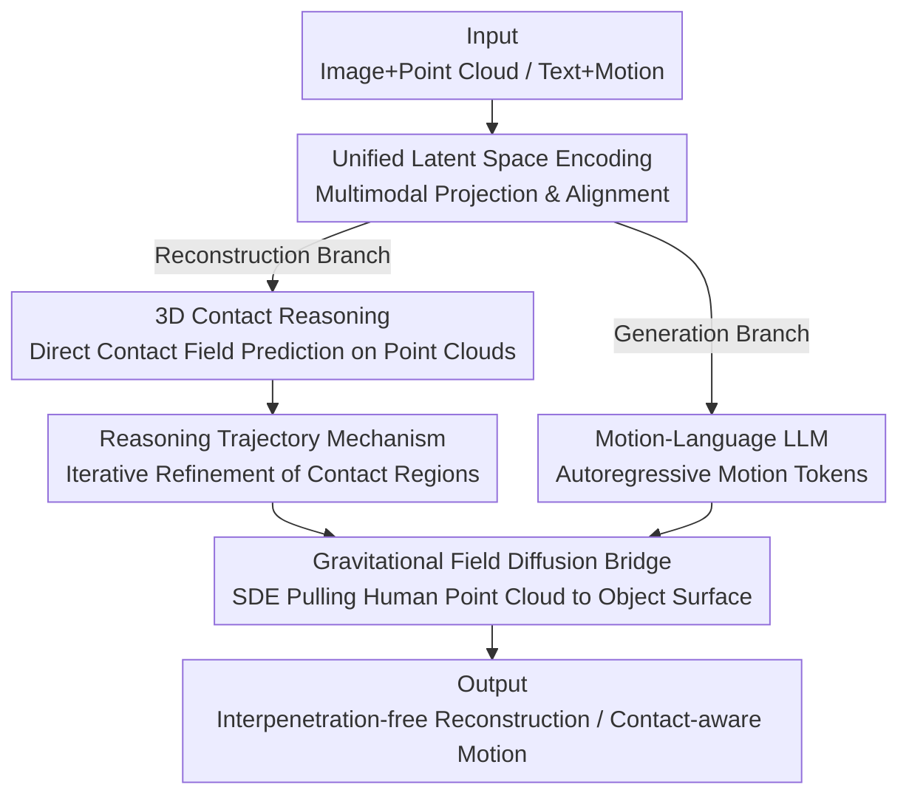

# ReGenHOI: Unifying Reconstruction and Generation for 3D Human-Object Interaction Understanding

**Conference**: CVPR 2026  
**Paper**: [CVF Open Access](https://openaccess.thecvf.com/content/CVPR2026/html/Xu_ReGenHOI_Unifying_Reconstruction_and_Generation_for_3D_Human-Object_Interaction_Understanding_CVPR_2026_paper.html)  
**Code**: https://github.com/xumiao66/ReGenHOI  
**Area**: 3D Vision / Human Understanding  
**Keywords**: Human-Object Interaction, Contact Reasoning, Unified Reconstruction and Generation, Diffusion Bridge, Shared Latent Space

## TL;DR
ReGenHOI unifies the "reconstruction" (restoring observed contacts from images) and "generation" (synthesizing future interactions from linguistic instructions) of 3D Human-Object Interaction (HOI) into a shared semantic-geometric latent space. By integrating direct 3D point cloud contact reasoning, iterative reasoning trajectories, and a gravitational field diffusion bridge for contact refinement, it simultaneously outperforms SOTA in contact estimation, reconstruction accuracy, and motion generation quality.

## Background & Motivation
**Background**: Understanding 3D HOI corresponds to two cognitive abilities: perception (reconstruction, restoring spatial relationships between bodies and objects from images) and imagination (generation, synthesizing future interaction movements based on intent). However, most existing methods treat these as independent tasks: reconstruction methods (e.g., InteractVLM, DECO) focus on restoring observed geometry, while generation methods (e.g., OMOMO, SemGeoMo) focus on synthesizing new human-object configurations from linguistic or visual prompts.

**Limitations of Prior Work**: This separation leads to inherent flaws on both sides. Reconstruction models lack semantic reasoning and fail to generalize beyond the training distribution; generation models struggle to ensure geometric and physical consistency, often resulting in interpenetration or misaligned contact. More specifically, most existing contact estimation is predicted in 2D and then lifted to 3D, where depth ambiguity contaminates contact localization. Furthermore, contact annotations for human and object sides are often labeled separately without forced alignment, lacking fine-grained bijective correspondences.

**Key Challenge**: Reconstruction and generation inherently share the same spatial intelligence—maintaining geometric consistency, ensuring semantic coherence, and reasoning about 3D spatial relationships. Training them separately forces two complementary abilities to operate in isolation: reconstruction loses the semantic/physical plausibility provided by generative priors, while generation loses the geometric grounding provided by real observations.

**Goal**: To build a unified framework that learns a shared semantic-geometric representation across reconstruction and generation, allowing the two tasks to support each other in the same reasoning space—reconstruction benefits from the plausibility of generative priors, and generation is constrained by the geometry of real observations.

**Key Insight**: The authors argue that the "contact region" is the key pivot connecting the two tasks. Whether restoring observations or imagining the future, the model must first determine where and how humans and objects interact. Thus, explicit reasoning on human-object contact regions is used as the foundation for constructing the shared latent representation.

**Core Idea**: Use a shared latent space to encode images, text, and point clouds uniformly. Perform direct reasoning on 3D contact with iterative refinement, then use a gravitational field diffusion bridge to refine coarse contact geometry into physically plausible, interpenetration-free results. Both reconstruction and generation branches share this representation.

## Method

### Overall Architecture
ReGenHOI adopts an encoder–decoder architecture: the encoder maps multimodal inputs $X$ (images and point clouds for reconstruction; text and motions for generation) into a unified latent representation $z = \text{Encoder}(X;\theta_{enc})$. The decoder then produces 3D configurations for reconstruction or motion sequences for generation $\hat{y} = \text{Decoder}(z\mid\theta_{dec})$. Crucially, the reconstruction latent code $z_{rec}$ and the generation latent code $z_{gen}$ are aligned into the **same shared latent space**, enabling knowledge sharing and mutual constraint between the two tasks.

The pipeline consists of three main components: **Unified Latent Space Encoding** projects and aligns heterogeneous inputs into the shared space; this is followed by **Dual-branch Decoding**—the reconstruction branch uses an LLM to predict dense contact probability fields, refined via reasoning trajectories for coarse alignment, while the generation branch uses a motion-language LLM to autoregressively predict motion tokens for sequence decoding; finally, **Gravitational Field Diffusion Bridge Refinement** polishes coarse contact geometry into physically plausible results. 3D contact reasoning and reasoning trajectory mechanisms are the pillars of the shared representation.

### Key Designs

**1. Unified Latent Space Encoding: Aligning Images, Text, and Point Clouds**

Despite the vast difference in inputs for reconstruction (RGB images) and generation (linguistic instructions), both drive the same contact reasoning and thus must be aligned. For reconstruction: visual features $f_I$ are extracted from image $I$, SMPL-X parameters $(\theta,\beta)$ are obtained via a regressor to generate a human mesh $H$, and a category-matched object mesh $O$ is retrieved and normalized. Geometric features $f_H, f_O$ are extracted via PointNet++, and the latent code is formed as $z_{rec} = W_H f_H + W_O f_O + W_I f_I$. Space priors are predicted as bounding boxes $B=\{b_{body}, b_{hand}, b_{object}\}$. For generation: text features $f_T$ and VQ-VAE quantized motion tokens $c_{1:L}$ form $z_{gen} = W_T f_T + W_C \text{Embed}(c_{1:L})$. $z_{rec}$ and $z_{gen}$ are aligned via contrastive/cross-modal losses, providing the physical basis for task synergy.

**2. 3D Contact Reasoning + Reasoning Trajectory Mechanism: Direct 3D Reasoning and Iterative Refinement**

To address depth ambiguity from 2D lifting, the model reasons directly on 3D point clouds. During reconstruction decoding, conditioned on $z_{rec}$, $B$, and optional text $T$, the LLM outputs a dense contact probability field $\Psi(x) = \text{MLP}(\text{LLM}(z_{rec}, B, [T]))$. Points exceeding a threshold $\tau$ form the candidate set $C$. To improve accuracy, the **Reasoning Trajectory Mechanism (RTM)** is introduced: using bounding boxes as anchors, the model explicitly infers structured spatial relationships (distance, overlap, approach direction) between human, hand, and object regions. It **iteratively refines** the candidate regions along an interpretable trajectory to obtain the final contact region $\hat{C}$ and optimizes the object's transformation matrix. Ablations show that removing RTM leads to a significant drop in contact F1 and reconstruction accuracy.

**3. Gravitational Field Diffusion Bridge Refinement: Modeling Physics as an SDE Trajectory**

Even after coarse alignment, geometry may still exhibit interpenetration. The authors adapt the Gravitational Field Diffusion Bridge (GBDB), viewing HOI as a "gravity-driven" process where the human point cloud is pulled toward the object surface under a learned potential field while maintaining SMPL-X anatomical priors. The refinement is formulated as a Stochastic Differential Equation:

$$dH_t = -\alpha\nabla\varphi(H_t)\,dt - \lambda_1\nabla L_{\text{SMPL-X}}\,dt - \lambda_2\nabla L_{normal}\,dt + g(H_t)\,dW_t$$

Where $\varphi(H_t)$ is the potential field centered on object $O$, encouraging human points to move toward valid contact zones while avoiding interpenetration; $L_{\text{SMPL-X}}$ maintains limb proportions and joint limits; $L_{normal}$ aligns surface normals. The diffusion term $g(H_t)dW_t$ injects controlled randomness to escape local optima. Solving via Euler–Maruyama establishes a continuous "refinement bridge" toward physical consistency.

### Loss & Training
The framework is built on pre-trained MotionGPT and human reconstruction modules. The motion generation component is fine-tuned first, after which it and the reconstruction modules are frozen to train the subsequent parts. The unified objective for contact localization is $L_{LLM} = \lambda_c L_{contact} + \lambda_s L_{semantic} + \lambda_r L_{reason}$, where $L_{contact}$ is binary cross-entropy for point-wise prediction, $L_{semantic}$ is a contrastive loss between geometric and text features, and $L_{reason} = \|\Phi_{geo}-\Phi_{sem}\|_2^2 + \|\Phi_{sem}-\Phi_{cont}\|_2^2$ constrains the continuity of the latent reasoning path. The diffusion bridge is optimized via $L_{bridge}$. Weights are set as $\lambda_c{=}1.0, \lambda_s{=}0.5, \lambda_r{=}0.1, \lambda_p{=}1.0, \lambda_m{=}\lambda_n{=}0.3$. The LLM is trained for 30 epochs using AdamW, and the diffusion bridge for 50k steps.

## Key Experimental Results

### Main Results

Contact Estimation (DAMON Dataset, binary human contact):

| Method | F1 ↑ | Precision ↑ | Recall ↑ | Geodesic (cm) ↓ |
|--------|------|-------------|----------|------------------|
| BSTRO | 46.0 | 51.0 | 53.0 | 38.06 |
| DECO | 55.0 | 65.0 | 57.0 | 21.32 |
| InteractVLM | 75.6 | 75.2 | 76.0 | 2.89 |
| **Ours** | **78.4** | **77.8** | **78.6** | **2.65** |

Motion Generation (FullBodyManipulation Dataset):

| Method | HandJPE ↓ | MPJPE ↓ | F1 ↑ | FID ↓ | R-score ↑ | Div. ↑ |
|--------|-----------|---------|------|-------|-----------|--------|
| OMOMO | 33.18 | 18.06 | 0.75 | 1.98 | 0.38 | 8.99 |
| CHOIS | 31.68 | 17.12 | 0.59 | 2.27 | 0.49 | 6.04 |
| SemGeoMo | 27.84 | 16.62 | 0.77 | 1.17 | 0.66 | 10.15 |
| **Ours** | **26.91** | **16.28** | **0.79** | **1.02** | **0.68** | **10.42** |

### Ablation Study

Reconstruction accuracy and ablation on the PICO dataset:

| Configuration | PA-CDh ↓ | PA-CDo ↓ | IV (cm³) ↓ | PD (mm) ↓ | Note |
|---------------|----------|----------|------------|-----------|------|
| InteractVLM | 6.38 | 13.91 | 2.78 | 3.15 | Prev. SOTA |
| Ours w/o GBDB | 6.41 | 12.84 | 1.20 | 2.45 | W/o refinement, higher IV/PD |
| Ours w/o RTM | 6.05 | 12.47 | 1.06 | 2.30 | W/o iterative reasoning |
| Ours w/o Gen | 5.76 | 12.15 | 0.98 | 2.23 | W/o shared latent space |
| **Ours** | **5.42** | 12.68 | **0.87** | **2.08** | Full model |

### Key Findings
- **Shared Latent Space is Synergistic**: Removing either the generation (w/o Gen) or reconstruction (w/o Rec) branch degrades performance on the other, proving mutually provided semantic priors and geometric grounding.
- **RTM is Vital for Contact Localization**: Replacing iterative reasoning with a single forward pass leads to a sharp decline in F1 scores, proving structured spatial reasoning is more reliable than vanilla LLM output.
- **GBDB Ensures Physical Plausibility**: Removing GBDB significantly increases penetration distance (PD) and interaction volume (IV), showing its primary value is in resolving interpenetration.
- **3D Reasoning Avoids Depth Ambiguity**: Compared to 2D-to-3D lifting pipelines, direct reasoning on point clouds shows a clear advantage in geodesic error.

## Highlights & Insights
- **Unified Task via "Contact Region"**: Defining both reconstruction and generation as "determining where contact occurs" is a clever abstraction. Contact is both measurable in observations and a necessary constraint in imagination.
- **Gravitational SDE Perspective**: Instead of simple ICP fitting, contact refinement is modeled as a stochastic process with anatomical constraints and normal alignment, allowing the model to escape local optima.
- **Interpretability of Reasoning Trajectories**: Explicitly inferring relative distances and orientations makes the contact prediction process a "white box" rather than an opaque LLM output.

## Limitations & Future Work
- **Dependency on External Modules**: Accuracy relies on off-the-shelf human mesh regressors and object retrieval. Failures in shape retrieval contaminate downstream contact reasoning.
- **Heavy Computational Cost**: Using a 7B Vicuna backbone for motion generation requires significant resources (8×A100), making real-time deployment difficult.
- **Reliance on Fine-grained Annotations**: The method depends on phase-specific semantic labels, which may not be available in many wild scenarios.
- **Rigid Body Assumption**: The diffusion bridge treats objects as fixed references, leaving interactions with deformable objects (e.g., clothing) unaddressed.

## Related Work & Insights
- **vs. InteractVLM / DECO**: These often predict in 2D and lack cross-aligned human-object contact labels; the proposed method reasons in 3D and generalizes to 80 object classes.
- **vs. SemGeoMo / OMOMO**: Purely generative models lack geometric grounding from real observations; the shared latent space in this work ensures more realistic contact (higher F1, lower FID).
- **vs. Original GBDB**: This work extends the hand-object gravitational bridge to full-body HOI and integrates it into a dual-branch unified framework.

## Rating
- Novelty: ⭐⭐⭐⭐ Unifying recon/gen via contact hubs and gravitational SDE is innovative, though individual modules build on existing work.
- Experimental Thoroughness: ⭐⭐⭐⭐ Extensive evaluation across four benchmarks with comprehensive ablation studies.
- Writing Quality: ⭐⭐⭐⭐ Clear motivation and methodology; well-structured equations. 
- Value: ⭐⭐⭐⭐ Provides a highly interpretable and unified framework for HOI, useful for robotics and animation.

<!-- RELATED:START -->

## Related Papers

- [\[CVPR 2026\] CARI4D: Category Agnostic 4D Reconstruction of Human-Object Interaction](cari4d_category_agnostic_4d_reconstruction_of_human_object_interaction.md)
- [\[CVPR 2026\] CrossHOI: Learning Cross-View Representations for Monocular 3D Human-Object Interaction Reconstruction](crosshoi_learning_cross-view_representations_for_monocular_3d_human-object_inter.md)
- [\[CVPR 2026\] Human Interaction-Aware 3D Reconstruction from a Single Image](human_interaction-aware_3d_reconstruction_from_a_single_image.md)
- [\[CVPR 2026\] UniSH: Unifying Scene and Human Reconstruction in a Feed-Forward Pass](unish_unifying_scene_and_human_reconstruction_in_a_feed-forward_pass.md)
- [\[CVPR 2026\] ForeHOI: Feed-forward 3D Object Reconstruction from Daily Hand-Object Interaction Videos](forehoi_feed-forward_3d_object_reconstruction_from_daily_hand-object_interaction.md)

<!-- RELATED:END -->
