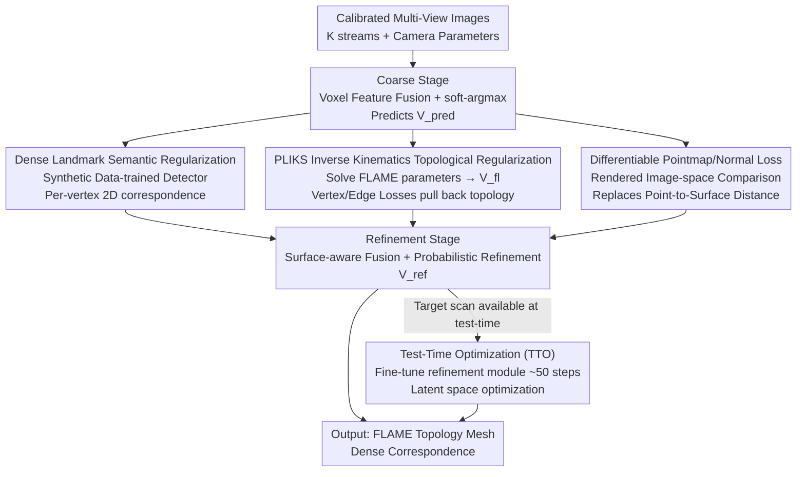

# Registration-Free Learnable Multi-View Capture of Faces in Dense Semantic Correspondence

**Conference**: CVPR 2026  
**arXiv**: [2605.01450](https://arxiv.org/abs/2605.01450)  
**Code**: https://filby89.github.io/mochi (Available)  
**Area**: 3D Vision  
**Keywords**: Multi-view face reconstruction, Dense semantic correspondence, FLAME, Registration-free training, Test-time optimization

## TL;DR
MOCHI is the first multi-view dense correspondence face reconstruction framework that does not require **pre-registered data** for training. By employing a "pseudo-linear inverse kinematics solver + differentiable pointmap/normal loss + dense landmarks trained on synthetic data" trio, it directly learns topology-consistent FLAME meshes from raw scans. Coupled with a lightweight test-time optimization (TTO), its reconstruction accuracy surpasses the very slow and labor-intensive traditional registration pipelines it aims to replace.

## Background & Motivation

**Background**: High-fidelity face reconstruction with "dense correspondence"—outputting meshes with the **same topology** (one-to-one vertex correspondence) for different individuals and expressions to facilitate animation and editing—currently relies on Multi-View Stereo (MVS) to obtain raw scans, followed by non-rigid registration to align these scans with a predefined template topology (e.g., FLAME). Learning-based methods like ToFu, TEMPEH, and GRAPE use neural networks to predict fixed-topology meshes from calibrated multi-view images in a single forward pass, compressing this multi-stage pipeline and eliminating iterative registration during inference.

**Limitations of Prior Work**: Although these learning-based methods offer fast inference, their **training supervision still relies on the slow and manual registration pipelines** they aim to replace. Preregistered Ground Truth (GT) must be prepared for every scan using traditional registration, which is time-consuming and requires manual verification and correction (e.g., fixing teeth intersections, compensating for failed extreme expressions, and per-subject hyperparameter tuning). In other words, these "registration-killing" methods cannot exist without registration itself.

**Key Challenge**: The natural signal for supervision directly from raw scans is the **point-to-surface distance** between the scan and the mesh. however, it relies on discrete nearest-neighbor search, which yields non-smooth gradients. When the predicted mesh is not yet closely aligned with the scan (during early training or in regions with large deformation), this loss induces artifacts such as self-intersections and penetrations, making it impossible to "learn topology from scratch." This is why prior works rely on pre-registered GT.

**Goal**: To eliminate the dependence on pre-registered GT during training, allowing the network to be **trained directly on raw scans and calibrated images** while ensuring the output remains a topology-consistent FLAME mesh with accuracy matching or exceeding traditional registration.

**Key Insight**: Since the problem arises from a lack of topological constraints and unstable point-to-surface losses, the solution is to integrate topological constraints as differentiable internal regularizations, replace unstable losses with differentiable rendering losses, and utilize a semantic signal (dense landmarks trained on synthetic data) to anchor geometrically ambiguous regions like the eyes and lips.

**Core Idea**: "Move the registration step inside the network"—use Pseudo-Linear Inverse Kinematics (PLIKS) to solve for FLAME parameters from free vertices as an implicit topological regularization, combined with differentiable pointmap/normal losses and dense semantic landmarks to learn dense correspondence meshes without registration.

## Method

### Overall Architecture
MOCHI follows the multi-view capture setup of TEMPEH: it takes images from $K$ calibrated cameras $\{\mathcal{I}_i\}_{i=1}^K$ and outputs a mesh $\hat{M}=(\mathbf{V},\mathbf{T})$ with FLAME topology ($n_v=5023$ vertices). The mesh is required to fit the raw scan spatially while maintaining canonical topology. The pipeline is a **coarse-to-fine** two-stage network: the coarse stage uses voxel feature fusion to predict an initial mesh $\mathbf{V}_c$, and the refinement stage fine-tunes vertices into $\mathbf{V}_{\text{ref}}$ by sampling multi-view features based on surface normals.

Crucially, there is **no GT registration** during training. The network is constrained toward topological consistency via three registration-free supervisions: ① A dense landmark detector (trained purely on synthetic data) provides 2D correspondences for each vertex as semantic regularization; ② A PLIKS solver solves for FLAME parameters from predicted vertices $\mathbf{V}_{\text{pred}}$ and performs a forward pass to obtain a topologically canonical mesh $\mathbf{V}_{\text{fl}}$, using vertex/edge losses to pull free predictions back toward the FLAME manifold; ③ Both the predicted mesh and GT scan are differentiably rendered into pointmaps and normal maps for comparison in image space (replacing point-to-surface distance). An optional TTO is applied during inference by fine-tuning the refinement module for a few dozen steps to fit the specific scan.

### Key Designs

**1. PLIKS (Pseudo-Linear Inverse Kinematics Solver): Topological Constraints as Internal Differentiable Regularization**

This component addresses the core issue where free network predictions deviate from FLAME topology due to a lack of GT registration. Given the predicted vertices $\mathbf{V}_{\text{pred}}$, MOCHI first estimates rigid rotations $\{\mathbf{R}_s\}$ for $S$ FLAME skinning segments using Procrustes alignment (efficiently estimated once without refinement). With rotations fixed, it solves a **linear least squares** problem to find shape $\boldsymbol{\beta}$, expression $\boldsymbol{\psi}$, and translation $\mathbf{t}$:

$$[\boldsymbol{\beta},\boldsymbol{\psi},\mathbf{t}]=\arg\min\big\|\mathbf{R}(\bar{\mathbf{V}}+\mathbf{B}_{\text{id}}\boldsymbol{\beta}+\mathbf{B}_{\text{exp}}\boldsymbol{\psi})+\mathbf{t}-\mathbf{V}_{\text{pred}}\big\|_2^2$$

The solved parameters are passed through the FLAME layer to obtain the canonical $\mathbf{V}_{\text{fl}}$. A vertex alignment loss and edge length regularization pull the free prediction back: $\mathcal{L}_{\text{PLIKS-align}}=\lambda_v\|\mathbf{V}_{\text{fl}}-\mathbf{V}_{\text{pred}}\|_2^2+\lambda_e\mathcal{L}_{\text{edge}}(\mathbf{V}_{\text{fl}},\mathbf{V}_{\text{pred}})$. Additionally, $\ell_2$ regularization $\mathcal{L}_{\text{PLIKS-reg}}=\lambda_\beta\|\boldsymbol{\beta}\|_2^2+\lambda_\psi\|\boldsymbol{\psi}\|_2^2$ is applied to ensure parameters stay within the distribution.

The brilliance lies in its use as an **implicit (bidirectional) regularization** rather than a hard constraint: gradients flow through both $\mathbf{V}_{\text{pred}}$ and $\mathbf{V}_{\text{fl}}$, pushing the free prediction toward reasonable anatomical structures while allowing the FLAME mesh to absorb view-dependent details. This avoids overfitting identity parameters (which would require much larger datasets) and prevents the reconstruction from being strictly locked within the FLAME shape space.

**2. Differentiable Pointmap + Normal Loss: Replacing Unstable Point-to-Surface Distance with Smooth Image-Space Supervision**

Traditional scan-to-mesh point-to-surface losses rely on discrete nearest-neighbor assignments, yielding non-smooth gradients that can bypass topological regularization and cause artifacts when the mesh is not yet aligned. MOCHI instead utilizes **differentiable rendering comparison** across all calibrated views. For the GT scan $\mathbf{S}$, it renders normal maps $\mathbf{N}_{\text{gt},i}$ and per-pixel 3D pointmaps $\mathbf{P}_{\text{gt},i}$. Corresponding $\mathbf{N}_{\text{pred},i}$ and $\mathbf{P}_{\text{pred},i}$ are rendered from the predicted mesh. A Geman–McClure robust penalty is used to suppress scan noise and outliers:

$$\mathcal{L}_{\text{geom}}=\sum_{i=1}^K \rho_{\text{GM}}\big(\|\mathbf{N}_{\text{pred},i}-\mathbf{N}_{\text{gt},i}\|_2\big)+\rho_{\text{GM}}\big(\|\mathbf{P}_{\text{pred},i}-\mathbf{P}_{\text{gt},i}\|_2\big)$$

where $\rho_{\text{GM}}(x)=\dfrac{x^2}{x^2+\sigma^2}$ ($\sigma=10$). Since the rendering process is fully differentiable and avoids discrete nearest-point selection, the gradients are smooth and spatially consistent. This allows stable convergence from a coarse initialization.

**3. Synthetic Data-Trained Dense Landmark Detector: Semantic Signals for Ambiguous Regions**

Pure geometric losses fail to resolve correspondences in regions that are partially missing, noisy, or semantically ambiguous (lips, teeth, eyelids). MOCHI trains a dense landmark detector providing **per-vertex 2D correspondences** for semantic supervision. It renders 25,000 synthetic images in Blender (random shape, expression, pose, albedo, lighting, and backgrounds). Using a DINOv3-Large backbone with a LoRA branch, it performs $\ell_2$ regression to predict dense 2D landmarks $\mathbf{U}\in\mathbb{R}^{n_v\times2}$. During training, this acts as a reprojection loss constraining **both** the canonical mesh $\mathbf{V}_{\text{fl}}$ and the free prediction $\mathbf{V}_{\text{pred}}$:

$$\mathcal{L}_{\text{lm}}=\sum_{i=1}^K\big[\mathcal{D}_i(\mathbf{V}_{\text{fl}})+\mathcal{D}_i(\mathbf{V}_{\text{pred}})\big],\quad \mathcal{D}_i(\mathbf{V})=\|\Pi_i(\mathbf{V})-\mathbf{U}_i\|_2^2$$

This component provides semantic regularization rather than geometric precision. On its own, it might "spray" triangles onto the scan surface, but when combined with PLIKS, it ensures anatomical consistency in ambiguous areas.

**4. Latent Test-Time Optimization (TTO): Fine-Tuning on Single Scans Using Learned Priors**

While the feed-forward model generalizes well, residual misalignments persist for specific captures. TTO fine-tunes **only the refinement module** for approximately 50 steps using the geometric losses from Section 3.5. Crucially, it **optimizes within the learned latent space** rather than optimizing vertex coordinates from scratch. Fine-tuning the refinement module is equivalent to moving along the "reasonable face geometry manifold," leading to fast, stable convergence and robustness to scan noise or partial geometry.

### Loss & Training
The total training objective is a weighted combination of geometric, landmark, and topological consistency terms:

$$\mathcal{L}_{\text{total}}=\lambda_{\text{geom}}\mathcal{L}_{\text{geom}}+\lambda_{\text{lm}}\mathcal{L}_{\text{lm}}+\lambda_{\text{align}}\mathcal{L}_{\text{PLIKS-align}}+\lambda_{\text{reg}}\mathcal{L}_{\text{PLIKS-reg}}$$

Training is divided into three stages over approximately one week on a single A100 (80GB): 1) Pre-training with 2D landmarks for 150k steps, 2) Coarse stage training for 300k steps, and 3) Refinement stage training for 300k steps.

## Key Experimental Results

### Main Results
Point-to-surface error (mm, lower is better) on FaMoS (8-view) and CoMA (6-view, zero-shot):

| Dataset | Setting | Method | Median↓ | Mean↓ |
|---------|---------|--------|---------|-------|
| FaMoS   | Image-only | TEMPEH (Requires Reg.) | 0.36 | 0.63 |
| FaMoS   | Image-only | **MOCHI** (Reg.-free) | **0.26** | **0.48** |
| FaMoS   | Image+Scan | Classic Reg. (Manual) | 0.10 | 0.24 |
| FaMoS   | Image+Scan | **MOCHI TTO** | **0.07** | **0.21** |
| CoMA    | Image-only | TEMPEH | 0.81 | 1.40 |
| CoMA    | Image-only | **MOCHI** (Zero-shot) | **0.53** | **1.09** |
| CoMA    | Image+Scan | Classic Reg. | 0.10 | 0.23 |
| CoMA    | Image+Scan | **MOCHI TTO** | **0.07** | **0.17** |

- **Image-only**: MOCHI reduces Median error on FaMoS from 0.36 to 0.26 (approx. 28%) **without any registration supervision**. Gains transfer across datasets (CoMA error 0.53 vs 0.81).
- **Image+Scan**: MOCHI TTO outperforms the manual registration pipeline (0.07 vs 0.10 mm).

### Ablation Study
- **Point-to-surface vs Pointmap**: Increasing point-to-surface weight leads to penetrations/self-intersections; pointmap remains smooth even at high weights.
- **Landmarks vs Landmarks+PLIKS**: Landmarks alone cause artifacts and noisy triangles; PLIKS ensures anatomical consistency.
- **TTO Vertex vs Latent Space**: Vertex optimization leads to higher error and artifacts; latent space optimization provides implicit semantic regularization.

### Key Findings
- **Highest Impact Components**: Differentiable pointmap loss (enables stable registration-free training) + PLIKS (ensures topological correctness).
- **Latent TTO**: Fine-tuning the refinement module is superior to raw vertex optimization as it constrains the search to a manifold of reasonable face geometries.
- **Failure Mode**: When the scan contains large visible teeth regions, TTO occasionally gets "distracted" by the teeth geometry, distorting the lips.

## Highlights & Insights
- **Internalizing Registration**: While previous methods relied on traditional registration for GT, MOCHI uses PLIKS as a differentiable implicit topological regularization—a fundamental paradigm shift.
- **Robust Loss Diagnosis**: Instead of assuming point-to-surface distance would work, the authors diagnosed its instability (discrete assignments → non-smooth gradients) and replaced it with a differentiable rendering loss.
- **Implicit Reg. vs Hard Constraints**: MOCHI does not strictly regress 3DMM parameters (avoiding identity overfitting), but "nudges" the mesh toward a canonical topology while allowing deviations to preserve detail.
- **Latent TTO Universality**: The paradigm of per-instance fine-tuning within a learned manifold is highly effective and applicable to other differentiable reconstruction tasks.

## Limitations & Future Work
- **Computational Overhead**: Pointmap/normal rendering and the PLIKS solver add significant time per training step (approx. 210 ms total on an A100).
- **Semantic Ambiguity**: The failure mode with teeth suggests that topological regularization still struggles with extreme geometric ambiguity.
- **Dataset Diversity**: Evaluation is primarily on FaMoS and CoMA, where subjects wear hairnets; generalization to extreme hair or varied appearances is not fully verified.

## Related Work & Insights
- **vs TEMPEH**: MOCHI adopts a similar coarse-to-fine structure but eliminates the registration requirement, outperforming TEMPEH by 28% in Median error.
- **vs Classic Registration**: MOCHI TTO provides a fully automated alternative that is both faster and more accurate than manual non-rigid ICP pipelines.
- **vs Neural Avatars**: Unlike NeRF/Gaussian-based methods that provide high-fidelity rendering, MOCHI outputs explicit FLAME meshes compatible with standard graphics engines for animation.

## Rating
- Novelty: ⭐⭐⭐⭐⭐ 
- Experimental Thoroughness: ⭐⭐⭐⭐ 
- Writing Quality: ⭐⭐⭐⭐⭐ 
- Value: ⭐⭐⭐⭐⭐ 

<!-- RELATED:START -->

## Related Papers

- [\[CVPR 2026\] CUBE: Representing 3D Faces with Learnable B-Spline Volumes](cube_bspline_3d_faces.md)
- [\[CVPR 2026\] Generalized-CVO: Fast and Correspondence-Free Local Point Cloud Registration with Second Order Riemannian Optimization](generalized-cvo_fast_and_correspondence-free_local_point_cloud_registration_with.md)
- [\[CVPR 2026\] C-GenReg: Training-Free 3D Point Cloud Registration by Multi-View-Consistent Geometry-to-Image Generation with Probabilistic Modalities Fusion](c-genreg_training-free_3d_point_cloud_registration_by_multi-view-consistent_geom.md)
- [\[CVPR 2026\] 3D-Aware Multi-Task Learning with Cross-View Correlations for Dense Scene Understanding](3d-aware_multi-task_learning_with_cross-view_correlations_for_dense_scene_unders.md)
- [\[CVPR 2026\] TokenGS: Decoupling 3D Gaussian Prediction from Pixels with Learnable Tokens](tokengs_decoupling_3d_gaussian_prediction_from_pixels_with_learnable_tokens.md)

<!-- RELATED:END -->
