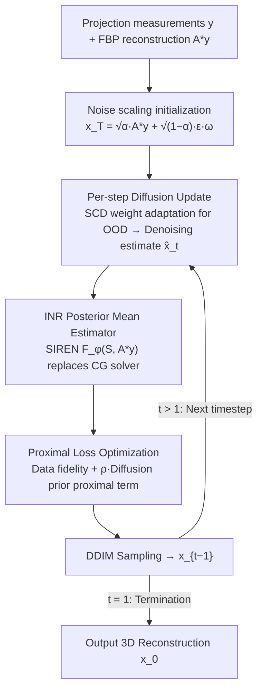

# Regularizing INR with Diffusion Prior for Self-Supervised 3D Reconstruction of Neutron Computed Tomography Data

**Conference**: CVPR 2026  
**arXiv**: [2603.10947](https://arxiv.org/abs/2603.10947)  
**Code**: Upcoming  
**Area**: 3D Vision  
**Keywords**: Neutron CT, Sparse-view Reconstruction, Implicit Neural Representation, Diffusion Prior, Inverse Problem

## TL;DR

Proposes DINR (Diffusive INR), which replaces traditional inversion solvers with an INR within the DD3IP diffusion framework. By injecting diffusion denoising estimates into the INR optimization process via a proximal loss, the method outperforms existing SOTA in neutron CT reconstruction with extremely sparse views (as few as 4-5 views).

## Background & Motivation

**Background**: Neutron CT is a vital imaging modality capable of characterizing internal structures via hydrogen distribution. It is widely applied in hydrogen fuel cell manufacturing, lithium-ion battery research, plant/soil water transport monitoring, and radiation shielding safety for concrete.

**Limitations of Prior Work**: Neutron beam flux is extremely low, requiring long exposure times for each view, resulting in available projection counts far below the Nyquist sampling requirement. Traditional FBP algorithms produce severe artifacts under sparse views (e.g., 19.31 dB PSNR at 4 views). MBIR using handcrafted priors (TV, qGGMRF) improves results but requires time-consuming parameter searches for each sparsity level and offers limited fidelity for microstructural details.

**Key Challenge**: INRs (e.g., SIREN) offer benefits like resolution independence, memory efficiency, and easy integration with physical forward models, but suffer from severe low-frequency spectral bias, leading to poor reconstruction of high-frequency structures under sparse supervision (only 14.76 dB PSNR at 4 views). Diffusion models (e.g., DD3IP/SCD) provide strong generative priors and adapt to OOD data, but their inversion steps typically use CG solvers, failing to exploit the continuous representation advantages of INRs.

**Goal**: Effectively inject strong generative priors from diffusion models into the INR framework to achieve high-fidelity 3D CT reconstruction under extra-sparse view conditions without modifying the diffusion model architecture.

**Key Insight**: A key conclusion of the DD3IP framework is that the estimation method for the posterior mean can be freely replaced. Ours leverages this modular property by replacing the CG solver with an INR as the posterior mean estimator in the diffusion inversion step, feeding back diffusion denoising outputs to the INR via a proximal loss function.

**Core Idea**: At each timestep of the diffusion reverse process, optimize INR weights using a loss function containing a proximal term for the diffusion denoising estimate, ensuring the INR simultaneously satisfies measurement data consistency and diffusion prior constraints.

## Method

### Overall Architecture

DINR is built upon the DD3IP (3D Deep Diffusion Image Prior) framework. The problem is modeled as $y = Ax + n$, where $x$ is the 3D attenuation coefficient volume, $y$ represents projection measurements, and $A$ is the parallel-beam projection matrix. At each timestep $t$ of the diffusion reverse process, the framework performs three operations: (1) Updates diffusion model weights to adapt to OOD data; (2) Generates a denoising estimate $\hat{x}_t$; (3) Optimizes INR weights using proximal loss and generates the next estimate via DDIM sampling. The diffusion model is pre-trained only on synthetic ellipsoid data and adapted to real neutron CT data during inference via the SCD weight update mechanism.

### Key Designs

**1. INR as Posterior Mean Estimator: Replacing CG Solvers with Differentiable Continuous Representations**

DD3IP traditionally requires estimating a "clean" posterior mean from noisy $x_t$ at each diffusion timestep using a CG (Conjugate Gradient) solver. Ours replaces this solver with a SIREN-based INR: $F_\phi$ receives a 3D coordinate grid $S$ and outputs attenuation coefficients. To avoid fitting from scratch, the FBP reconstruction $A^*y$ is provided as an auxiliary input, acting as a low-frequency skeleton for refinement and significantly speeding up convergence. This replacement is valid because the DD3IP framework proves posterior sampling correctness is independent of the specific Denoising Inference Solver (DIS). Using an INR converts discrete voxels into continuous functions, providing resolution independence and end-to-end differentiability with the CT forward model $A$.

**2. Proximal Loss: Balancing Measurement Consistency and Diffusion Priors**

A pure INR suffers from low-frequency bias, causing high-frequency structures to fail at 4 views (14.76 dB PSNR). Ours adds a proximal term to the INR optimization objective, pulling the INR output toward the diffusion denoising estimate $\hat{x}_t$ at each step:

$$\mathcal{L}_\phi = \underbrace{\text{MSE}\big(A F_\phi(S, A^*y),\, y\big)}_{\text{Data Fidelity}} + \underbrace{\rho \cdot \text{MSE}\big(\hat{x}_t,\, F_\phi(S, A^*y)\big)}_{\text{Proximal Term / Diffusion Prior}}$$

The first term ensures the INR reconstruction matches the measured projection $y$. The second term "borrows" the image prior from the diffusion model to compensate for the INR's lack of high-frequency detail. The weight $\rho$ controls the prior's influence; it is set to $\rho=0$ during initialization to fit clean data, then introduced during the reverse process.

**3. Noise Scaling Initialization: Controlling Regularization via Scalar $\omega$**

The starting point of the diffusion reverse process determines the ratio of "low-frequency skeleton" to "generative detail." Ours multiplies the injected noise by a tunable scalar $\omega>0$ during initialization:

$$x_T = \sqrt{\alpha_T}\, A^*y + \sqrt{1-\alpha_T}\, \epsilon \cdot \omega$$

A larger $\omega$ increases noise and suppresses FBP low-frequency components, allowing the diffusion prior to dominate, which increases the regularization strength of the DD3IP framework. $\omega$ is tuned based on view sparsity (synthetic: 0.02–0.2; real: ~0.002).

### Loss & Training

**Complete Algorithm Flow**:

1. Initialize INR weights $\phi_T$: Fit projection data using standard MSE loss ($\rho=0$).
2. Load pre-trained diffusion weights $\theta_T$ (trained on synthetic ellipsoids).
3. Initialize $x_T = \sqrt{\alpha_T} A^*y + \sqrt{1-\alpha_T} \epsilon \cdot \omega$.
4. For each timestep $t = T \to 1$:
    - SCD Step: Update $\theta_{t-1} = \arg\min_\theta \text{MSE}(AD_\theta(x_t|y), y)$.
    - Denoising: $\hat{x}_t = D_{\theta_{t-1}}(x_t|y)$.
    - INR Update: $\phi_{t-1} = \arg\min_\phi \mathcal{L}_\phi(S, y, \hat{x}_t, \rho)$.
    - Sampling: If $t>1$, $x_{t-1} = \text{DDIM}_{\theta_{t-1}}(F_{\phi_{t-1}}(S, A^*y), \eta)$; if $t=1$, output $x_0 = F_{\phi_0}(S, A^*y)$.

**Key Hyperparameter Settings**: For synthetic data, $\rho$ is set such that the proximal term to data term ratio is $1 \times 10^{-5}$; for real data, the ratio is $1 \times 10^{-6}$. $\omega$ is determined via parameter search.

## Key Experimental Results

### Main Results

**Synthetic Data** ($2 \times 256 \times 256$ concrete microstructure phantom):

| Views | FBP | INR (SIREN) | DD3IP | **Ours (DINR)** |
|:---:|:---:|:---:|:---:|:---:|
| 4 | 19.31 / 0.08 | 14.76 / 0.18 | 26.17 / 0.25 | **26.27 / 0.24** |
| 8 | 21.67 / 0.18 | 28.15 / 0.35 | 28.37 / 0.34 | **28.56 / 0.38** |
| 16 | 25.27 / 0.30 | 30.34 / 0.54 | 31.21 / 0.61 | **31.30 / 0.63** |
| 32 | 29.62 / 0.43 | 32.85 / 0.66 | 32.91 / 0.74 | **33.43 / 0.76** |

*Metrics: PSNR (dB) / SSIM*

**Real Neutron CT Data** (1091 views/360° neutron scanner, downsampled to 256):

| Views | FBP | MBIR (qGGMRF) | INR | DD3IP | **Ours (DINR)** |
|:---:|:---:|:---:|:---:|:---:|:---:|
| 5 | 19.90 / 0.10 | 21.02 / 0.04 | 20.18 / 0.03 | 20.89 / 0.06 | **21.27 / 0.05** |
| 9 | 22.90 / 0.33 | **26.00 / 0.38** | 24.08 / 0.27 | 25.41 / 0.34 | 25.22 / 0.35 |
| 17 | 25.91 / 0.55 | 28.10 / 0.58 | 27.30 / 0.54 | **28.04 / 0.62** | 27.56 / 0.62 |
| 33 | 30.11 / 0.73 | 31.00 / 0.77 | 29.70 / 0.71 | 31.19 / 0.79 | **31.37 / 0.77** |

*Note: MBIR uses exhaustive parameter search ($10^{-4}$ to $10^6$) for each sparsity level.*

### Ablation Study

**ROI Scale Analysis** (Real data, data-driven unbiased ROI selection):

PSNR calculated across sub-regions from $64 \times 96$ cropped sections down to $8 \times 8$:

| ROI Scale | DINR vs DD3IP Trend | DINR vs MBIR Trend |
|:---:|:---:|:---:|
| $> 48 \times 48$ | Close or slightly better | MBIR better at medium sparsity |
| $32 \times 32$ | DINR significantly better | DINR begins to exceed MBIR |
| $< 32 \times 32$ | DINR substantially better | DINR outperforms comprehensively |

### Key Findings

- **Synthetic Dominance**: DINR achieves the highest PSNR and SSIM across all 4 synthetic sparsity levels (4/8/16/32 views), outperforming pure INR by 11.51 dB at 4 views.
- **Ultra-Sparse Advantage**: At 5 views on real data, DINR (21.27 dB) outperforms both fine-tuned MBIR (21.02 dB) and DD3IP (20.89 dB).
- **Higher Microstructural Fidelity**: DINR's advantage increases as ROI scales decrease below $32 \times 32$, indicating superior fidelity for pores and microstructures compared to competitors.
- **MBIR's Mid-Sparsity Edge**: MBIR remains superior at 9 views (26.00 dB vs 25.22 dB), suggesting handcrafted priors are competitive when data constraints are less extreme.
- **Global Metric Bias**: MBIR achieves higher global PSNR via smooth backgrounds despite poorer visual quality in 5/9 view scenarios; ROI analysis exposes this bias.

## Highlights & Insights

- **Modular Prior Injection**: Exploits the DIS-independence of the DD3IP framework to integrate diffusion priors into INR via proximal loss in a "plug-and-play" fashion.
- **Synthetic Pre-training to Real Inference**: Demonstrates that diffusion models trained on synthetic ellipsoids can effectively guide real concrete microstructure reconstruction, verifying the OOD adaptation of SCD.
- **ROI Evaluation Methodology**: Proposes data-driven multi-scale ROI assessment, analogous to SNR growth curves in CT quality evaluation, revealing local advantages masked by global metrics.
- **Scientific Value**: Successfully addresses the low-flux challenges of neutron CT, proving the potential of the diffusion prior + INR route for scientific imaging inverse problems.

## Limitations & Future Work

- **Hyperparameter Dependency**: Requires manual tuning or search for $\rho$ and $\omega$ across different datasets/sparsities.
- **Mid-Sparsity Performance**: MBIR outperforms DINR at 9 views, suggesting diffusion priors might introduce bias when data is relatively sufficient.
- **Small-Scale Validation**: Tested only on $2 \times 256 \times 256$ volumes; expansion to large-scale 3D reconstruction is needed.
- **Experimental Gaps**: Missing quantitative ablations on FBP input contributions and different INR architectures.
- **PSNR/SSIM Inconsistency**: In some real-data cases, PSNR is optimal while SSIM is not (e.g., 5-view real data).
- **Computational Cost**: Costs of simultaneous weight optimization for both diffusion and INR models per step remain unquantified.
- **Geometry Constraints**: Currently limited to parallel-beam geometry.

## Related Work & Insights

- **vs DD3IP**: DINR replaces the CG solver with an INR, gaining continuous representation and consistently winning across synthetic view counts.
- **vs Pure INR (SIREN)**: Pure INR collapses at 4 views (14.76 dB); the proximal diffusion prior effectively compensates for the low-frequency bias.
- **vs MBIR (qGGMRF)**: MBIR requires exhaustive parameter searches ($10^{-4} \sim 10^6$) per sparsity level, whereas DINR is more robust in ultra-sparse scenarios.
- **Paradigm Generalization**: The injection of generative priors through proximal terms into physics-driven optimization can extend to X-ray, electron CT, and other tomography modalities.
- **Evaluation Insight**: ROI analysis suggests global metrics may significantly underestimate algorithm performance in critical regions; scientific imaging should adopt task-driven metrics.

## Rating

- Novelty: ⭐⭐⭐⭐ — Meaningful integration of INR and diffusion via proximal loss, though core modularity relies on DD3IP.
- Experimental Thoroughness: ⭐⭐⭐ — Dual validation with synthetic and real data, but lacks large-scale testing and certain ablations.
- Writing Quality: ⭐⭐⭐ — Clear method description but relatively concise.
- Value: ⭐⭐⭐⭐ — Strong practical value for extreme-sparse scientific reconstruction with a scalable modular design.

<!-- RELATED:START -->

## Related Papers

- [\[CVPR 2025\] Regularizing INR with Diffusion Prior for Self-Supervised 3D Reconstruction of Neutron CT Data](../../CVPR2025/3d_vision/regularizing_inr_with_diffusion_prior_self-supervised_3d_reconstruction_of_neutr.md)
- [\[CVPR 2026\] Revisiting Pose Sensitivity in Splat-based Computed Tomography under Sparse-view Reconstruction](revisiting_pose_sensitivity_in_splat-based_computed_tomography_under_sparse-view.md)
- [\[CVPR 2026\] DuoMo: Dual Motion Diffusion for World-Space Human Reconstruction](duomo_dual_motion_diffusion_for_world-space_human_reconstruction.md)
- [\[CVPR 2026\] E-RayZer: Self-supervised 3D Reconstruction as Spatial Visual Pre-training](e-rayzer_self-supervised_3d_reconstruction_as_spatial_visual_pre-training.md)
- [\[CVPR 2026\] From None to All: Self-Supervised 3D Reconstruction via Novel View Synthesis](from_none_to_all_self-supervised_3d_reconstruction_via_novel_view_synthesis.md)

<!-- RELATED:END -->
