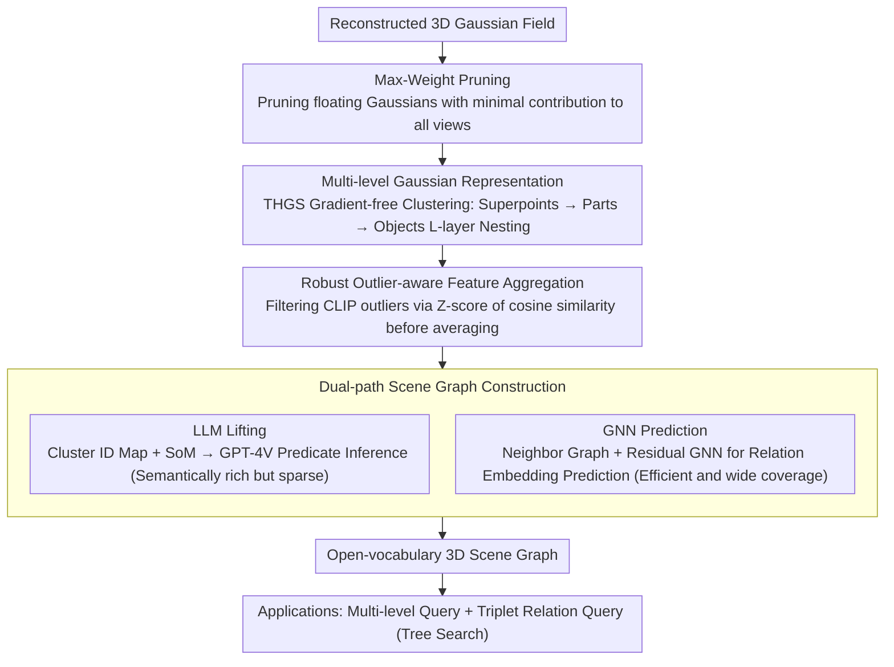

# ReLaGS: Relational Language Gaussian Splatting

**Conference**: CVPR2026  
**arXiv**: [2603.17605](https://arxiv.org/abs/2603.17605)  
**Code**: [Project Homepage](https://dfki-av.github.io/ReLaGS/)  
**Area**: 3D Vision  
**Keywords**: 3D Gaussian Splatting, Open-vocabulary, 3D Scene Graph, Hierarchical Semantics, Relational Reasoning, Training-free

## TL;DR

Ours proposes ReLaGS, the first training-free framework that unifies multi-level language Gaussian fields and open-vocabulary 3D scene graphs. It improves scene representation through Max-Weight Pruning and robust outlier-aware feature aggregation, combined with GNN-based relation prediction to achieve efficient structured 3D scene understanding.

## Background & Motivation

**Background**: Although NeRF and 3DGS excel in geometric and photometric reconstruction, they lack scene semantic information and cannot support high-level reasoning tasks such as navigation, editing, and question answering.

**Limitations of Prior Work in Language Field Distillation**: Existing language field methods (e.g., LangSplat, LERF) only encode "what objects are present" and cannot handle queries involving spatial relations, such as "select the cup next to the laptop," because they are **single-level and isolated**, lacking hierarchical semantics and inter-entity relations.

**Lack of Hierarchical Granularity**: Users may describe an entire object ("Ramen") or its parts ("Noodles"). A single semantic granularity cannot distinguish between part-level and object-level queries, making it difficult to adapt to the ambiguity of natural language.

**Key Challenge in Relation Modeling**: RelationField learns relations through ray pairs but requires hours of per-scene training and renders at less than 10 fps. SplatTalk requires LLM tokenization and LoRA fine-tuning, which is costly.

**Inconsistency of Multi-view Features**: SAM masks exhibit inconsistencies across different views, and CLIP features are noisy. Direct mean aggregation causes object embeddings to be contaminated by outliers.

**Limitations of Scene Graph Methods**: ConceptGraphs relies on expensive LLM inference and outputs text-based graphs; GaussianGraph requires per-scene training; Open3DSG is limited by pre-segmented point clouds. There is a lack of a unified and efficient open-vocabulary 3D scene graph solution.

## Method

### Overall Architecture

ReLaGS aims to provide multi-granularity open-vocabulary semantics and explicitly construct an inter-object relation graph on a reconstructed Gaussian field without per-scene training. The mechanism consists of three steps: first, Max-Weight Pruning purifies the geometry by removing floating Gaussians that contribute minimally to any training view; second, it performs gradient-free hierarchical clustering (based on THGS) following the sequence of "superpoints → sub-parts → parts → objects," combined with robust outlier-aware feature aggregation to obtain reliable language embeddings; finally, an open-vocabulary 3D scene graph is built on this hierarchical representation, where relations are either annotated by an LLM or predicted by a GNN.

### Key Designs

**1. Max-Weight Pruning (MWP): Purifying Geometry by Removing Floating Gaussians**

Floating Gaussians often remain at boundaries and occluded areas, contributing little to any view while disrupting geometry and subsequent clustering. ReLaGS calculates the maximum contribution weight $\omega_i^{\max} = \max_{c,p} w_{i,p}^{(c)}$ for each Gaussian $G_i$ across all views and pixels, pruning those with $\omega_i^{\max} < \tau_{contrib}$. This step, though simple, is the most significant contributor in the ablation study (+6.16 mIoU), as clean geometry forms the foundation for all semantic and relational reasoning.

**2. Hierarchical Gaussian Representation: A Hierarchical Tree for Dual Object-Part Queries**

To handle queries like "Ramen" or "Noodles," ReLaGS utilizes the gradient-free clustering of THGS to build a hierarchical tree. Gaussians are first partitioned into geometrically consistent superpoints using Cut Pursuit, then merged step-by-step based on SAM mask priors to obtain $L$ nested levels $\mathcal{S}^{(1)}, \dots, \mathcal{S}^{(L)}$. Lower levels represent fine-grained parts, while higher levels represent complete objects. Consistent 2D-3D correspondence is established via pixel-to-dominant-Gaussian mapping $G^*_{(u,v)} = \arg\max_i w_i$. During querying, a tree search starts from the root, descending if a child node has higher similarity to the query, thereby automatically determining the appropriate granularity.

**3. Robust Outlier-aware Feature Aggregation (ROFA): Protecting Object Embeddings from Outlier CLIP Features**

While clustering defines which Gaussians form an object, assigning a reliable language embedding is challenging due to SAM mask inconsistencies and noisy CLIP features. ROFA processes CLIP features $\{f_i\}$ of an object across $\mathcal{C}_{obj}$ views by first calculating the mean cosine similarity $s_i$ for each feature relative to others. After Z-score normalization $z_i = (s_i - \mu_s)/\sigma_s$, outlier features with $z_i < -\tau_{lang}$ are filtered, and only the consistent features are averaged. A threshold of $\tau_{lang}=3$ is most stable, showing significant improvements in densely occluded scenes.

**4. Dual-path Scene Graph Construction: LLM-Lifting for Semantics and GNN Prediction for Coverage**

Relations are obtained via two complementary paths. The **LLM Lifting path** renders view-consistent cluster ID maps with SoM markers for GPT-4V to infer relation predicates. The top-$k_p$ frequent predicates are encoded via Jina and averaged as edge embeddings, providing rich but sparse semantics. The **GNN Prediction path** uses a Residual Graph Neural Network to predict relation embeddings $\hat{f}_{ij} = f'_{ij} + \mathcal{F}_\theta(f_v^{src}, f_v^{dst}, f'_{ij})$ on a neighbor graph within a distance threshold. This model is pre-trained via contrastive learning on 3RScan and generalizes to new scenes efficiently.

### Loss & Training

The GNN is pre-trained using a **contrastive learning loss**, aiming to align predicted relation embeddings with ground truth in the Jina embedding space. Besides this, the entire framework requires no per-scene gradient optimization.

## Key Experimental Results

### 3D Scene Graph Prediction (3DSSG/RIO10)

| Method | Object R@5 | Object R@10 | Predicate R@3 | Predicate R@5 | Scene-agnostic |
|------|-----------|------------|--------------|--------------|---------|
| ConceptGraphs | 0.37 | 0.46 | 0.74 | 0.79 | ✗ |
| RelationField | 0.69 | 0.80 | 0.76 | 0.82 | ✗ |
| Open3DSG | 0.56 | 0.61 | 0.58 | 0.65 | ✓ |
| **Ours (GNN)** | **0.68** | **0.79** | **0.79** | **0.87** | **✓** |

- Ours outperforms RelationField by +0.3 R@3 / +0.5 R@5 in relation prediction without per-scene training.
- Ours is **4.7x faster and uses 7.6x less GPU memory** than RelationField (7.5GB vs 32GB).

### Relation-guided 3D Instance Segmentation (ScanNet++)

| Method | mIoU | Scene-agnostic |
|------|------|---------|
| LERF | 0.25 | ✗ |
| OpenNeRF | 0.45 | ✗ |
| LangSplat | 0.49 | ✗ |
| RelationField | 0.53 | ✗ |
| THGS | 0.29 | ✓ |
| **Ours** | **0.56** | **✓** |

### Open-vocabulary Segmentation (LERF-OVS)

| Method | Figurines | Ramen | Teatime | Waldo | Mean | Training-free |
|------|-----------|-------|---------|-------|------|-------|
| LAGA | 64.1 | 55.6 | 70.9 | 65.6 | 64.0 | ✗ |
| THGS | 57.3 | 43.5 | 68.3 | 50.7 | 54.9 | ✓ |
| VALA | 59.9 | 51.5 | 70.2 | 65.1 | 61.7 | ✓ |
| **Ours** | **64.7** | 51.2 | **81.0** | 60.6 | **64.4** | **✓** |

### Ablation Study

| Configuration | Figurines | Ramen | Teatime | Kitchen | Mean |
|------|-----------|-------|---------|---------|------|
| Baseline | 52.05 | 47.19 | 76.77 | 47.50 | 55.88 |
| +MWP | 59.16 | 47.41 | 80.98 | 60.59 | 62.04 |
| +MWP+ROFA (Full) | 64.69 | 51.15 | 80.98 | 60.60 | 64.36 |

### Key Findings

- MWP provides the largest contribution (+6.16 mIoU); removing floating Gaussians is crucial for geometry and downstream clustering.
- ROFA is particularly effective in densely occluded scenes (Figurines +5.53, Ramen +3.74).
- $\tau_{lang}=3$ is the optimal threshold; values too high or too low degrade performance.
- GNN generalizes well across datasets (3RScan → ScanNet++), as the modality gap between language Gaussians and point cloud features is small.
- The full pipeline completes in ~12.6 minutes (11m reconstruction + 1.5m distillation + 0.1m scene graph), with rendering at 200+ fps.

## Highlights & Insights

- **First Unified Framework**: Simultaneously achieves multi-level semantic hierarchies and open-vocabulary relational reasoning, addressing "what," "composition," and "association."
- **Completely Training-free**: 4.7x faster and 7.6x more memory-efficient than RelationField, enabling truly scalable 3D understanding.
- **MWP + ROFA Combination**: Purifies geometry and semantics respectively; simple yet effective with thorough ablation.
- **Dual-path Scene Graph Design**: LLM lifting provides semantically rich edges while GNN prediction provides efficient coverage, offering strong complementarity.
- **Tree Search Query**: Automatically adapts to query granularity, unifying object-level and part-level discovery.

## Limitations & Future Work

- ROFA depends on the Z-score threshold $\tau_{lang}$, which may require tuning for different datasets and might not be robust in extremely sparse-view scenes.
- GNN pre-training is limited to the 27 relation classes in 3RScan; the true generalization of open-vocabulary relations (e.g., rare predicates) is not fully verified.
- Improvements on ScanNet 3D semantic segmentation are limited (MWP was disabled due to evaluation protocols requiring a fixed number of Gaussians).
- The LLM lifting path depends on GPT-4V, which is costly and has limited reproducibility.
- Testing on dynamic scenes or large-scale outdoor scenes is not yet addressed.

## Related Work & Insights

- **Language Field Distillation (Training-based)**: LangSplat, LERF, LangSplatV2 — Incorporate vision-language supervision into the rendering loop, but per-scene training is inefficient.
- **Language Field Distillation (Training-free)**: Occam's LGS (MAP closed-form), Dr.Splat (top-k truncation), VALA (visibility gating), Splat Feature Solver (sparse linear inverse problem), THGS (hierarchical clustering) — These form the foundational framework for this work.
- **3D Scene Graphs**: ConceptGraphs (LLM inference + text graphs), GaussianGraph (per-scene training + implicit relations), RelationField (ray pairs + per-scene optimization) — These methods face issues with efficiency or explicitness.
- **Open-vocabulary Scene Graphs**: Open3DSG (pre-segmented point clouds + Graph Transformer) — A reference for the GNN design in this work.

## Rating

- Novelty: ⭐⭐⭐⭐ — First to unify hierarchical Gaussian representations with explicit scene graphs; MWP/ROFA designs are simple and effective.
- Experimental Thoroughness: ⭐⭐⭐⭐ — Covers four datasets across three task types with complete ablations, though the explanation for limited ScanNet improvement is slightly forced.
- Writing Quality: ⭐⭐⭐⭐ — Clear structure, well-argued motivation, and informative illustrations.
- Value: ⭐⭐⭐⭐ — The combination of training-free, efficiency, and multi-task unification is an important direction for 3DGS semantic understanding.

<!-- RELATED:START -->

## Related Papers

- [\[ICCV 2025\] Online Language Splatting](../../ICCV2025/3d_vision/online_language_splatting.md)
- [\[CVPR 2026\] LangRef3DGS: Natural Language-Guided 3D Referential Segmentation from Partial Observations via 3D Gaussian Splatting](langref3dgs_natural_language-guided_3d_referential_segmentation_from_partial_obs.md)
- [\[CVPR 2026\] Multi-Scale Gaussian-Language Map for Zero-shot Embodied Navigation and Reasoning](multi-scale_gaussian-language_map_for_zero-shot_embodied_navigation_and_reasonin.md)
- [\[CVPR 2026\] OnlinePG: Online Open-Vocabulary Panoptic Mapping with 3D Gaussian Splatting](onlinepg_online_open-vocabulary_panoptic_mapping_with_3d_gaussian_splatting.md)
- [\[CVPR 2026\] SR3R: Rethinking Super-Resolution 3D Reconstruction With Feed-Forward Gaussian Splatting](sr3r_rethinking_super-resolution_3d_reconstruction_with_feed-forward_gaussian_sp.md)

<!-- RELATED:END -->
