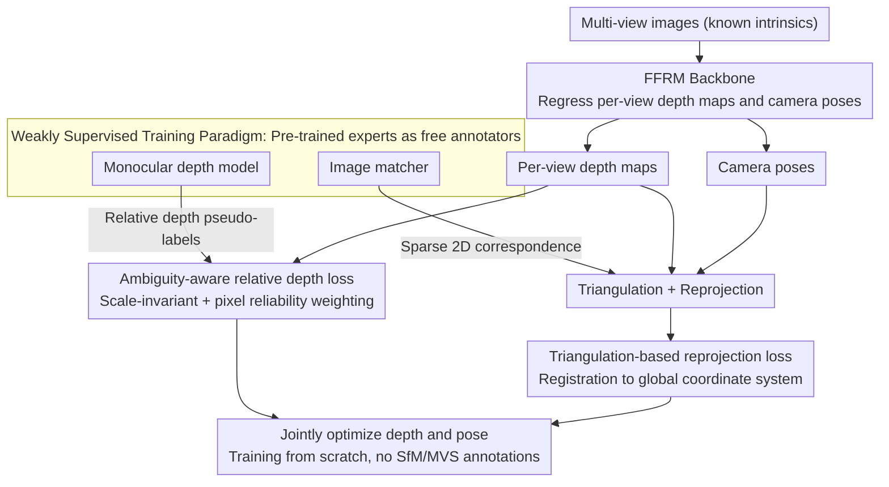

# Reliev3R: Relieving Feed-forward 3D Reconstruction from Multi-View Geometric Annotations

**Conference**: CVPR 2026  
**arXiv**: [2604.00548](https://arxiv.org/abs/2604.00548)  
**Code**: None  
**Area**: 3D Vision  
**Keywords**: Feed-forward 3D Reconstruction, Weak Supervision, Monocular Depth, Sparse Correspondence, SfM-free Training

## TL;DR

Reliev3R proposes the first weakly supervised paradigm to train feed-forward 3D reconstruction models (FFRM) from scratch without multi-view geometric annotations (e.g., point clouds and poses from SfM/MVS), utilizing monocular relative depth and sparse image correspondences as alternative supervision. It achieves performance comparable to or exceeding some fully supervised FFRMs.

## Background & Motivation

Feed-forward 3D reconstruction models (e.g., DUSt3R, MASt3R) map 2D images to 3D content in an end-to-end manner but rely heavily on multi-view geometric annotations generated by SfM/MVS pipelines. These annotations are computationally expensive, fragile in textureless scenes, and difficult to scale.

**Key Observation**: Multi-view geometric annotations are not essential for reconstruction—raw multi-view inputs already contain all geometric cues (depth-appearance relationships, multi-view correspondences, pose-induced reprojection structures). Training an FFRM with SfM annotations is equivalent to "embedding" the traditional reconstruction pipeline into a Transformer.

**Core Problem**: Can geometric principles be learned directly from multi-view inputs without relying on heavy geometric annotations?

## Method

### Overall Architecture

Reliev3R addresses the data bottleneck where FFRM training is inseparable from SfM/MVS annotations. Previously, traditional reconstruction pipelines were required to compute dense point clouds and precise poses for each scene to supervise the network. This approach replaces expensive annotations with two types of nearly free weakly supervised signals. The backbone remains a standard FFRM—taking a set of multi-view images and regressing depth maps and camera poses per-view. The change lies in the supervision: one branch uses relative depth pseudo-labels from a pre-trained monocular depth model to constrain the "shape" of each image's depth; the other uses sparse 2D correspondence points from an off-the-shelf image matcher to align depth and poses of different views into a global coordinate system via triangulation. These two signals, local and global, complement each other, allowing the model to be trained from scratch on image sets entirely lacking 3D geometric annotations.

### Key Designs

**1. Ambiguity-aware relative depth loss: Constraints per-view shapes without being misled by sky or reflections**

Monocular depth provides a relative "how far" prior for each pixel, but it has two issues: lack of absolute scale consistency across views and unreliability in regions like sky or specular reflections. Reliev3R adopts a scale-invariant depth loss, constraining only the ordering and shape of predicted depth rather than absolute scale, thus tolerating scale drift in monocular pseudo-labels between views. The "ambiguity-aware" key involves a reliability weight for each pixel, automatically down-weighting contributions from untrustworthy regions like sky or reflections to prevent incorrect pseudo-labels from biasing optimization. Thus, monocular depth contributes only where it is proficient (dense, local relative structures).

**2. Triangulation-based reprojection loss: Bridging local depth with cross-view global consistency**

With only monocular depth, while individual image shapes are correct, they lack alignment—missing global geometric consistency. This component uses an off-the-shelf matcher to find sparse 2D correspondences between image pairs as geometric anchors. It performs triangulation on these matched points using predicted depth maps and camera poses, then projects them back to each view to minimize reprojection error. Since reprojection depends on both depth and pose, this loss jointly optimizes both, effectively forcing per-view depth predictions to register into a unified global 3D coordinate system. This establishes a clear division of labor: the relative depth loss handles "intra-view correctness," while the reprojection loss handles "inter-view alignment."

**3. Weakly supervised training paradigm: Pseudo-labels generated zero-shot by pre-trained experts, discarding SfM**

Tracing the supervision sources reveals no requirement for scene-specific 3D ground truth: relative depth comes from off-the-shelf monocular models, and sparse correspondences from off-the-shelf matchers. Both are obtained by running zero-shot on input images, treating pre-trained expert models as free annotators. The only remaining external assumption is known camera intrinsics—which is accessible in most practical acquisitions. This paradigm expands the training data boundary from "scenes with SfM labels" to "any set of unlabeled multi-view images," removing the annotation pipeline bottleneck for FFRM scaling.

### Loss & Training

The total loss is the sum of the ambiguity-aware scale-invariant depth loss and the triangulation-based reprojection loss, jointly supervising depth and pose. The model is trained from scratch without loading pre-trained weights from any fully supervised FFRMs. Specific hyperparameters for loss weighting follow the original text.

> ⚠️ Specific weighting and training details for the above losses are subject to the original paper.

## Key Experimental Results

### Main Results

| Method | Supervision | Depth Accuracy | Pose Accuracy | Note |
|------|------|---------|---------|------|
| MVDUSt3R | Full | Medium | Medium | Early FFRM |
| FLARE | Full | Medium | Medium | Recent FFRM |
| AnyCam | Weak (Pose) | — | Medium | Focuses on pose |
| **Reliev3R** | **Weak** | **Equal/Exceed** | **Exceeds AnyCam** | No geometric labels |

Performance equates to or exceeds some fully supervised methods using significantly less annotated data.

### Ablation Study

| Configuration | Depth Accuracy | Pose Accuracy | Description |
|------|---------|---------|------|
| Relative depth loss only | Medium (Local good) | Poor | Lacks global consistency |
| Reprojection loss only | Poor | Medium | Lacks depth shape constraint |
| Both combined | Optimal | Optimal | Significant complementary effect |
| No ambiguity awareness | Decrease | — | Noise introduced in sky areas |

### Key Findings

- The two supervision signals are highly complementary: relative depth constrains local shapes, while reprojection constrains global alignment.
- The ambiguity-aware mechanism is crucial—without it, incorrect depth estimates in sky/reflection regions disrupt optimization.
- Significantly exceeds AnyCam (also weakly supervised) in pose estimation, indicating that joint optimization of depth and pose is more effective than independent estimation.

## Highlights & Insights

- **Lowering the data barrier for 3D learning**: Transitioning from "requiring SfM labels" to "only images + pre-trained models" significantly reduces training data construction costs.
- **Pre-trained models as free annotators**: Pseudo-labels from monocular depth models and matchers are sufficient to replace expensive SfM pipelines.
- **Towards scalable 3D foundation models**: Eliminating geometric annotation bottlenecks allows FFRMs to be trained on multi-view data of any scale.

## Limitations & Future Work

- Still assumes known camera intrinsics; though usually accessible, it limits "zero-hypothesis" learning.
- Pseudo-label quality is bounded by pre-trained models—potential unreliability in severe out-of-distribution scenes.
- Current performance is slightly below the latest fully supervised FFRMs (e.g., VGGT, Fast3R), though the gap is narrowing.
- Future work could explore completely self-supervised training paradigms (without intrinsics).

## Related Work & Insights

- **vs DUSt3R/MASt3R/VGGT**: These fully supervised FFRMs are stronger but rely on SfM labels; Reliev3R removes this dependency.
- **vs AnyCam**: Both are weakly supervised, but AnyCam only estimates pose, while Reliev3R estimates both depth and pose.
- **vs MonoDepth**: Monocular depth methods lack multi-view consistency; Reliev3R uses it as a component rather than the final solution.

## Rating

- Novelty: ⭐⭐⭐⭐⭐ First method to train FFRM from scratch without multi-view geometric annotations; paradigm innovation.
- Experimental Thoroughness: ⭐⭐⭐⭐ Comprehensive cross-dataset comparisons.
- Writing Quality: ⭐⭐⭐⭐ Clear motivation, complete technical details.
- Value: ⭐⭐⭐⭐⭐ Significantly drives scalable 3D reconstruction.

<!-- RELATED:START -->

## Related Papers

- [\[CVPR 2026\] Cross-View Splatter: Feed-Forward View Synthesis with Georeferenced Images](cross-view_splatter_feed-forward_view_synthesis_with_georeferenced_images.md)
- [\[CVPR 2026\] AnchorSplat: Feed-Forward 3D Gaussian Splatting with 3D Geometric Priors](anchorsplat_feed-forward_3d_gaussian_splatting_with_3d_geometric_priors.md)
- [\[CVPR 2026\] AMB3R: Accurate Feed-forward Metric-scale 3D Reconstruction with Backend](amb3r_accurate_feed-forward_metric-scale_3d_reconstruction_with_backend.md)
- [\[CVPR 2026\] EcoSplat: Efficiency-controllable Feed-forward 3D Gaussian Splatting from Multi-view Images](ecosplat_efficiency-controllable_feed-forward_3d_gaussian_splatting_from_multi-v.md)
- [\[CVPR 2026\] PanoVGGT: Feed-Forward 3D Reconstruction from Panoramic Imagery](panovggt_feed-forward_3d_reconstruction_from_panoramic_imagery.md)

<!-- RELATED:END -->
