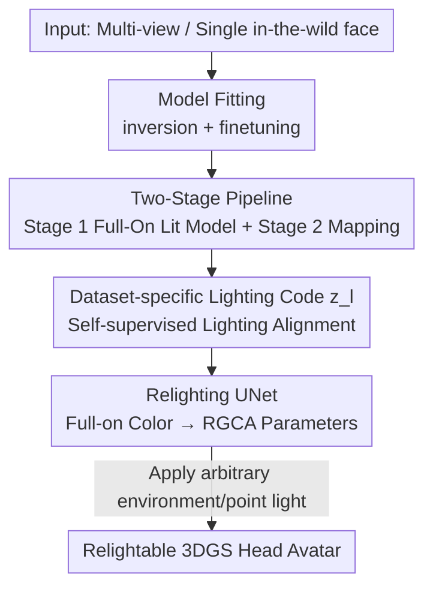

# RelightAnyone: A Generalized Relightable 3D Gaussian Head Model

**Conference**: CVPR 2026  
**Paper**: [CVF Open Access](https://openaccess.thecvf.com/content/CVPR2026/html/Xu_RelightAnyone_A_Generalized_Relightable_3D_Gaussian_Head_Model_CVPR_2026_paper.html)  
**Code**: To be confirmed  
**Area**: 3D Vision  
**Keywords**: 3D Gaussian Splatting, head avatar, relightable, OLAT, self-supervised lighting alignment

## TL;DR
RelightAnyone proposes a "two-stage" relightable 3D Gaussian head model: it first learns a cross-identity, full-on lit 3DGS avatar from large-scale, easily accessible "flat-lit multi-view facial data", and then trains a mapping network with a small amount of expensive OLAT data to translate the full-on lit Gaussian parameters into relightable RGCA physical reflectance parameters. This eliminates the need to acquire OLAT data for every new subject, enabling reconstruction and arbitrary relighting even from a single in-the-wild photo.

## Background & Motivation
**Background**: 3D Gaussian Splatting (3DGS) has become the standard practice for reconstructing photorealistic head avatars, offering efficient reconstruction from multi-view images and real-time novel view rendering. To allow these avatars to be "relit" in arbitrary virtual environments, leading high-quality solutions (e.g., Relightable Gaussian Codec Avatars, RGCA) rely on OLAT (one-light-at-a-time, time-multiplexing of point lights) acquisition—capturing faces in a light stage under hundreds of point lights one-by-one to disentangle the appearance into physical relightable parameters such as albedo, diffuse/specular reflectance.

**Limitations of Prior Work**: Methods like RGCA are **person-specific**—requiring a fresh collection of OLAT data in a light stage and retraining a model for every new individual, which is both labor-intensive and computationally expensive. Subsequent work URAvatar attempts "generalized relighting", but relies on a **massive OLAT collection across diverse identities** to train priors, and building such a large-scale OLAT dataset is extremely costly and time-consuming. URAvatar also requires unwrapped albedo textures as an identity condition, which cannot be obtained from a single in-the-wild image, and unwrapping is prone to failure.

**Key Challenge**: High-quality relighting requires OLAT data, which is scarce and expensive, whereas identity generalization requires a large variety of identities—identities that are abundant in **flat-lit fixed-lighting datasets** (e.g., Ava-256, Nersemble). The data required for these two objectives do not align directly.

**Goal**: (1) Relight arbitrary subjects without subject-specific OLAT data; (2) Train unified models across multiple existing datasets with diverse camera/lighting setups to ensure identity generalization; (3) Support reconstructing a relightable avatar from a single in-the-wild photo.

**Key Insight**: The authors observe that "identity diversity" and "relighting capability" can be **disentangled into two data sources**: learning identity priors from massive flat-lit data, and learning the relighting mapping from a small amount of publicly available OLAT data.

**Core Idea**: Learn a **mapping** from "flat-lit 3DGS avatars" to the "corresponding RGCA relightable Gaussian parameters", splitting "identity generalization" and "physical relighting" into a two-stage pipeline for separate training.

## Method

### Overall Architecture
The goal of RelightAnyone is to take multi-view or single-view images of a person and output a relightable 3DGS head avatar that can be rendered under arbitrary environmental lighting. The key is not an end-to-end network, but splitting the problem into two stages, allowing each stage to leverage the most appropriate data.

**Stage 1 (Multi-Identity Full-On Lit Model)**: Given a learnable identity code $z_{id}\in\mathbb{R}^{256}$ and a low-dimensional, dataset-specific lighting code $z_l\in\mathbb{R}^4$, a **full-on lighting** 3DGS avatar is predicted: the mesh decoder $\mathcal{D}_{mesh}$ (MLP) outputs coarse mesh vertices, and the geometry decoder $\mathcal{D}_g$ and color decoder $\mathcal{D}_c$ (both 2D CNNs decoding Gaussian parameters on the shared UV texture map of the coarse template mesh) output the geometry and full-on lit color $c_k^f$ of each Gaussian. Stage 1 is trained on **multiple flat-lit datasets** to guarantee generalization to novel identities.

**Stage 2 (Relighting Network)**: Stage 2 is a UNet that translates the full-on lit Gaussian color textures $c_k^f$ output by Stage 1 into RGCA's relightable parameters $\{\rho_k,d_k,\sigma_k,v_k,n_k\}$ (albedo, diffuse radiative transfer, specular roughness, visibility, and normal). It **only needs to be trained on a much smaller OLAT dataset**, as the identity diversity is already covered by the Stage 1 prior.

After chaining the two stages together, **fitting** (inversion + finetuning) can be performed on unseen subjects to reconstruct an arbitrarily relightable avatar from single or multi-view images. The overall pipeline is shown below:

### Key Designs

**1. Two-Stage Pipeline: Disentangling Identity Generalization and Physical Relighting into Two Data Sources**

This is the core of the paper, directly addressing the key challenge of "expensive OLAT vs. identity diversity in flat-lit data". If trained in a single stage to predict relightable parameters directly (like RGCA/URAvatar), the model **can only be trained on OLAT data** (as shown by the single-stage baseline in Table 1), severely limiting identity diversity by the scale of the OLAT dataset. RelightAnyone's approach first trains Stage 1: learning a cross-identity full-on lit 3DGS model across a stack of flat-lit datasets (Ava-256, SDFM, Nersemble, totaling hundreds of identities), where Gaussian parameters are encoded in $1024\times1024$ UV textures, and positions are given by $t_k=\hat{t}_k+\delta t_k$ (barycentric interpolation base points + offsets). Stage 2 is then trained separately: learning the "full-on lit to relightable" mapping on a small-scale OLAT dataset (3DPR, 116 training identities). The two stages are **trained sequentially rather than end-to-end**, enabling the network to utilize both flat-lit and OLAT datasets simultaneously while **preserving the identity prior learned by Stage 1** from being contaminated by the small dataset during Stage 2 training. Table 1 shows that compared to the single-stage baseline, the two-stage pipeline lifts the PSNR from 25.49 to 30.06, with prominent advantages especially in hard shadow regions.

**2. Dataset-specific Lighting Code $z_l$: Self-Supervised Alignment of Datasets into a Unified Neutral Color Space**

A risk of cross-dataset training is that each flat-lit dataset has different camera parameters and exact distributions of "flat lighting" (some are 360° ring lit, some have only front flash, and some have background reflections). Training directly on mixed datasets makes it hard to learn a unified neutral color space. The authors introduce a 4-dimensional, **dataset-specific** learnable lighting code $z_l$, which is concatenated with the identity code and fed into the color decoder $\mathcal{D}_c$ (i.e., $\{c_k^f\}=\mathcal{D}_c(z_{id},z_l)$). This allows the network to **disentangle** "dataset-level lighting variations" from the "neutral appearance of the subject". This is self-supervised—without lighting annotations, $z_l$ is driven solely by reconstruction objectives to absorb systematic lighting biases across different datasets, resulting in a cleaner, more structured identity latent space (Fig. 7). This also yields a key capability: **lighting transfer across datasets by changing $z_l$**. Since Stage 2 is trained under the specific full-on condition of one dataset (D1/3DPR), relighting subjects from other datasets requires "aligning" their full-on colors to D1's full-on condition first. This is achieved by simply substituting their $z_l$ with D1's $z_l$. Ablation studies show that removing $z_l$ leads to blotchy artifacts in cross-dataset relighting.

**3. Relighting UNet: View-Independent/View-Dependent Dual Branches + Positional Conditioning + Albedo Regularization**

The Stage 2 UNet uses a shared encoder $\mathcal{E}$ with skip connections, splitting into two decoder branches: the view-independent branch $\mathcal{D}_{ci}$ outputting $\{\rho_k,d_k,\sigma_k\}$ (albedo, diffuse SH coefficients, roughness) and the view-dependent branch $\mathcal{D}_{cv}$ outputting $\{v_k,\delta n_k\}$ (visibility, normal residuals), where the viewing direction $\omega_o$ is concatenated to each pixel at the bottleneck layer. A key detail is that the encoder's input **concatenates the 3D Gaussian position $t_k$** (adding 3 extra channels) along with the full-on lit color $c_k^f$. This is because even if two subjects share the same color under full-on lit conditions, their different geometries will result in different self-shadowing under a single point light; thus, the network must see the geometry to learn shape-dependent shading. Another challenge is the albedo: in RGCA, the albedo is jointly optimized per-subject, but a generalized scenario requires direct prediction of albedo for **unseen subjects**. Unconstrained predictions by the network tend to yield meaningless albedo/shading decompositions. The authors add two regularizations: $\mathcal{L}_\rho$ (L2 norm pulling predicted albedo towards the mean full-on texture) and a monochromatic constraint $\mathcal{L}_{mono}=\frac{1}{3}\sum_{i\in\{r,g,b\}}(d_{ki}-\frac{d_{kr}+d_{kg}+d_{kb}}{3})^2$ to encourage diffuse SH coefficients to be monochromatic, preventing colors from being erroneously baked into the radiative transfer terms. Normals are obtained via $n_k=(\hat{n}_k+\delta n_k)/\|\hat{n}_k+\delta n_k\|$, and after decoding these parameters, colors under arbitrary lighting can be computed using RGCA's diffuse and specular formulas.

**4. Model Fitting: Inversion + Finetuning, Applicable to Unseen Subjects from a Single Image**

Once trained, adapting the model to unseen subjects involves a two-step optimization. During fitting, the **entire Stage1 + Stage2 pipeline is always run**, while fixing $z_l$ to the one corresponding to the OLAT dataset (D1) used for Stage 2 training. The final image is rendered from Stage 2's relightable Gaussians (rather than Stage 1's neutral full-on Gaussians)—this is crucial because the scene lighting is unknown and must be estimated jointly as an optimized variable. The **inversion** step freezes the network and optimizes the identity code $z_{id}$ (initialized to the average of trained subject codes) and the scene lighting (parameterized as the RGB intensities of a fixed set of point lights from training), with the loss $\mathcal{L}_{fit}^1=\lambda_{l1}\mathcal{L}_{l1}+\lambda_{ssim}\mathcal{L}_{ssim}+\lambda_{geo}\mathcal{L}_{geo}+\lambda_{id}\|z_{id}\|^2$. The **finetuning** step further fine-tunes Stage 1 network weights to recover facial details while **freezing Stage 2** to preserve the relighting prior, utilizing a locality regularization $\mathcal{L}_{lr}$ to prevent overfitting: $\mathcal{L}_{fit}^2=\mathcal{L}_{fit}^1+\lambda_{lr}\mathcal{L}_{lr}$. Consequently, the model can reconstruct an arbitrarily relightable 3DGS head avatar from minimal inputs, even a single in-the-wild portrait.

### Loss & Training
Stage 1 loss: $\mathcal{L}_{Stage1}=\lambda_{l1}\mathcal{L}_{l1}+\lambda_{ssim}\mathcal{L}_{ssim}+\lambda_{geo}\mathcal{L}_{geo}+\lambda_s\mathcal{L}_s+\lambda_t\mathcal{L}_t$, where $\mathcal{L}_s$ is the Gaussian scale regularization, and $\mathcal{L}_t$ constrains the positional offset $\delta t_k$ to be small. Stage 2 loss: $\mathcal{L}_{Stage2}=\lambda_{l1}\mathcal{L}_{l1}+\lambda_{ssim}\mathcal{L}_{ssim}+\lambda_{c\_}\mathcal{L}_{c\_}+\lambda_n\mathcal{L}_n+\lambda_\rho\mathcal{L}_\rho+\lambda_{mono}\mathcal{L}_{mono}$, where $\mathcal{L}_{c\_}$ penalizes negative colors that SH might produce in the diffuse term, and $\mathcal{L}_n$ is the L2 regularization of the normal residuals. For the uncalibrated Ava-256 (D2) dataset, a warmup of 2000 iterations (without $z_l$) is performed to optimize a $3\times3$ color matrix for color calibration, after which $z_l$ is enabled for training.

## Key Experimental Results

### Main Results
Comparison of environment map relighting with 3D GAN-based generalized relighting methods on testing subjects from D1 (3DPR) (baseline numbers are directly reproduced from the 3DPR paper; relighting is unified using a low-resolution $10\times20$ environment map, with GT generated by image-based relighting):

| Method | PSNR ↑ | RMSE ↓ | SSIM ↑ | LPIPS ↓ |
|------|--------|--------|--------|---------|
| NFL [25] | 16.97 | 0.2926 | 0.77 | 0.2385 |
| Lite2Relight [59] | 16.72 | 0.2619 | 0.79 | 0.2506 |
| 3DPR [60] | 21.02 | 0.1801 | 0.83 | 0.1996 |
| Ours (Single Image) | 26.57 | 0.0996 | 0.86 | 0.1671 |
| Ours (Multi-view) | **29.07** | **0.0746** | **0.91** | **0.1649** |

Even with only a single input image, the proposed model achieves a PSNR of 26.57, significantly outperforming the Prior SOTA 3DPR (21.02); multi-view inputs further boost the performance to 29.07. The authors also point out two common drawbacks of 3D GAN-based methods: deformed heads in non-frontal poses (since they are trained on 2D portrait datasets without enforcing multi-view consistency) and the inability to fit multi-view inputs. Comparisons with 2D diffusion methods (IC-Light, DiffusionRenderer) are qualitative: IC-Light fails to capture the dominant light source, lacks consistency across frames, and renders skin with a metallic look; DiffusionRenderer estimates overly diffuse skin materials with unrealistic shadows, and both are essentially 2D methods incapable of novel-view synthesis.

### Ablation Study
Two-stage vs. Single-stage (on D1 testing subjects; the single-stage baseline replaces $\mathcal{D}_c$ with two decoders directly outputting relightable parameters, allowing training on OLAT data only):

| Configuration | PSNR ↑ | RMSE ↓ | SSIM ↑ | LPIPS ↓ |
|------|--------|--------|--------|---------|
| Single-Stage | 25.49 | 0.1092 | 0.76 | 0.2732 |
| Two-Stage (Ours) | **30.06** | **0.0655** | **0.87** | **0.2358** |

The ablation of the lighting code $z_l$ is qualitative (as D2/D3/D4 subjects lack relighting GT, yielding only qualitative point-light results): removing $z_l$ causes dataset lighting variations to entangle with subject appearance, leading to blotchy artifacts in cross-dataset relighting; with $z_l$, swapping codes to align with D1 yields smooth and realistic results (Fig. 7).

### Key Findings
- **The two-stage design makes the largest contribution**: removing it and reverting to a single-stage drops the PSNR by 4.57 (30.06 $\rightarrow$ 25.49), and the single-stage model clearly degrades in hard shadow regions; furthermore, when scene lighting is unknown and requires optimization, the single-stage model almost completely loses its relighting prior, yielding severe artifacts.
- **Dataset-specific lighting codes are a prerequisite for unified cross-dataset training**: without $z_l$, heterogeneous flat-lit datasets cannot be aligned to the full-on lighting condition of the OLAT dataset, resulting in blotchy relighting artifacts.
- **The data strategy is effective**: using only 1 small OLAT dataset (116 training identities) + 3 flat-lit datasets (hundreds of identities) successfully generalizes relighting to arbitrary subjects, validating the feasibility of "disentangling identity generalization and physical relighting into two data sources".

## Highlights & Insights
- **Formulating the "data scarcity" problem as a "mapping learning" problem**: The core insight is that high-quality relighting is not hindered by a lack of identity diversity, but rather a lack of OLAT annotations. Thus, learning a "full-on to relightable" mapping enables large-scale, easily obtainable flat-lit data to "borrow" the relighting capabilities of a small OLAT dataset. This disentanglement strategy can be transferred to any reconstruction task where "expensive annotations + cheap unannotated data" coexist.
- **Treating the dataset-specific lighting code as an "interchangeable lighting plug"**: Utilizing a 4D code to absorb systemic lighting variations of each dataset allows the model to align samples from different datasets to the target full-on condition at inference time by simply swapping codes. This serves as both a self-supervised alignment mechanism and a shortcut to cross-dataset lighting transfer, making the design highly efficient.
- **Rendering with Stage 2 outputs instead of Stage 1 neutral Gaussians during fitting**, which is crucial for enabling single-image in-the-wild fitting, as the scene lighting is unknown and must be optimized jointly.
- **The monochromatic albedo regularization $\mathcal{L}_{mono}$ is a reusable trick**: in generalized (rather than subject-specific) scenarios, constraining the diffuse SH with a monochromatic prior prevents colors from being erroneously baked into the radiative transfer terms, which would otherwise distort the albedo/shading decomposition.

## Limitations & Future Work
- **Hair remains a weakness**: The authors acknowledge that hair reconstruction and relighting are suboptimal, primarily due to unstable hair geometry tracking, making it difficult to establish reliable UV correspondences on hair strands. Future work could model hair and the face separately, similar to related works.
- **Only trained on neutral expressions**: The current model only covers neutral expressions. Extending it to dynamic expressions and capturing expression-dependent appearances requires larger datasets containing both OLAT and full-on multi-expression data.
- **Dependency on face trackers and a unified topology**: All datasets are aligned to a unified topology/canonical space using the VHAP tracker. Tracking errors (especially on hair) directly propagate to reconstruction quality.
- **The relighting network is trained only under a single full-on lit condition**: All cross-dataset subjects must first be aligned to D1's full-on lit condition via $z_l$. This essentially anchors the relighting capability to a single OLAT dataset (3DPR). Whether its coverage of reflectance diversity is sufficient to generalize to highly diverse skin types/materials is not fully quantified in the paper (⚠️ subject to the original text).

## Related Work & Insights
- **vs. RGCA [64]**: RGCA uses learnable radiative transfer to make 3D Gaussians relightable with extremely high quality but is person-specific, requiring OLAT capture + retraining for every new individual. This paper reuses RGCA's relightable parameterization but generalizes it to arbitrary subjects via a two-stage approach, and replaces RGCA's per-subject-optimized albedo with network predictions + regularization.
- **vs. URAvatar [35]**: URAvatar also generalizes RGCA but requires large-scale multi-view OLAT capture for each subject during training and uses unwrapped albedo textures as conditions (which are hard to obtain from a single image). The proposed two-stage approach bypasses the OLAT capture bottleneck by leveraging common flat-lit datasets + a small OLAT dataset, and does not require albedo texture conditions.
- **vs. 3D GAN-based methods (NFL [25] / Lite2Relight [59] / 3DPR [60])**: These methods use 3D-aware GANs like EG3D as priors but are mostly trained on 2D portrait datasets, leading to incomplete 3D geometry, missing textures on the back of the head, distortions in non-frontal poses, and an inability to fit multi-view inputs. This paper learns from multi-view data, ensuring geometric consistency, handling both single-view and multi-view inputs, and yielding significantly superior quantitative results.
- **vs. 2D diffusion-based methods (IC-Light [89] / DiffusionRenderer [36])**: Pure 2D methods cannot generate novel views; IC-Light lacks HDRI-level fine-grained light control and fails to capture the dominant light source; DiffusionRenderer predicts overly diffuse skin materials. This paper provides 3D-consistent, physical relighting that supports arbitrary environment maps.

## Rating
- Novelty: ⭐⭐⭐⭐⭐ Formulating the "OLAT data scarcity" as a "full-on to relightable mapping learning" problem, and using dataset-specific lighting codes for self-supervised alignment of heterogeneous datasets, offers a clear and practical strategy.
- Experimental Thoroughness: ⭐⭐⭐⭐ Main comparisons + key ablations are comprehensive with self-consistent figures. However, the evaluation on $z_l$ and cross-dataset subjects is mostly qualitative (lacking GT), and dimensions like expressions/hair are not covered.
- Writing Quality: ⭐⭐⭐⭐⭐ The logic from motivation to challenges to solution flows smoothly. The pipeline and formulas are well-explained, and limitations are honestly discussed.
- Value: ⭐⭐⭐⭐⭐ Reconstructing a relightable head avatar from a single image and "upgrading" flat-lit datasets to synthetic OLAT has significant practical value for digital human production pipelines.

<!-- RELATED:START -->

## Related Papers

- [\[ICLR 2026\] FastGHA: Generalized Few-Shot 3D Gaussian Head Avatars with Real-Time Animation](../../ICLR2026/3d_vision/fastgha_generalized_few-shot_3d_gaussian_head_avatars_with_real-time_animation.md)
- [\[CVPR 2026\] PercHead: Perceptual Head Model for Single-Image 3D Head Reconstruction & Editing](perchead_perceptual_head_model_for_single-image_3d_head_reconstruction_editing.md)
- [\[CVPR 2026\] PhysHead: Simulation-Ready Gaussian Head Avatars](physhead_simulation-ready_gaussian_head_avatars.md)
- [\[CVPR 2026\] EmoDiffTalk: Emotion-aware Diffusion for Editable 3D Gaussian Talking Head](emodifftalk_emotion-aware_diffusion_for_editable_3d_gaussian_talking_head.md)
- [\[CVPR 2025\] HRAvatar: High-Quality and Relightable Gaussian Head Avatar](../../CVPR2025/3d_vision/hravatar_high-quality_and_relightable_gaussian_head_avatar.md)

<!-- RELATED:END -->
