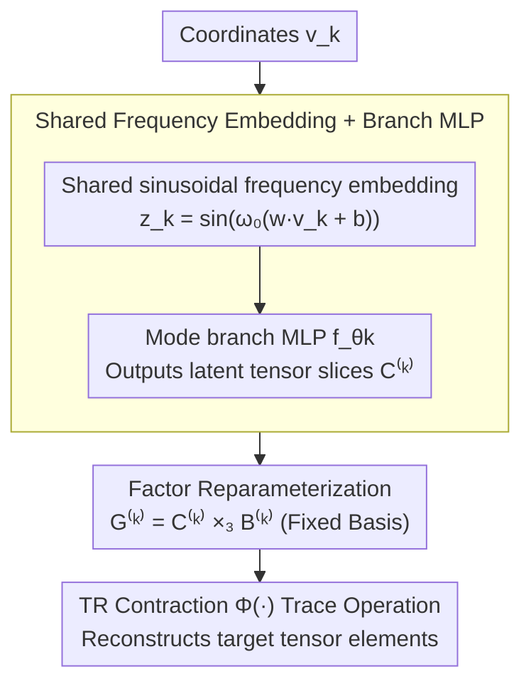

# Reparameterized Tensor Ring Functional Decomposition for Multi-Dimensional Data Recovery

**Conference**: CVPR2026  
**arXiv**: [2603.01034](https://arxiv.org/abs/2603.01034)  
**Code**: [YangyangXu2002/RepTRFD](https://github.com/YangyangXu2002/RepTRFD)  
**Area**: 3D Vision / Low-level Vision / Tensor Decomposition  
**Keywords**: Tensor Ring Decomposition, Implicit Neural Representation, Reparameterization, Image Inpainting, Point Cloud Recovery, Frequency Analysis

## TL;DR

Ours proposes RepTRFD: a method that addresses the spectral bias issue of INR-parameterized Tensor Ring (TR) factors by reparameterizing them into a "learnable latent tensor $\times$ fixed basis" form, consistently outperforming SOTA in tasks like image inpainting, denoising, super-resolution, and point cloud recovery.

## Background & Motivation

**Background**: Low-rank tensor decompositions such as CP, Tucker, TT, and TR provide compact representations for multi-dimensional data (images, video, remote sensing, medical imaging). TR decomposition is particularly efficient for high-order tensor modeling due to its ring structure.

**Limitations of Prior Work**: Traditional TR decomposition is inherently discrete, defined only on fixed grids, making it unable to handle continuous signals or resolution-independent modeling (e.g., sparse point clouds).

**Goal**: While existing works extend Tucker, CP, and TT decompositions to the continuous domain (e.g., LRTFR, DRO-TFF), a continuous extension for TR decomposition remains missing.

**Key Challenge**: Directly using INR to parameterize TR factors leads to poor reconstruction as results are dominated by low-frequency components, causing a severe loss of high-frequency details.

**Key Insight**: Frequency analysis reveals that the spectral characteristics of TR factors are directly transmitted to the reconstructed tensor. If the factors lack high-frequency components, the reconstruction will also lack high-frequency details in the corresponding dimensions.

**Secondary Limitation**: Standard INRs (e.g., SIREN) possess an inherent spectral bias toward learning low-frequency components, making it difficult to capture the high-frequency content required in TR factors.

## Method

### Overall Architecture

The core problem is that traditional TR decomposition is limited to discrete grids, while direct INR parameterization of TR factors suffers from low-frequency dominance. RepTRFD uses INR to "generate" TR factors but inserts a reparameterization layer between the network and the factors. The network outputs a learnable latent tensor, which is then multiplied by a fixed basis to form the actual factors used for TR contraction.

The pipeline operates as follows: coordinates $v_k$ pass through a shared sinusoidal frequency embedding layer $\mathbf{z}_k = \sin(\omega_0(\mathbf{w}v_k + \mathbf{b}))$. Each mode has a branch MLP $f_{\theta_k}$ that maps the embedding to latent tensor slices $\mathcal{C}^{(k)}_{:v_k:} \in \mathbb{R}^{r_k \times R_{k+1}}$ (where $R_{k+1} = \beta r_{k+1}$ and $\beta \geq 1$ is the expansion factor). The latent tensor is contracted with a fixed basis $\mathbf{B}^{(k)}$ via $\mathcal{G}^{(k)} = \mathcal{C}^{(k)} \times_3 \mathbf{B}^{(k)}$ to produce the actual TR factors. Finally, the target tensor elements are reconstructed using the trace operation of the TR contraction operator $\Phi(\cdot)$.

### Key Designs

**1. Shared Frequency Embedding + Branch MLP: Unified coordinate encoding for all modes**

Using independent INRs for each mode can lead to inconsistent frequency responses and overfitting. RepTRFD uses a shared sinusoidal embedding layer $\mathbf{z}_k = \sin(\omega_0(\mathbf{w}v_k + \mathbf{b}))$ across all modes, with individual branch MLPs $f_{\theta_k}$ generating mode-specific latent tensor slices. This shared embedding imposes cross-mode consistency at the parameter level, resulting in more stable training.

**2. Factor Reparameterization: Shifting high-frequency learning to sensitive optimization spaces**

This is the core contribution. RepTRFD decomposes each TR factor into a structure of "learnable latent tensor $\mathcal{C}^{(k)}$ (generated by INR) $\times$ fixed basis $\mathbf{B}^{(k)}$". Theorem 2 proves that there exists a specific basis $\mathbf{B}$ such that the gradient response ratio for high-frequency components in the reparameterized space is higher than in the original parameter space, making the optimization more sensitive to high-frequency details.

The fixed basis values are carefully set. Theorem 3 provides a Xavier-style initialization $\mathbf{B}^{(k)}_{ij} \sim \mathcal{U}(-\sqrt{6/(r_{k+1}+R_{k+1})}, \sqrt{6/(r_{k+1}+R_{k+1})})$ to ensure variance consistency in forward and backward propagation. Theorem 4 proves the global Lipschitz continuity of the RepTRFD mapping, ensuring robustness against input perturbations. Since $\mathbf{B}^{(k)}$ is frozen after initialization, the computational overhead is negligible (~1s).

### Loss & Training

A general framework combining data fidelity and optional regularization is used: $$\min_\phi \mathsf{L}_{\text{data}}(g_\phi; \mathcal{O}) + \mathsf{L}_{\text{reg}}(g_\phi)$$, where data terms and regularization are selected based on the specific task (inpainting, denoising, super-resolution, or point cloud recovery).

## Experimental Results

### Main Results

**Image/Video Inpainting**: Ours outperforms TRLRF, FCTN, HLRTF, LRTFR, DRO-TFF, and NeurTV across color images, multispectral images (MSI), hyperspectral images (HSI), and video.

| Dataset | Method | SR=0.1 PSNR | SR=0.2 PSNR | SR=0.3 PSNR |
|--------|------|-------------|-------------|-------------|
| Color Image (256²×3) | DRO-TFF | 23.22 | 27.52 | 30.04 |
| | NeurTV | 24.16 | 27.81 | 30.28 |
| | **RepTRFD** | **25.70** | **29.37** | **32.01** |
| MSI (256²×31) | DRO-TFF | 38.45 | 42.28 | 45.00 |
| | **RepTRFD** | **39.34** | **44.66** | **47.74** |

**Point Cloud Recovery (SR=0.2, NRMSE↓)**:

| Method | Doll | Duck | Frog | Mario |
|------|------|------|------|-------|
| WIRE | 0.106 | 0.060 | 0.053 | 0.086 |
| FINER | 0.110 | 0.059 | 0.054 | 0.088 |
| **RepTRFD** | **0.093** | **0.053** | **0.050** | **0.080** |

### Ablation Study

1.  **Effect of Reparameterization**: Without vs. with reparameterization at SR=0.2, color image PSNR improved from 27.41 to 30.45 (+3.04 dB), and MSI from 29.41 to 48.67 (+19.26 dB).
2.  **Impact of Expansion Factor $\beta$**: As $\beta$ increased from 1 to 10, PSNR improved with faster convergence, though gains eventually diminished.
3.  **Sensitivity to Basis Initialization**: For HSI Botswana, the optimal PSNR (45.27) was achieved at the theoretically derived scale $a \approx 0.165$.
4.  **Shared Frequency Embedding**: Compared to independent embeddings, shared embeddings provided more stable training and better anti-overfitting properties.
5.  **Complexity**: Under matched parameter counts and FLOPs, RepTRFD consistently outperformed LRTFR.

### Key Findings

*   Gains from reparameterization are particularly significant for high-order data (HSI, Video), where MSI inpainting saw a **19 dB** improvement.
*   Computational overhead is minimal (~1s), as the fixed basis $\mathbf{B}$ requires no gradient updates.
*   In super-resolution tasks, it is 10-30x faster than pure INR methods (SIREN/WIRE/FINER) with ~1 dB higher PSNR.

## Highlights & Insights

1.  **First to extend TR decomposition to the continuous domain**, filling the gap for TR formats in tensor functional representation.
2.  **Novel frequency analysis perspective**: Theoretically reveals the transmission mechanism from TR factor spectra to reconstructed tensor spectra.
3.  **Simple and effective reparameterization**: Introduces a single fixed basis matrix without changing network architecture, significantly boosting high-frequency learning.
4.  **Rigorous theoretical guarantees**: Covers gradient dynamics (Theorem 2), initialization (Theorem 3), and Lipschitz continuity (Theorem 4).
5.  **Unified framework across four tasks**: High versatility across inpainting, denoising, super-resolution, and point cloud recovery.

## Limitations & Future Work

1.  **Manual hyperparameter tuning**: Parameters like TR rank $r_k$, expansion factor $\beta$, and frequency $\omega_0$ require per-task tuning.
2.  **Limited to 3rd-4th order tensors**: While theoretically scalable, experiments did not cover higher-order data like light fields or spatio-spectral-temporal data.
3.  **Lack of comparison with end-to-end deep learning**: Baselines are confined to traditional optimization or INR methods, excluding supervised methods like U-Net or Transformers.
4.  **Scalability in point clouds**: Testing was limited to small-scale SHOT datasets, leaving large-scale LiDAR or ShapeNet scenes unverified.
5.  **Passive fixed basis**: Since $\mathbf{B}^{(k)}$ is frozen, exploring learnable or adaptive bases might further increase expressivity.

## Related Work & Insights

*   **INR series**: SIREN, WIRE, FINER — Ours is complementary via tensor decomposition, offering higher precision and speed.
*   **Tensor Functional Representation**: LRTFR (Tucker), DRO-TFF (Rank-1) — Ours introduces the TR format and solves spectral bias via reparameterization.
*   **Reparameterization**: Weight Normalization, RepVGG, and INR weight decomposition — Ours applies reparameterization at the tensor factor level rather than network weights.

## Rating

*   Novelty: ⭐⭐⭐⭐ — TR functionalization + frequency analysis + factor reparameterization are well-integrated.
*   Experimental Thoroughness: ⭐⭐⭐⭐ — Comprehensive across tasks and data types, though missing deep learning baselines.
*   Writing Quality: ⭐⭐⭐⭐⭐ — Rigorous derivations and clear logic from problem analysis to solution.
*   Value: ⭐⭐⭐⭐ — Provides a new TR format and reparameterization paradigm for tensor functional representation.

<!-- RELATED:START -->

## Related Papers

- [\[CVPR 2026\] QuadSync: Quadrifocal Tensor Synchronization via Tucker Decomposition](quadsync_quadrifocal_tensor_synchronization_via_tucker_decomposition.md)
- [\[CVPR 2026\] Volumetric Functional Maps](volumetric_functional_maps.md)
- [\[CVPR 2026\] Multi-modal Frequency Decomposition Network for Semantic Scene Completion](multi-modal_frequency_decomposition_network_for_semantic_scene_completion.md)
- [\[CVPR 2026\] Learning Convex Decomposition via Feature Fields](learning_convex_decomposition_via_feature_fields.md)
- [\[CVPR 2026\] FunREC: Reconstructing Functional 3D Scenes from Egocentric Interaction Videos](funrec_reconstructing_functional_3d_scenes_from_egocentric_interaction_videos.md)

<!-- RELATED:END -->
