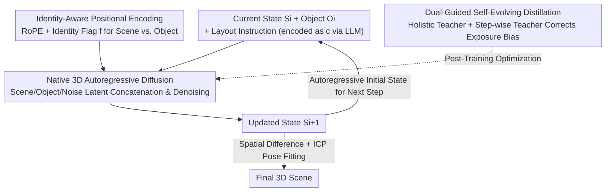

# Repurposing 3D Generative Model for Autoregressive Layout Generation

**Conference**: CVPR 2026  
**Paper**: [CVF Open Access](https://openaccess.thecvf.com/content/CVPR2026/html/Feng_Repurposing_3D_Generative_Model_for_Autoregressive_Layout_Generation_CVPR_2026_paper.html)  
**Code**: https://github.com/fenghora/LaviGen  
**Area**: 3D Vision  
**Keywords**: 3D Layout Generation, Autoregressive Generation, 3D Generative Model Repurposing, Physical Plausibility, Self-Evolving Distillation  

## TL;DR
LaviGen "repurposes" a pretrained native 3D generative model into an autoregressive layout generator, placing objects one-by-one directly in native 3D space. This ensures generated scene layouts are both physically plausible (no collisions, no out-of-bounds, no floating) and semantically coherent, achieving 19% higher physical plausibility and approximately 65% faster inference compared to SOTA.

## Background & Motivation
**Background**: 3D scene layout generation requires placing objects in a semantically reasonable and physically feasible manner (e.g., chairs surrounding a table rather than penetrating a wall). Mainstream approaches fall into two categories: one treats layout as language (e.g., LayoutGPT uses LLMs to output JSON-formatted coordinates), and the other uses visual signals for indirect supervision (e.g., LayoutVLM uses rendered images + differentiable optimization to refine poses).

**Limitations of Prior Work**: Methods treating layout as language perform reasonably in semantics but lack physical modeling, often leading to object collisions, interpenetration, and floating. While LayoutVLM improves out-of-bounds issues using 2D visual supervision, image-level supervision is **computationally expensive** and lacks a "holistic" understanding of complex 3D interactions. Both paradigms operate in **non-native representations** (text/2D), losing critical 3D geometric information.

**Key Challenge**: Layout is essentially a **geometric distribution**—the spatial relationships and semantic dependencies between objects. However, existing methods bypass 3D space and approximate it in text or 2D, forcing a choice between "semantically correct but physically wrong" and "slow refinement."

**Goal**: To learn layouts directly from the geometric distribution of 3D scenes by repurposing powerful native 3D generative models (which possess inherent spatial relationships and geometric priors) for layout generation, completion, and editing.

**Key Insight**: The authors observe that "scene layout is a special type of geometric distribution," and native 3D generative models (such as TRELLIS) have already learned rich spatial priors from large-scale 3D data. By **sequentially placing objects** and producing a new scene state at each step, physically plausible spatial arrangements can be naturally satisfied. Compared to "holistic generation" that injects all object conditions at once (which tends to make the generation process unstable), the autoregressive paradigm offers stronger controllability and naturally supports object addition or deletion.

**Core Idea**: Repurpose 3D generative models + autoregressive object-by-object placement to bring layout generation into native 3D space; then, employ a post-training strategy to address the "exposure bias" inherent in autoregressive generation.

## Method

### Overall Architecture
Given a current scene state $S_i$, a target object $O_i$, and layout instructions, LaviGen encodes them and feeds them into an **adaptive 3D diffusion model**. This model denoises and generates an updated state $S_{i+1}$ in native 3D space after placing $O_i$. $S_{i+1}$ then serves as the initial state for the next step, concatenated with the next object $O_{i+1}$ to build the scene step-by-step autoregressively. High-fidelity scenes at each step are obtained by comparing spatial differences between $S_{i+1}$ and $S_i$ to locate newly added regions, followed by using ICP to fit the original mesh for pose estimation. To mitigate error accumulation (exposure bias) in long sequences, a dual-guided self-evolving distillation is applied during post-training.

### Key Designs

**1. Native 3D Autoregressive Layout Diffusion: Denoising Placement Object-by-Object in 3D Space**

To address the loss of geometric information in text/2D representations, LaviGen models object spatial configurations directly in native 3D space. It repurposes the structural 3D latent diffusion model TRELLIS, retaining only its **structural generation stage**—predicting sparse voxel occupancy to model the spatial organization of objects. Each 3D asset is represented as a set of local latent codes $Z=\{z_p\mid p\in P\}$ indexed by voxels (where $P$ denotes active voxel positions near the object surface). Training is performed using Flow Matching: $x(t)=(1-t)x_0+t\epsilon$, learning a time-dependent vector field $v_\theta$ to minimize $L=\mathbb{E}\|v_\theta(x,t)-(\epsilon-x_0)\|_2^2$. Architecturally, the scene $S$ and object $O$ are encoded into latent representations $s,o\in\mathbb{R}^{N\times d}$, concatenated with random noise $\epsilon$, and denoised alongside text condition $c$. The objective is $L=\mathbb{E}\|v_\theta(x,s,o,c,t)-(\epsilon-x_0)\|_2^2$. This allows the model to understand the context of "current scene + one new object" at each step, yielding physically plausible updates in native 3D and avoiding the instability of simultaneous multi-object generation.

**2. Identity-Aware Positional Encoding: Distinguishing "Scene" vs. "New Object" Tokens**

While adaptive diffusion allows interaction between scene, object, and latent tokens, it is difficult for the model to distinguish which tokens represent the current scene state versus the newly added object. The authors introduce an **identity flag** $f$ into the standard Rotary Positional Encoding (RoPE). After concatenating inputs $[x,s,o]$, each token is associated with a voxel position $(f,h,w,l)$, where noise latents $x$ and state $s$ use $f=0$ (sharing spatial coordinates), while the object $o$ uses $f=1$ (retaining its independent geometric semantics). In the complex-valued positional frequencies $\Phi(f,h,w,l)=[\phi_f(f);\phi_h(h);\phi_w(w);\phi_l(l)]$, $\phi_f$ encodes the source identity while the others encode spatial positions along standard RoPE. This allows the model to distinguish different latent streams while maintaining spatial alignment, achieving precise semantic decoupling and geometric consistency reasoning.

**3. Dual-Guided Self-Evolving Distillation: Using Two Teachers to Correct Autoregressive Exposure Bias**

Autoregressive models are trained on ground-truth context but must rely on their own imperfect outputs during inference, leading to accumulated errors such as collisions (exposure bias). Inspired by Self-Forcing, the student $G_\theta$ is trained using its **own generated context** via self-evolution: $S_i^\theta=G_\theta(S_{i-1}^\theta,O_i,c)$ replaces teacher forcing $S_i^\theta=G_\theta(S_{i-1},O_i,c)$, forcing the model to recover from its own mistakes. However, 3D layout states are **cumulative** (each $S_i$ implicitly encodes all previous objects); early errors propagate. Thus, **dual guidance** is used: Holistic guidance $L_{holistic}=L_{DM}(p_\theta(S_n|C)\,\|\,p_{TS}(S_n|c))$ uses a bidirectional base model as a global planner to supervise final scene quality; Step-wise guidance $L_{step}=\sum_i L_{DM}(p_\theta(S_i|C_i)\,\|\,p_{TP}(S_i|C_i))$ uses a causal autoregressive model as a per-step teacher to provide object-level corrections on the student's imperfect context. The final objective is $L_{dual}=L_{holistic}+L_{step}$, with gradients $\nabla_\theta L_{dual}\approx\mathbb{E}[(s_T-s_\psi)\nabla_\theta x_0]$ implemented via Distribution Matching Distillation (DMD). The two teachers provide complementary signals at the scene and object levels, correcting error accumulation while distilling multi-step sampling into fewer steps for massive speedups.

### Loss & Training
The model is trained from scratch in three stages: ① Replace the text encoder with a frozen Qwen2.5-VL-7B-Instruct and train a bidirectional base 3D generative model (20 epochs); ② Train the teacher model in an autoregressive paradigm (20k steps) as the foundation for distillation and efficient inference; ③ Peer-to-peer dual-guided self-evolving distillation to create a few-step student (5k steps), using the bidirectional model as a holistic teacher and the causal model as a step-wise teacher. The autoregressive sequence is inferred from instructions by Qwen-VL, though user-defined sequences (e.g., bottom-up) are supported during inference. The DiT has ~3B parameters and converges stably without extensive hyperparameter tuning.

## Key Experimental Results

### Main Results
Evaluated using the LayoutVLM benchmark. Metrics: **CF** (Collision-Free), **IB** (In-Boundary) quantify physical plausibility; **Pos./Rot.** (Position/Rotation consistency) quantify semantic alignment (scored by GPT-4o from top/side views when ground truth is absent); **PSA** (Physically-Grounded Semantic Alignment) combines semantic relevance and physical feasibility; **T** is inference time (seconds). Except for T, all are normalized to [0,100] (higher is better); results reported for 8–10 object layouts.

| Method | CF↑ | IB↑ | Pos.↑ | Rot.↑ | PSA↑ | T(s)↓ |
|------|-----|-----|-------|-------|------|-------|
| LayoutGPT | 83.8 | 24.2 | **80.8** | **78.0** | 16.6 | 21.3 |
| Holodeck | 77.8 | 8.1 | 62.8 | 55.6 | 5.6 | 58.2 |
| I-Design | 76.8 | 34.3 | 68.3 | 62.8 | 18.0 | 179.2 |
| LayoutVLM | 81.8 | 94.9 | 77.5 | 73.2 | 58.8 | 75.5 |
| **Ours (LaviGen)** | **97.3** | **98.6** | 76.9 | 77.1 | **78.8** | **24.3** |

LaviGen leads significantly in CF/IB (physical plausibility), with a PSA of 78.8 far exceeding LayoutVLM's 58.8. Semantic metrics (Pos./Rot.) are competitive with the strongest baselines. Inference time is 24.3s, ~65% faster than LayoutVLM (75.5s) and nearly 7x faster than I-Design (179.2s). LayoutGPT has the best semantics but an IB of only 24.2, confirming the physical flaws of "language-only" approaches.

### Ablation Study
Components added sequentially to the base generative model:

| Configuration | CF↑ | IB↑ | PSA↑ | T(s)↓ | Description |
|------|-----|-----|------|-------|------|
| Base model | 75.6 | 64.8 | 16.7 | 145.7 | Cluttered layout, severe collisions |
| + Identity-aware encoding | 89.1 | 96.8 | 71.4 | 144.1 | Surge in physical plausibility, but still has exposure bias |
| + Holistic guidance $L_{holistic}$ | 79.5 | 81.9 | 59.7 | 24.5 | Massive speedup, but poor small object fitting/flipped rotations |
| + Step-wise guidance $L_{step}$ (Full) | **97.3** | **98.6** | **78.8** | **24.3** | Physically plausible and semantically coherent |

### Key Findings
- **Identity-aware encoding drives the largest "physical leap"**: Adding it improved IB from 64.8 to 96.8 and PSA from 16.7 to 71.4, indicating that distinguishing between scene and object tokens is critical for understanding spatial relations.
- **Distillation provides ~6x speedup but requires step-wise guidance**: Adding only holistic guidance reduced T from 144s to 24.5s but compromised small object fitting and rotation accuracy. Step-wise guidance restored CF/IB to 97+ by providing object-level corrections.
- **Application Extensions**: Since it operates directly in 3D space, LaviGen naturally supports **layout completion** (filling in partial scenes) and **layout editing** (adding/deleting/replacing objects). In user studies (43 participants × 10 tasks), physical plausibility (52.1) and overall quality (55.6) were significantly higher than LayoutGPT and LayoutVLM.

## Highlights & Insights
- **Paradigm shift to "Repurposing 3D Generative Models + Autoregression"**: Treating layout as a geometric distribution and placing objects directly in native 3D space fundamentally solves the geometric information loss issue of text/2D paradigms. This strategy of "repurposing large generative priors for downstream structural tasks" can be transferred to robotic grasp planning, AR/VR scene construction, etc.
- **Minimalist design of Identity Flag $f$ in RoPE**: Adding a single dimension for source identity allows the model to differentiate between the scene and new objects with near-zero overhead, yet it provides the largest gains in physical plausibility.
- **Tailored Dual-Teacher Distillation for Cumulative States**: The authors point out that 3D layout states are cumulative, unlike independent video frames. Thus, per-frame/step supervision is insufficient, requiring both scene-level and object-level guidance—an insight valuable for all autoregressive 3D/sequential generation tasks.

## Limitations & Future Work
- Dependency on TRELLIS structural representations and large-scale 3D assets (~500K assets + 15K scenes) makes transfer to asset-scarce domains costly.
- ⚠️ The paper does not fully discuss whether autoregressive generation remains stable for extremely large-scale scenes (far exceeding 8–10 objects) or if error accumulation is completely mitigated by dual guidance.
- Semantic metrics (Pos./Rot.) still show a small gap compared to LayoutGPT, indicating the native 3D paradigm does not yet "crush" language-based models in pure semantic alignment.
- Final poses rely on ICP fitting to original meshes, which may be unstable for geometrically irregular or near-symmetrical objects (rotation flipping occurred in ablations), suggesting a need for increased robustness.

## Related Work & Insights
- **vs. LayoutGPT (Layout as Language)**: LayoutGPT outputs JSON coordinates; it has strong semantics but no physical modeling, leading to severe collisions (IB only 24.2). LaviGen builds explicit geometric constraints in native 3D, leading in physical plausibility.
- **vs. LayoutVLM (2D Visual Optimization)**: LayoutVLM uses rendering + optimization; it has good IB but physical plausibility is still sub-optimal and rendering optimization is slow (75.5s). LaviGen generates directly in 3D, with higher PSA and ~65% faster inference.
- **vs. ATISS (Early Autoregressive Coordinate Regression)**: ATISS regresses coordinates directly, ignoring geometric semantics and leading to spatial inconsistency. LaviGen denoises in a structured 3D latent space, preserving geometric semantics.
- **vs. Self-Forcing (Video Autoregressive Distillation)**: Borrows self-evolution ideas but adapts to the "cumulative" nature of 3D layout states by using holistic + step-wise guidance rather than per-frame supervision.

## Rating
- Novelty: ⭐⭐⭐⭐⭐ First to repurpose a native 3D generative model as an autoregressive layout generator.
- Experimental Thoroughness: ⭐⭐⭐⭐ Comprehensive experiments, ablations, user studies, and applications; lacks validation for extremely large scenes.
- Writing Quality: ⭐⭐⭐⭐ Clear explanations of the framework, identity encoding, and dual-guided distillation with complete formulas.
- Value: ⭐⭐⭐⭐⭐ Significantly better physical plausibility and speed, unlocks completion/editing, has high practical value, and code is open-source.

<!-- RELATED:START -->

## Related Papers

- [\[CVPR 2026\] PointNSP: Autoregressive 3D Point Cloud Generation with Next-Scale Level-of-Detail Prediction](pointnsp_autoregressive_3d_point_cloud_generation_with_next-scale_level-of-detai.md)
- [\[CVPR 2026\] MeshWeaver: Sparse-Voxel-Guided Surface Weaving for Autoregressive Mesh Generation](meshweaver_sparse-voxel-guided_surface_weaving_for_autoregressive_mesh_generatio.md)
- [\[ICCV 2025\] Repurposing 2D Diffusion Models with Gaussian Atlas for 3D Generation](../../ICCV2025/3d_vision/repurposing_2d_diffusion_models_with_gaussian_atlas_for_3d_generation.md)
- [\[CVPR 2026\] BrickNet: Graph-Backed Generative Brick Assembly](bricknet_graph-backed_generative_brick_assembly.md)
- [\[CVPR 2026\] Learning Hierarchical Hyperbolic Mixture Model for Part-aware 3D Generation](learning_hierarchical_hyperbolic_mixture_model_for_part-aware_3d_generation.md)

<!-- RELATED:END -->
