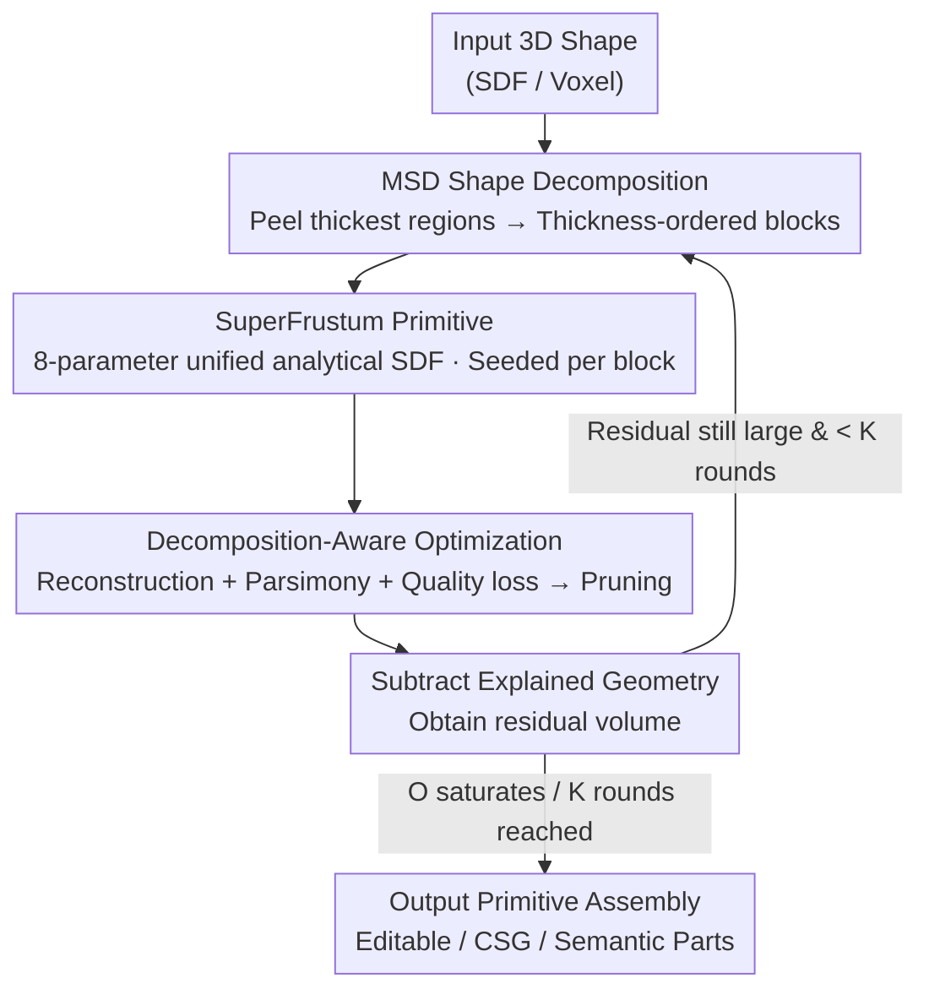

# Residual Primitive Fitting of 3D Shapes with SuperFrusta

**Conference**: CVPR 2026  
**Paper**: [CVF Open Access](https://openaccess.thecvf.com/content/CVPR2026/html/Ganeshan_Residual_Primitive_Fitting_of_3D_Shapes_with_SuperFrusta_CVPR_2026_paper.html)  
**Code**: To be open-sourced (the paper states "Code will be open-sourced upon acceptance")  
**Area**: 3D Vision  
**Keywords**: Primitive Fitting, Shape Decomposition, Analytical SDF, Editable 3D Assets, Residual Fitting

## TL;DR
This paper converts a 3D shape into a "few but accurate" analytical primitive assembly. It proposes **SuperFrustum**, an 8-parameter unified analytical primitive that achieves expressiveness, editability, and optimizability simultaneously. It then utilizes **ResFit**, an unsupervised "analysis-optimization alternating, residual-fitting" pipeline, to fit the primitives sequentially. This achieves an IoU improvement of up to 9 points across multiple 3D benchmarks while using only about half the number of primitives compared to previous work.

## Background & Motivation
**Background**: Distilling complex 3D shapes into a set of interpretable analytical primitives (such as cuboids, cylinders, and superquadrics) yields clean, structured, and editable assets. This aligns with human cognitive perception of objects as combinations of simple shapes, serving as a bridge from dense 3D data to controllable design. Existing methods are categorized into three classes: shape analysis-driven (segmenting regions by curvature/thickness/convexity before fitting), optimization-driven (directly tuning primitive parameters to minimize reconstruction error), and learning-driven (utilizing neural networks to predict primitive parameters).

**Limitations of Prior Work**: All existing methods struggle with the trade-off between **reconstruction fidelity vs. program parsimony**. Methods pursuing high fidelity produce highly redundant, overlapping primitives, while methods enforcing parsimony fail to capture curved surfaces and fine details. Simultaneously achieving expressiveness, compactness, and editability remains an open challenge.

**Key Challenge**: The authors attribute this trade-off to two root causes. First, **the primitive families themselves are not expressive enough**. Cuboids, superquadrics, and ellipsoids must be stacked in large numbers to capture the rich shape variations in 3D assets. Moreover, superquadrics sacrifice editability and cannot accurately reproduce common regular volumes like cubes or cones. Second, **inference pipelines have inherent flaws**. Methods relying on early complete segmentation suffer from error propagation if the initial partition is incorrect. Conversely, optimization-driven methods that fit a "soup of primitives" from scratch struggle within highly non-convex loss landscapes.

**Goal**: (1) To design a primitive that simultaneously satisfies three desiderata: expressiveness, editability, and optimizability; (2) to develop an inference algorithm that robustly navigates non-convex loss landscapes to produce both compact and high-fidelity assemblies.

**Key Insight**: The authors discovered that the Shadertoy/Demoscene community had long explored unified analytical functions that smoothly morph between basic shapes to render rich geometries with minimal descriptions. Though originally designed for real-time rendering and scene compression rather than inverse modeling, these formulations **prove surprisingly suitable for differentiable fitting** with slight modifications. Simultaneously, by coupling "top-down shape analysis" and "bottom-up primitive optimization" in an alternating loop, they allow the two signals to correct each other instead of operating in isolation.

**Core Idea**: Replace rigid primitive families with an 8-parameter unified analytical SDF primitive (SuperFrustum), and approach Occam's parsimonious assembly via an iterative workflow (ResFit): "analyze to extract global structure → optimize local geometry → subtract explained geometry → repeat on residuals".

## Method

### Overall Architecture
The task is defined as: given a 3D shape $x$, infer a program $z$ composed of analytical primitives, whose execution $E(z)$ reconstructs $x$. Each program defines a closed surface obtained through combination operators on a sequence of primitives $\{f_{\theta_i}\}_{i=1}^{|z|}$. According to Occam's razor, the objective is to be both accurate and compact:

$$z^* = \arg\max_z\ O(x, z),\qquad O(x, z) = R(x, E(z)) - \alpha|z|$$

where $R$ is reconstruction accuracy, $|z|$ is the program length (number of primitives), and $\alpha$ controls the trade-off between fidelity and parsimony.

The overall pipeline is an **iterative loop**: ResFit alternates between "shape analysis" and "primitive optimization". In each round, **MSD shape decomposition** first partitions the current residual volume into thickness-ordered regions and initializes a SuperFrustum for each. Then, **decomposition-aware optimization** tunes the parameters of the entire primitive set to maximize $O$ (involving differentiable loss and discrete pruning). After optimization, the "explained" geometry is subtracted from the target, and the remaining **residual** enters the next round to be further resolved by new primitives. This process repeats until $O$ saturates or a fixed number of rounds $K$ is reached (default is at most 10 rounds, with 7 MSD iterations per round). This alternating scheme enables information exchange between "global structure" and "local parameters": it can both allocate primitives to under-parameterized regions and rectify over-parameterization through soft regularization and hard pruning.

### Key Designs

**1. SuperFrustum: An 8-parameter unified analytical primitive capturing expressiveness, editability, and optimizability**

The limitation of prior work is direct: existing primitive families (superquadrics are editable and optimizable but lack expressiveness; algebraic surfaces are expressive but not editable; multi-type hybrid primitives are expressive and editable but hard to optimize) usually satisfy only one or two desiderata. SuperFrustum is defined as the zero-isosurface of a signed distance function $SF(p)=f(p;\theta)$, parameterized by $\theta=(s,r,d,t,b,o)$ consisting of 8 scalars. These intuitively control anisotropic scaling $s$, profile roundness $r$, dilation $d$, tapering $t$, bulge $b$, and onion-like shell thickness $o$. With these 8 knobs, a single formula can smoothly transition among cuboids, cylinders, cones, spheres, tori, and their tapered/bent/hollow variants. Crucially, its SDF is piecewise $C^1$ and almost everywhere differentiable with respect to all parameters, enabling stable gradient-based fitting. This implementation is inspired by the "minimal description, real-time rendering" analytical formulations in Demoscene, yet fits inverse modeling perfectly. The entire assembly is recursively synthesized from multiple transformed SuperFrusta via a **smooth union operator** $\mathcal{U}$ : each primitive has a pose $(R_i,t_i)$ and shape parameters $\theta_i$, yielding $g_i(p)=f(R_i^\top(p-t_i);\theta_i)$, with the final implicit field computed as:

$$F_1(p)=g_1(p),\qquad F_{k+1}(p)=\mathcal{U}\big(F_k(p),\,g_{k+1}(p);\,\beta_k\big)$$

where $\beta_k$ controls smooth blending sharpness, and the zero-isosurface defines the final surface.

**2. ResFit: An iterative loop fitting residuals, allowing global analysis and local optimization to correct each other**

Pure optimization methods tend to produce convoluted, entangled reconstructions, whereas pure analysis methods partition shapes without considering whether the primitive family can actually represent them—causing a disconnect between "top-down analysis" and "bottom-up representation". ResFit bridges this gap through alternation: in each round, the analysis phase decomposes the current residual volume into regions to seed new primitives, and the optimization phase tunes parameters to maximize $O$, isolating the explained geometry from the residuals, looping until $O$ saturates or $K$ rounds are reached. It is specifically designed with self-correction mechanisms: to prevent over-parameterization, only a few primitives are seeded per round, combined with "soft regularization to penalize redundancy + hard pruning to remove primitives that compromise $O$"; to address under-parameterization, primitives optimize based on their local support, and **the entire assembly is re-optimized in each round**. This allows the system to self-correct when new parts are added, gradually converging to a compact and coherent structure. Compared to single-shot schemes that "optimize all primitives simultaneously", multi-round progressive allocation of capacity to residual errors empirically yields higher fidelity, fewer primitives, and lower overlap.

**3. MSD Initialization: Using morphological decomposition to "peel the thickest parts first" for better seeds in curved, hollow, and branching structures**

ResFit uses volumetric regions from shape decomposition to initialize primitives; the better the decomposition strategy aligns with the expressiveness of the primitive family, the better the performance. While recent works largely rely on approximate convex decomposition (ACD/CoACD), the authors found that a modified version of **Morphological Shape Decomposition (MSD)** is uniquely suited for SuperFrusta. MSD is an iterative approach that "peels the thickest part first": at each step, it identifies the thickest internal connected region $\Gamma_k$ in the current SDF $f(p)$—defined as the connected component surviving an erosion radius of $|\tau|$:

$$\Gamma_k \subseteq \{p\in\Omega \mid f(p)\le \tau\},\quad \Gamma_k\ \text{is a cc}$$

where the threshold $\tau\le 0$ is set to the minimum value that satisfies a volume fraction $\kappa$ for $\mathrm{Vol}(\Gamma_k)$. The component is dilated back to its full scale as $R_k=\Gamma_k\oplus B_{|\tau|}$, recorded, and subtracted from the shape. The residual field is updated to $f_{k+1}(p)=f_k(p)\setminus R_k$ and the process is repeated, yielding a sequence of candidate regions sorted by descending thickness. This offers two major advantages over ACD: (1) ACD's convexity constraints over-segment non-convex structures that a single SuperFrustum could easily model (e.g., curved or hollow parts like bicycle tires, a cat's curved tail, or a bowl's rim); (2) MSD is more robust to the noisy residual volumes generated in the ResFit cycle. Within each volume, PCA and a cylindricity score are used to determine canonical axes, inferring the pose and scale to initialize the primitive parameters.

**4. Decomposition-Aware Optimization: Three-way loss (reconstruction + parsimony + quality) and greedy pruning**

Tuning the assembly parameters to maximize $O$ involves both a differentiable phase and a discrete pruning phase. The **reconstruction term** is a differentiable surrogate for $R$: it supervises the true occupancy $o(p)$ with the current assembly's occupancy field $\hat o(p)=\sigma(-\beta\tanh(\beta F(p)))$. Points are sampled uniformly inside the volume and more densely near the surface, weighted by the target mesh's principal curvatures $\kappa(p)$ to better reconstruct thin and high-curvature structures, and evaluated exclusively within a mask $M=\{p\mid F(p)<\tau\}$ to focus computation near the assembly:

$$w(p)=1+\sigma(\kappa(p)),\qquad L_{rec}=\frac{1}{|M|}\sum_{p\in M} w(p)\big(\hat o(p)-o(p)\big)^2$$

The **parsimony term** assigns a Gumbel-Softmax sampled existence variable $q_i\in(0,1)$ to each primitive, modulating its SDF to $f_i^*(p)=q_i f_i(p)+(1-q_i)$ to smoothly fade out low-probability primitives while penalizing the expected active primitive count: $L_{count}=\sum_i q_i$. The **quality term** is a structural regularizer $L_{qual}=L_{overlap}+L_{union}$: $L_{overlap}$ penalizes overlapping regions where multiple primitives are active (suppressing redundant coverage), and $L_{union}$ penalizes regions occupied by the smooth union but not by any individual primitive (preventing excessive blending). Together, they ensure the assembly is neither entangled nor overly blended, improving editability. The total loss is:

$$L_{total}=L_{rec}+\lambda_{count}L_{count}+\lambda_{qual}L_{qual}$$

Upon convergence of the differentiable optimization, a **discrete pruning** step is performed: primitives with negligible volume or contribution are trial-deleted one by one, accepting deletions that improve the main objective $O$.

### Loss & Training
This is an unsupervised per-shape optimization (not training a network) utilizing a single set of fixed hyperparameters throughout: the high-level objective $O$ uses curvature-weighted surface IoU with a program length penalty $\alpha=10^{-3}$; optimization loss weights are $\lambda_{count}=10^{-3}$ and $\lambda_{qual}=10^{-2}$; ResFit runs for at most 10 rounds or until convergence, with 7 MSD iterations per round.

## Key Experimental Results

### Main Results
Datasets: (1) Replicated version of 3DGen-Prim (the original is not public, generated via Hunyuan3D-2.1 with 510 prompts from 3DGen-Bench); (2) 500 geometrically diverse shapes from Toys4K selected via farthest point sampling. Metrics include reconstruction metrics: IoU(128³), CD, EMD, and BiSurfIoU, and program quality metrics: #Prims, Overlap, IntraPrim(↓), and InterPrim(↑) (the latter two measure semantic purity and part distinctiveness based on PartField features). Baselines include learning-driven Primitive Anything (PA, including its test-time optimization variant TTO) and the strong optimization-driven baseline Marching Primitives (MPS).

| Dataset | Metric | Ours | Prev. SOTA (MPS) | Gain |
|--------|------|------|--------------|------|
| 3DGen-Prim | IoU ↑ | **88.74** | 82.67 | +6.1 |
| 3DGen-Prim | BiSurfIoU ↑ | **80.19** | 71.53 | +8.7 |
| 3DGen-Prim | CD ↓ | **0.168** | 0.884 | Substantially Lowered |
| 3DGen-Prim | #Prims ↓ | **23.98** | 42.96 | ≈ Half |
| 3DGen-Prim | Overlap ↓ | **0.210** | 0.684 | >3× Decrease |
| Toys4K | IoU ↑ | **89.92** | 80.60 | +9.3 |
| Toys4K | #Prims ↓ | **23.67** | 30.62 | Fewer |
| Toys4K | Overlap ↓ | **0.208** | 0.588 | >2.8× Decrease |

Ours achieves the best results across both reconstruction and program quality: IoU improves by 6–9 points, the number of primitives is cut roughly in half, and overlap is reduced by more than 3×. It also achieves the lowest IntraPrim (high semantic purity) and high InterPrim (well-separated parts).

### Ablation Study

| Configuration | IoU | #Prims | Overlap | Description |
|------|-----|--------|---------|------|
| SuperFrustum + Smooth Union | **88.37** | 21.46 | **0.199** | Full primitive design |
| SuperFrustum without Smooth Union | 87.15 | 18.68 | 0.257 | Removes smooth union; overlap increases, accuracy decreases |
| SuperPrimitive (without taper/bend) | 86.66 | 21.36 | 0.291 | Removes tapering/bending degrees of freedom; accuracy decreases |
| Superquadric | 76.50 | 18.17 | 0.286 | Prone to bad local minima when axes are misaligned |
| Cuboid | 82.33 | 20.49 | 0.298 | Weakest expressiveness |
| ResFit + MSD | **89.86** | **23.46** | **0.207** | Full pipeline |
| ResFit + CoACD | 88.02 | 24.18 | 0.214 | Replaces decomposition strategy; slight performance drop |
| Single-shot + MSD | 87.95 | 28.17 | 0.236 | Single-shot fitting; produces more and messier primitives |
| Single-shot + CoACD | 86.56 | 26.67 | 0.226 | Sensitive to initial partition |

### Key Findings
- **Primitive expressiveness is key**: The tapering/bending degrees of freedom and smooth union significantly contribute to reconstruction accuracy. Replacing them with superquadrics leads to poor local minima due to axis misalignment (MPS mitigates this using non-differentiable periodic axis-flip heuristics; this paper avoids such tricks for a controlled comparison).
- **Iterative > Single-shot, MSD > CoACD**: By progressively redistributing capacity to residual errors, ResFit's multi-round strategy is more accurate, more compact, and less prone to overlap than one-off joint optimization of all primitives. MSD's non-convex partitioning provides superior initialization for curved, hollow, and branching geometries.
- **Adjustable speed-quality trade-off**: On Toys4K, the full 10-round pipeline takes about 652.6s per shape. However, a fast 2-round variant takes only 184.1s to achieve 86.54 IoU with 15.54 primitives, matching or slightly exceeding MPS (86.30 IoU at 256³ resolution) while using 5× fewer primitives. The authors note that ResFit has not yet been optimized for speed, and custom CUDA kernels could accelerate it.

## Highlights & Insights
- **Cross-disciplinary inspiration**: Adapting unified analytical forms from Shadertoy/Demoscene—originally meant for scene compression and real-time rendering—into primitives suitable for differentiable inverse modeling. The realization that "formulas designed for rendering fit optimization extremely well" is a beautiful insight.
- **Simultaneously satisfying three desiderata**: Handily balancing expressiveness, editability, and optimizability with just 8 semantic parameters. Crucially, it can accurately replicate regular manufacturing shapes like cuboids/cones, bypassing the long-standing limitation where superquadrics sacrifice editability.
- **"Fitting residuals" as a transferable paradigm**: Instead of optimizing a large, chaotic pool of primitives from scratch, alternating between analysis and optimization—where each round explains the remaining residuals while allowing global re-optimization and pruning to self-correct—can be transferred to any structured reasoning task that requires progressive assembly over non-convex loss landscapes.
- **Bi-directional quality regularization**: Penalizing overlap suppresses redundancy while penalizing union excesses prevents over-blending. This ensures that the final assembly is clean and avoids being "mushed together", directly translating to superior editability and semantic consistency.

## Limitations & Future Work
- **Slow processing speed**: The full 10-round per-shape optimization takes hundreds of seconds. The authors acknowledge that the pipeline has not been optimized for speed and requires dedicated CUDA kernels for practical deployment.
- **Dependency on decomposition quality**: Initialization is heavily reliant on MSD's partition quality. The robustness of MSD on extremely thin shells or highly interleaved geometries, along with sensitivity analyses for thresholds $\kappa$ and $\tau$, are not fully detailed in the main paper (deferred to the supplementary material).
- **Capacity ceiling of 8 parameters**: Although highly expressive, SuperFrustum is fundamentally a deformation family of regular analytical shapes. For complex, purely organic or free-form details, a single primitive has limited coverage and still relies on stacking multiple primitives via smooth union.
- **Custom evaluation dataset**: Since the original 3DGen-Prim was not publicly released, the authors had to replicate it, causing some uncertainty regarding direct comparability with the original work.

## Related Work & Insights
- **vs. Marching Primitives (MPS)**: MPS directly optimizes superquadric assemblies from SDF grids to achieve high fidelity, but requires a large number of primitives, suffers from high overlap, and relies on non-differentiable heuristics like periodic axis flipping. Ours employs the more expressive SuperFrustum combined with residual iteration, yielding a 6–9 point higher IoU while halving the primitive count and dropping overlap by 3×.
- **vs. Primitive Anything (PA)**: PA utilizes supervised learning to predict cuboid/cylinder/ellipsoid assemblies, which is accurate within the training domain but generalizes poorly to novel or complex shapes. Ours uses unsupervised per-shape optimization, making it distribution-agnostic and more robust on diverse geometries.
- **vs. Shape Analysis-Driven Methods (ACD/CoACD, etc.)**: These methods commit to a fixed early segmentation, leaving them vulnerable to error propagation, and their convexity constraints tend to over-segment non-convex structures. Ours enables interactive bi-directional loops between analysis and optimization, adapting the partition directly to the primitive family's representational capability.

## Rating
- Novelty: ⭐⭐⭐⭐⭐ A novel primitive, residual iteration paradigm, and cross-disciplinary inspiration; the scheme is complete and systematic.
- Experimental Thoroughness: ⭐⭐⭐⭐ Evaluated across two datasets, metrics for both reconstruction and program quality, and comprehensive dual-ablating of both the primitive family and pipeline; custom dataset replication and speed remain minor drawbacks.
- Writing Quality: ⭐⭐⭐⭐⭐ Strong logical loop from motivation to challenges, methods, and ablations; text-to-figure mappings are clear.
- Value: ⭐⭐⭐⭐⭐ High-fidelity and editable analytical assembly that directly connects dense 3D data with controllable design, paving the way for downstream applications like editable assets, CSG, and semantic parts.

<!-- RELATED:START -->

## Related Papers

- [\[CVPR 2026\] LoST: Level of Semantics Tokenization for 3D Shapes](lost_level_of_semantics_tokenization_for_3d_shapes.md)
- [\[CVPR 2026\] Unified Primitive Proxies for Structured Shape Completion](unified_primitive_proxies_for_structured_shape_completion.md)
- [\[CVPR 2026\] UniTEX: Universal High Fidelity Generative Texturing for 3D Shapes](unitex_universal_high_fidelity_generative_texturing_for_3d_shapes.md)
- [\[CVPR 2026\] PrITTI: Primitive-based Generation of Controllable and Editable 3D Semantic Urban Scenes](pritti_primitive-based_generation_of_controllable_and_editable_3d_semantic_urban.md)
- [\[CVPR 2026\] Radar-Guided Polynomial Fitting for Metric Depth Estimation](radar-guided_polynomial_fitting_for_metric_depth_estimation.md)

<!-- RELATED:END -->
