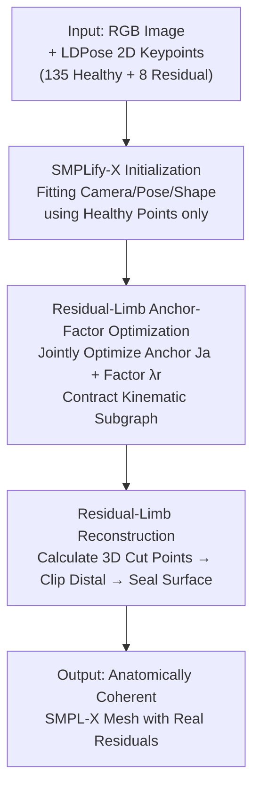

# ResiHMR: Residual-Limb Aware Single-Image 3D Human Mesh Recovery for Individuals with Limb Loss

**Conference**: CVPR 2026  
**arXiv**: [2604.28025](https://arxiv.org/abs/2604.28025)  
**Code**: None (project page mentioned in paper, repository not provided)  
**Area**: 3D Vision / Human Understanding  
**Keywords**: Human Mesh Recovery, Residual Limb, Amputee, Topology-Adaptive Optimization, SMPL-X

## TL;DR
ResiHMR is the first single-image 3D human mesh recovery framework specifically for the amputee population. It utilizes "Residual-Limb Anchor-Factor Optimization" to clip the fixed SMPL-X skeleton to cover only the existing limbs and employs "Residual-Limb Reconstruction" to explicitly remove distal mesh vertices and seal smooth residual surfaces. This reduces the residual limb 2D MPJPE from 73.61 px to 23.19 px (using HSMR backbone).

## Background & Motivation
**Background**: Single-image Human Mesh Recovery (HMR) relies on parametric human models like SMPL / SMPL-X, which compress pose and shape into a low-dimensional space. By using optimization (SMPLify-X) or regression (HMR2.0, HSMR) to fit 2D keypoints, controllable 3D human meshes can be recovered from an RGB image for applications in animation, motion analysis, and rehabilitation monitoring.

**Limitations of Prior Work**: All mainstream models incorporate an "intact limb prior"—the skeletal graph, vertex connectivity, and pose priors are defined based on a fixed topology of non-disabled anatomy. When encountering an amputee, these models cannot represent the residual surface and instead "hallucinate" intact limbs or force the residual end into the nearest healthy joint. In the example of a left thigh amputation in Figure 2, SMPL-X artificially completes the leg; because HSMR regresses a full-body biomechanical skeleton, errors at the residual limb interfere with the entire skeleton, biasing the healthy limbs.

**Key Challenge**: The joint graph of fixed-topology models is hard-coded and lacks the concept of a "residual limb endpoint." Consequently, the amputation site has no geometric representation, and optimization becomes unstable near the missing limb. Existing amputee-related works (like AJAHR) only judge "joint existence" while still relying on the full SMPL topology, forcing residual ends to coincide with existing joints. LDPose defines 2D residual limb endpoints but lacks 3D supervision and parametric human representations.

**Goal**: To elevate 2D residual limb endpoints into anatomically meaningful 3D termination positions while maintaining global pose and body proportions consistent with healthy keypoints, ensuring each residual limb has explicit 3D geometry rather than being implicitly shortened or omitted.

**Key Insight**: The authors observed that residual limb length correlates anthropometrically with the length of the remaining healthy segments. Instead of retraining models, the authors perform topology-adaptive optimization within the SMPL-X parameter space and skeletal structure, compressing the "termination point" into a scaling factor $\lambda_r$ along the kinematic chain.

**Core Idea**: The mechanism employs "Anchor Joints + Residual Factors" to redefine the kinematic subgraph and stop hallucinated limbs, followed by explicit mesh clipping and sealing to create realistic residual surfaces—implementing "topology clipping + residual creation" instead of "joint deletion within intact topology."

## Method

### Overall Architecture
ResiHMR takes an RGB image and LDPose-format full-body 2D keypoints (135 OpenPose WholeBody points + 8 residual limb endpoints) as input, and outputs an anatomically coherent SMPL-X mesh with realistic residual geometry. It is **entirely optimization-based and requires no training data**. The pipeline consists of three sequential steps:

1. **Initialization**: Standard SMPLify-X objectives fit SMPL-X camera, pose, and shape using only healthy keypoints (at this stage, residual limbs are still hallucinated as intact).
2. **Residual-Limb Anchor-Factor Optimization**: Guided by residual endpoint supervision, the method jointly optimizes an anchor joint $\mathbf{J}_a$ and a residual factor $\lambda_r$ for each residual limb, contracting the kinematic graph into a subgraph of existing limbs.
3. **Residual-Limb Reconstruction**: Using the solved $(\mathbf{J}_a^\star, \lambda_r^\star)$, 3D cut points are calculated on the mesh to clip distal geometry and seal smooth, convex, watertight residual surfaces.

The key is its **plug-and-play** design: it operates directly on the SMPL-X parameter space and skeletal structure, making it compatible with any HMR pipeline outputting SMPL-X (validated on both optimization-based SMPLify-X and regression-based HSMR).

### Key Designs

**1. Residual-Limb Anchor-Factor Optimization: Compressing "Where the Limb Ends" into a Scaling Factor**

This addresses the issue where fixed-topology models force residual ends into the nearest healthy joint. The authors parameterize each residual limb's endpoint as a point on the segment connecting the anchor joint $\mathbf{J}_a$ (the distal joint of the amputation segment root, e.g., knee or elbow) and its upstream joint $\mathbf{J}_t$:

$$\mathbf{R}_r = \mathbf{J}_a + \lambda_r(\mathbf{J}_t - \mathbf{J}_a), \quad \lambda_r \in [0, 1]$$

Where $\lambda_r = 0$ indicates an intact limb and $\lambda_r = 1$ indicates total amputation. This linear interpolation provides a low-dimensional representation anchored to the kinematic chain—it maintains the segment direction while allowing the optimizer to adjust length via a single factor, keeping the global skeleton consistent with SMPL-X. For each visible residual endpoint, the loss for optimizing $(\mathbf{J}_a, \lambda_r)$ is:

$$\mathcal{L} = \mathcal{L}_{\text{reproj}} + \alpha\mathcal{L}_{\text{reg}} + \mu\mathcal{L}_{\text{len}}$$

The reprojection term $\mathcal{L}_{\text{reproj}} = \|\pi(\mathbf{R}_r) - \mathbf{k}_r^{2D}\|^2$ aligns the residual end with 2D observations; the regularization term $\mathcal{L}_{\text{reg}} = \|\mathbf{J}_a - \mathbf{J}_a^{\text{init}}\|^2$ prevents anchor joints from deviating from their SMPLify-X initialization; the length term $\mathcal{L}_{\text{len}} = (\|\mathbf{J}_t - \mathbf{J}_a\| - \|\mathbf{J}_t - \mathbf{J}_a^{\text{init}}\|)^2$ preserves segment lengths from SMPLify-X, encoding anthropometric priors to ensure biomechanical feasibility. This implements the "correlation between healthy and residual segments" observation: only the termination point is adjusted, while original segment length priors remain.

**2. Residual-Limb Reconstruction: Explicit Clipping and Sealing**

Anchor-factor optimization only provides the endpoint position; the hallucinated distal mesh remains. This step converts parameters into geometry. First, the 3D cut point $\mathbf{p}_r = \mathbf{J}_a^\star + \lambda_r^\star(\mathbf{J}_t^{\text{init}} - \mathbf{J}_a^\star)$ is calculated. Subsequent operations are restricted to the limb sub-mesh:

- **Segmentation-Guided Coarse Clipping**: Utilizing SMPL-X body part labels, distal parts (e.g., forearm + hand, or foot) corresponding to the amputation are deleted to narrow the search space.
- **Fine Geometric Cutting**: Within the retained segment (e.g., upper arm/thigh), the face nearest to $\mathbf{p}_r$ is found. A cutting plane is defined by normal $\hat{\mathbf{n}} = \frac{\mathbf{J}_a^\star - \mathbf{J}_t^{\text{init}}}{\|\mathbf{J}_a^\star - \mathbf{J}_t^{\text{init}}\|}$. For each vertex, the signed distance $\phi(\mathbf{v}) = \langle \mathbf{v} - \mathbf{p}_r, \hat{\mathbf{n}} \rangle$ is calculated; vertices with $\phi$ exceeding a threshold that are not in a "protected ring" are deleted, ensuring a smooth intersection robust to local noise.
- **Boundary Cleaning and Sealing**: Boundary vertices are extracted. Low-degree boundary points are iteratively pruned, a local plane is fitted, and concentric vertex rings are generated at $\pm h$ along the normal. The boundary and rings are triangulated to seal a smooth, convex, watertight residual surface.

The final mesh $\mathbf{M}_r(\Theta)$ remains closed and anatomically realistic, suitable for clinical assessment and prosthetic alignment.

### Loss & Training
ResiHMR requires no training and relies on pure optimization. Anchor-factor optimization uses L-BFGS (strong Wolfe line search), with $\lambda$ initialized to 0.5 and clipped to $[\lambda_{\min}, \lambda_{\max}]$. Weights $\alpha, \mu$ are adaptively scaled based on per-instance fit error. Each residual limb is optimized independently, and solutions are accepted only if the reprojection error is below a threshold (15 px).

## Key Experimental Results

### Main Results
Evaluated on the **LDPose-LimbLoss Evaluation Dataset** (255 real amputee images with 17 standard joints + 8 residual endpoints + per-person masks). Metrics include 2D MPJPE (Body / Res-Limb / Intact) and mIoU (reconstruction mask vs. manual mask). For non-ResiHMR methods, residual accuracy is measured using a "segment midpoint proxy."

| Method | Body Kpts MPJPE↓ | Res-Limb MPJPE↓ | Intact Kpts MPJPE↓ | mIoU↑ |
| :--- | :--- | :--- | :--- | :--- |
| TokenHMR [CVPR24] | 34.79 | 102.34 | 31.73 | 0.717 |
| CameraHMR [3DV25] | 29.26 | 78.13 | 25.56 | **0.752** |
| PromptHMR [CVPR25] | 51.07 | 102.48 | 46.88 | 0.751 |
| HSMR [CVPR25] | 28.27 | 73.61 | 24.56 | 0.705 |
| SMPLify-X [CVPR19] | 47.67 | 129.59 | 41.32 | 0.662 |
| **ResiHMR (SMPLify-X)** | 41.77 | 98.36 | 37.40 | 0.703 |
| **ResiHMR (HSMR)** | **24.75** | **23.19** | 24.87 | 0.741 |

Key findings: ① ResiHMR improves both base methods—SMPLify-X Intact Kpts improved from 41.32→37.40 px; HSMR Body Kpts improved from 28.27→24.75 px and Res-Limb from 73.61→**23.19** px. ② ResiHMR (HSMR) achieves the best Body/Res-Limb performance; CameraHMR reaches the highest mIoU (0.752). ③ ResiHMR is the only method explicitly modeling endpoints, explaining its massive advantage in Res-Limb accuracy.

### Ablation Study
While a discrete ablation table was not provided, the margin of contribution is evident from the baseline comparisons:

| Configuration | Res-Limb MPJPE | mIoU | Note |
| :--- | :--- | :--- | :--- |
| HSMR (Base, fixed topology) | 73.61 | 0.705 | No explicit residual limb |
| ResiHMR (HSMR) | **23.19** | 0.741 | ~68% reduction in residual error |
| SMPLify-X (Base) | 129.59 | 0.662 | Optimization baseline |
| ResiHMR (SMPLify-X) | 98.36 | 0.703 | ~24% reduction in residual error |

### Key Findings
- **Explicit modeling is the root cause of superior localization**: Topology-adaptive optimization reduces global distortion caused by forcing models to explain missing limbs, but the sharp drop in MPJPE comes from predicting actual endpoints rather than using midpoints.
- **Positive feedback on global pose**: By contracting the skeleton to a valid subgraph, the amputation site no longer interferes with healthy limbs, improving Body Kpts in HSMR.
- **Residual error sources**: Errors mainly stem from imperfect initialization and large-scale variations in the 255 images amplifying pixel-level MPJPE.

## Highlights & Insights
- **Dimensionality reduction of limb length into $\lambda_r$**: Positioning the factor along the kinematic chain ensures anatomical plausibility while providing a single controllable parameter. This parameterization is transferable to any scenario requiring local topology editing on a fixed skeleton.
- **Parameter space plug-and-play**: By modifying parameters and the skeleton without touching the backbone, the method supports both optimization (SMPLify-X) and regression (HSMR), offering a roadmap for extending existing HMR systems.
- **Geometric clipping and sealing**: The use of signed distance, protection rings, and concentric sealing provides a geometric post-processing method robust to mesh noise for creating watertight surfaces.
- **The "Aha" moment**: Amputee reconstruction does not require retraining models—encoding clinical "healthy segment ∝ residual segment" priors into the loss enables SOTA localization through pure optimization.

## Limitations & Future Work
- **Lack of 3D Ground Truth**: The authors admit there is no GT 3D dataset for amputees; evaluation is limited to 2D reprojection and masks, which cannot directly measure 3D residual error.
- **Optimization-heavy and independent per limb**: Relies on good initialization and 2D keypoint quality (rejects error >15 px), making it slow and sensitive to noise. Performance in complex occlusions or with prosthetic components is unknown.
- **Comparison with AJAHR**: AJAHR was not open-sourced at the time of submission; hence, a direct comparison between specific amputee methods is missing.
- **Future Directions**: Introducing multi-view data for strong supervision or using diffusion models to learn residual geometry, soft tissue priors, and residual-socket interfaces to reduce reliance on optimization.

## Related Work & Insights
- **vs. AJAHR**: AJAHR predicts joint existence for amputee-aware fitting but remains dependent on full SMPL topology, forcing ends to joints. ResiHMR defines explicit endpoints and contracts the topology to a subgraph.
- **vs. LDPose**: LDPose provides a 2D endpoint system; ResiHMR serves as the "3D extension" that lifts these 2D points into 3D residual geometry.
- **vs. Fixed-topology HMR**: These models (SMPLify-X, HSMR) hallucinate missing limbs. ResiHMR acts as a plug-and-play module allowing them to support anatomically coherent amputee reconstruction without changing backbones.

## Rating
- Novelty: ⭐⭐⭐⭐⭐ First framework for explicit residual surface reconstruction and topology-adaptive optimization in single-image HMR.
- Experimental Thoroughness: ⭐⭐⭐⭐ Solid comparison with 5 baselines across two backbones, though lacks 3D GT and an exhaustive component-wise ablation table.
- Writing Quality: ⭐⭐⭐⭐ Clear motivation, complete formulas, and strong clinical context.
- Value: ⭐⭐⭐⭐⭐ High social impact for inclusion in human modeling, with direct applications in prosthetic alignment and gait analysis.

<!-- RELATED:START -->

## Related Papers

- [\[CVPR 2026\] Human Interaction-Aware 3D Reconstruction from a Single Image](human_interaction-aware_3d_reconstruction_from_a_single_image.md)
- [\[CVPR 2026\] Anny-Fit: All-Age Human Mesh Recovery](anny-fit_all-age_human_mesh_recovery.md)
- [\[CVPR 2026\] OnlineHMR: Video-based Online World-Grounded Human Mesh Recovery](onlinehmr_video-based_online_world-grounded_human_mesh_recovery.md)
- [\[CVPR 2026\] Fall Risk and Gait Analysis using World-Spaced 3D Human Mesh Recovery](fall_risk_gait_analysis_hmr.md)
- [\[ICCV 2025\] AJAHR: Amputated Joint Aware 3D Human Mesh Recovery](../../ICCV2025/3d_vision/ajahr_amputated_joint_aware_3d_human_mesh_recovery.md)

<!-- RELATED:END -->
