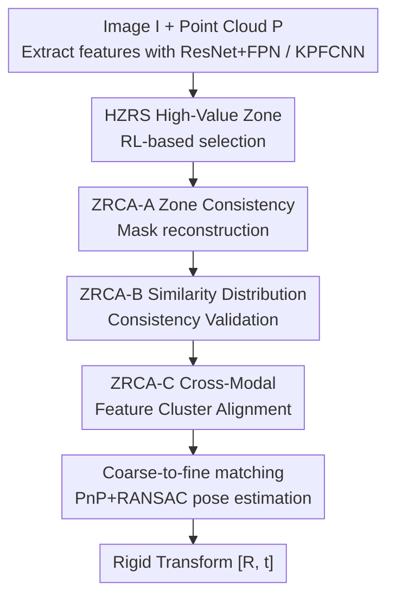

# Rethinking 2D-3D Registration: A Novel Network for High-Value Zone Selection and Representation Consistency Alignment

**Conference**: CVPR 2026  
**Paper**: [CVF Open Access](https://openaccess.thecvf.com/content/CVPR2026/html/Cheng_Rethinking_2D-3D_Registration_A_Novel_Network_for_High-Value_Zone_Selection_CVPR_2026_paper.html)  
**Code**: To be confirmed  
**Area**: 3D Vision  
**Keywords**: Image-to-point cloud registration, cross-modal matching, reinforcement learning zone selection, representation consistency, cluster alignment

## TL;DR
R23Net employs reinforcement learning to first select "high-value" regions on images and point clouds that are capable of producing high-quality matches and are suitable for dense matching (HZRS module). It then aligns the cross-modal representations of these regions using three sets of consistency constraints (ZRCA module). This elevates the registration recall (RR) from 68.4% to 77.0% on RGB-D Scenes v2, setting a new SOTA for image-to-point cloud registration.

## Background & Motivation
**Background**: The goal of image-to-point cloud registration (I2P) is to estimate the rigid transform $[R, t]$ that aligns a point cloud to the camera coordinate system given an image and a point cloud of the same scene. This is a critical step in 3D reconstruction, SLAM, and visual localization. Existing methods mainly fall into two streams: (1) **detect-then-match**, which detects keypoints on images and point clouds separately and then matches them based on features, striving for high-quality, sparse correspondences; and (2) **detection-free** (e.g., 2D3D-MATR), which follows a coarse-to-fine dense matching pipeline and estimates the pose using PnP-RANSAC, attempting to dilute errors through a large number of correspondences.

**Limitations of Prior Work**: Detect-then-match methods are limited by the scarcity of repeatable keypoints. Due to the large domain gap between images and point clouds, obtaining consistent cross-modal keypoints and descriptors is highly challenging, leading to sparse high-quality correspondences that are easily corrupted by outliers. Although detection-free methods produce more correspondences, non-overlapping regions between images and point clouds, along with the propagation of coarse matching drifts to fine matching stages, result in a large number of low-quality, erroneous matches. A deeper issue is that image features originate from texture while point cloud features capture structure; even when focusing on the same region, their representation is inherently inconsistent, directly degrading cross-modal matching accuracy.

**Key Challenge**: 'Quality' and 'quantity' are two incompatible paths: high-quality matching is precise but sparse, whereas dense matching is abundant but noisy. Furthermore, regardless of the chosen path, the underlying challenge of cross-modal representation inconsistency remains unsolved.

**Goal**: The goal is to decouple this into two sub-problems: (1) how to identify high-value key regions that are suitable for dense matching; and (2) how to establish consistent representations for these cross-modal key regions.

**Key Insight**: The authors observe that the drawbacks of the two paths are highly complementary. By first identifying reliable regions through a 'high-quality' approach and then diluting errors in those regions using a 'dense' approach, one can simultaneously obtain 'better' and 'more' correspondences. Existing information such as region boundaries and similarity structures can then be leveraged to impose consistency constraints, pulling the cross-modal representations closer.

**Core Idea**: The core idea is to employ reinforcement learning to bypass the obstacle of discrete, non-differentiable region selection to select high-value regions (HZRS). Then, representation consistency constraints (ZRCA) are imposed from three perspectives—understanding, coordination, and acceleration—to align cross-modal representations before performing coarse-to-fine matching.

## Method

### Overall Architecture
The inputs to R23Net are an image $I \in \mathbb{R}^{H\times W\times 3}$ and a point cloud $P \in \mathbb{R}^{N\times 3}$ of the same scene, and the output is the rigid transform $[R, t]$. The overall pipeline is as follows: image features are extracted using ResNet+FPN, and point cloud features are extracted via KPFCNN (both equipped with positional encodings). After preliminary cross-modal alignment using self-attention and cross-attention transformers, the features are processed by **HZRS** using reinforcement learning to select high-value regions and discard low-quality ones, yielding $F_i^s, F_p^s$. They then enter **ZRCA**, which sequentially applies consistency constraints (mask reconstruction, similarity distribution validation, and cluster alignment) via three units. Finally, coarse-to-fine matching on the aligned features yields the coarse match set $M_c$ and the refined dense match set $M_f$, after which PnP+RANSAC is employed to estimate the pose.

The four contributing modules correspond to the four key designs below. HZRS is responsible for 'selecting the right regions', while the three units in ZRCA are responsible for 'aligning representations' from the viewpoints of understanding, coordination, and acceleration.

### Key Designs

**1. HZRS: RL-based High-Value Zone Selection: Reward-Driven Solution for Non-Differentiable Selection**

To address the issue that non-overlapping and textureless regions introduce coarse matching errors which then propagate to fine matching, HZRS aims to isolate regions that generate high-quality correspondences before performing dense matching. The key challenge is that selecting or discarding a region is a discrete binary decision, which is inherently non-differentiable and cannot be directly optimized using gradients. The authors model this as a reinforcement learning task: the candidate sets $C=(C_i, C_p)$ represent the indices of $h\times w$ spatial locations in the image and $n$ points in the point cloud, respectively. The policy network outputs a selection probability $p_t = \pi_\theta(a_t=1\,|\,s_t)$ for each candidate (where $a_t\in\{0,1\}$ denotes select/discard). The expected reward is optimized using the REINFORCE algorithm, and a baseline $z$ (a moving average of historical rewards, $z=\frac{1}{T}\sum_t R_t$ ) is introduced to reduce gradient variance:

$$L_R = -\mathbb{E}_{(s_t,a_t)\sim\pi_\theta}\left[(R-z)\sum_{t=1}^{T}\log\pi_\theta(a_t|s_t)\right].$$

The design of the reward function is the core of this module. The authors use the inverse of the circle loss $L_x$ (which measures matching quality by penalizing the feature distance of positive and negative pairs) as the primary term, supplemented by a 'projection correctness' term to prevent spatial misalignment between the selected image and point cloud regions:

$$R = \frac{1}{L_x} + \lambda_1\cdot \mathrm{Pro}_i + \lambda_2\cdot \mathrm{Pro}_p,$$

where $\mathrm{Pro}_i$ and $\mathrm{Pro}_p$ project the selected image region $I_s$ to the point cloud and the selected point cloud region $P_s$ to the image, respectively. Positive rewards are given for correct projections and negative rewards for misalignment, forcing both modalities to select the same physical region. This guarantees both high-quality matches within the selected region (via the $1/L_x$ term) and cross-modal alignment (via the projection terms). During training, low-probability (low-quality) feature patches are discarded directly, which additionally accelerates training and yields high-value zone features $F_i^s, F_p^s$.

**2. ZRCA-A: Zone Consistency Mask Reconstruction: Representation Alignment from an 'Understanding' Perspective**

Even when high-value zones are identified, the representations of images (textures) and point clouds (structures) remain inconsistent. This unit addresses the issue from an 'understanding' perspective—rather than directly aligning internal features, it uses observable region boundaries to impose indirect constraints. Specifically, the selected image features $F_i^s$ are used to localize the high-value zone mask $M_o$ in the image. Meanwhile, the cosine similarity between the selected point cloud features $F_p^s$ and the complete image features $F_i$ is computed, extracting the top-k most similar image regions to obtain $M_A$ (this similarity map is already required in the subsequent coarse-to-fine stage, incurring virtually zero extra computational overhead). If representations across both modalities are consistent, $M_o$ and $M_A$ should overlap highly. The authors enforce this consistency using a joint Dice and KL loss:

$$L_M^{\text{Dice}} = 1 - \frac{2\langle M_o, M_A\rangle + \varepsilon}{\langle M_o, \mathbf{1}\rangle + \langle M_A, \mathbf{1}\rangle + \varepsilon},\qquad L_M^{\text{KL}} = \mathrm{KL}(\tilde{M}_o\,\|\,\tilde{M}_A),$$

The total mask loss is defined as $L_M = L_M^{\text{Dice}} + L_M^{\text{KL}}$ (where $\tilde{M}$ represents the distribution normalized by sum). A notable design choice: the authors only constrain the 'point-cloud-to-image' projection and not the reverse. This is because point clouds are sparse and locally discontinuous with unclear structural boundaries, whereas image regions exhibit continuous, sharp boundaries that are more suitable for evaluating region consistency—plus, the correctness of the reverse projection is already guaranteed by the HZRS reward terms, avoiding redundancy.

**3. ZRCA-B: Similarity Distribution Consistency Validation: Error Propagation Suppression from a 'Coordination' Perspective**

In coarse-to-fine matching, errors in the coarse stage propagate to the fine stage, causing misalignment. This unit introduces a safeguard from a 'coordination' perspective. The core observation is that if matched regions are semantically consistent, their internal patch-wise similarity structures should also be consistent; conversely, mismatches expose structural discrepancies, which can be amplified as reliable constraint signals. Given the normalized image and point cloud patch features $f_i, f_p\in\mathbb{R}^{m\times c}$ (where $m$ is the number of matched pairs), the self-similarity matrices $S_i = f_i f_i^\top$ and $S_p = f_p f_p^\top$ are computed, with the Frobenius norm of their difference serving as the loss:

$$L_S = \|S_i - S_p\|_F^2.$$

Since correspondences are highly unreliable in the early stages of training, this constraint is deferred until training stabilizes (specifically, warming up starting from epoch 10 and fully integrated by epoch 20) to prevent the model from getting derailed by noise.

**4. ZRCA-C: Cross-Modal Feature Cluster Alignment: Distribution Realignment and Convergence Acceleration from an 'Acceleration' Perspective**

Using t-SNE, the authors observe that image and point cloud features align at the cluster level before eventually converging to point-level alignment. To accelerate convergence and enhance cross-domain alignment, this unit introduces cluster alignment from an 'acceleration' perspective. High-dimensional local features from images and point clouds are clustered into at most $K_{\max}$ clusters, parameterized by learnable prototypes $u_k$ (images) and $v_\ell$ (point clouds). Each prototype is associated with a learnable gate (passed through a sigmoid function to obtain activation probabilities $\pi_k, \rho_\ell$, relaxed via Gumbel-Softmax during training to obtain continuous gate values). Local features are softly assigned to prototypes using the gates with a temperature parameter $\tau_a$:

$$A^{\text{img}}_{jk} = \frac{\exp(s^{\text{img}}_{jk})}{\sum_{k'}\exp(s^{\text{img}}_{jk'})},\quad s^{\text{img}}_{jk} = \frac{\langle \tilde{F}^j_I, \tilde{u}_k\rangle}{\tau_a} + \log(\pi_k + \delta),$$

Cluster-level features $\hat{u}_k, \hat{v}_\ell$ are aggregated based on these assignments. After row normalization, the cross-modal cosine similarity $S_c$ is calculated, and Sinkhorn normalization (incorporating a dustbin row/column to filtering out low-relevance features) is applied to extract the soft correspondence matrix. Finally, high-confidence cluster correspondences are pulled closer using a contrastive loss $L_{\text{NCE}}$ based on mutual nearest neighbor positive pairs. This is combined with a gate sparsity regularization term $Z_{\text{gate}}$ and a quality regularization term $Z_{\text{mass}}$ (penalizing flat clusters) to adaptively regulate the number of active clusters, giving the total loss $L_C = L_{\text{NCE}} + Z_{\text{gate}} + Z_{\text{mass}}$. Ablations indicate that this accelerates convergence from 19 epochs to 16 epochs.

### Loss & Training
Both coarse and fine matching networks adopt the generic circle loss $L_x$ (Eq. 17, which applies weighted log-sum-exp penalties to anchor descriptors $d_x$ based on the L2 distance of positive and negative pairs). The total loss is a weighted sum of all modules:

$$L = L_x + \beta_1 L_R + \beta_2 L_M + \beta_3 L_S + \beta_4 L_C.$$

Implementation details: PyTorch 1.13.1 on a single RTX 3090 GPU; decoder output feature dimension is 512; transformer depth is 3 layers; hyperparameters are set to $\tau_g=0.5,\ \tau_a=0.3,\ \tau_s=0.35,\ \beta_1=\beta_2=1.0,\ \beta_3=0.5,\ \beta_4=0.2,\ \lambda_1=\lambda_2=0.5,\ K_{\max}=6$. $L_C$ is applied only during epochs 5–15, and $L_S$ warms up from epoch 10 to epoch 20. This phased-constraint strategy prevents unreliable correspondences in early stages from disrupting training.

## Key Experimental Results

### Main Results
Evaluated on the RGB-D Scenes v2 and 7-Scenes datasets under the 2D3D-MATR benchmark, the metrics used are Inlier Ratio (IR, percentage of pixel-point matches within 5cm), Feature Matching Recall (FMR, percentage of pairs with IR > 10%), and Registration Recall (RR, percentage of pairs with RMSE < 10cm). The table below lists the mean results for both datasets:

| Dataset | Metric | R23Net | Prev. SOTA | Gain |
|--------|------|--------|----------|------|
| RGB-D Scenes v2 | IR ↑ | 43.4 | 40.1 (Flow-I2P) | +3.3 |
| RGB-D Scenes v2 | FMR ↑ | 93.6 | 94.4 (B2-3Dnet) | -0.8 |
| RGB-D Scenes v2 | RR ↑ | **77.0** | 68.4 (Flow-I2P) | **+8.6** |
| 7-Scenes | IR ↑ | 54.9 | 53.2 (Diff2I2P) | +1.7 |
| 7-Scenes | FMR ↑ | 93.2 | 93.1 (B2-3Dnet) | +0.1 |
| 7-Scenes | RR ↑ | **83.8** | 83.0 (Diff2I2P) | +0.8 |

The registration recall (RR) is the most telling metric: on RGB-D Scenes v2, it outperforms the previous best method Flow-I2P by 8.6 percentage points (pp), and on 7-Scenes, it outperforms the strong baseline 2D3D-MATR (75.8) by 8.0 pp. In terms of pose errors (Table 2), R23Net achieves a Mean RRE of 1.918° and a Mean RTE of 0.055m on RGB-D Scenes v2, substantially outperforming CA-I2P (2.559° / 0.061m). Regarding cross-domain generalization, although designed for indoor environments, R23Net achieves an RTE of 0.17m and an RRE of 1.15° on the outdoor KITTI dataset (Table 3), surpassing ICL-I2P (0.20m / 1.24°). Notably, the FMR on RGB-D Scenes v2 is marginally lower than B2-3Dnet; the authors justify this as an expected cost of the selection policy, as isolating high-value regions inherently discards certain peripheral matches.

### Ablation Study
Ablation of HZRS and the three units (A/B/C) of ZRCA on RGB-D Scenes v2:

| Configuration | HZRS | A | B | C | IR | FMR | RR |
|------|------|---|---|---|------|------|------|
| M1 (baseline) | | | | | 32.5 | 91.0 | 56.4 |
| M2 | ✓ | | | | 41.8 | 92.4 | 70.2 |
| M7 | | ✓ | | | 34.1 | 91.5 | 68.6 |
| M8 | | | ✓ | | 34.3 | 92.7 | 59.2 |
| M5 | ✓ | ✓ | ✓ | | 42.0 | 93.4 | 76.1 |
| M9 (Full) | ✓ | ✓ | ✓ | ✓ | **43.4** | **93.6** | **77.0** |

### Key Findings
- **HZRS provides the largest contribution**: Simply adding HZRS (M2) boosts RR from 56.4% to 70.2% (+13.8 pp) and IR from 32.5% to 41.8%, demonstrating that 'selecting the right regions first' is the most critical step.
- **The three ZRCA units have distinct focuses and are cumulative**: Unit A (mask reconstruction) alone boosts RR to 68.6%, Unit B (similarity validation) primarily stabilizes FMR, and Unit C (cluster alignment) focuses on acceleration—Table 5 shows it reduces convergence from 19 epochs to 16 epochs. The full configuration pushes RR further to 77.0%.
- **The trade-off is inference overhead**: R23Net has an inference time of 0.311s and memory footprint of 6358MB, slightly higher than those of 2D3D-MATR (0.281s / 6240MB). However, the authors argue this is a worthwhile trade-off for the performance gain; moreover, HZRS discards low-value patches, which actually speeds up training.
- **Substantial gains in difficult scenarios**: In scenes like 'Heads' where the camera is extremely close to surfaces and small errors are magnified, or in 'Stairs' with repetitive textures, the improvement in registration accuracy is particularly significant. This validates the effectiveness of high-value zone selection and representation alignment in mitigating domain gaps.

## Highlights & Insights
- **Formulating 'non-differentiable selection' as an RL problem**: Region selection is inherently discrete. Instead of force-fitting a differentiable approximation, the authors directly adopt REINFORCE with a meticulously designed reward (matching quality $1/L_x$ + projection correctness). This clean formulation encodes both 'quality' and 'cross-modal alignment' into the reward, offering valuable reference for related tasks.
- **'Virtually zero-overhead' consistency constraints**: ZRCA-A constructs $M_A$ by reusing the similarity maps that are already computed during the coarse-to-fine stage, and Unit B computes self-similarity matrices using pre-existing patch features. Neither constraint introduces redundant computations, reflecting a highly pragmatic engineering design.
- **Deconstruct representation alignment from three perspectives: understanding, coordination, and acceleration**: The fuzzy problem of 'cross-modal representation inconsistency' is decoupled into three orthogonal units covering mask-level, similarity-structure-level, and cluster-distribution-level consistencies. This clear hierarchy can be widely generalized to other cross-modal alignment tasks.
- **Phased constraint scheduling**: Postponing the activation of $L_S$ and $L_C$ until training stabilizes avoids corruption from noisy early correspondences, serving as a general trick for losses that depend on the quality of intermediate outputs.

## Limitations & Future Work
- **Increased inference overhead**: The reinforcement learning-based selection in HZRS and the multiple constraints in ZRCA increase inference time and GPU memory footprint compared to 2D3D-MATR, which limits its applicability in real-time SLAM or localization.
- **Slight degradation in FMR**: Selecting only high-value regions inherently discards peripheral matches, resulting in slightly lower FMR compared to purely dense matching methods on certain datasets. This highlights a trade-off between strict region selection and retrieving all possible matchable regions.
- **Complex training schedule**: Multiple loss terms require distinct activation timelines ($L_C$ during epochs 5–15, $L_S$ during epochs 10–20), alongside numerous hyperparameters ($\beta_{1\sim4}$ , temperature parameters, cluster quality thresholds). This incurs higher tuning costs for replication and dataset transfer. ⚠️ Please refer to the original paper for actual mathematical formulations of certain reward/loss terms (e.g., the indicator formulation of the projection terms in Eq. 4).
- **Reinforcement learning variance**: Although a moving-average baseline is leveraged to reduce variance, the paper lacks a comprehensive sensitivity analysis regarding training stability under REINFORCE and the sensitivity to reward weights $\lambda_1, \lambda_2$.

## Related Work & Insights
- **vs. 2D3D-MATR**: 2D3D-MATR is a representative detection-free coarse-to-fine dense matcher, but it performs matches indiscriminately across non-overlapping or low-quality regions. R23Net inserts HZRS before matching to isolate high-value regions first and perform dense matching strictly inside them, lifting the RR from 56.4% (baseline) to 77.0%.
- **vs. CA-I2P / Diff2I2P / Flow-I2P**: These approaches bridge the modal gap through channel alignment, depth-conditioned diffusion, and Beltrami manifold alignment, respectively. In contrast, R23Net explicitly performs zone selection (HZRS) and multi-level representation alignment (ZRCA), thoroughly outperforming them in RR.
- **vs. detect-then-match (e.g., 2D3DMatch-Net, P2-Net)**: Traditional detect-then-match methods suffer from severe lack of repeatable cross-modal keypoints, resulting in scarce high-quality correspondences. R23Net replaces manual keypoint detection with an RL-based region selection strategy, bypassing the keypoint sparsity issue.

## Rating
- Novelty: ⭐⭐⭐⭐ Using RL to solve non-differentiable region selection while marrying 'quality' with 'dense' paradigms, and leveraging three perspectives for cross-modal consistency, presents highly refreshing ideas.
- Experimental Thoroughness: ⭐⭐⭐⭐ Evaluation across two indoor datasets, generalization on KITTI, complete ablation of the four modules, and overhead (latency/memory) comparison make it relatively comprehensive.
- Writing Quality: ⭐⭐⭐⭐ Motivations are derived logically with complete formulations, although a few reward/mask equations might benefit from referring to the original paper for precise notation.
- Value: ⭐⭐⭐⭐ Sets a new I2P registration SOTA (RR +8.6 pp). The region selection mechanism of HZRS holds strong potential value for other cross-modal matching tasks.

<!-- RELATED:START -->

## Related Papers

- [\[ICCV 2025\] CA-I2P: Channel-Adaptive Registration Network with Global Optimal Selection](../../ICCV2025/3d_vision/ca-i2p_channel-adaptive_registration_network_with_global_optimal_selection.md)
- [\[CVPR 2026\] GM-R²: Generative Matching Learning for Unsupervised Geometric Representation and Registration](gm-r2_generative_matching_learning_for_unsupervised_geometric_representation_and.md)
- [\[CVPR 2026\] Cross-Instance Gaussian Splatting Registration via Geometry-Aware Feature-Guided Alignment](cross-instance_gaussian_splatting_registration_via_geometry-aware_feature-guided.md)
- [\[CVPR 2026\] EV-CGNet: Co-visible Focused 3D-guided 2D Event Keypoint Detection Network](ev-cgnet_co-visible_focused_3d-guided_2d_event_keypoint_detection_network.md)
- [\[CVPR 2026\] UniCorrn: Unified Correspondence Transformer Across 2D and 3D](unicorrn_unified_correspondence_transformer_across_2d_and_3d.md)

<!-- RELATED:END -->
