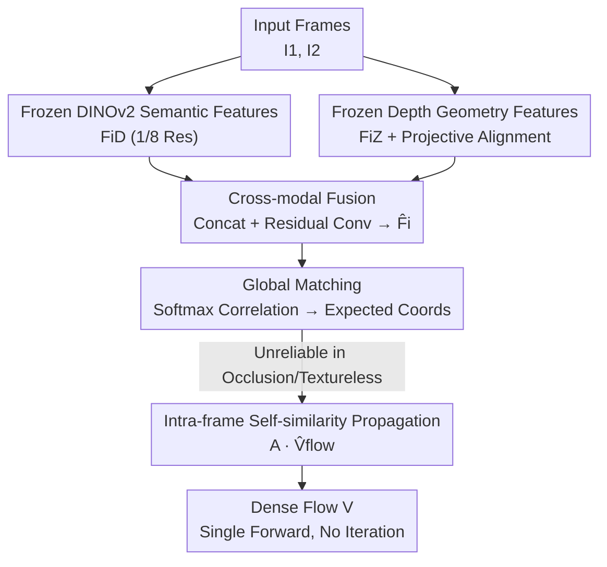

# Rethinking Dense Optical Flow without Test-Time Scaling

**Conference**: CVPR 2026  
**arXiv**: [2605.08000](https://arxiv.org/abs/2605.08000)  
**Code**: None  
**Area**: 3D Vision / Optical Flow Estimation  
**Keywords**: Dense Optical Flow, Foundation Model Prior, DINOv2, Monocular Depth, Global Matching, Zero-shot Generalization

## TL;DR
This paper proposes replacing task-specific optical flow encoders with frozen vision foundation models (DINOv2 for semantic features + Depth Anything V2 for geometric features). By estimating dense flow through a single-forward global matching session without any iterative refinement (test-time refinement), the method achieves a 2.81 EPE on Sintel Final, challenging the dominant assumption that improving optical flow necessitates stacking test-time computation.

## Background & Motivation
**Background**: Dense optical flow is a fundamental vision task that estimates a displacement vector for every pixel between two frames. Accuracy gains over the past decade have primarily been driven by two directions—increasingly complex architectures (RAFT, SEA-RAFT, FlowFormer) and **multi-step iterative refinement at test-time** (recurrent update/refinement). RAFT reformulates optical flow as "iterative corrections on all-pairs correlation volumes," typically requiring 32 iterations; similarly, SEA-RAFT and FlowSeek rely on 4 or more refinement steps to reach SOTA performance.

**Limitations of Prior Work**: This "trading test-time computation for accuracy" trajectory (termed "test-time scaling" by the authors) is computationally expensive, requiring multiple rounds of recurrent operators for a single estimation. Furthermore, these methods still insist on training a **flow-specific feature encoder**, necessitating large-scale labeled data and lengthy training schedules. Even approaches like FlowSeek that introduce monocular depth priors merely **inject depth into the recurrent refinement** as a guidance for correction, while the backbone remains a flow-specific model trained from scratch.

**Key Challenge**: Optical flow is essentially a **correspondence problem**—the core difficulty lies in learning representations that can reliably match pixels across frames while respecting scene structure and motion boundaries. Modern vision foundation models (semantic discriminativeness of DINOv2, boundary-aware geometric cues of Depth Anything) **already encode these properties**, yet remain disconnected from the optical flow field. The prevailing practice assumes optical flow must be explicitly learned and repeatedly refined, wasting existing strong priors.

**Goal**: To estimate competitive dense optical flow through a single forward pass without any additional test-time computation or iterative refinement, verifying whether "strong foundation model priors can partially substitute for test-time scaling."

**Key Insight**: Treat vision foundation models as **frozen representation priors** rather than trainable tasks. Since DINOv2 provides spatially consistent semantic embeddings and depth models provide sharp geometric boundaries, fusing them for direct global matching may allow correspondences to "naturally emerge" without the need for recurrent correction.

**Core Idea**: Replace "task-specific encoders + multi-step refinement" with "frozen DINOv2 semantic features + frozen depth foundation features $\rightarrow$ cross-modal fusion $\rightarrow$ single-pass global matching + propagation." This shifts optical flow from a "task requiring training and repeated correction" back to "inference on fixed pre-trained representations."

## Method

### Overall Architecture
Given two RGB input frames $\mathbf{I}_1, \mathbf{I}_2 \in \mathbb{R}^{H \times W \times 3}$, the goal is to estimate a dense flow field $\mathbf{V} \in \mathbb{R}^{H \times W \times 2}$. The framework adopts the "global matching + propagation" pipeline from GMFlow but **entirely replaces the critical feature encoder**: instead of training a flow-specific CNN encoder, it extracts semantic and geometric features from two frozen foundation models, fuses them into a unified representation, and performs a single-pass transformer-based global matching to compute flow—with no recurrent units, iterative refinement, or test-time optimization.

The process follows four steps: ① Extract $1/8$ resolution dense semantic features $\mathbf{F}_i^D$ using a frozen **DINOv2-S**; ② Extract intermediate depth decoder features $\mathbf{F}_i^Z$ using a frozen **Depth Anything V2-B**, followed by a learnable projection $\Psi_{\text{proj}}$ to align resolution and channels with $\mathbf{F}_i^D$; ③ Concatenate the two features along the channel dimension and pass them through a **cross-modal fusion network** $\Psi_{\text{fusion}}$ to obtain a unified representation $\hat{\mathbf{F}}_i$; ④ Pass the fused features through a transformer encoder for **global matching** (taking the expectation of coordinates from a softmax correlation volume) to get the initial flow, then apply intra-frame self-similarity **propagation** to diffuse reliable estimates to occluded or textureless regions. Only the projection, fusion, and matching modules are trainable; both foundation backbones remain frozen throughout.

### Key Designs

**1. Replacing Flow-specific Encoders with Frozen DINOv2: Outsourcing Correspondence to Self-supervised Priors**

Addressing the limitation that "training flow-specific encoders requires massive labels and risks overfitting to motion biases," the authors directly use frozen DINOv2-S features $\mathbf{F}_i^D = \Phi_{\text{DINO}}(\mathbf{I}_i) \in \mathbb{R}^{\frac{H}{8} \times \frac{W}{8} \times C_D}$. DINOv2, trained self-supervisely on internet-scale images, provides dense embeddings that are spatially consistent and capture fine-grained structure, making them naturally suited for cross-frame matching. The key is **keeping it frozen**: not updating the backbone ensures the large-scale vision priors are preserved from being distorted by motion supervision, while also transforming optical flow into "inference on fixed representations" rather than "simultaneous representation learning and flow estimation." This is the root of its strong **zero-shot (synthetic training $\rightarrow$ real testing)** generalization.

**2. Intermediate Features of Depth Foundation Models as Geometric Priors: Anchoring Motion Boundaries with Structural Cues**

Motion discontinuities in optical flow often coincide with depth boundaries, yet pure semantic features may be insensitive to geometric edges. The authors utilize **intermediate depth decoder features** $\mathbf{F}_i^Z = \Phi_{\text{Depth}}(\mathbf{I}_i)$ from a frozen Depth Anything V2-B rather than the final scalar depth map. Prior work suggests intermediate representations carry more transferable and information-rich geometric signals (discontinuities, object boundaries, spatial layout, and implicit uncertainty in occluded/reflective areas). Since depth feature resolution/dimensions differ from DINOv2, a lightweight convolutional projection $\tilde{\mathbf{F}}_i^Z = \Psi_{\text{proj}}(\mathbf{F}_i^Z)$ is used for alignment. Unlike FlowSeek, which uses depth as a **refinement guide**, this method uses it as a **prior to shape the correspondence representation itself**, without relying on camera intrinsics or explicit 3D reconstruction assumptions.

**3. Cross-modal Fusion: Integrating Semantics and Geometry before Matching**

Semantic features emphasize appearance consistency, while geometric features emphasize structural boundaries. These are complementary but heterogeneous. The authors first concatenate them $\mathbf{F}_i^C = \text{Concat}(\mathbf{F}_i^D, \tilde{\mathbf{F}}_i^Z)$, then apply a lightweight residual fusion network $\hat{\mathbf{F}}_i = \Psi_{\text{fusion}}(\mathbf{F}_i^C)$. This allows the network to **re-weight, suppress, or enhance** features cross-modally in a data-driven manner. Crucially, **fusion occurs before any matching or motion estimation**—early fusion enables the final representation to encode both "appearance similarity" and "structural consistency," thereby disambiguating regions with low texture, repetitive patterns, or motion boundaries before they reach the matcher.

**4. Single-pass Global Matching + Self-similarity Propagation: Non-iteratively Filling Unreliable Regions**

Once fused features $\mathbf{F}_1, \mathbf{F}_2$ are obtained via a transformer encoder, global matching is performed **only once** following the GMFlow pipeline. The all-pairs correlation volume $\mathbf{C}_{\text{flow}} = \frac{\mathbf{F}_1 \mathbf{F}_2^\top}{\sqrt{D}}$ is calculated and converted into a matching distribution $\mathbf{M}_{\text{flow}}$ via softmax. Taking the expectation over the second frame coordinate grid $\mathbf{G}_{2D}$ yields corresponding coordinates $\hat{\mathbf{G}}_{2D} = \mathbf{M}_{\text{flow}} \mathbf{G}_{2D}$, and the initial flow is the displacement $\hat{\mathbf{V}}_{\text{flow}} = \hat{\mathbf{G}}_{2D} - \mathbf{G}_{2D}$. While this provides sub-pixel accuracy for large displacements, softmax matching assumes reliable correspondence for every pixel, which fails in occluded or textureless areas. Consequently, a **propagation** step uses intra-frame feature self-similarity $\mathbf{A} = \text{softmax}(\frac{\mathbf{F}_1 \mathbf{F}_1^\top}{\sqrt{D}})$ to diffuse estimates from reliable regions: $\mathbf{V} = \mathbf{A} \, \hat{\mathbf{V}}_{\text{flow}}$. The authors intentionally **leave the matching operator unchanged** from GMFlow to strictly attribute performance gains to the "foundation model-driven representations."

### Loss & Training
The model is supervised using an $\ell_1$ regression loss between predicted flow and ground truth (robust to outliers and aligned with the EPE evaluation metric), applied to both intermediate and final predictions with higher weight on the latter:

$$L = \sum_{i=1}^{N} \gamma^{N-i} \left\| \mathbf{v}^{(i)} - \mathbf{v}_{gt} \right\|_1$$

Where $N$ is the number of predictions, $\mathbf{v}^{(i)}$ is the $i$-th stage prediction, and $\gamma$ balances their weights. Training is staged: 200k iterations on FlyingChairs (batch 16, lr $4 \times 10^{-4}$, crop $384 \times 512$), then 800k iterations on FlyingThings3D (lr $2 \times 10^{-4}$, crop $384 \times 768$). Fine-tuning experiments use the TSKH blend (KITTI+HD1K+Things+Sintel) for 200k iterations. Using two RTX 6000 GPUs and AdamW, DINOv2 and Depth Anything V2 backbones are frozen, optimizing only the projection, fusion, and matching modules.

## Key Experimental Results

### Main Results
**Cross-dataset Generalization (Trained on Chairs+Things only, no target domain fine-tuning):**

| Method | #refine | Things(val,clean) EPE | Sintel(train,clean) EPE | Sintel(train,final) EPE |
|------|---------|------|------|------|
| RAFT | 32 | 4.25 | 1.43 | 2.71 |
| GMFlow | 0 | 3.48 | 1.50 | 2.96 |
| GMFlow | 1 | 2.80 | 1.08 | 2.48 |
| SEA-RAFT (S) | 4 | – | 1.27 | **4.32** |
| FlowSeek (T) | 4 | 3.94 | 1.16 | 2.48 |
| **Ours** | **0** | 3.02 | 1.46 | **2.81** |

The core strength lies in **Sintel Final**: Ours (2.81 EPE) significantly outperforms SEA-RAFT (4.32) under equivalent training conditions and matches FlowSeek (2.63), which uses extra TartanAir pre-training—all while being **strictly single-forward with zero refinement**.

**Sintel train (After Chairs+Things+TSKH training):**

| Method | Extra Data | #refine | Clean EPE | Final EPE |
|------|-----------|---------|-----------|-----------|
| RAFT | – | 32 | 0.768 | 1.217 |
| GMFlow | – | 0 | 0.947 | 1.276 |
| GMFlow | – | 1 | 0.762 | 1.110 |
| SEA-RAFT (S) | TartanAir | 4 | **0.546** | **0.782** |
| FlowSeek (T) | TartanAir | 4 | 0.71 | 1.28 |
| **Ours** | – | 0 | 0.847 | 1.140 |

On Sintel Final (1.140), the method outperforms RAFT, GMFlow (0-refine), and FlowSeek. SEA-RAFT remains superior, but this is attributed to training scale: SEA-RAFT uses $8\times$ L40 GPUs and TartanAir pre-training, whereas Ours uses $2\times$ RTX 6000 with no extra data.

**KITTI train (After fine-tuning):** Ours achieves EPE 1.99 / F1-all 7.40, comparable to GMFlow (0-refine: 2.06 / 7.57). SEA-RAFT and FlowSeek are better here due to recurrent refinement's advantage in handling KITTI's sharp motion boundaries and occlusions.

### Ablation Study

| Config | Things EPE | Sintel Clean EPE | Sintel Final EPE | Final s40+ EPE |
|------|-----------|------------------|------------------|----------------|
| w/o Fusion Module | 3.52 | 1.575 | 3.12 | 19.37 |
| **w/ Fusion Module (Full)** | 3.02 | 1.46 | 2.81 | 16.99 |

| Config | FlyingChairs EPE (100k iters) |
|------|------|
| w/o Depth Features (also w/o fusion) | 1.77 |
| w/ Depth Features | **0.87** |

### Key Findings
- **Cross-modal fusion is vital**: Enabling fusion improves Sintel Final EPE from 3.12 to 2.81. The largest gains occur in **large-motion regions** ($s_{40+}$ EPE dropped from 19.37 to 16.99), proving semantic+geometric complementarity helps disambiguate large displacements.
- **Depth features are the cornerstone**: Adding depth features on FlyingChairs reduced EPE from 1.77 to 0.87 (~51% drop), suggesting geometric cues are essential rather than just supplementary.
- **Foundation priors can substitute test-time scaling**: Outperforming the 4-step refined SEA-RAFT in zero-shot Sintel tests directly supports the hypothesis that strong priors can offset the need for iterative computation.

## Highlights & Insights
- **Subtracting Complexity**: While the field typically adds architectural complexity and refinement steps, this paper demonstrates that leveraging existing foundation model priors allows a single forward pass to suffice.
- **Intermediate Depth Features as a Trick**: A significant engineering insight—intermediate depth decoder layers carry more transferable signals (boundaries, uncertainty) than the final depth map.
- **Early Fusion Philosophy**: Fusing priors before matching and keeping the matcher unchanged isolates the performance gains to the "representation" itself rather than architectural tuning.
- **Inherent Zero-shot Robustness**: Because the backbones are frozen and only lightweight modules are trained, the model is exceptionally robust to synthetic-to-real domain shifts.

## Limitations & Future Work
- **Limitations**: Accuracy degrades in scenes with heavy occlusion or extremely fine structures (evident on KITTI). Performance is bounded by the quality of the foundation models and inherits their biases.
- **Caveats**: The "outperforming SEA-RAFT" claim mainly holds in zero-shot settings under equivalent training; when opponents use $4\times$ the compute and extra datasets, this method still trails SOTA, suggesting a trade-off between simplicity and absolute performance.
- **Future Directions**: Introducing **lightweight refinement** or **larger-scale pre-training** within the foundation model paradigm—specifically, using priors to minimize the number of required refinement steps.

## Related Work & Insights
- **vs RAFT / SEA-RAFT**: They rely on recurrent update operators (32 / 4 steps) to scale performance; Ours uses a single pass. The edge in zero-shot Sintel Final comes from replacing task-specific encoders with foundation representations.
- **vs GMFlow**: Ours adopts the global matching formula but **removes flow-specific feature learning**, substituting it with frozen DINOv2+Depth features.
- **vs FlowSeek**: Both use depth foundation models. However, FlowSeek uses depth as a **guidance for recurrent updates**, whereas Ours uses it as a **representation prior** fused before matching. This highlights the distinction between "prior as correction" and "prior as representation."

## Rating
- Novelty: ⭐⭐⭐⭐ Systematically applying frozen foundation priors to replace iterative refinement in optical flow is a fresh and well-argued perspective.
- Experimental Thoroughness: ⭐⭐⭐ Good coverage of Sintel/KITTI/Things, though it lacks direct quantification of inference latency/FLOPs to prove the "test-time scaling" savings.
- Writing Quality: ⭐⭐⭐⭐ Clear motivation and solid mathematical formulation of components.
- Value: ⭐⭐⭐⭐ Offers a viable path to reduce optical flow inference costs, particularly useful for resource-constrained or zero-shot scenarios.

<!-- RELATED:START -->

## Related Papers

- [\[CVPR 2026\] Optical Flow Matching: Reframing Optical Flow as Continuous Transport Dynamics](optical_flow_matching_reframing_optical_flow_as_continuous_transport_dynamics.md)
- [\[CVPR 2026\] Flow4DGS-SLAM: Optical Flow-Guided 4D Gaussian Splatting SLAM](flow4dgs-slam_optical_flow-guided_4d_gaussian_splatting_slam.md)
- [\[CVPR 2026\] Learning 3D Reconstruction with Priors in Test Time](tco_learning_3d_reconstruction_with_priors_in_test_time.md)
- [\[CVPR 2026\] ZipMap: Linear-Time Stateful 3D Reconstruction via Test-Time Training](zipmap_linear-time_stateful_3d_reconstruction_via_test-time_training.md)
- [\[CVPR 2026\] Dense Metric Depth Completion from Sparse Direct Time-of-Flight Sensors](dense_metric_depth_completion_from_sparse_direct_time-of-flight_sensors.md)

<!-- RELATED:END -->
