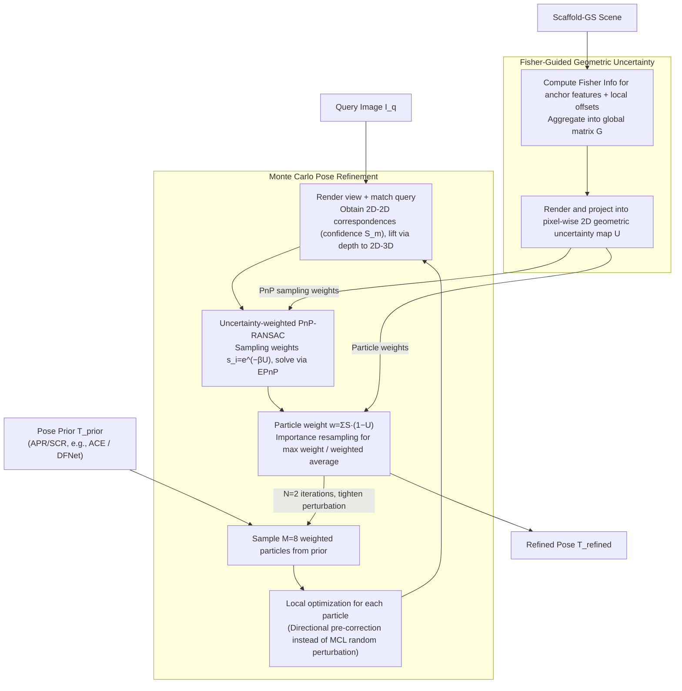

# Rethinking Pose Refinement in 3D Gaussian Splatting under Pose Prior and Geometric Uncertainty

**Conference**: CVPR2026  
**arXiv**: [2603.16538](https://arxiv.org/abs/2603.16538)  
**Code**: [Project Page](https://arxiv.org/abs/2603.16538) (Code released)  
**Area**: 3D Vision  
**Keywords**: 3D Gaussian Splatting, Visual Localization, Pose Refinement, Monte Carlo Sampling, Fisher Information, Uncertainty Modeling

## TL;DR

The UGS-Loc framework is proposed to jointly model pose prior uncertainty and geometric uncertainty through Monte Carlo pose sampling and Fisher information-guided PnP optimization, significantly enhancing the robustness of camera pose refinement in 3DGS scenes without requiring retraining.

## Background & Motivation

- **Current State of 3DGS Pose Refinement**: 3D Gaussian Splatting has become a powerful scene representation in visual localization. Pose refinement methods based on the "render-and-compare" strategy have achieved SOTA accuracy.
- **Neglected Pose Prior Uncertainty**: Existing methods rely on a single deterministic pose estimate from APR/SCR. When the initial pose bias is large or occlusion is severe, the matching quality between the rendered view and the query image degrades sharply.
- **Neglected Geometric Uncertainty**: 3DGS ellipsoidal primitives are only approximate geometries. Depth rendering in regions with sparse training views or dynamic object contamination is not uniformly reliable, yet existing methods treat all depths equally.
- **Error Propagation Chain**: Unreliable depths are used to lift 2D-2D correspondences to 2D-3D correspondences. Erroneous geometric information is directly passed to the PnP solver, leading to unstable pose estimation.
- **Fragility of Deterministic Pipelines**: Methods like GS-CPR are highly sensitive to initial poses. Figure 2 demonstrates erroneous correspondences and unstable refinement originating from biased poses.
- **Goal**: AR/VR, autonomous driving, and robotics applications have strict requirements for pose refinement robustness. A general uncertainty-aware solution that does not require retraining is needed.

## Method

### Overall Architecture

UGS-Loc revisits "render-and-compare" camera pose refinement in 3DGS, pointing out that two components have been treated as deterministic: the initial pose prior from APR/SCR and the depth geometry rendered by 3DGS. Both are reformulated as explicitly modeled uncertainties—Monte Carlo refinement handles pose prior uncertainty, and Fisher information-guided PnP handles geometric uncertainty. The entire framework is an inference-time pipeline requiring no retraining or additional supervision, completing in 2 iterations with 8 particles.

### Key Designs

**1. Monte Carlo Pose Refinement: Replacing a Single Deterministic Pose with Weighted Particles**

**Mechanism**: Existing methods trust a single deterministic pose from APR/SCR. When initial bias or occlusion is high, matching quality collapses. UGS-Loc uses a weighted particle set $\mathcal{P}=\{(\mathbf{T}^{(m)}, w^{(m)})\}_{m=1}^{M}$ to represent the pose prior, where $\mathbf{T}^{(m)} \in SE(3)$. It replaces traditional MCL random perturbations with local optimization to guide particles toward local modes of the likelihood distribution, reducing the required particle count. The importance weight of each particle combines matching confidence $S_m$ and geometric uncertainty $U_m$:

$$w^{(m)} = \frac{\sum_i S_m(r_i) \cdot (1 - U_m(r_i))}{\sum_j \sum_i S_j(r_i) \cdot (1 - U_j(r_i))}$$

The final pose is obtained via importance resampling of the highest-weight particle or a weighted average, allowing multiple hypotheses to compete rather than relying on a single guess.

**2. Fisher Information-Guided Geometric Uncertainty: Biasing PnP towards Reliable Geometric Sampling**

**Design Motivation**: 3DGS ellipsoidal rendered depth is not universally reliable. Errors in sparse or dynamic regions can feed incorrect 2D-3D correspondences into the PnP solver. UGS-Loc extends Fisher information to the anchor-based Scaffold-GS representation (parameterized by anchor features and local offsets). It uses the diagonal Hessian of a Laplace approximation, $\mathrm{H}'' \simeq \mathrm{diag}((\nabla_\theta f)^\top (\nabla_\theta f)) + \lambda I$, aggregated from all training views into a global matrix $\mathrm{G}$. This is projected via the 3DGS rendering formula into a pixel-wise 2D uncertainty map. This map is converted into sampling weights $s_i = e^{-\beta \bar{U}(r_i)} + \epsilon$, biasing RANSAC toward geometrically reliable regions. Consensus evaluation is similarly weighted. This naturally integrates geometric uncertainty into sampling without modifying the PnP solver itself.

### Loss & Training

The framework is an inference-time refinement pipeline with no explicit loss function for training. PnP is solved using the EPnP algorithm with uncertainty-weighted RANSAC. Perturbation ranges are tightened across iterations—the first iteration samples from a uniform distribution of 10cm translation and 0.01° rotation, while subsequent iterations are reduced to 1cm / 0.01°.

## Key Experimental Results

### Main Results

**Indoor Benchmark (7Scenes)**

| Method | Chess | Fire | Heads | Office | Pumpkin | RedKitchen | Stairs | Avg (cm/°) |
|------|-------|------|-------|--------|---------|------------|--------|------------|
| ACE + GS-CPR | 0.5/0.15 | 0.6/0.25 | 0.4/0.28 | 0.9/0.26 | 1.0/0.23 | 0.7/0.17 | 1.4/0.42 | 0.8/0.25 |
| ACE + UGS-Loc | **0.37/0.12** | **0.47/0.20** | **0.36/0.25** | **0.77/0.22** | **0.79/0.18** | **0.58/0.15** | **1.11/0.33** | **0.64/0.21** |

- ACE + UGS-Loc reduces average error by approximately 20% compared to ACE + GS-CPR.
- Accuracy reaches 95.6% under a strict [2cm, 2°] threshold (compared to 93.1% for GS-CPR and its iterative variant GS-CPR²).

**Outdoor Benchmark (Cambridge Landmarks)**

| Method | Kings | Hospital | Shop | Church | Avg (cm/°) |
|------|-------|----------|------|--------|------------|
| DFNet + GS-CPR | 23/0.32 | 42/0.74 | 10/0.36 | 27/0.62 | 26/0.51 |
| DFNet + UGS-Loc | **18.7/0.19** | **14.5/0.29** | **3.9/0.15** | **5.5/0.17** | **10.7/0.20** |
| ACE + GS-CPR | 20/0.29 | 21/0.40 | 5/0.24 | 13/0.40 | 15/0.33 |
| ACE + UGS-Loc | **17.8/0.18** | **13.8/0.30** | **4.2/0.16** | **6.3/0.20** | **10.5/0.21** |

- **Gain**: UGS-Loc reduces the median translation error of GS-CPR by approximately 30% on Cambridge.
- When using DFNet as a weaker prior, UGS-Loc refinement can even surpass the ACE+GS-CPR combination.

### Ablation Study

- **Number of Particles**: As particles increase from 2 to 16, the Cambridge average error drops from 11.8/0.24 to 10.3/0.20 (DFNet prior), showing monotonic improvement.
- **Iterative Refinement**: Simple iteration in GS-CPR saturates quickly after the first pass, whereas UGS-Loc continues to converge to lower errors within 2 iterations.
- **Matching Modules**: MASt3r is slightly superior to SuperPoint+LightGlue (11/0.22 vs 13/0.26), but uncertainty-aware refinement allows lightweight matchers to achieve near-SOTA accuracy.
- **Efficiency**: The standard configuration (m=8) achieves end-to-end inference at 1.1s/iteration, significantly faster than MCLoc's 2.4s/query.

## Highlights & Insights

- **Dual Uncertainty Modeling**: First to jointly consider pose prior and geometric uncertainty in 3DGS pose refinement.
- **Novelty**: A plug-and-play inference-time solution adaptable to different pose estimators and matching modules without retraining.
- **Efficient Monte Carlo**: Replaces traditional MCL random predictions with local optimization, achieving SOTA with only 8 particles and 2 iterations.
- **Mechanism**: Geometric uncertainty integrates naturally into RANSAC via sampling weights, requiring no modification to the PnP solver.
- **Robustness**: Weak priors (DFNet) refined via UGS-Loc can approach results from strong priors (ACE).

## Limitations & Future Work

- Increasing the number of particles linearly increases inference time (16 particles ≈ 2× time), limiting real-time performance.
- Fisher information requires pre-computation and aggregation from all training views, necessitating re-computation upon scene updates.
- Geometric uncertainty was only validated on Scaffold-GS and not extended to other 3DGS variants (vanilla 3DGS, 2DGS, etc.).
- Rotation error improvement in Cambridge outdoor scenes is less significant than translation error improvement.
- Uncertainty modeling under dynamic scenes or extreme lighting changes was not explored.
- The perturbation range for Monte Carlo sampling remains a manually set hyperparameter.

## Related Work & Insights

- **vs GS-CPR**: GS-CPR is deterministic; UGS-Loc introduces a probabilistic framework, improving performance by 20-30%.
- **vs MCLoc**: Both are Monte Carlo-based, but MCLoc is NeRF-based and requires 80 iterations (2.4s), whereas UGS-Loc needs only 2 iterations (1.1s) with higher accuracy.
- **vs STDLoc**: STDLoc is close to UGS-Loc on 7Scenes (0.76 vs 0.64 cm), but UGS-Loc shows stronger cross-prior generalization.
- **vs Bayes' Rays / FisherRF**: These quantify uncertainty for reconstruction quality rather than localization; UGS-Loc is the first to use Fisher information for pose refinement.
- **vs HR-APR / NeFeS**: These methods requiring extra training reach 35/0.78 on Cambridge, while UGS-Loc reaches 10.5/0.21 without training.

## Rating

- **Novelty**: ⭐⭐⭐⭐ Clear dual uncertainty modeling systematically introduced to 3DGS localization.
- **Experimental Thoroughness**: ⭐⭐⭐⭐ Three benchmarks, multiple priors, and detailed ablations, though more 3DGS variants could be tested.
- **Writing Quality**: ⭐⭐⭐⭐ Clear diagrams, well-motivated, and complete derivations.
- **Value**: ⭐⭐⭐⭐ A practical, plug-and-play inference-time solution that directly advances the 3DGS localization community.

<!-- RELATED:START -->

## Related Papers

- [\[CVPR 2026\] VarSplat: Uncertainty-aware 3D Gaussian Splatting for Robust RGB-D SLAM](varsplat_uncertainty-aware_3d_gaussian_splatting_for_robust_rgb-d_slam.md)
- [\[CVPR 2026\] Wavelet-Driven 3D Anomaly Detection under Pose-Agnostic and Sparse-View](wavelet-driven_3d_anomaly_detection_under_pose-agnostic_and_sparse-view.md)
- [\[CVPR 2026\] UST-Hand: An Uncertainty-aware Spatiotemporal Point Cloud Interaction Network for 3D Self-supervised Hand Pose Estimation](ust-hand_an_uncertainty-aware_spatiotemporal_point_cloud_interaction_network_for.md)
- [\[CVPR 2026\] Energy-GS: Image Energy-guided Pose Alignment Gaussian Splatting with redesigned pose gradient flow](energy-gs_image_energy-guided_pose_alignment_gaussian_splatting_with_redesigned_.md)
- [\[CVPR 2026\] SR3R: Rethinking Super-Resolution 3D Reconstruction With Feed-Forward Gaussian Splatting](sr3r_rethinking_super-resolution_3d_reconstruction_with_feed-forward_gaussian_sp.md)

<!-- RELATED:END -->
