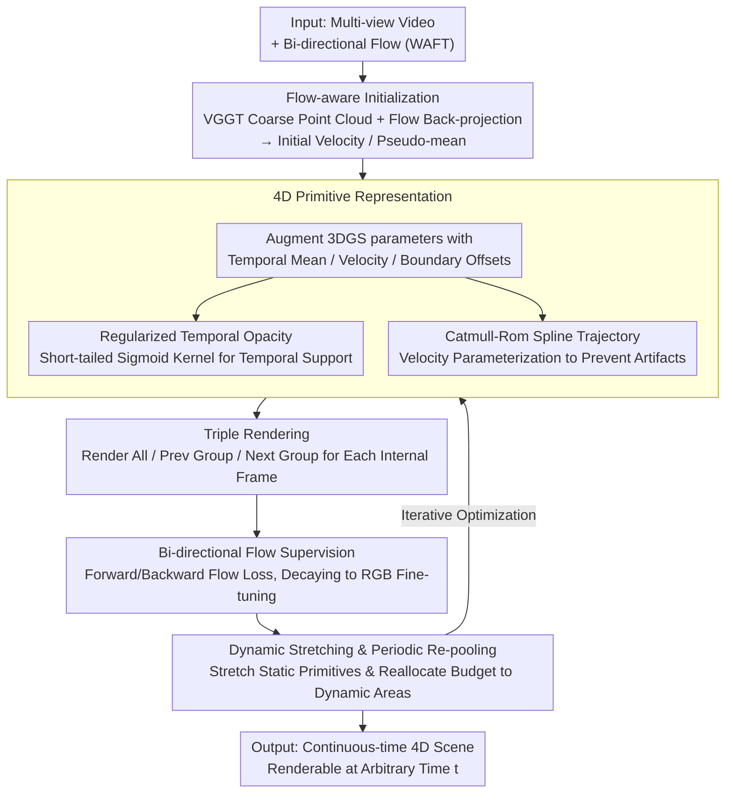

# RetimeGS: Continuous-Time Reconstruction of 4D Gaussian Splatting

**Conference**: CVPR2026  
**arXiv**: [2603.13783](https://arxiv.org/abs/2603.13783)  
**Code**: None  
**Area**: 3D Vision  
**Keywords**: 4D Gaussian Splatting, Dynamic Scene Reconstruction, Temporal Interpolation, Optical Flow Supervision, Catmull-Rom Spline, Temporal Aliasing

## TL;DR

This paper proposes RetimeGS, which integrates regularized temporal opacity, Catmull-Rom spline trajectories, bidirectional optical flow supervision, and triple rendering strategies. These designs resolve ghosting and temporal aliasing issues in 4D Gaussian Splatting (4DGS) during inter-frame interpolation, enabling ghost-free continuous-time 4D reconstruction at arbitrary timestamps.

## Background & Motivation

High-fidelity reconstruction of dynamic scenes is a core problem in CV/CG. A key requirement is **retime control**—rendering dynamic scenes at arbitrary timestamps while maintaining temporal consistency for effects like slow-motion playback, high-frame-rate VR rendering, and "bullet time" in VFX. This essentially requires generating continuous intermediate frames between discrete input frames.

### Two Paradigms of Existing Methods and Their Limitations

**Paradigm 1: Deformation Field Methods** (Deform-GS, MotionGS, etc.) model geometry and appearance in a canonical space, capturing dynamics through deformation fields, control points, or physical constraints:

- **Limitations of Prior Work**: These methods assume dynamics primarily stem from geometric motion and fail when the **visibility or texture appearance of objects changes over time**.
- **Limitations of Prior Work**: They rely on precise point correspondence estimation, which becomes unreliable during **large motions or situations with limited frame overlap**.
- **Key Challenge**: A single primitive may accumulate spatially misaligned signals due to incorrect correspondences, leading to visual artifacts and erroneous trajectories.

**Paradigm 2: 4D Primitive Methods** (STGS, Ex4DGS, etc.) represent dynamic scenes directly using 4D primitives, decomposing opacity into base opacity $\times$ spatial 3D Gaussian $\times$ temporal 1D Gaussian:

- **Key Challenge**: Temporal opacity is only supervised at **discrete integer frames** without any regularization.
- **Key Challenge**: Learned opacity tends to **overfit to discrete frames** (temporal aliasing: where the temporal support collapses to a sub-frame level).
- **Key Challenge**: Rendering intermediate frames results in typical **ghosting artifacts**, where translucent structures from adjacent input frames are statically superimposed.
- **Background**: While manageable for small motions or high-frame-rate data, this issue becomes severe in **large motion** scenarios.

**Key Insight**: An intuitive solution is low-pass filtering the temporal opacity (similar to Mip-Splatting's solution for spatial aliasing). However, a stretched temporal distribution requires precise trajectory estimation across multiple frames; otherwise, it introduces a different form of ghosting.

### Design Principles

Based on the analysis above, the representation in RetimeGS must satisfy three principles:

1.  **Dynamic Appearance/Disappearance** — Capture changes in appearance and visibility to overcome the limitations of deformation-based methods.
2.  **Regularization Against Collapse** — Prevent temporal support from collapsing into discrete frames under sparse temporal sampling.
3.  **Precise and Consistent Trajectories** — Maintain smooth and accurate motion throughout the primitive's lifespan to prevent ghosting caused by inconsistency.

## Method

### Overall Architecture

RetimeGS aims to solve the ghosting and temporal aliasing problems of 4DGS during interpolation between discrete frames, allowing ghost-free rendering at arbitrary timestamps. The input consists of multi-view videos and corresponding bidirectional optical flow (pre-computed by WAFT). The output is a 4D scene representation capable of rendering at any time $t$. The methodology centers on a redesigned 4D primitive representation, supported by four training strategies to ensure "non-collapsing temporal support" and "smooth, consistent trajectories."

### Key Designs

**1. 4D Primitive Representation: Temporal Mean, Velocity, and Spline Trajectories**

On top of standard 3DGS parameters $(x, s, h, q, \sigma)$, each Gaussian primitive is extended to:

$$(\mu_\tau,\ \tau_l,\ \tau_r,\ \boldsymbol{\mu},\ \boldsymbol{v},\ \boldsymbol{s},\ \boldsymbol{q}(t),\ \boldsymbol{h},\ \sigma)$$

Where $\mu_\tau$ is the temporal mean, $\tau_l, \tau_r$ are the temporal boundary offsets (defining temporal opacity), $\boldsymbol{\mu}$ is the pseudo-spatial mean, $\boldsymbol{v} = (v_1, v_2, v_3)$ are velocity components (together with $\mu$ defining the spline trajectory), and rotation $q(t)$ is modeled as a low-order polynomial of time. At any time $t$, standard 3DGS parameters $(\boldsymbol{x}(t), \boldsymbol{s}, \boldsymbol{q}(t), \boldsymbol{h}, \sigma_\tau(t), \sigma)$ are derived for projection, depth sorting, and alpha blending. This representation allows both "how geometry moves" and "when it appears/disappears" to be optimized, capturing changes in visibility and appearance and overcoming the limitations of pure deformation methods.

**2. Regularized Temporal Opacity: Short-tailed Sigmoid Kernels**

The root cause of ghosting in 4D primitive methods is that temporal opacity is only supervised at discrete frames and lacks regularization, leading to overfitting to discrete frames (temporal aliasing). RetimeGS initializes the temporal mean and boundary offsets as the midpoint and half-interval between two adjacent frames and keeps them non-optimizable:

$$\mu_\tau = \frac{t_i + t_{i+1}}{2}, \quad \tau_l = \tau_r = \frac{\Delta t}{2}$$

A short-tailed temporal kernel is defined using the product of two sigmoids to ensure smooth decay at the boundaries:

$$\sigma_\tau(t) = \tilde{\psi}_l\left(\frac{t - (\mu_\tau - \tau_l)}{\gamma}\right) \cdot \tilde{\psi}_r\left(\frac{(\mu_\tau + \tau_r) - t}{\gamma}\right)$$

At global video boundaries, the corresponding sigmoid is replaced by a constant 1 to avoid drop-offs in visibility, with $\gamma=0.005$ ensuring a short tail. This setup ensures each group of primitives covers the interval between two input frames while being supervised by both, allowing adjacent primitive groups to blend in/out smoothly.

**3. Catmull-Rom Spline Trajectories: Flow-supervised Splines**

Regularizing temporal opacity is insufficient if movements are large; linear velocity assumptions lead to piecewise linear artifacts. RetimeGS uses **Catmull-Rom splines** to model the spatial mean $\boldsymbol{x}(t)$, explicitly supervised by bidirectional optical flow. For a primitive with temporal mean at $(t_i + t_{i+1})/2$: $v_2$ is the linear velocity from frame $t_i$ to $t_{i+1}$, $v_1$ is from $t_{i-1}$ to $t_i$, and $v_3$ is from $t_{i+1}$ to $t_{i+2}$. The spline's four control points are derived directly: inner points $p_1 = \mu - \frac{1}{2}\Delta t \cdot v_2$ and $p_2 = \mu + \frac{1}{2}\Delta t \cdot v_2$ (which the spline passes through exactly), and outer points $p_0 = p_1 - \Delta t \cdot v_1$ and $p_3 = p_2 + \Delta t \cdot v_3$ to determine curvature. Optimization of "pseudo-mean + velocity components" is found to be more stable than optimizing control points directly.

### Loss & Training

Four strategies enable effective training:

1.  **Bi-directional Flow Supervision**: Uses forward and backward flow to establish coarse correspondences. At frame $t_i$, 3D displacements between adjacent primitive groups' control points are projected to 2D to form flow maps, which are supervised by GT flow. Flow learning rates decay to zero in later stages, switching entirely to RGB refinement.
2.  **Triple Rendering**: Rendering all primitives reconstructs input frames, but since each group covers different spatial regions, individual group renders are often under-reconstructed. For each internal frame $t_i$, three images are rendered—all primitives, the preceding group, and the succeeding group—all supervised by GT. This forces each group to independently explain the input frame, resolving uneven coverage.
3.  **Dynamic Stretching & Periodic Re-pooling**: After stabilization, adjacent nearest-neighbor primitives with similar colors and near-zero velocity have their $\tau_l, \tau_r$ stretched to cover more time, and redundant primitives are pruned. This allows static regions to use fewer primitives, reallocating the MCMC budget to dynamic areas.
4.  **Flow-aware Initialization**: Uses VGGT to estimate per-frame point clouds. 2D flow is back-projected to 3D to obtain initial 3D velocities, which initialize $v_1, v_2, v_3$, providing a reasonable starting point for optimization.

Training Details: The total loss includes RGB reconstruction, flow loss, opacity regularization (0.01), and scale regularization (0.1). MCMC re-pooling occurs every 100 iterations, with dynamic stretching every 3K iterations. Total training takes 20K iterations on an RTX 4090D.

## Key Experimental Results

### Main Results

| Method | PSNR ↑ | SSIM ↑ | LPIPS ↓ |
|:---|:---:|:---:|:---:|
| Deform-GS | 28.45 | 0.867 | 0.0272 |
| STGS | 25.34 | 0.825 | 0.0357 |
| GaussianFlow | 25.91 | 0.825 | 0.0339 |
| Ex4DGS | 25.95 | 0.811 | 0.0379 |
| 2D Lifting (FILM+STGS) | 28.79 | 0.886 | 0.0267 |
| **Ours (RetimeGS)** | **30.08** | **0.904** | **0.0225** |

RetimeGS outperforms all baselines across all metrics. Compared to the strongest baseline (2D Lifting), it achieves a PSNR gain of **+1.29 dB**, and a **+4.74 dB** gain over the 4D primitive baseline STGS.

### Ablation Study

| Configuration | PSNR ↑ | SSIM ↑ | LPIPS ↓ |
|:---|:---:|:---:|:---:|
| w/o Flow Init | 29.69 | 0.899 | 0.0227 |
| w/o Flow Supervision | 27.24 | 0.861 | 0.0282 |
| w/o Triple Rendering | 27.16 | 0.849 | 0.0319 |
| w/o Dynamic Stretching | 28.81 | 0.886 | 0.0247 |
| Linear Trajectory | 28.50 | 0.884 | 0.0243 |
| **Full RetimeGS** | **30.08** | **0.904** | **0.0225** |

### Key Findings

1.  **Triple Rendering** has the most significant impact (-2.92 dB). Without it, each group only explains partial regions, leading to missing textures in individual group renders.
2.  **Flow Supervision** is critical (-2.84 dB); without it, textures on fast-moving objects become severely distorted.
3.  **Spline vs. Linear Trajectories** (-1.58 dB) shows notable error reduction along edges in circular motion scenarios.
4.  **GaussianFlow** uses only forward flow and lacks temporal regularization; the optimizer can satisfy flow constraints while still collapsing temporal support, resulting in persistent ghosting.

## Highlights & Insights

1.  **Precise Diagnosis**: Correctly identifies ghosting in 4D primitive methods as temporal aliasing, creating a framework analogous to Mip-Splatting's approach to spatial aliasing.
2.  **Pseudo-mean + Velocity**: While mathematically equivalent to four control points, this parameterization provides a much better optimization landscape.
3.  **Triple Rendering**: A simple yet effective solution that forces each primitive group to independently justify the input frame, solving coverage gaps.
4.  **Dynamic Stretching**: Multiple benefits including reduced redundancy, reallocated budget for dynamic areas, and reduced flickering in static regions via cross-frame accumulated supervision.

## Limitations & Future Work

1.  **Low Frame Rates**: When inter-frame motion exceeds ~50 pixels (@1K), optical flow becomes unreliable, leading to artifacts in intermediate frames.
2.  **Slight Flickering**: The disjoint nature of adjacent primitive groups at input frame boundaries may still cause minor temporal discontinuities.
3.  **Dependency on Pre-computed Flow**: Reliance on WAFT flow quality increases pre-processing complexity.
4.  **Appearance Modeling**: SH coefficients are static; the method may struggle with dramatic lighting changes.

## Related Work & Insights

- **Mip-Splatting**: Inspired the temporal regularization framework, though RetimeGS notes that low-pass filtering requires accompanying trajectory design.
- **GaussianFlow**: Pioneered flow trajectory supervision, but RetimeGS proves flow alone is insufficient without temporal opacity regularization.
- **STGS**: A representative 4D primitive baseline where unconstrained temporal opacity leads to severe temporal aliasing.

## Rating

| Dimension | Score (1-10) |
|:---|:---:|
| Novelty | 7 |
| Technical Depth | 8 |
| Experimental Thoroughness | 8 |
| Writing Quality | 9 |
| Value | 7 |
| **Overall** | **7.5** |

## Related Papers

- [\[CVPR 2026\] 4C4D: 4 Camera 4D Gaussian Splatting](4c4d_4_camera_4d_gaussian_splatting.md)
- [\[CVPR 2026\] BulletGen: Improving 4D Reconstruction with Bullet-Time Generation](bulletgen_improving_4d_reconstruction_with_bullet-time_generation.md)
- [\[CVPR 2026\] AeroDGS: Physically Consistent Dynamic Gaussian Splatting for Single-Sequence Aerial 4D Reconstruction](aerodgs_physically_consistent_dynamic_gaussian_splatting_for_single-sequence_aer.md)
- [\[AAAI 2026\] Sparse4DGS: 4D Gaussian Splatting for Sparse-Frame Dynamic Scene Reconstruction](../../AAAI2026/3d_vision/sparse4dgs_4d_gaussian_splatting_for_sparse-frame_dynamic_scene_reconstruction.md)
- [\[CVPR 2026\] SV-GS: Sparse View 4D Reconstruction with Skeleton-Driven Gaussian Splatting](sv-gs_sparse_view_4d_reconstruction_with_skeleton-driven_gaussian_splatting.md)

<!-- RELATED:END -->

<!-- RELATED:START -->

## Related Papers

- [\[CVPR 2026\] 4C4D: 4 Camera 4D Gaussian Splatting](4c4d_4_camera_4d_gaussian_splatting.md)
- [\[AAAI 2026\] Sparse4DGS: 4D Gaussian Splatting for Sparse-Frame Dynamic Scene Reconstruction](../../AAAI2026/3d_vision/sparse4dgs_4d_gaussian_splatting_for_sparse-frame_dynamic_scene_reconstruction.md)
- [\[CVPR 2026\] GP-4DGS: Probabilistic 4D Gaussian Splatting from Monocular Video via Variational Gaussian Processes](gp-4dgs_probabilistic_4d_gaussian_splatting_from_monocular_video_via_variational.md)
- [\[CVPR 2026\] Layered 4D-Rotor Gaussian Splatting: A Compressed Representation for Long Dynamic Scenes](layered_4d-rotor_gaussian_splatting_a_compressed_representation_for_long_dynamic.md)
- [\[CVPR 2026\] AeroDGS: Physically Consistent Dynamic Gaussian Splatting for Single-Sequence Aerial 4D Reconstruction](aerodgs_physically_consistent_dynamic_gaussian_splatting_for_single-sequence_aer.md)

<!-- RELATED:END -->
