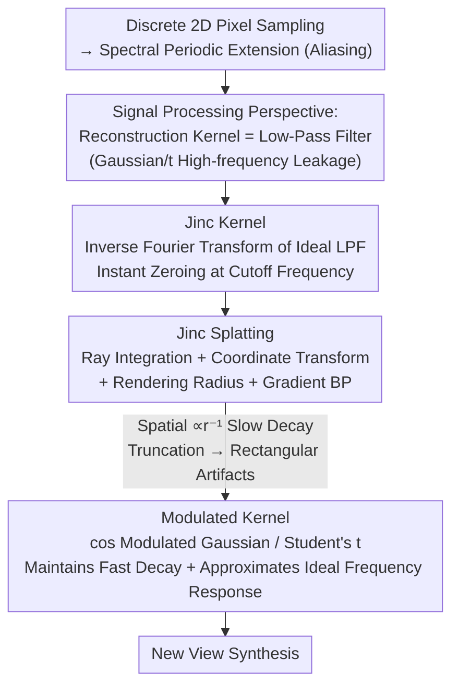

# Revisiting 3D Reconstruction Kernels as Low-Pass Filters

**Conference**: CVPR 2026  
**Paper**: [CVF Open Access](https://openaccess.thecvf.com/content/CVPR2026/html/Zhang_Revisiting_3D_Reconstruction_Kernels_as_Low-Pass_Filters_CVPR_2026_paper.html)  
**Code**: Not provided in cache  
**Area**: 3D Vision / New View Synthesis / 3D Gaussian Splatting  
**Keywords**: Signal Processing, Ideal Low-pass Filter, Jinc Kernel, Modulated Kernel, Anti-aliasing

## TL;DR
This paper reinterprets the "reconstruction kernel" in 3D Gaussian Splatting (3DGS) as a "low-pass filter" in signal reconstruction. It demonstrates that Gaussian, Exponential, and Student’s t kernels are non-ideal low-pass filters (causing aliasing via high-frequency leakage). Accordingly, it proposes the **Jinc kernel**, derived from the ideal low-pass filter, and introduces a **modulated kernel** to balance frequency fidelity with fast spatial decay, outperforming both 3DGS and SSS in low- and high-resolution new view synthesis.

## Background & Motivation

**Background**: 3D reconstruction essentially recovers continuous 3D signals from discrete 2D pixel samples. Explicit representations like 3DGS use an accumulation of "primitive kernels" (Gaussian ellipsoids) to represent scenes, utilizing rasterization for real-time rendering. Subsequent works have replaced these kernels: GES uses generalized exponential functions, SSS (3D Student Splatting and Scooping) uses Student’s t mixtures with positive/negative densities, and 3DGabSplat employs Gabor primitives.

**Limitations of Prior Work**: The authors unify these methods under a neglected perspective: **the Fourier transform of a reconstruction kernel is the low-pass filter in signal reconstruction**. Discrete sampling causes periodic spectral extension; to recover the continuous signal, a low-pass filter must isolate the baseband spectrum from its replicas. The problem lies in the fact that the frequency responses of Gaussian, Exponential, and Student’s t kernels do not **decay sharply** at the cutoff frequency. This leads to high-frequency leakage, where high- and low-frequency components overlap, resulting in aliasing and blurred details during rendering. Point clouds represent an extreme case—their frequency response is a constant 1, providing zero filtering capability.

**Key Challenge**: An ideal low-pass filter (instant zeroing at the cutoff frequency) completely suppresses aliasing, but its spatial domain counterpart (the Jinc function) **decays extremely slowly** ($\propto r^{-1}$). During rendering, this would result in each pixel being covered by a massive number of kernels, causing memory and time complexity to explode. Reducing memory by truncating the kernel prematurely breaks continuity across tiles, producing **rectangular artifacts** (matching the rasterization tile size). Thus, a trade-off exists between "frequency fidelity" and "spatial efficiency."

**Goal**: ① Provide a unified framework to evaluate various 3D reconstruction kernels from a signal processing perspective; ② Design kernels that closely approximate ideal low-pass filters; ③ Achieve anti-aliasing benefits without memory explosions or artifacts.

**Key Insight**: Since kernels are filters, the reconstruction kernel can be derived directly from the "ideal low-pass filter"—this leads to the Jinc kernel. Furthermore, frequency modulation can be used to "shift" existing fast-decaying kernels to approximate the frequency response of an ideal filter.

**Core Idea**: Replace empirical Gaussian/Student’s t kernels with the inverse Fourier transform of an ideal low-pass filter (Jinc kernel) to eliminate aliasing, then utilize a cosine modulated kernel to approximate the ideal frequency response while maintaining the fast spatial decay of the base kernel.

## Method

### Overall Architecture
The paper follows a "signal processing derivation chain": identifying spectral periodic extension from discrete sampling as the root problem, then proving that explicit 3D kernels act as low-pass filters. Based on this, it derives the **Jinc kernel** from the 3D ideal low-pass filter and designs a differentiable **Jinc Splatting** rasterization pipeline (ray integration, coordinate transformation, rendering radius, and gradient backpropagation). Finally, to address the rectangular artifacts caused by Jinc's slow spatial decay, it proposes the **modulated kernel** as a practical engineering trade-off.

### Key Designs

**1. Signal Processing Perspective and Jinc Kernel: Deriving Kernels from Ideal Filters**

This step targets the root cause of why existing kernels fail: their frequency responses do not drop to zero sharply at the cutoff frequency, allowing high frequencies to leak into the low-frequency band. The authors define the 3D Ideal Low-Pass Filter (ILPF) as a spherical indicator function in the frequency domain—all-pass within radius $f_c$ and all-stop outside: $H(\bm{f}) = 1$ when $\|\bm{f}\| \le f_c$, otherwise $0$. Applying the inverse Fourier transform yields the isotropic spatial kernel:

$$h(r) = \frac{2 f_c^2}{r}\, j_1(2\pi f_c r),$$

where $j_1(\alpha) = \frac{\sin\alpha - \alpha\cos\alpha}{\alpha^2}$ is the spherical Bessel function of the first kind—this is the Jinc kernel. It is then generalized into an anisotropic form (using covariance $\Sigma = RSS^\top R^\top$, where the cutoff frequency is absorbed into the scale matrix $S$): $h(\bm{x}) = \dfrac{j_1(\sqrt{(\bm{x}-\bm{\mu})^\top \Sigma^{-1}(\bm{x}-\bm{\mu})})}{\sqrt{(\bm{x}-\bm{\mu})^\top \Sigma^{-1}(\bm{x}-\bm{\mu})}}$. The fundamental difference from Gaussian/Student’s t is that Jinc is a **truncated** ideal filter in the frequency domain, theoretically suppressing all aliasing.

**2. Jinc Splatting: Rasterizing the Jinc Kernel like 3DGS**

Having the kernel is insufficient; it requires an optimization-friendly rasterization scheme. Rendering a pixel involves affine and projection transforms, followed by integration along the ray. The authors derive the closed-form integration of the Jinc kernel along an arbitrary line $\bm{x}(t) = \bm{a} + t\bm{b}$, simplified via $\bm{m} = S^{-1}R^{-1}(\bm{a}-\bm{\mu})$ and $\bm{n} = S^{-1}R^{-1}\bm{b}$:

$$I = \frac{\pi\, J_1(\alpha)}{\|\bm{n}\|\,\alpha}, \qquad \alpha = \frac{\|\bm{m}\times\bm{n}\|}{\|\bm{n}\|},$$

where $J_1$ is the Bessel function of the first kind. Camera transformations from world to pixel coordinates are substituted to obtain $\alpha$ and the integral for each pixel $(u,v)$. To control computational costs, a threshold $q$ is set: the contribution of a kernel is truncated when $\alpha > q$. This is equivalent to solving a homogeneous quadratic equation $\bm{u}_h^\top(N - (\|\bm{m}\|^2 - q^2)Q)\bm{u}_h = 0$ on the projection plane, giving an ellipse (conic section) that defines the 2D rendering radius $\Sigma_{2D}$. Gradients $\partial I/\partial\alpha$ are derived to support end-to-end optimization.

**3. Modulated Kernels: Approximating Ideal Frequency Response via Cosine Modulation**

While Jinc is ideal in the frequency domain, its spatial decay ($\propto r^{-1}$) is too slow—each pixel is covered by too many kernels, causing memory/time to surge with resolution. Early truncation to save memory breaks continuity, resulting in tile-sized rectangular artifacts. The trade-off is to take existing fast-decaying kernels (Gaussian, Student’s t) and multiply them by a cosine term for "frequency shifting." For a 1D Gaussian:

$$h_g(x) = g(x)\big(\omega + (1-\omega)\cos(f_0 x)\big),$$

The frequency domain becomes $\mathcal{F}(h_g) = \omega G(f) + \frac{1-\omega}{2}\big(G(f-f_0) + G(f+f_0)\big)$, shifting the base spectrum to both sides to make the low-frequency response flatter and closer to an ideal filter; $\omega \in [0,1]$ balances original response and modulation. The shift $f_0$ is set to half the Full Width at Half Maximum (FWHM): $f_0 = 1.178\sigma$ for Gaussian and $1.386\sigma$ for Student’s t ($\nu=1$). The key benefit: modulated kernels inherit the exponential spatial decay ($\propto e^{-r^2}$), requiring no large support and producing no rectangular artifacts, while concentrating 95% of spectral energy more narrowly.

### Loss & Training
The method is implemented atop the SSS codebase, using the SGHMC optimizer and adaptive density control. Instead of the empirical $3\sigma$ rule used in Gaussian, the Jinc kernel spatial range is defined by the integral parameter $\alpha$ (fixed at $\alpha=30$). Modulated kernel experiments are conducted by replacing only the kernels in the original 3DGS and SSS codebases without changing other hyperparameters.

## Key Experimental Results

> Metrics: PSNR↑, SSIM↑, LPIPS↓. "Speed/Energy" refers to the decay rate and 95% energy concentration radius (normalized spatial length/wavenumber, smaller is more concentrated).

### Kernel Spatial/Frequency Characteristics (Table 1)

| Kernel | Spatial Decay | Spatial 95% Energy | Freq. Decay | Freq. 95% Energy |
|------|---------|-------------|---------|-------------|
| Gaussian [18] | $\propto e^{-r^2}$ | 2.77 | $\propto e^{-f^2}$ | 2.77 |
| Student's t [53] | $\propto r^{-2}$ | 3.68 | $\propto e^{-f}$ | 2.99 |
| Jinc | $\propto r^{-1}$ | 5.59 (Slowest) | Cutoff | **1.90** (Most Concentrated) |
| Modulated Gaussian | $\propto e^{-r^2}$ | ~2.77 | $\propto e^{-f^2}$ | <2.77 |
| Modulated Student's t | $\propto r^{-2}$ | ~3.68 | $\propto e^{-f}$ | <2.99 |

Gaussian has the fastest spatial decay, whereas Jinc is optimal in the frequency domain but worst spatially. Modulated kernels narrow the frequency energy while preserving spatial decay.

### Low-Resolution NVS (Table 2, NeRF-Synthetic Downsampled)

| Resolution | Method | PSNR↑ | SSIM↑ | LPIPS↓ |
|--------|------|-------|-------|--------|
| 64×64 | 3DGS [18] | 24.01 | 0.901 | 0.0575 |
| 64×64 | SSS [53] | 29.17 | 0.954 | 0.0214 |
| 64×64 | **Jinc** | **29.87** | **0.955** | **0.0199** |
| 128×128 | 3DGS [18] | 22.30 | 0.887 | 0.0956 |
| 128×128 | SSS [53] | 30.24 | 0.964 | 0.0230 |
| 128×128 | **Jinc** | **31.40** | 0.961 | 0.0411 |

At 64×64, Jinc is 0.70 dB higher than SSS and 5.86 dB higher than 3DGS. PSNR gains reach 9.10 dB at 128×128, confirming that ideal low-pass kernels effectively suppress aliasing.

### Standard NVS with Modulated Kernels (Table 3, Excerpts)

| Dataset | Method | PSNR↑ | SSIM↑ | LPIPS↓ |
|--------|------|-------|-------|--------|
| Mip-NeRF360 | 3DGS [18] | 28.69 | 0.870 | 0.182 |
| Mip-NeRF360 | **Ours (3DGS)** | **29.16** | 0.871 | 0.181 |
| Mip-NeRF360 | SSS [53] | 29.90 | 0.893 | 0.145 |
| Mip-NeRF360 | **Ours (SSS)** | **29.96** | 0.893 | **0.143** |
| Tanks & Temples | 3DGS [18] | 23.14 | 0.841 | 0.183 |
| Tanks & Temples | **Ours (3DGS)** | **23.86** | **0.853** | **0.168** |

### Key Findings
- **Gains from ideal low-pass kernels are significant**: At low resolutions, Jinc's PSNR improvement over 3DGS ranges from 5.86 to 9.10 dB, proving high-frequency leakage is a major bottleneck for standard kernels.
- **Modulation benefits 3DGS more (up to +0.72 dB PSNR)**: Since Gaussian frequency decay is fast, modulation significantly strengthens the low-frequency response. SSS has inherently slower spectral decay, so while gains are modest, they remain consistent.
- **Jinc is impractical for high resolution**: The $\propto r^{-1}$ decay leads to memory/time bloat, necessitating modulated kernels for practical deployment—hence the split evaluation strategy.

## Highlights & Insights
- **Unified empirical kernels under signal processing**: By framing "kernel Fourier transform = low-pass filter," it places 3DGS/GES/SSS/Gabor in a unified evaluative coordinate system. 
- **Derivation from ideal objectives**: Instead of tweaking empirical kernels, the paper starts from an ideal objective (spherical indicator function) and applies an inverse transform to find the Jinc kernel.
- **Modulation as a transferable trick**: The "cos modulation + accumulation" strategy is "plug-and-play" for any fast-decaying kernel to reshape its frequency response.
- **Honest assessment of Jinc limitations**: By using a split experimental design (Jinc for low-res, modulated for standard), the paper avoids overstating Jinc's practical utility while maintaining its theoretical importance.

## Limitations & Future Work
- The Jinc kernel possesses two inherent issues: slow spatial decay requires large supports (high memory + rectangular artifacts), and ideal filters naturally exhibit **ringing** (oscillations in intensity transitions).
- Modulated kernels are a compromise; they do not perfectly match the ideal frequency cutoff. Parameters $\omega$ and $f_0$ are currently heuristic; optimal tuning requires further search.
- Evaluation is primarily on NeRF-Synthetic and common NVS datasets, lacking validation on dynamic or large-scale outdoor scenes.

## Related Work & Insights
- **vs 3DGS [18]**: 3DGS uses non-ideal Gaussian ellipsoids; this method replaces them with Jinc/modulated kernels to combat aliasing at the root frequency-domain level.
- **vs SSS [53]**: SSS uses Student’s t mixtures. This method builds on SSS by solely swapping kernels, demonstrating consistent improvements from the kernel design itself.
- **vs Mip-Splatting**: While other methods perform analytical integration over pixel footprints, this work approaches anti-aliasing from the perspective of frequency-domain filter design.

## Rating
- **Novelty**: ⭐⭐⭐⭐⭐ Unifies 3D reconstruction kernels as low-pass filters and derives Jinc from ideal objectives.
- **Experimental Thoroughness**: ⭐⭐⭐⭐ Solid multi-resolution and multi-dataset comparisons, though Jinc is not evaluated at high resolutions directly.
- **Writing Quality**: ⭐⭐⭐⭐ Complete derivations and intuitive visualizations.
- **Value**: ⭐⭐⭐⭐ Offers a transferable modulation trick and a unified analysis framework for 3DGS anti-aliasing.

<!-- RELATED:START -->

## Related Papers

- [\[CVPR 2026\] UniSH: Unifying Scene and Human Reconstruction in a Feed-Forward Pass](unish_unifying_scene_and_human_reconstruction_in_a_feed-forward_pass.md)
- [\[CVPR 2026\] 3DReflecNet: A Large-Scale Dataset for 3D Reconstruction of Reflective, Transparent, and Low-Texture Objects](3dreflecnet_a_large-scale_dataset_for_3d_reconstruction_of_reflective_transparen.md)
- [\[CVPR 2026\] Omni-3DEdit: Generalized Versatile 3D Editing in One-Pass](omni-3dedit_generalized_versatile_3d_editing_in_one-pass.md)
- [\[CVPR 2026\] Coherent Human-Scene Reconstruction from Multi-Person Multi-View Video in a Single Pass](coherent_humanscene_reconstruction_from_multiperso.md)
- [\[CVPR 2026\] Revisiting Pose Sensitivity in Splat-based Computed Tomography under Sparse-view Reconstruction](revisiting_pose_sensitivity_in_splat-based_computed_tomography_under_sparse-view.md)

<!-- RELATED:END -->
