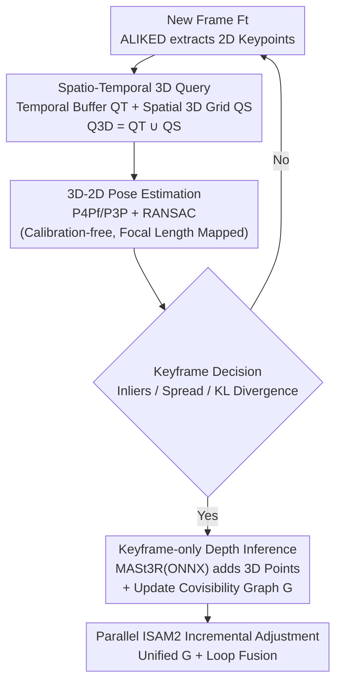

# Revisiting Monocular SLAM with Spatio-Temporal Scene Modeling

**Conference**: CVPR 2026  
**Paper**: [CVF Open Access](https://openaccess.thecvf.com/content/CVPR2026/html/Piedade_Revisiting_Monocular_SLAM_with_Spatio-Temporal_Scene_Modeling_CVPR_2026_paper.html)  
**Code**: To be open-sourced (Project page merl.com/research/highlights/slam-mer)  
**Area**: 3D Vision / Visual SLAM / Real-time Localization and Mapping  
**Keywords**: Monocular SLAM, Spatio-temporal modeling, Calibration-free, Feed-forward geometric priors, Real-time localization

## TL;DR
Addressing the pain point that calibration-free monocular SLAM is "either slow or non-modular," this paper proposes **SLAM-MER**, a pipeline implemented from scratch in C++. It utilizes dual-path 3D point queries—"Temporal Buffer (recent keyframes) + Spatial 3D Grid (early reconstructed regions)"—for localization. By invoking a feed-forward depth model (MASt3R) only on keyframes, it fuses sparse keypoint localization with semi-dense anchor representation, achieving **80+ FPS** real-time performance (significantly exceeding MASt3R-SLAM at ~13 FPS and VGGT-SLAM at <5 FPS) while maintaining comparable or superior localization accuracy.

## Background & Motivation

**Background**: Visual SLAM simultaneously estimates camera trajectories and reconstructs environmental maps. Traditional geometric methods (MonoSLAM, PTAM, ORB-SLAM series) rely on handcrafted features, multi-view geometry, and sparse maps, which are computationally efficient but difficult for dense reconstruction and require known intrinsic parameters. Recent feed-forward multi-view geometry models (DUSt3R, MASt3R, VGGT) can output dense point clouds directly from uncalibrated RGB images, leading to learning-based SLAM systems like MASt3R-SLAM and VGGT-SLAM. These are calibration-free and produce dense maps but are **computationally heavy, with none capable of running in real-time above 30 FPS**.

**Limitations of Prior Work**: ① Dense feed-forward methods perform inference and 3D-3D matching for every frame, incurring massive overhead often requiring frame skipping (e.g., processing only 1 in 3 frames); ② Most localization methods (dense or sparse) only track 2D keypoints from the "latest keyframe" to the current frame, requiring every tracked pixel to have a corresponding 3D map point, which triggers unnecessary keyframe creation and destroys temporal consistency when slight camera jitter causes keypoints to disappear; ③ Existing pipelines often split adjustments into local/global phases and compute loop closures separately, hindering modularity and real-time performance.

**Key Challenge**: There is a trade-off between **real-time performance vs. dense/calibration-free capability**. Pure geometric sparse methods are fast but not dense and require calibration, while feed-forward dense methods are calibration-free and produce dense maps but are slow. The root cause is that map representation and localization query methods do not fully exploit the "spatio-temporal structure" of the scene.

**Goal**: ① Design a localization method that simultaneously utilizes temporal continuity and spatial layout to query 3D points; ② Maintain real-time performance (>30 FPS, target 80+) under calibration-free monocular settings; ③ Provide a modular C++ framework where components (depth models / VPR / features) can be arbitrarily replaced.

**Key Insight**: The authors argue that **3D-2D correspondences are sufficient for accurate localization, and per-frame depth is unnecessary** (this is the primary difference from the 3D-3D matching in MASt3R-/VGGT-SLAM). Depth is only inferred when creating keyframes. Furthermore, using "Temporal Buffer + Spatial 3D Grid" allows complementary recall of 3D points, preserving short-term continuity and enabling revisit of early reconstructed areas.

**Core Idea**: Use spatio-temporal dual queries (temporal buffer + spatial 3D cells) to recall 3D map points for 3D-2D localization. This integrates the lightweight real-time capability of sparse keypoint tracking with the calibration-free/semi-dense capability of feed-forward geometric priors within a unified framework using parallel ISAM2 incremental optimization.

## Method

### Overall Architecture
The map in SLAM-MER is a triplet $M = (K, P_w, C)$: a set of keyframes $K$, world-coordinate 3D map points $P_w$, and 3D grid cells $C$ (grouping 3D points into spatial voxels). These are associated via a **covisibility graph** $G$, where nodes are keyframes and map points, and edges $E_{KK}$ denote relative poses between keyframes while $E_{KP}$ denote 3D-2D projection constraints + 3D-3D Euclidean distance constraints. The pipeline consists of two **parallel modules**: localization and adjustment. For each new frame, 2D keypoints are extracted, 3D points are queried via dual paths, absolute pose is estimated, and keyframe creation is decided. Depth inference is performed only during keyframe creation to supplement 3D points and update $G$. The adjustment module continuously monitors $G$ in a separate thread, using ISAM2 for incremental optimization of keyframe poses and map points; loop closures only add constraints to $G$ without separate optimization.

### Key Designs

**1. Spatio-Temporal Dual-Path 3D Map Point Query**

This is the core contribution addressing the issue where "tracking only the latest keyframe leads to point loss during jitter." Instead of looking only at the previous keyframe, candidate 3D points are aggregated as $Q_{3D} = Q_T \cup Q_S$. **Temporal Query $Q_T$**: Maintains a buffer $B$ of the last $N$ frames. For each frame, the keyframes sharing the most 3D points are identified, and their 3D points are collected into $Q_T$. This allows 2D keypoints to be tracked longer, reducing the size of the covisibility graph and map. **Spatial Query $Q_S$**: Visible 3D grid cells are calculated using the pose $T_k$ of the most recently localized frame (cells are sorted asynchronously by distance to speed up). Occupied cells are rasterized back to the image to confirm visibility, taking 3D points only from the nearest cells. Finally, FAISS is used for nearest neighbor matching between $Q_{3D}$ descriptors and current 2D keypoint descriptors to obtain 3D-2D correspondences. The beauty of the spatial query is that it enables "implicit loop closure"—if drift is low, the grid recalls old points directly when revisiting areas without waiting for a loop closure module.

**2. Keyframe-only Depth Inference + 3D-2D Calibration-free Localization**

Addressing the overhead of dense feed-forward methods, the authors posit that accurate localization requires 3D-2D correspondences rather than per-frame depth. Thus, the feed-forward single-image geometric model (default MASt3R, exported to ONNX and run via ONNXRuntime in C++) is invoked **only during keyframe creation**. It provides point maps and confidence scores to generate local 3D points $P^{kf}_i$ for the keyframe's 2D keypoints. Since feed-forward point maps are scale-less, a scale factor is estimated using existing 3D-2D correspondences to align local points to the world map. For pose estimation with unknown intrinsics, a **P4Pf solver** is used within RANSAC for robust estimation of both pose and focal length (assuming equal axes and principal point at the center). After a few frames, the focal length is fixed to the historical median, and the system switches to the faster P3P solver. This design allows the pipeline to remain calibration-free while amortizing depth inference costs, a key factor for reaching 80+ FPS.

**3. KL-Divergence-Based Keyframe Decision and Implicit Loop Closure**

To decide when to create keyframes—balancing map completeness and redundancy—the system uses three criteria: ① Insufficient 3D-2D inliers; ② 2D keypoints with 3D correspondences are not "spread" enough across the image (measured by the ratio of the convex hull area of matched keypoints to all detected keypoints); ③ Detection of revisited locations. The third is achieved by calculating a histogram $H_k$ of "3D points seen by various keyframes" for the current frame and comparing it to the previous frame's $H_{k-1}$ using KL divergence $D_{KL}(H_k\|H_{k-1})$. In new areas, only recent keyframes have covisible points, resulting in a skewed histogram and low KL (e.g., $D_{KL}=0.016$). When revisiting old locations, early keyframes suddenly share points, causing a histogram shift and high KL (e.g., $D_{KL}=3.74$), effectively adding loop constraints to the covisibility graph during keyframe creation.

**4. Parallel ISAM2 Incremental Adjustment and Loop Fusion**

To avoid separate local/global adjustment loops, the adjustment module runs in a separate thread using ISAM2 (GTSAM framework) to incrementally update poses and map points. The factor graph representation of ISAM2 **naturally supports local and global adjustments without branched processing**, maintaining a single unified covisibility graph. Loop closure uses MegaLoc for image-level retrieval of candidate keyframes followed by geometric verification via 3D-2D correspondences. Verified loops simply add $E_{KP}$/$E_{KK}$ edges to $G$ and fuse duplicate 3D points (map fusion). **No separate optimization is run at the end of loop closure**; the incremental solver automatically absorbs these new constraints. Combined with retrieval-based relocalization, the system is robust to short-term occlusion and the kidnapped robot problem.

## Key Experimental Results

### Main Results: Pose Accuracy and Real-time Performance (Table 1)

| Dataset | Method | Type | Avg ATE↓ (m) | FPS↑ |
|---------|--------|------|-------------|------|
| TUM RGB-D | DROID-SLAM [53] | Dense/Calibrated | 0.158 | ≈20 |
| TUM RGB-D | MASt3R-SLAM [42] | Dense/Uncalibrated | 0.060 | 13.2 |
| TUM RGB-D | VGGT-SLAM (SL(4)) [37]| Dense/Uncalibrated | 0.053 | <5 |
| TUM RGB-D | **SLAM-MER (Ours)** | Sparse/Uncalibrated | **0.056** | **86.6** |
| 7-Scenes | MASt3R-SLAM [42] | Dense/Uncalibrated | 0.058 | 15.0 |
| 7-Scenes | VGGT-SLAM (SL(4)) [37]| Dense/Uncalibrated | 0.056 | <5 |
| 7-Scenes | **SLAM-MER (Ours)** | Sparse/Uncalibrated | 0.059 | **103.2** |

Accuracy is comparable to the strongest baselines (TUM 0.056m, 7-Scenes 0.059m), but FPS is an order of magnitude higher (86.6 / 103.2 vs. <5~15). SLAM-MER processes 30 FPS video streams in real-time without skipping frames.

### Ablation Study: Effect of Spatio-Temporal Queries (Table 2 excerpt)

| Configuration | ATE↓ (m) | Keyframes \|K\| | Map Points \|Pw\| | FPS↑ |
|---------------|---------|-----------------|-------------------|------|
| Buffer \|B\|=1 (No Temporal) | 0.084 / 0.304 | 31 / 88 | 8659 / 23327 | 168.9 / 161.4 |
| Buffer \|B\|=10 | 0.073 / 0.280 | 31 / 86 | 7820 / 22731 | 159.3 / 144.9 |
| Buffer \|B\|=100 | 0.059 / 0.191 | 28 / 79 | 7551 / 20381 | 114.2 / 98.4 |
| Buffer \|B\|=1000 | 0.040 / 0.151 | 23 / 67 | 6445 / 17772 | 81.8 / 45.9 |
| + Spatial Query (Grid ≈8 cm) | 0.035 / — | 22 / — | 6342 / — | — |

### Key Findings
- **Larger temporal buffers improve accuracy and map compactness but decrease FPS**: Increasing $|B|$ from 1 to 1000 reduced ATE from 0.084 to 0.040 and map points from 8659 to 6445 (longer tracking leads to fewer keyframes), but FPS dropped from 168.9 to 81.8.
- **Spatial queries further reduce error**: Adding spatial queries on top of $|B|=1000$ reduced ATE from 0.040 to 0.035 with even fewer keyframes, validating the complementarity of the dual paths.
- **Sparse localization + keyframe-only depth is the source of real-time speed**: Unlike feed-forward SLAM running dense inference every frame, SLAM-MER amortizes heavy computation to sustain 80+ FPS without frame skipping.

## Highlights & Insights
- **The insight that "localization needs 3D-2D, not per-frame depth" is critical**: It shifts feed-forward geometric overhead from "per frame" to "per keyframe," forming the foundation of real-time performance and differentiating it from 3D-3D matching methods.
- **KL divergence for keyframe decision and implicit loops is clever**: Using histogram shifts of covisible points to simultaneously trigger keyframe creation and identify loop closures reduces the burden on explicit loop detection.
- **Implicit loop closure through 3D grids**: When drift is small, the grid recalls old points directly, providing a "cheap" alternative to heavy loop closure modules.
- **Unified Graph + ISAM2**: Amalgamating all constraints into a single factor graph for incremental solving simplifies the multi-threaded logic of traditional SLAM.
- **High Modularity**: Features, depth models, and retrievers are plug-and-play, making the framework extensible for future state-of-the-art components.

## Limitations & Future Work
- Dependency on feed-forward model quality: Since depth maps are scale-less and rely on 3D-2D for alignment, scale may become unstable in texture-less regions or with few correspondences.
- Spatial-query-based loop closure only works when drift is small; large drifts still require the heavy loop closure module or relocalization.
- Accuracy is comparable to, but does not yet significantly outperform, the best dense methods in all sequences; the primary advantage is speed rather than a new precision ceiling.
- Evaluation concentrated on indoor scenes (TUM, 7-Scenes); robustness in large-scale outdoor or highly dynamic environments remains to be verified.

## Related Work & Insights
- **vs. MASt3R-SLAM / VGGT-SLAM**: These methods perform per-frame inference and 3D-3D matching, achieving calibration-free dense mapping at <5~15 FPS with frame skipping. Ours achieves similar accuracy an order of magnitude faster.
- **vs. ORB-SLAM3**: ORB-SLAM3 requires known intrinsics and uses BoW for loops; ours is calibration-free (P4Pf) and uses MegaLoc plus a unified ISAM2 graph.
- **vs. DROID-SLAM**: DROID uses learned dense optical flow and backend optimization (~20 FPS); ours uses a lighter sparse keypoint + semi-dense anchor hybrid approach.

## Rating
- Novelty: ⭐⭐⭐⭐
- Experimental Thoroughness: ⭐⭐⭐⭐
- Writing Quality: ⭐⭐⭐⭐
- Value: ⭐⭐⭐⭐⭐

<!-- RELATED:START -->

## Related Papers

- [\[CVPR 2026\] SCE-SLAM: Scale-Consistent Monocular SLAM via Scene Coordinate Embeddings](sce-slam_scale-consistent_monocular_slam_via_scene_coordinate_embeddings.md)
- [\[CVPR 2026\] ST4R-Splat: Spatio-Temporal Referring Segmentation in 4D Gaussian Splatting](st4r-splat_spatio-temporal_referring_segmentation_in_4d_gaussian_splatting.md)
- [\[CVPR 2026\] LiDAR Prompted Spatio-Temporal Multi-View Stereo for Autonomous Driving](lidar_prompted_spatio-temporal_multi-view_stereo_for_autonomous_driving.md)
- [\[CVPR 2026\] STS-Mixer: Spatio-Temporal-Spectral Mixer for 4D Point Cloud Video Understanding](sts_mixer_4d_point_cloud.md)
- [\[CVPR 2026\] STAC: Plug-and-Play Spatio-Temporal Aware Cache Compression for Streaming 3D Reconstruction](stac_plug-and-play_spatio-temporal_aware_cache_compression_for_streaming_3d_reco.md)

<!-- RELATED:END -->
