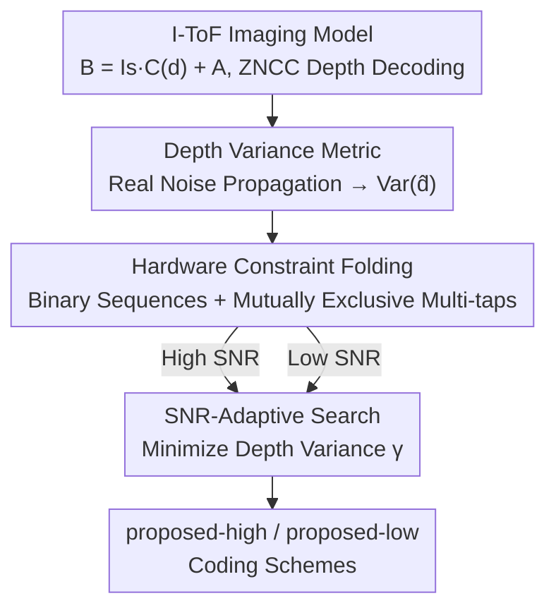

# Revisiting Optimal Coding for I-ToF under Practical Sensor Constraints

**Conference**: CVPR 2026  
**Paper**: [CVF Open Access](https://openaccess.thecvf.com/content/CVPR2026/html/Luo_Revisiting_Optimal_Coding_for_I-ToF_under_Practical_Sensor_Constraints_CVPR_2026_paper.html)  
**Code**: None  
**Area**: 3D Vision / Computational Imaging / Depth Sensing  
**Keywords**: Indirect Time-of-Flight, Coding Scheme, Depth Variance, Hardware Constraints, Mutually Exclusive Multi-tap

## TL;DR
This paper derives the depth error of I-ToF cameras under a realistic noise model into a computable "depth variance metric." It directly integrates hardware constraints—such as peak power, bandwidth, binary waveforms, and mutually exclusive multi-taps—into the design phase. This allows for searching the optimal coding schemes within a constrained feasible space. The two discovered schemes (for high/low SNR) consistently outperform Hamiltonian and double ramp codes in both simulations and on commercial sensors.

## Background & Motivation
**Background**: Indirect Time-of-Flight (I-ToF) cameras estimate depth by emitting continuous modulated light and measuring the phase delay of the return signal. Due to high resolution, small form factor, and low cost, they have become the most common depth sensing solution in AR, scanning, robotics, and consumer electronics. Given fixed laser power and exposure time, depth precision is almost entirely determined by the "coding scheme"—the design of the modulation function $M(t)$ and the demodulation function $D(t)$.

**Limitations of Prior Work**: Finding the optimal coding scheme is difficult because the combinations of $M(t)$ and $D(t)$ are theoretically infinite. Existing works follow two paths, each with flaws: Gupta et al. (Hamiltonian coding) proposed an elegant analytical framework using "coding curve length" as a metric, but it assumes ideal sensors (fixed noise, infinite power, continuous demodulation), which fails in real hardware. Li et al. utilize deep learning with more complete noise models but require known scene statistics, high computational power, and massive labeled data, while also neglecting physical sensor constraints.

**Key Challenge**: Real commercial I-ToF sensors have a hard constraint ignored by most theoretical frameworks—the **mutually exclusive multi-tap mechanism**. Multiple demodulation taps (collecting charge "buckets") on the sensor can only have one tap active at any given time to avoid crosstalk. This constraint fundamentally alters the shape of Hamiltonian codes (forcing $M(t)$ to repeat three times in one period and shortening the coding curve to 1/3 of the design), rendering theoretical optima ineffective. Although Gutierrez et al. considered peak power, bandwidth, and binary waveforms, they designed codes under ideal settings first and used "post-hoc approximation" to fit the curves, which does not guarantee hardware realizability and still missed the mutual exclusivity constraint.

**Goal**: (1) Derive I-ToF depth error under a realistic noise model to obtain a depth variance metric for direct optimization; (2) Fold all practical hardware constraints (including mutual exclusivity) into the design phase to make the search space enumerable; (3) Search for coding schemes that are deployable on commercial sensors and optimal for different SNR levels.

**Core Idea**: Instead of designing beautiful codes in an ideal space and forcing them into hardware, it is better to first compress the feasible space using hardware constraints and then minimize the "real depth variance" within that space. The authors found that the **optimal coding scheme is not fixed but depends on the scene SNR**, leading to separate optimal searches for high and low SNR scenarios.

## Method

### Overall Architecture
The method is a design pipeline: "Imaging Modeling → Noise/Error Analysis → Deriving Depth Variance Metric → Hardware Constraint Folding → Search in Constrained Space." This yields two coding schemes optimized for different SNRs (proposed-high / proposed-low).

First, I-ToF imaging is defined: the laser emits a modulated signal $M(t)$, and the sensor receives $R(t)=s\,M(t-\tfrac{2d}{c})+a$, where $d$ is depth, $c$ is light speed, $s=\beta/d^2$ combines reflectivity $\beta$ and distance attenuation, and $a$ is ambient light. The sensor uses $D(t)$ to control exposure, integrating to get brightness $B(d)=\int_0^T R(t)D(t)\,dt = I_s\,C(d)+A$, where $C(d)$ is the normalized cross-correlation of $M$ and $D$. Since there are three unknowns ($I_s, d, A$), three phase-shifted versions of the demodulation $D_i(t)\,(i=0,1,2)$ are used to obtain three brightness values, and depth is resolved via zero-mean normalized cross-correlation (ZNCC). The set $\{M, D_i\}$ constitutes the **coding scheme**.

The pipeline is as follows:

### Key Designs

**1. Depth Variance Metric: Converting "Real Depth Error" into an Optimizable Scalar**

Older methods (Gupta) used coding curve length, which relies on the assumption of "fixed noise and ideal demodulation." In real sensors, noise variance changes with brightness, and decoders are non-ideal. This paper adopts the noise model from Li: measured brightness is approximated as Gaussian $\hat B_i(d)\sim\mathcal N(B_i(d),\sigma_i^2(d))$, where variance $\sigma_i(d)=\sqrt{B_i(d)+\sigma_r^2}$ includes photon shot noise and readout noise $\sigma_r$.

By performing first-order linearization on the ZNCC normalization function $G(\cdot)$, the depth variance is derived as:

$$\mathrm{Var}(\hat d)\approx\Big(\sum_{i=0}^{2}\frac{I_s^2\,(C'_{\perp i}(d))^2}{\sigma_i^2(d)}\Big)^{-1}$$

where $C'_{\perp i}(d)$ is the component of the derivative $C'(d)$ on the plane orthogonal to the brightness direction. If $\sigma_i^2$ and $I_s$ were fixed/ideal, this would degrade into the "squared 3D velocity of $C(d)$" (Gupa's curve length). Only by retaining the real, brightness-dependent $\sigma_i^2$ does it accurately characterize precision on real sensors.

**2. Hardware Constraint Folding: Compressing Feasible Space During Design**

Rather than post-hoc approximation, the authors express four hardware constraints as constraints on "discrete binary sequences": (1) Limited peak power $P_\text{max}$; (2) Finite bandwidth—approximated as a "minimum switching time" $t_\text{min}=2/f_\text{max}$, making the signal approximate a square wave within the frequency limit; (3) Binary modulation/demodulation (0/1); (4) **Mutually exclusive multi-taps**.

$M(t)$ and $D_i(t)$ are discretized into binary sequences $S_M, S_{D_i}\in\{0,1\}$ of length $n = \tau/t_\text{min}$. The mutual exclusivity constraint is:

$$\sum_{i=0}^{2}S_{D_i}[k]\le 1,\quad \forall k$$

Additional constraints ensure equal total exposure time for each tap $\sum_k S_{D_0}[k]=\sum_k S_{D_1}[k]=\sum_k S_{D_2}[k]$. Peak power is constrained ($M(t)=P_\text{max}S_M$), allowing total power $M_\text{total}$ to vary with the code. These constraints reduce the infinite search space to a manageable, enumerable scale.

**3. SNR-Adaptive Search: Minimizing Depth Variance Across the Range**

The optimization objective $\gamma$ is the integral of depth variance over the full range:

$$\gamma=\frac{1}{d_\text{range}}\int_{0}^{d_\text{max}=c\tau/2}\Big(\sum_{i=0}^{2}\frac{I_s^2(d)\,(C'_{\perp i}(d))^2}{I_s(d)\,C_i(d)+A+\sigma_r^2}\Big)^{-1}\,dd$$

The optimization problem is:

$$\arg\min_{S_M,\{S_{D_i}\}}\ \gamma(S_M,\{S_{D_i}\})$$

Constraints include binary values, mutual exclusivity, $M_\text{total}>0$, non-zero exposure, and non-ambiguity. The problem is solved via **brute-force enumeration or simulated annealing (SA)**. The key insight is: **optimal codes depend on SNR**. By varying the average ambient light $\bar a$, the authors found **proposed-high** (optimized for $\bar a=0$) and **proposed-low** (optimized for high $\bar a$).

### Loss & Training
This is not a learning-based method. The only "objective function" is the aforementioned $\gamma$, minimized over discrete binary sequence spaces. Simulation setup: $T=10\,\text{ms}$, $\tau=90\,\text{ns}$, $t_\text{min}=10\,\text{ns}$, $\sigma_r=20$.

## Key Experimental Results

### Comparison of Methods (Table 1)

| Method | Constraints Modeled | Optimization | Objective | Deployable |
|------|-----------|---------|---------|--------|
| Gupta [9] | None (Ideal) | Theory | Curve Length | No |
| Li [20] | Power, Bandwidth | Deep Learning | Training Loss | No |
| Gutierrez [10] | Power, BW, Binary | Post-hoc Approx | Curve Fitting | Yes |
| **Ours** | **+ Mutual Exclusivity** | **Brute-force / SA** | **Depth Variance** | **Yes** |

### Simulation: Stanford Bunny Reconstruction MAE (Fig.5)

| Scheme | High SNR ($\bar a=0$) MAE | Low SNR ($\bar a=1$) MAE |
|----------|----------------------|----------------------|
| Double ramp | 6.15 mm | 23.86 mm |
| Hamiltonian | 5.28 mm | 23.27 mm |
| **Proposed-high** | **1.02 mm** | 2.94 mm |
| **Proposed-low** | 2.09 mm | **2.83 mm** |

The searched codes reduce error from ~20mm to single-digit millimeters. The performance swap at different SNRs validates the SNR-adaptive design.

### Real Sensor Experiments (3-tap BEM80T04BB)

| Scenario | Comparison | Result |
|------------|------|------|
| Flat plate (High/Low SNR) | Proposed vs Prior | Proposed achieves lowest MAE in both SNR conditions. |
| Motion (Short Integration) | 15ms Double Ramp vs 5ms Proposed-low | Double Ramp: 5.14cm MAE; Proposed-low: 3.33cm MAE. |

In the motion experiment, **proposed-low uses 1/3 the integration time (5ms vs 15ms) while achieving higher precision**, allowing for higher frame rates and reduced motion blur.

### Key Findings
- **No single code fits all**: The optimal code shifts as ambient light levels change.
- **Mutual exclusivity is critical**: Modeling this constraint ensures that codes designed are actually realizable and superior on commercial sensors.
- **Efficiency gain**: The optimized codes allow for significantly shorter integration times with better results than standard codes.

## Highlights & Insights
- **Metric Upgrade**: Moving from geometric measures (curve length) to a noise-aware depth variance metric aligns the design with real sensor physics.
- **Search Space Compression**: By folding constraints into the sequence definition, the infinite optimization problem becomes enumerable.
- **SNR Dependency**: Provides the insight that systems should switch coding schemes online based on ambient light conditions.

## Limitations & Future Work
- **Small Noise Assumption**: The linearization of the variance metric may fail under extremely high noise where depth "phase wraps" or jumps occur.
- **Periodic Coding**: Currently restricted to periodic functions; non-periodic or multi-frequency sequences remain for future exploration.
- **Search Scalability**: Brute force scales poorly as $t_\text{min}$ decreases ($n$ increases); the stability of Simulated Annealing for very large $n$ requires further study.

## Related Work & Insights
- **vs Gupta (Hamiltonian)**: Gupta's theory fails on real hardware due to the mutual exclusivity constraint; this paper provides the necessary correction.
- **vs Li (Deep Learning)**: This method is data-free, requires no training, and explicitly handles hardware constraints that the learning approach omits.
- **vs Gutierrez**: While both consider binary constraints, this paper integrates them (and mutual exclusivity) into the initial search rather than approximating an ideal curve post-hoc.

## Rating
- **Novelty**: ⭐⭐⭐⭐ Solid correction of classic theory by integrating real sensor constraints.
- **Experimental Thoroughness**: ⭐⭐⭐⭐ Extensive simulation and real prototype validation on moving targets.
- **Writing Quality**: ⭐⭐⭐⭐ Clear logic with rigorous derivation.
- **Value**: ⭐⭐⭐⭐ High practical value for commercial I-ToF systems aiming to reduce noise and motion blur.

<!-- RELATED:START -->

## Related Papers

- [\[CVPR 2026\] Revisiting Pose Sensitivity in Splat-based Computed Tomography under Sparse-view Reconstruction](revisiting_pose_sensitivity_in_splat-based_computed_tomography_under_sparse-view.md)
- [\[CVPR 2026\] Globally Optimal Pose from Orthographic Silhouettes](globally_optimal_pose_from_orthographic_silhouettes.md)
- [\[CVPR 2026\] GeoCodeBench: Benchmarking PhD-Level Coding in 3D Geometric Computer Vision](benchmarking_phd-level_coding_in_3d_geometric_computer_vision.md)
- [\[CVPR 2026\] LiteSense: Lifting Lightweight ToF with RGB for High-Resolution Metric Depth Estimation](litesense_lifting_lightweight_tof_with_rgb_for_high-resolution_metric_depth_esti.md)
- [\[CVPR 2026\] Revisiting 3D Reconstruction Kernels as Low-Pass Filters](revisiting_3d_reconstruction_kernels_as_low-pass_filters.md)

<!-- RELATED:END -->
