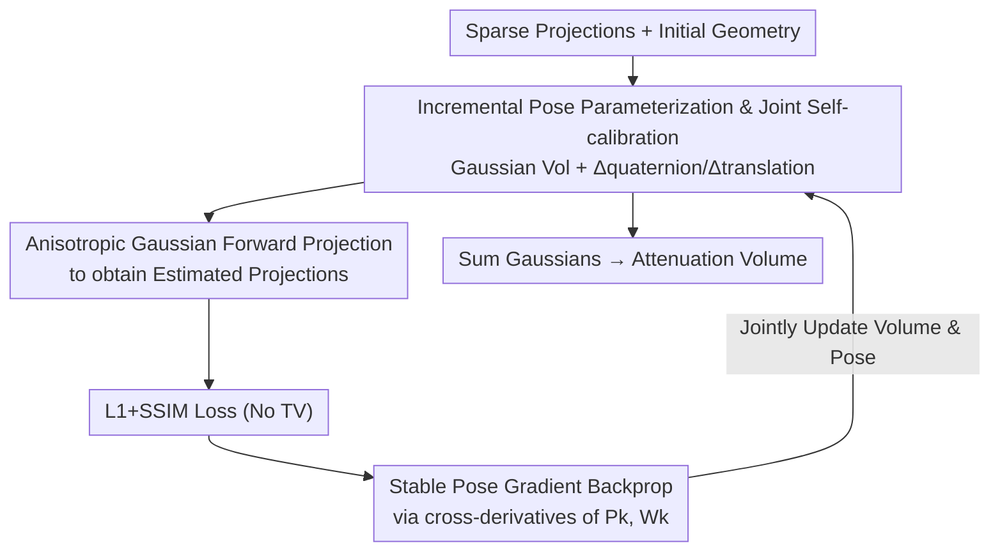

# Revisiting Pose Sensitivity in Splat-based Computed Tomography under Sparse-view Reconstruction

**Conference**: CVPR 2026  
**Paper**: [CVF Open Access](https://openaccess.thecvf.com/content/CVPR2026/html/Choi_Revisiting_Pose_Sensitivity_in_Splat-based_Computed_Tomography_under_Sparse-view_Reconstruction_CVPR_2026_paper.html)  
**Code**: TBD  
**Area**: 3D Vision  
**Keywords**: CT Reconstruction, Gaussian Splatting, Sparse-view, Geometric Self-calibration, Pose Optimization

## TL;DR
Aiming at the streak/strip artifacts in 3D Gaussian Splatting-based sparse-view CT on real data, this paper proves through controlled experiments that the primary cause is pose error in the acquisition geometry rather than view sparsity. Based on this, it derives a stable and differentiable joint self-calibration framework that incrementally optimizes camera poses while reconstructing the volume. By removing TV regularization, the system becomes more stable and faster, effectively suppressing streak artifacts while preserving details in real data, achieving a PSNR approximately 10 dB higher than the SOTA on synthetic data.

## Background & Motivation
**Background**: X-ray CT reconstructs the internal structure of objects from penetrating projections and is widely used in medical diagnosis and industrial inspection. Classic FDK algorithms are fast but require dense projections; iterative methods offer better quality but are slow. Recently, differentiable rendering has transformed CT reconstruction into an optimization problem of continuous volume fields. Neural implicit representations and the latest **splatting-based representation (R2-Gaussian)**—which models the attenuation field as a set of anisotropic 3D Gaussians—achieve high quality and fast convergence under sparse-view conditions.

**Limitations of Prior Work**: Splat-based CT performs well on synthetic data, but the authors found that once applied to **real CT acquisition**, significant streak and strip artifacts appear, which are much more severe than in traditional reconstruction methods—even in scenes without metal objects that typically cause anomalies. This suggests that the degradation does not stem solely from data sparsity.

**Key Challenge**: The Gaussian representation in splat-based CT introduces anisotropic weighting along the ray direction, making the reconstruction intensity **inherently sensitive to geometric misalignment**. In real rotation systems, mechanical defects inevitably cause deviations between actual and ideal geometries (pose inaccuracy). View sparsity is merely a surface symptom; pose sensitivity is the root cause limiting the robustness of splat-based CT.

**Goal**: (1) Systematically analyze and locate the true source of artifacts in splat-based CT; (2) Re-derive the pose optimization within the splatting formula to obtain a stable, differentiable self-calibration framework capable of joint geometric refinement during reconstruction; (3) Provide unbiased simulation data with controlled pose perturbations to enable reproducible evaluation of geometric sensitivity.

**Key Insight**: A clever "Pseudo-GT loop experiment" is used to decouple the confounding variables of "sparsity" and "pose error" by comparing splatting reconstructions on real projections versus projections re-synthesized from a Pseudo-GT.

**Core Idea**: Treat camera poses as learnable parameters optimized alongside the Gaussian volume, implementing "self-calibrating reconstruction" through incremental parameterization and stable cross-derivative gradient backpropagation without requiring pre-calibrated hardware.

## Method

### Overall Architecture
The method consists of two parts. **First, an attribution analysis** (the four-step experiment in Fig. 2) confirms that pose error is the primary cause of artifacts. **Next, joint self-calibration reconstruction** is performed: sparse projections are fed into the splatting reconstruction, where the density, center, and covariance $\{\rho_i, \mathbf{p}_i, \Sigma_i\}$ of the 3D Gaussians are optimized alongside the **incremental pose parameters** $\{\Delta \mathbf{q}_k, \Delta \mathbf{t}_k\}$ for each camera. The anisotropic Gaussians are forward-projected to generate estimated projections, and an L1+SSIM loss is calculated against the input projections (**with TV regularization removed**). Volume and pose are simultaneously updated via stable gradient backpropagation, iterating until convergence, after which the Gaussians are summed into an attenuation volume. The diagram below shows the runtime self-calibration reconstruction loop:

### Key Designs

**1. Artifact Attribution: Decoupling "Sparsity" and "Pose Error"**

Limitations: Splat-based CT produces streak artifacts on real data, but "sparse views" and "inaccurate poses" are confounded. The authors designed a four-step controlled experiment (Fig. 2). Step 1 uses dense 721 views of real data with FDK to obtain a Pseudo-GT volume (since $\text{RMSE} \propto 1/\sqrt{N}$, FDK is accurate enough with dense projections). Step 2 re-synthesizes 75 projections from the Pseudo-GT (fully known geometry, no pose error). Step 3 runs splatting reconstruction on "Real 75 views" and "Synthetic 75 views" separately. Crucially, the streak artifacts are **significantly suppressed** in the synthetic 75-view reconstruction, while the real 75-view reconstruction remains full of streaks. Since both have the same view count, sparsity is not the primary cause. Step 4 compares error maps between estimated and GT projections: synthetic errors are uniform, while real errors show **directional bias** at object edges—a fingerprint of inaccurate camera poses. This isolates geometric error as the primary source of artifacts.

**2. Incremental Pose Parameterization and Joint Self-calibration**

Limitations: Traditional CT calibration either uses offline calibration phantoms (cannot handle real-time perturbations and requires extra scans) or online methods with various limitations. Here, pose is directly integrated into the reconstruction optimization. Each camera's rigid motion is represented by rotation $\mathbf{W}_k$ and translation $\mathbf{t}_k$. The $i$-th Gaussian is transformed to $\tilde{\mathbf{p}}_{i,k} = \mathbf{W}_k \mathbf{p}_i + \mathbf{t}_k$ and $\tilde\Sigma_{i,k} = \mathbf{W}_k \Sigma_i \mathbf{W}_k^\top$ before being projected. The key is **incremental parameterization**: motion is modeled using quaternions $\mathbf{q}_k$ and translation vectors, but only the small increments relative to initial geometry $\Delta \mathbf{q}_k = \mathbf{q}_k - \mathbf{q}_{k,init}$ and $\Delta \mathbf{t}_k = \mathbf{t}_k - \mathbf{t}_{k,init}$ are optimized. The final parameter set $\Theta = \{\mathbf{p}_i, \Sigma_i, \rho_i, \Delta \mathbf{q}_k, \Delta \mathbf{t}_k\}$ is solved jointly. This "small increment" approach mitigates gradient explosion under small-angle approximations and allows fine-grained refinement, achieving self-calibration without extra hardware or GT segmentation priors.

**3. Stable Pose Gradient Backprop + Removing TV Regularization**

Limitations: Previous splat-based CT methods ignored pose-related cross-derivative dependencies during backpropagation, causing instability. This paper explicitly tracks the Jacobian of the loss with respect to two pose-related intermediaries (Fig. 5): the perspective projection matrix $\mathbf{P}_k \in \mathbb{R}^{3 \times 4}$ and the rotation matrix $\mathbf{W}_k$. The gradient for $\mathbf{W}_k$ is split: $\tfrac{\partial \mathcal{L}}{\partial \mathbf{W}_k} = \tfrac{\partial \mathcal{L}}{\partial \mathbf{W}_{k,a}} + \tfrac{\partial \mathcal{L}}{\partial \mathbf{W}_{k,b}}$, passing through the transformed Gaussian centers $\tilde{\mathbf{p}}_{i,k}$ and $\mathbf{M}_{i,k}$ (product of Jacobian $\mathbf{J}_{i,k}$ and $\mathbf{W}_k$). The term $\tfrac{\partial \mathcal{L}}{\partial \mathbf{W}_{k,b}}$ differs from RGB splatting calibration because CT splatting's ray-space mapping $\phi(\cdot)$ preserves the third dimension (requiring Gaussian ray integration to simulate X-ray attenuation). The loss used is only L1+SSIM; **TV regularization is intentionally removed**. The authors found that TV is redundant in the joint calibration framework and suppresses critical geometric gradients, weakening the system's ability to recover subtle pose corrections. Removing TV also reduces computation time.

**4. Unbiased Geometric Perturbation Simulation Data**

Limitations: Standard synthetic data assumes ideal circular trajectories, failing to reflect mechanical deviations of real systems. The authors construct a dataset with controlled geometric errors, modeling the detector geometry as an SE(3) rigid transform $T$. Rotation and translation are **treated separately** to ensure unbiasedness. Translations are linear, sampled from zero-mean Gaussian $\mathbf{t} \sim \mathcal{N}(0, \sigma_{trans}^2 I)$. Rotations are on the non-linear SO(3); noise is added by mapping to the tangent space via the logarithmic map, adding Gaussian noise with variance $\sigma_{rot}^2$, and mapping back via the exponential map. This ensures realistic perturbations while maintaining valid transformations. Mathematical proof of unbiasedness is provided (in supplementary materials), offering a reproducible testbed for geometric sensitivity.

### Loss & Training
The loss is $\mathcal{L}(I_k, \hat I_k) = \mathcal{L}_{L1}(I_k, \hat I_k) + \lambda \mathcal{L}_{SSIM}(I_k, \hat I_k)$, combining pixel-level and structural similarity, without TV. Gaussian learning rates follow R2-Gaussian; camera parameter learning rates are set to 2e-4, exponentially decaying to 2e-5 over 30,000 steps. Implemented in PyTorch + CUDA, trained on an RTX A6000.

## Key Experimental Results

### Main Results
Synthetic data was generated via TIGRE with injected rotation noise (std 0.03 in Lie algebra) and translation noise (std 1.0, one voxel size). Real data used public CT datasets with 75 views. The table below compares PSNR between the baseline [R2-Gaussian] and Ours with/without geometric perturbations:

| Scene | No Noise-Baseline | No Noise-Ours | Noise-Baseline | Noise-Ours |
| :--- | :---: | :---: | :---: | :---: |
| Chest | 35.81 | 35.68 | 26.69 | **30.44** |
| Foot | 32.51 | 32.04 | 25.46 | **30.57** |
| Beetle | 43.18 | 43.22 | 33.15 | **40.48** |
| Broccoli | 36.54 | 34.70 | 22.21 | **30.20** |
| Engine | 40.25 | 39.33 | 24.69 | **31.60** |
| Teapot | 47.81 | 47.79 | 36.65 | **43.43** |

Ours is on par with the baseline when there is no noise (indicating self-calibration does not harm ideal cases). Once pose noise is injected, the baseline significantly degrades while Ours remains stable—achieving roughly 10 dB higher PSNR than SOTA joint calibration methods (Thies et al.). In terms of pose calibration accuracy (Table 2, mean of 15 scenes), Ours achieves a translation RMSE of 0.726 AU (NeAT: 1.437, Thies et al.: 2.463) and orientation error of 0.627° (NeAT: 2.881°, Thies et al.: 4.076°).

### Ablation Study

| Configuration | Key Result | Description |
| :--- | :--- | :--- |
| Noise level $\sigma_{rot}/\sigma_{trans}$ (Beetle) 0.01/0.5 → 0.10/5.0 | Baseline 37.28→30.80; Ours 41.38→32.32 dB | Ours is consistently more robust as noise increases. |
| View count 75/50/25 (with perturbations) | Ours 33.42/31.73/29.02; Baseline 28.50/27.67/26.44 dB | Ours leads in PSNR/SSIM across all view counts. |
| Computation Time (Synthetic Mean) | Ours 20.89 min < Baseline 23.19 < Thies 31.15 < NeAT 48.35 | Removing TV regularization makes Ours faster than the baseline. |
| Extreme Sparsity (25 views) + Perturbations | Ours has far fewer artifacts than baseline, but needle-like artifacts appear. | TV removal reveals limitations in extremely sparse scenarios. |

### Key Findings
- **Pose error is the primary cause**: Controlled experiments prove that with 75 views, synthetic data (no pose error) has almost no streaks, while real data (with pose error) is full of streaks. Error maps show directional bias at edges on real data—the core evidence for this attribution.
- **Removing TV is better**: Within the joint self-calibration framework, TV regularization suppresses geometric gradients and slows down the process. Removing it increases stability and speed, suggesting that stability should derive from accurate geometric modeling rather than heuristic smoothing.
- **Trade-off in extreme sparsity**: At 25 views, Ours is still much better than the baseline but shows needle-like artifacts due to the lack of TV, suggesting additional regularization might be needed for extreme cases.

## Highlights & Insights
- **Decoupling variables in experimental design**: Using dense FDK Pseudo-GT + re-synthesized projections cleanly separates "sparsity" from "pose error" and confirms the hypothesis via directional bias in error maps—a reusable paradigm for attribution.
- **CT-specific gradient terms**: The paper clearly identifies that CT splatting's ray-space mapping preserves the third dimension, leading to different pose gradients compared to RGB splatting (the extra "blue" term), bridging the gap between observed sensitivity and underlying mechanism.
- **"Less is More"**: Removing TV regularization simultaneously yields more stable geometric gradients, higher quality, and shorter runtime—a triple win that reassess the value of heuristic smoothing in differentiable reconstruction.
- **Reusable calibration parameters**: The estimated camera calibration parameters can be transferred to other reconstruction methods; self-calibration serves the broader ecosystem, not just this framework.

## Limitations & Future Work
- The authors acknowledge that under extreme sparsity (25 projections), needle-like artifacts appear without TV, indicating a need for new regularization strategies in future work.
- Translations are sampled in voxel space; physical effects may vary with data scale (the "AU = one voxel size" unit requires attention for comparability).
- Self-identified limitations: The method assumes a reasonable initial geometry (incremental optimization for small deviations). Whether it remains stable for large offsets or extreme motion without falling into local minima was not fully discussed. Verification focused heavily on cone-beam geometry; generalizability to other system geometries requires further testing.

## Related Work & Insights
- **vs. R2-Gaussian (Splatting CT Baseline)**: The baseline assumes calibrated geometry and uses TV to suppress artifacts; it suffers from needle-like artifacts and over-smoothing on real data due to pose error. Ours jointly optimizes pose and removes TV, suppressing artifacts while preserving detail without losing quality in noise-free cases.
- **vs. Thies et al. (FDK + Head Motion Correction)**: They use FDK with head motion correction, but FDK limits output quality and relies on pre-trained networks for quality assessment. Ours uses differentiable splatting for end-to-end joint optimization, yielding ~10 dB higher PSNR and smaller pose errors.
- **vs. Gao et al. / Wu et al. (Implicit + Pose Correction)**: Gao requires GT segmentation priors; Wu supports only fan-beam geometry and lacks public code. Ours supports cone-beam and requires no segmentation.
- **vs. NeAT (Adaptive Octree Implicit + Pose Correction)**: NeAT has sharp boundaries but struggles with uniform regions; its implicit network has high time complexity. Ours is faster, more robust, fully differentiable, and achieves higher calibration accuracy.

## Rating
- Novelty: ⭐⭐⭐⭐ The insight that "pose sensitivity is the primary cause" coupled with CT-specific gradient derivation is highly valuable. Components like joint pose optimization and incremental parameterization are adapted from RGB splatting calibration.
- Experimental Thoroughness: ⭐⭐⭐⭐ Solid synthetic/real dual evaluation + noise/view/time ablations + quantitative pose accuracy. Real data evaluation is mostly qualitative.
- Writing Quality: ⭐⭐⭐⭐⭐ Extremely clear logical chain from attribution experiments to mechanism analysis to the proposed method.
- Value: ⭐⭐⭐⭐ Clears a critical hurdle for deploying splatting-based CT on real systems; the framework is lightweight and easy to integrate, with reusable calibration parameters.

<!-- RELATED:START -->

## Related Papers

- [\[CVPR 2026\] Wavelet-Driven 3D Anomaly Detection under Pose-Agnostic and Sparse-View](wavelet-driven_3d_anomaly_detection_under_pose-agnostic_and_sparse-view.md)
- [\[CVPR 2026\] Revisiting Optimal Coding for I-ToF under Practical Sensor Constraints](revisiting_optimal_coding_for_i-tof_under_practical_sensor_constraints.md)
- [\[CVPR 2026\] SGS-Intrinsic: Semantic-Invariant Gaussian Splatting for Sparse-View Indoor Inverse Rendering](sgs-intrinsic_semantic-invariant_gaussian_splatting_for_sparse-view_indoor_invers.md)
- [\[CVPR 2026\] Revisiting Token Compression for Accelerating ViT-based Sparse Multi-View 3D Object Detectors](revisiting_token_compression_for_accelerating_vit-based_sparse_multi-view_3d_obj.md)
- [\[CVPR 2026\] SV-GS: Sparse View 4D Reconstruction with Skeleton-Driven Gaussian Splatting](sv-gs_sparse_view_4d_reconstruction_with_skeleton-driven_gaussian_splatting.md)

<!-- RELATED:END -->
