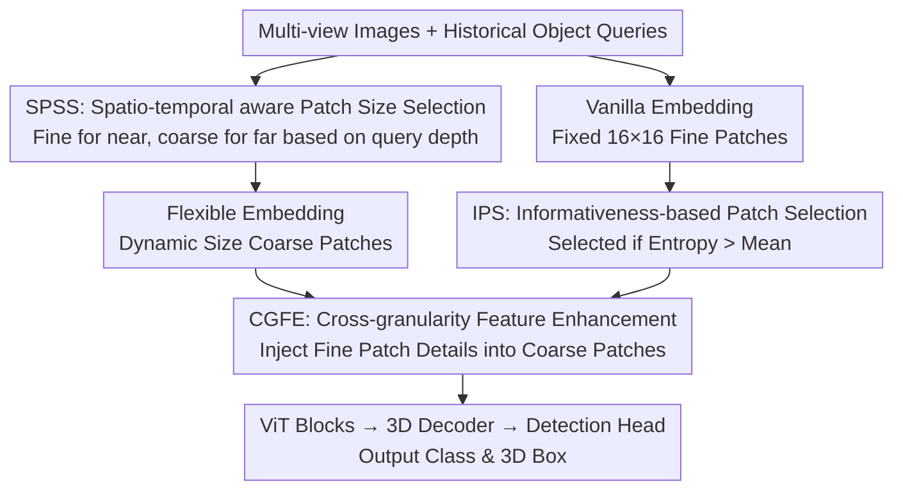

# Revisiting Token Compression for Accelerating ViT-based Sparse Multi-View 3D Object Detectors

**Conference**: CVPR 2026  
**Paper**: [CVF Open Access](https://openaccess.thecvf.com/content/CVPR2026/html/Ji_Revisiting_Token_Compression_for_Accelerating_ViT-based_Sparse_Multi-View_3D_Object_CVPR_2026_paper.html)  
**Code**: https://github.com/Mingqj/SEPatch3D  
**Area**: 3D Vision / Autonomous Driving Perception / Model Acceleration  
**Keywords**: Multi-view 3D Detection, Token Compression, Dynamic Patch Size, ViT Acceleration, Entropy Selection

## TL;DR
To address the slow inference of ViT-based multi-view 3D detectors, this paper proposes SEPatch3D. It replaces traditional token pruning/merging with "scenewise spatio-temporal dynamic patch sizing + coarse patch enhancement using fine patches," achieving up to a 57.7% speedup over StreamPETR on nuScenes with negligible accuracy loss.

## Background & Motivation

**Background**: Multi-view 3D object detection is a core component of autonomous driving perception. Sparse query-based detectors (e.g., DETR3D, Sparse4D, StreamPETR) bypass dense BEV construction by directly associating learnable object queries with image features. These methods focus on object-level information and achieve leading accuracy, making them particularly suitable for pairing with powerful ViT backbones.

**Limitations of Prior Work**: The computational cost of ViTs grows linearly with the number of tokens. Sparse detectors coupled with ViTs suffer from high inference latency (e.g., StreamPETR + ViT-L takes 1.3 seconds per frame at 640×1600 resolution). Three traditional token compression strategies—token pruning, token merging, and increasing patch size—work for classification but face issues in 3D detection: pruning discards background regions (valuable sources of hard negatives); merging creates irregular aggregations that break contextual consistency; and simply increasing patch size (beyond 16) leads to a significant loss of fine-grained semantics.

**Key Challenge**: There is a trade-off between acceleration (reducing tokens) and accuracy (preserving fine-grained semantics + background context). Existing strategies apply "one-size-fits-all" compression without considering scene content, resulting in either lost background or lost detail.

**Goal**: Design a compression strategy that is both efficient and preserves the fine-grained semantics required for detection, pushing the boundary of the accuracy-efficiency trade-off.

**Key Insight**: The authors found that increasing patch size preserves overall semantics best for detection; the issue lies only in the loss of detail when patches are too large. By applying "coarse where possible, fine where needed" and recovering details in sharpened critical regions, both goals can be met. Clues for "coarseness vs. fineness" can be derived from the depth distribution of historical object queries—near scenes with objects require fine patches, while distant, background-dominant scenes can use coarse patches.

**Core Idea**: Dynamically adjust patch sizes based on the spatio-temporal distribution of objects (fine for near, coarse for far), then select high-information regions using entropy to inject fine-grained details back into coarse patches, minimizing information loss while reducing tokens.

## Method

### Overall Architecture
SEPatch3D modifies only the patchification and feature enhancement stages of sparse detectors like StreamPETR (Image → Patch Embedding → ViT → 3D Decoder → Head). It comprises two stages. The first stage is **Dynamic Dual-path Patch Embedding**: two embeddings are performed simultaneously for each frame—one is a vanilla 16×16 embedding (producing fine patches as detail sources), and the other is a flexible embedding where the SPSS module selects a larger size based on historical query cues (producing coarse patches for the backbone). The second stage is **Selective Cross-granularity Feature Enhancement**: the IPS module uses entropy to pick high-information regions from vanilla patches, and the CGFE module injects these fine-grained details into corresponding coarse patches via cross-attention. The enhanced coarse patches are then processed by the ViT, 3D decoder, and head.

### Key Designs

**1. SPSS (Spatio-temporal aware Patch Size Selection): Using historical query depth trends to decide coarseness.**

To achieve "fine for near, coarse for far," a proxy reflecting object distance without current-frame dependence is needed. SPSS reuses object queries from the previous frame $T-1$. $M$ queries are projected into the ego coordinate system to calculate 3D positions, and their mean depth $\bar{D}_{T-1}=\frac{1}{M}\sum_i d_i^{T-1}$ serves as a scalar descriptor of the spatial layout. To prevent patch size jitter between frames, a linear regression is performed on the mean depths of the previous $h$ frames to obtain the trend slope $S_{T-1}=\mathrm{Linear}(\bar{D}_{T-h},\dots,\bar{D}_{T-1})$, with $\Delta S_{T-1}=S_{T-1}-S_{T-2}$ describing the change in trend. The current patch size is decided via three branches: if objects are far and moving further ($\bar{D}_{T-1}>\theta$ and $\Delta S_{T-1}>0$), a large patch $P_l$ is chosen; if objects are near and approaching ($\bar{D}_{T-1}<\theta$ and $\Delta S_{T-1}<0$), a small patch $P_s$ is chosen; otherwise, the previous size is maintained. $\theta$ is set to 0.6.

**2. IPS (Informativeness-based Patch Selection): Adaptive selection of regions prone to detail loss.**

IPS first aligns historical queries to the current frame using motion estimation to get $\hat{Q}_T$, then performs cross-attention between patch features $F_p$ (queries) and $\hat{Q}_T$ (keys/values) to incorporate temporal motion cues. Since low-level patch features have limited semantics, the authors use **entropy** to locate high-information regions. For L2-normalized features $\tilde{F}$, entropy for each patch is calculated as $H_j=-\sum_{c=1}^{C}\tilde{F}_{j,c}\log\tilde{F}_{j,c}$. High entropy typically corresponds to texture-rich or edge-heavy areas. Instead of top-K, the selection is **adaptive**: all patches with entropy exceeding the global mean are selected, allowing the count to vary with scene complexity.

**3. CGFE (Cross-granularity Feature Enhancement): Injecting fine details via cross-attention.**

CGFE allows coarse patch features $F_l$ to retrieve fine-grained information from corresponding selected fine patch features $F_n$: $F_e=\mathrm{softmax}\!\left(\frac{\mathrm{pos}(F_l)\,\mathrm{pos}(F_n)^\top}{\sqrt{C}}\right)F_n$, where $\mathrm{pos}(\cdot)$ denotes the addition of positional encoding $PE$. To preserve the original global structure of the coarse patches, a residual connection is used: $F_l'=F_l+F_e$. This ensures that coarse patches in informative regions regain local details, compensating for the semantic loss caused by token reduction.

### Loss & Training
The method introduces no additional compression-specific loss, following the standard training objective of StreamPETR. It is designed as a plug-and-play module. The backbone used is ViT-L, with $M=64$ queries, $C=256$ dimensions, and $h=8$ historical frames. Two variants, "fast" and "faster," differ in $(P_s,P_l)$ values (e.g., at 640×1600, fast uses (18,20) and faster uses (20,22)). Inference timing is measured on a single RTX 3090.

## Key Experimental Results

### Main Results

nuScenes validation set (ViT-L backbone; † denotes 640×1600 resolution):

| Method | Resolution | NDS(%)↑ | mAP(%)↑ | Infe. Time (ms)↓ | Gain (Speed) |
| :--- | :--- | :--- | :--- | :--- | :--- |
| StreamPETR | 320×800 | 61.2 | 52.1 | 317.0 | Baseline |
| ToC3D-faster | 320×800 | 60.5 | 51.3 | 237.2 | -25.2% |
| SEPatch3D-fast | 320×800 | 61.2 | 52.1 | 250.2 | -21.1% |
| SEPatch3D-faster | 320×800 | 60.3 | 51.6 | 194.3 | -38.7% |
| StreamPETR† | 640×1600 | 62.7 | 55.8 | 1309.9 | Baseline |
| ToC3D-faster† | 640×1600 | 61.9 | 54.3 | 878.5 | -33.0% |
| SEPatch3D-fast† | 640×1600 | 62.7 | 54.5 | 675.4 | -48.4% |
| SEPatch3D-faster† | 640×1600 | 62.4 | 54.2 | 554.4 | -57.7% |

At 320×800, the "fast" variant matches StreamPETR's accuracy (61.2 NDS) with a 21.1% speedup. At 640×1600, "fast" matches baseline accuracy (62.7 NDS) while reducing latency by 48.4%, and "faster" reaches a 57.7% reduction. Compared to the SOTA ToC3D-faster, SEPatch3D-faster is approximately 17.6% faster with comparable accuracy.

### Ablation Study

Incremental component effects (Faster variant, 320×800, nuScenes):

| Configuration | NDS(%)↑ | mAP(%)↑ | Infe. Time (ms)↓ | Params (M) |
| :--- | :--- | :--- | :--- | :--- |
| Baseline | 61.2 | 52.1 | 317.0 | 316.62 |
| + SPSS | 58.8 | 50.8 | 189.1 (-40.3%) | 318.77 |
| + CGFE | 60.4 | 51.7 | 209.6 (-33.9%) | 325.58 |
| + IPS | 60.3 | 51.6 | 194.3 (-38.7%) | 328.13 |

Adding SPSS alone provides a massive speedup (-40.3%) but drops 2.4 NDS, confirming that naive coarsening loses details. CGFE recovers NDS to 60.4, proving detail injection is the primary compensator. IPS maintains accuracy while reducing latency from 209.6 to 194.3 ms by limiting enhancement to informative regions.

### Key Findings
- **CGFE is the core of accuracy recovery**: It recovers 1.6 NDS of the loss caused by SPSS, validating that detail injection offsets the side effects of larger patches.
- **IPS makes enhancement more efficient**: Replacing top-K with "entropy > mean" adaptive selection allows the computational load to scale with scene complexity and reduces CGFE overhead.
- **Strong Generalization**: The method speeds up DETR3D and Sparse4Dv2 by 22%–37% with negligible drops and works consistently across different ViT encoders (ViT-B, SAM-pretrained, etc.).

## Highlights & Insights
- **Revisiting token compression types**: The paper identifies specific failure modes in detection (losing hard negatives vs. breaking context) and establishes "increasing patch size" as the most suitable baseline for detection.
- **Smart use of historical queries**: SPSS uses existing queries to derive depth-based spatio-temporal cues with zero additional sensing overhead, utilizing linear regression for temporal stability.
- **Decoupled Compression/Compensation**: The two-stage "coarsen to save, selectively enhance to compensate" logic is transferable to other ViT tasks like video understanding or high-resolution feature maps.

## Limitations & Future Work
- Patch sizes only switch between two discrete levels ($P_s, P_l$); continuous or multi-level adaptation might yield better trade-offs.
- SPSS depends on the previous frame's query depth; **cold starts or poor initial query quality** (e.g., entering a scene or heavy occlusion) may lead to incorrect size decisions. ⚠️
- Entropy is used as a proxy for informativeness; its reliability under extreme lighting or noise conditions is not fully stress-tested.

## Related Work & Insights
- **vs. ToC3D**: ToC3D prunes background tokens based on motion-aware queries, which can lose background detail. Ours adjusts granularity and enhances informative regions, achieving a better accuracy-efficiency Pareto front.
- **vs. tgGBC**: tgGBC accelerates the decoder, but the backbone is the bottleneck in ViT detectors. Ours targets the backbone's token count directly for more thorough acceleration.
- **vs. General ViT Compression**: Strategies like DynamicViT or ToMe are built for classification. This paper argues these cause structural damage in 3D detection and provides a detection-specific alternative.

## Rating
- Novelty: ⭐⭐⭐⭐ 
- Experimental Thoroughness: ⭐⭐⭐⭐⭐ 
- Writing Quality: ⭐⭐⭐⭐ 
- Value: ⭐⭐⭐⭐ 

<!-- RELATED:START -->

## Related Papers

- [\[CVPR 2026\] Revisiting Pose Sensitivity in Splat-based Computed Tomography under Sparse-view Reconstruction](revisiting_pose_sensitivity_in_splat-based_computed_tomography_under_sparse-view.md)
- [\[CVPR 2026\] GauMVC: Generative Decoupled Gaussian Representation for Human-centric Multi-view Video Compression](gaumvc_generative_decoupled_gaussian_representation_for_human-centric_multi-view.md)
- [\[CVPR 2026\] Aligning Text, Images and 3D Structure Token-by-Token](aligning_text_images_and_3d_structure_token-by-token.md)
- [\[CVPR 2026\] Block-Sparse Global Attention for Efficient Multi-View Geometry Transformers](block-sparse_global_attention_for_efficient_multi-view_geometry_transformers.md)
- [\[CVPR 2026\] Confidence-Guided Multi-Scale Aggregation for Sparse-View High-Resolution 3D Gaussian Splatting](confidence-guided_multi-scale_aggregation_for_sparse-view_high-resolution_3d_gau.md)

<!-- RELATED:END -->
## Related Papers

- [\[CVPR 2026\] SEPatch3D: Revisiting Token Compression for Accelerating ViT-based Sparse Multi-View 3D Object Detectors](sepatch3d_revisiting_token_compression_for_accelerating_vit_based_sparse_3d_detectors.md)
- [\[CVPR 2026\] Revisiting Pose Sensitivity in Splat-based Computed Tomography under Sparse-view Reconstruction](revisiting_pose_sensitivity_in_splat-based_computed_tomography_under_sparse-view.md)
- [\[CVPR 2026\] OLATverse: A Large-scale Real-world Object Dataset with Precise Lighting Control](olatverse_a_large-scale_real-world_object_dataset_with_precise_lighting_control.md)
- [\[CVPR 2026\] Aligning Text, Images and 3D Structure Token-by-Token](aligning_text_images_and_3d_structure_token-by-token.md)
- [\[CVPR 2026\] Block-Sparse Global Attention for Efficient Multi-View Geometry Transformers](block-sparse_global_attention_for_efficient_multi-view_geometry_transformers.md)

<!-- RELATED:END -->
