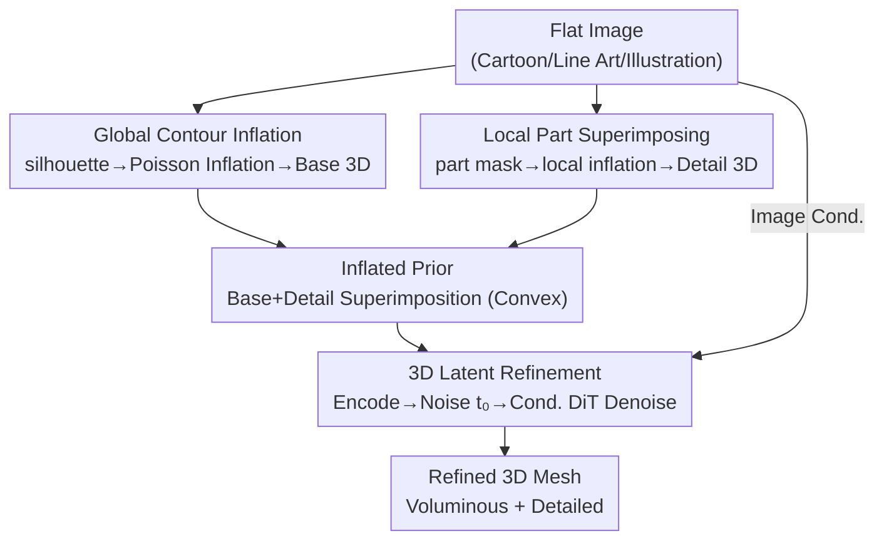

# REVIVE 3D: Refinement via Encoded Voluminous Inflated prior for Volume Enhancement

**Conference**: CVPR 2026  
**arXiv**: [2604.27504](https://arxiv.org/abs/2604.27504)  
**Code**: https://guts4.github.io/REVIVE3D/ (Project Page)  
**Area**: 3D Vision  
**Keywords**: Single-image to 3D, flat images, inflated prior, 3D latent refinement, volumetric metrics

## TL;DR
REVIVE 3D utilizes a "two-stage, plug-and-play" pipeline to transform flat images lacking 3D cues (cartoons, line art, flat illustrations) into voluminous 3D meshes. It first inflates the image into a volumetric "inflated prior" mesh, then performs noise injection and denoising refinement within the latent space of a pre-trained 3D latent diffusion backbone. The method also introduces two reference-free metrics, Compactness and Normal Anisotropy, to quantify "volume" and "surface flatness."

## Background & Motivation
**Background**: Mainstream image-to-3D generation currently follows two paths—synthesizing multi-view images followed by 3D lifting, or performing 3D latent diffusion directly in a compact latent space (where a 3D autoencoder defines the latent space and a DiT performs denoising from Gaussian noise to a clean latent, then decoded to a mesh, e.g., Trellis, Direct3D, Hunyuan3D).

**Limitations of Prior Work**: When the input consists of **flat images** (defined by the authors as inputs lacking 3D cues like shading, texture gradients, or relative positioning, such as cartoons, line art, or flat illustrations), SOTA models often fail. They either fail in depth/normal estimation or produce "squashed" meshes with almost no volume. The root cause is that large-scale training sets consist almost entirely of natural photos or rendered images rich in 3D cues, making flat images out-of-distribution.

**Key Challenge**: Previous remedies for flat images "fail to reach true 3D." Silhouette inflation methods (Monster Mash family) are driven only by silhouettes and cannot recover back-facing geometry or details; 2D-guided pipelines (depth/Canny/pose guidance) only provide 2D cues, leaving deformation stuck in image space without generating volume or back-side geometry; parametric regression methods are constrained by pre-defined model spaces, limiting expressiveness. The essence of the problem is that **these methods operate in 2D or restricted model spaces without providing direct 3D volumetric cues to the model**.

**Goal**: To directly generate "voluminous + detailed" 3D meshes from flat images and to quantify the presence of volume.

**Key Insight**: The authors observe that since the backbone model has already pre-trained rich 3D knowledge, it only lacks a volumetric cue to "activate" it. Therefore, an **inflated prior—coarse but voluminous—is explicitly constructed in 3D** to feed into the model, using the stochasticity of diffusion for refinement rather than circumventing through 2D.

**Core Idea**: First, silhouettes and part masks are inflated into a volumetric, part-aware Inflated Prior. This is then encoded into a 3D latent space, injected with Gaussian noise, and denoised conditionally. The geometric cues from the prior "leverage" the backbone's pre-trained 3D knowledge to complete concavities and back-sides while refining details.

## Method

### Overall Architecture
REVIVE 3D addresses the "flat image → voluminous and detailed 3D mesh" task via a two-stage serial pipeline (Fig. 3). **Stage 1 (Inflated Prior Generation)**: A Base 3D representing global volume is inflated from the foreground silhouette, while a Detail 3D representing local structures is inflated from part segmentation masks. These are superimposed to form an **Inflated Prior**. This prior possesses volume and part-specific spatial cues but assumes **convex geometry** (incorrectly making concave mouths or tails protruding). **Stage 2 (3D Latent Refinement)**: This prior mesh is encoded into a latent by a 3D Encoder, injected with Gaussian noise at an initial noise level $t_0$, and undergoes conditional DiT denoising guided by the input image before being decoded into the final Refined 3D mesh. The stochasticity of noise injection and denoising "erases" the convex assumption, leveraging the backbone's pre-trained knowledge to correct concavities and back-sides while preserving the volume provided by the prior. This pipeline is plug-and-play, validated by the authors on both Hunyuan3D-2.1 and Direct3D backbones.

### Key Designs

**1. Global Contour Inflation: "Blowing up" silhouettes into global volume using Poisson Inflation**

This step addresses the pain point where models fail to estimate depth due to a lack of 3D cues in flat images. The goal is to create global volume from scratch. The authors follow the geometric inflation approach of Monster Mash: first, the outer contour is extracted from the foreground silhouette, and the 2D plane region enclosed by the contour is triangulated into a 2D mesh. A discrete Poisson equation is then solved on this mesh to find a smooth height field $\tilde{h}$, assigning each vertex a scalar value for normal displacement. For each internal vertex $i$, a local volume constraint is enforced:

$$\sum_{j\in N_i} w_{ij}(\tilde{h}_j-\tilde{h}_i)=s_i a_i c,\qquad \tilde{h}_i=0\ \text{for}\ i\in\mathcal{C}$$

where $w_{ij}$ are cotangent Laplacian weights (capturing local curvature), $s_i$ is $+1$ (front) / $-1$ (back), $a_i$ is $1/3$ of the area of triangles around vertex $i$ (lumped vertex area), $c$ is the global inflation strength, and vertices on the contour set $\mathcal{C}$ are fixed at the zero-height plane by Dirichlet boundary conditions. Finally, a square root mapping $h_i=s_i\sqrt{|\tilde{h}_i|}$ is applied to smooth the height field, resulting in a convex Base 3D. The advantage is that the inflation originates from the image's own contours, ensuring the volumetric cues are naturally aligned with the image, which is more reliable than using a generic sphere as a prior.

**2. Local Part Superimposing: Adding local structural cues via part inflation**

Global silhouette inflation alone misses fine structures, making Stage 2 refinement of detailed meshes difficult. The authors use an automatic segmentation method (SAM-based) to extract part candidate masks. After filtering, each retained part $p$ is triangulated and inflated into a local height field $h_p$ (Detail 3D), which is then superimposed onto the Base height field via interpolation:

$$h_{\text{final}}=h_{\text{base}}+\sum_p \mathcal{I}_p(h_p)$$

where $\mathcal{I}_p$ is a piecewise linear interpolation function that maps the local height field onto the base mesh vertices, accumulating part by part. This provides Stage 2 with explicit part-specific spatial cues regarding "where details should appear and their shape," allowing the conditional DiT to align image features with latent geometry accurately. Ablations show that removing this (using only Base 3D) results in flat surfaces and lost details even if global volume is present.

**3. Stochastic 3D Latent Refinement: Jointly correcting convex assumptions via noise-denoise**

This is the core design addressing the **purely convex geometry** caused by the additive superimposition in Stage 1 (Fig. 4). Borrowing from the "error correction and sample quality enhancement" capabilities of stochastic diffusion models, the authors first encode the Inflated Prior into a latent $z_0$. Gaussian noise is then injected at a normalized initial noise level $t_0\in[0,1]$ to obtain the starting latent:

$$z_{t_0}=a_{t_0}z_0+b_{t_0}\varepsilon,\qquad \varepsilon\sim\mathcal{N}(0,\mathbf{I})$$

where $a_{t_0}, b_{t_0}$ are determined by the backbone diffuser's noise schedule ($t_0=0$ is clean, $t_0=1$ is pure noise). Conditioned on the input image, the model denoises from $z_{t_0}$ back to $z_0$, followed by decoding (Marching Cubes). Crucially, the injected stochasticity allows the DiT to deviate from the prior's convex assumption and utilize pre-trained 3D knowledge to "redraw" concavities and back-sides, while the denoising process remains guided by the prior's volume/part cues. $t_0$ serves as a **fidelity-plausibility** knob—too small, and convex artifacts remain; too large, and the volume is washed away.

### Loss & Training
This method is **training-free** and serves as a plug-and-play pipeline. It reuses pre-trained 3D latent diffusion backbones (Hunyuan3D-2.1 / Direct3D) without new losses. Key hyperparameters: Stage 1 global and local inflation strength $c=1.5$; Stage 2 guidance scale $7.0$, $50$ sampling steps, and default initial noise $t_0=0.8$ (experimentally, $[0.7, 0.8]$ is optimal). Inference takes approximately 3 minutes (Stage 1 ~2 min + Stage 2 ~1 min on RTX 6000 Ada).

## Key Experimental Results

### Main Results
The test set consists of 2,232 self-collected flat images (humans, animals, characters, specifically targeting cases where existing models fail, such as flat paint, shadeless art, and occlusions). Metrics include Uni3D / ULIP for image-3D semantic consistency, and the proposed Compactness ($C$, higher is more voluminous) and Normal Anisotropy ($\mathrm{NA}$, lower is less flat) for volume and surface flatness.

| Method | Uni3D↑ | ULIP↑ | C↑ | NA↓ |
|------|--------|-------|------|------|
| Trellis | 0.2736 | 0.1241 | 0.1748 | 0.1282 |
| DrawingSpinUp | 0.2335 | 0.1164 | 0.1604 | 0.1332 |
| Hunyuan3D-Omni | 0.2816 | 0.1257 | 0.1707 | 0.1120 |
| Direct3D (Backbone) | 0.2796 | 0.1315 | 0.2012 | 0.1019 |
| Hunyuan3D-2.1 (Backbone) | 0.2759 | 0.1193 | 0.1408 | 0.1347 |
| **Ours (Hunyuan3D-2.1)** | 0.3043 | 0.1265 | **0.2179** | **0.0767** |
| **Ours (Direct3D)** | **0.3097** | **0.1375** | 0.2178 | 0.0908 |

Applying REVIVE 3D to both backbones leads to significant improvements in Compactness and Normal Anisotropy (NA dropped from 0.13/0.10 to 0.077/0.091, indicating more volume and less flatness). Uni3D/ULIP also improved, showing that semantic consistency is not sacrificed for volume. A user study with 51 participants (5-point Likert scale) ranked the method best in Quality, Volume, and Details.

### Ablation Study
Tested on the Art3D dataset across inflation strengths and initial noise $t_0$ (defaults 1.5 / 0.8 highlighted in red):

| Inflation Strength | Noise $t_0$ | C | NA | Uni3D | ULIP | Note |
|---------|-----------|------|------|-------|------|------|
| 6.0 | 0.8 | 0.2682 | 0.0547 | 0.3276 | 0.1153 | Over-inflated |
| 0.1 | 0.8 | 0.1172 | 0.2539 | 0.2840 | 0.0935 | Under-inflated, collapsed volume |
| 1.5 | 1.0 | 0.1501 | 0.2168 | 0.3003 | 0.1006 | Pure noise start, prior volume lost |
| 1.5 | 0.6 | 0.4296 | 0.0511 | 0.3043 | 0.0979 | Too close to prior (distorts image) |
| **1.5** | **0.8** | 0.2691 | 0.0610 | **0.3382** | 0.1153 | **Default: Best geometry-image alignment** |

### Key Findings
- **$t_0$ is the Master Switch for Volume vs. Fidelity**: Small $t_0$ (0.6) keeps the latent close to the Inflated Prior, yielding excellent C/NA but retaining convex artifacts and deviating from the input image. Large $t_0$ (1.0) starts from pure noise, causing the backbone to lose the volume. $t_0=0.8$ is chosen because it yields the highest Uni3D/ULIP (alignment) while maintaining volume.
- **Local Part Superimposing is Essential for Detail**: Refinement using only Base 3D (no part superimposition) recovers global volume but often results in flat surfaces and lost details (Fig. 8). Part cues provide the DiT with explicit guidance on where structural details should be.
- **Metrics are Reliable**: Sorting ModelNet40 categories by C / NA (Table 1) shows high C for voluminous classes (glass_box, dresser) and low C for flat ones (curtain, keyboard). High NA corresponds to flat classes (door, wardrobe), while low NA corresponds to complex curved ones (vase, bowl)—consistent with human intuition.

## Highlights & Insights
- **"Constructing a coarse 3D prior to activate backbone knowledge" is a reusable paradigm**: Instead of struggling in 2D, providing an imperfect but voluminous initial value in 3D and refining it via diffusion stochasticity is more effective. This "Prior + Latent Refinement" approach can generalize to any generation task where input cues are insufficient but backbone priors are strong.
- **3D Geometric Error Correction via SDEdit-style denoising**: Moving the image editing trick of "injecting noise to an intermediate step then denoising" into 3D latents is clever. $t_0$ clearly controls the trade-off between "preserving prior" vs. "leveraging backbone," providing a physically meaningful single-knob control.
- **Establishing Non-Reference Metrics for "Volume"**: Since flat images lack Ground Truth 3D, reference-based metrics like Chamfer are unusable. Compactness ($36\pi V^2/S^3$) and Normal Anisotropy (based on normalized Shannon entropy of normal distribution) depend only on the generated mesh. Their alignment with human perception on ModelNet40 makes this evaluation protocol valuable for the "flat image 3D" sub-field.

## Limitations & Future Work
- **Ours**: The method relies on pre-trained backbones, which might pull simplified cartoon styles toward the backbone's photorealistic bias (style drift). The authors suggest better texture alignment as future work.
- **Observations**: ① The pipeline relies on reliable foreground silhouettes and part segmentation. While Fig. 10 shows robustness to imperfect segmentation, severe failures will distort Detail 3D cues. ② Stage 1 takes ~2 min, which is slow for batch scenarios. ③ Compactness can be "cheated" by simple convex blobs like an inflated eraser; it must be used alongside Normal Anisotropy.
- **Future Directions**: Introducing texture/style consistency as a constraint in Stage 2 to mitigate style drift, or using adaptive $t_0$ (larger noise for concavities/back-sides, smaller for confirmed regions).

## Related Work & Insights
- **vs. Contour Inflation (Monster Mash family)**: They rely solely on silhouettes, lacking back-side guidance and detailed part structures, often requiring manual disambiguation. This paper treats inflation as a "prior" and uses 3D latent diffusion to complete concavities and back-sides.
- **vs. 2D-guided Pipelines (DrawingSpinUp, depth/pose guidance)**: They provide only 2D cues, failing to create true 3D volume. Ours provides 3D volume cues directly, enabling the generation of back-side geometry. DrawingSpinUp's significantly lower C/NA scores support this.
- **vs. Hunyuan3D-Omni with Box Condition**: Bounding-box conditions can increase apparent volume but often result in uniform expansion that breaks image consistency. Our volume comes from an image-aligned inflated prior, ensuring consistency.
- **vs. Vanilla Backbones (Direct3D / Hunyuan3D-2.1)**: Direct inputs of flat images lead to collapsed meshes. Adding the two-stage pipeline improves C/NA across the board, proving the issue lies in the lack of an "activating" 3D volume prior rather than the backbone's capacity.

## Rating
- Novelty: ⭐⭐⭐⭐ The combination of "inflated prior + 3D latent refinement" targets the specific pain point of flat images effectively. The new metrics are a solid addition, though components are clever re-assemblies of existing techniques.
- Experimental Thoroughness: ⭐⭐⭐⭐ A large难例 (difficult cases) test set, dual-backbone validation, 5 baselines, 51-person user study, and extensive ablation make for a comprehensive evaluation.
- Writing Quality: ⭐⭐⭐⭐ Progressive motivation, clear structure, and effective visualizations (convex failure, trajectories) make for a strong presentation.
- Value: ⭐⭐⭐⭐ Plug-and-play and training-free, providing immediate utility for cartoon/illustration-to-3D in production (games, animation, VR).

<!-- RELATED:START -->

## Related Papers

- [\[CVPR 2026\] Rethinking Pose Refinement in 3D Gaussian Splatting under Pose Prior and Geometric Uncertainty](rethinking_pose_refinement_in_3d_gaussian_splatting_under_pose_prior_and_geometr.md)
- [\[CVPR 2026\] Color-Encoded Illumination for High-Speed Volumetric Scene Reconstruction](color-encoded_illumination_for_high-speed_volumetric_scene_reconstruction.md)
- [\[CVPR 2026\] Photo3D: Advancing Photorealistic 3D Generation through Structure-Aligned Detail Enhancement](photo3d_advancing_photorealistic_3d_generation_through_structure-aligned_detail_.md)
- [\[CVPR 2026\] Dynamic Visual SLAM using a General 3D Prior](dynamic_visual_slam_using_a_general_3d_prior.md)
- [\[CVPR 2026\] mmWaveFlow: Unified Enhancement and Generation of mmWave Human Point Clouds](mmwaveflow_unified_enhancement_and_generation_of_mmwave_human_point_clouds.md)

<!-- RELATED:END -->
