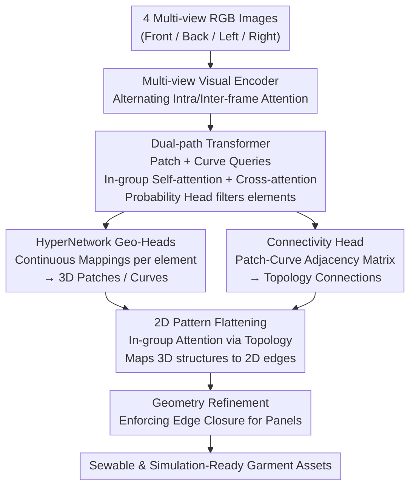

# ReWeaver: Towards Simulation-Ready and Topology-Accurate Garment Reconstruction

**Conference**: CVPR2026  
**arXiv**: [2601.16672](https://arxiv.org/abs/2601.16672)  
**Authors**: Ming Li, Hui Shan, Kai Zheng, Chentao Shen, Siyu Liu, Yanwei Fu, Zhen Chen, Xiangru Huang  
**Institute**: Zhejiang University, Shanghai Institute for Advanced Study, Westlake University, Fudan University, Adobe, Xidian University  
**Code**: To be confirmed  
**Area**: 3D Vision  
**Keywords**: Garment Reconstruction, Sewing Patterns, Topology Reconstruction, Multi-view Reconstruction, Physical Simulation  

## TL;DR

The ReWeaver framework is proposed to jointly reconstruct 3D garment geometry and 2D sewing patterns from a minimum of 4 multi-view RGB images. By employing a dual-path Transformer to predict 3D surface patches/curves and their topological connections, followed by in-group attention to flatten 3D structures into 2D panel edges, it achieves the first topology-accurate garment asset recovery ready for direct physical simulation.

## Background & Motivation

High-quality 3D garment reconstruction is critical for applications like virtual try-on, digital humans, gaming, and robotic manipulation. However, existing methods face two primary challenges:

1.  **Limitations of Unstructured Representations**: Current methods (point clouds, SDF, 3D Gaussian Splatting, etc.) can approximate garment geometry but lack explicit sewing structures (seams/panels). This makes them difficult to use directly for physical simulation, garment editing, or retargeting, as these representations are inherently incompatible with industry-standard design workflows centered on 2D sewing patterns.

2.  **Deficiencies in Existing Sewing Pattern Methods**:
    *   Methods relying on predefined topologies (e.g., DiffAvatar) are limited to simple garments and cannot handle unseen styles.
    *   Vision-language models (e.g., ChatGarment, AIpparel) generate 2D patterns via tokenized JSON descriptions; while they offer better topological generalization, they lack geometric precision.
    *   Most methods focus solely on 2D patterns, ignoring accurate 3D geometric understanding.

**Goal**: Simultaneously reconstruct accurate garment **topology** (which panels/seams are connected) and **geometry** (precise 3D shapes of each element), ensuring the output is suitable for both 3D perception and high-fidelity physical simulation.

## Method

### Overall Architecture

The core question ReWeaver addresses is: Given only four photos (front, back, left, right), can we recover accurate 3D geometry while simultaneously outputting the 2D sewing patterns required by industrial workflows, with a one-to-one correspondence between seams and panels for direct physical simulation? It integrates these tasks through an encoder-decoder framework: a multi-view encoder fuses sparse images into unified features, a dual-path Transformer decodes 3D surface patches, seams, and their topological relationships from these features, and a flattening module unfolds the 3D structures into 2D panel edges based on the topology, with post-processing ensuring panel closure.

A key prerequisite for understanding the subsequent sections is the correspondence between 2D and 3D space entities:

| Space | Surface Region | Boundary Line |
|:---:|:---:|:---:|
| 3D | Patch | Curve (Seam) |
| 2D | Panel | Edge |

Essentially, a 3D Patch is flattened into a 2D Panel, and a 3D Curve joining two patches corresponds to a 2D Edge—the entire pipeline maintains this 2D↔3D mapping.

### Key Designs

**1. Multi-view Visual Encoder: Fusing Sparse Images via Alternating Attention**

The first challenge in garment reconstruction is the limited, sparse input from non-fixed viewpoints. Both local textures from single views and global geometry from cross-view consistency must be utilized. ReWeaver follows the VGGT approach: each image is divided into $16\times16$ non-overlapping patches, embedded as tokens via a DINOv2 backbone. It then alternates between **intra-frame self-attention** (refining single-view textures) and **inter-frame self-attention** (aligning and aggregating cross-view geometry). This iterative refinement is robust to sparse inputs. Finally, tokens from all frames are concatenated and flattened into a sequence $T_i \in \mathbb{R}^{N_i \times D}$ ($D=768$) for decoding.

**2. Dual-path Transformer: Separating and Interacting Element Decoders**

3D Patches and Curves have distinct properties; decoding them together causes mutual interference. Inspired by ComplexGen, ReWeaver allocates separate paths: learnable patch queries $Q_p \in \mathbb{R}^{N_p \times D}$ ($N_p=200$) and curve queries $Q_c \in \mathbb{R}^{N_c \times D}$ ($N_c=70$). Within each layer, each path performs **in-group self-attention** (internal communication among patches or curves), followed by **cross-group cross-attention** (extracting context from image tokens and the other element type), and finally LayerNorm + FFN + Residuals. This yields refined $T_p$ and $T_c$. A probability head identifies which queries hit valid elements:

$$\sigma_p^i = \text{sigmoid}(f_p^{\text{prob}}(T_p^i)), \quad \sigma_c^i = \text{sigmoid}(f_c^{\text{prob}}(T_c^i))$$

Queries below thresholds $\epsilon_p, \epsilon_c$ are filtered, and topological refinement produces binary masks $\boldsymbol{\sigma}_p^{\star}, \boldsymbol{\sigma}_c^{\star}$, selecting true patches and curves from the candidates.

**3. HyperNetwork Geometry Prediction Head: Continuous Mappings via HyperNetworks**

Directly regressing fixed-count point coordinates ties sampling density to training parameters. ReWeaver utilizes a HyperNetwork: each token outputs weights for a small MLP that continuously maps parameter domains to 3D space. The curve head $f_c^{\text{geo}}$ generates a 3-layer MLP mapping $[0,1] \to \mathbb{R}^3$, and the patch head $f_p^{\text{geo}}$ generates an MLP mapping $[0,1]^2 \to \mathbb{R}^3$:

$$g_c^i(u) = f_c^{\text{geo}}(T_c^i)(u) \in \mathbb{R}^3, \quad g_p^i(u,v) = f_p^{\text{geo}}(T_p^i)(u,v) \in \mathbb{R}^3$$

Since geometry is represented as a continuous function, sampling can occur at any density. During inference, sampling is demand-driven (sparse for small patches, dense for large ones), ensuring uniform 3D point distributions.

**4. Connectivity Prediction Head: Explicitly Predicting "Who is Sewn to Whom"**

For sewing patterns, the connections between curves and patches are essential. ReWeaver performs linear projections on patch and curve tokens followed by a dot product and Sigmoid to predict connectivity probabilities:

$$\sigma_{pc}(i,j) = \text{sigmoid}(f_p^{\text{adj}}(T_p^i) \cdot f_c^{\text{adj}}(T_c^j))$$

The adjacency matrix $\sigma_{pc}$ is thresholded and refined into a binary matrix $\sigma_{pc}^{\star} \in \{0,1\}^{N_p \times N_c}$, explicitly defining which curves form each patch's boundary.

**5. 2D Pattern Flattening: Structure-Aware Group Attention**

Based on $\sigma_{pc}^{\star}$, each valid patch token and its associated curve tokens are grouped. Within the group, curve tokens undergo self-attention and cross-attention with the patch token to produce edge tokens $T_e$. For each connected curve $j \in \partial_i$, a HyperNetwork generates an MLP mapping 1D parameters to normalized 2D coordinates:

$$g_e^{ij}(u) = f_e^{\text{edge}}(T_e^j)(u) \in [0,1]^2, \quad \forall u \in [0,1]$$

Scale factors $s_i$ are regressed from patch tokens to restore physical dimensions. Finally, a geometry refinement step enforces edge closure to create closed panel cycles for triangulation and simulation.

### Loss & Training

A correspondence between predicted and ground-truth elements is established using **Hungarian matching**. The total loss includes:

**Geometry Loss** (Chamfer Distance):

$$L_{\text{geo}} = \sum_{g \in \mathcal{G}} w_{\text{geo}}^{(g)} \cdot \text{CD}(V(g), V(m(g)))$$

**Classification & Connectivity Loss** (BCE):

$$L_{\text{cls}} = \sum_{\sigma \in \{\boldsymbol{\sigma}_p, \boldsymbol{\sigma}_c, \sigma_{pc}\}} w_{\text{cls}}^{(\sigma)} \cdot \text{BCE}(\sigma, m(\sigma))$$

**Scale Loss** ($\ell_2$):

$$L_{\text{scale}} = \sum_{i=1}^{N_p} w_{\text{scale}} \|s_i - s_{m(i)}^{\text{gt}}\|_2^2$$

## Key Experimental Results

### Main Results

| Metric | AIpparel-MV | ReWeaver | Description |
|:---|:---:|:---:|:---|
| $\text{Acc}_p$ ↑ Panel count accuracy | 0.4561 | **0.8923** | ReWeaver +43.6% |
| $\text{Acc}_e$ ↑ Edge count accuracy | **0.6774** | 0.6570 | Comparable |
| $\text{Acc}_o$ ↑ Overall topology accuracy | 0.3090 | **0.5863** | ReWeaver +27.7% |
| $\text{CD}_e$ ↓ 2D edge Chamfer dist. | 0.0648 | **0.0395** | More precise geometry |
| IoU ↑ Panel IoU | 0.7084 | **0.8080** | +10.0% gain |

ReWeaver significantly outperforms the multi-view enhanced AIpparel (AIpparel-MV) in 5 out of 6 metrics, particularly in **panel count accuracy**, which jumps from 45.6% to 89.2%.

### Ablation Study

| Configuration | $\text{CD}_p^{\text{adapt}}$ ↓ | $\text{Acc}_p$ ↑ | $\text{Acc}_o$ ↑ | IoU ↑ |
|:---|:---:|:---:|:---:|:---:|
| Full (with refinement) | **0.0187** | 0.8923 | **0.5863** | **0.8080** |
| Without refinement | 0.0188 | **0.9101** | 0.4880 | 0.7775 |

**Key Findings**:
*   **Topology refinement** removes redundant edges, increasing overall topology accuracy ($Acc_o$) from 48.8% to 58.6%.
*   **Geometry refinement** closes gaps between 2D edges, increasing IoU from 77.8% to 80.8%.
*   Refinement has negligible impact on 3D geometry (Chamfer distance), showing its primary value is in topological consistency.
*   **Adaptive sampling** based on spatial variance reduces prediction error ($\text{CD}_p$) from 0.0225 to 0.0187.

## Highlights & Insights

*   ⭐ **First Joint Reconstruction**: Simultaneously outputs 3D garment geometry and 2D sewing patterns with explicit 2D-3D correspondence for direct simulation.
*   ⭐ **HyperNetwork Parameterization**: Uses continuous mappings for flexible, demand-driven adaptive sampling and geometric smoothness.
*   ⭐ **Dual-path Transformer**: Effectively fuses multi-view image evidence with structural geometric constraints.
*   ⭐ **GCD-TS Dataset**: A 100k-scale dataset that fixes texture "leaks" of seam information in original GCD.

## Limitations & Future Work

*   High-quality complex topology data remains scarce, leading to a visible **sim-to-real gap**.
*   Fine-grained topology prediction ($\text{Acc}_e = 0.657$) has significant room for improvement compared to panel detection.
*   Lacks quantitative evaluation on real-world imagery.
*   Geometry refinement relies on heuristic rules and does not guarantee 100% closure success.

## Rating

*   Novelty: ⭐⭐⭐⭐
*   Experimental Thoroughness: ⭐⭐⭐
*   Writing Quality: ⭐⭐⭐⭐
*   Value: ⭐⭐⭐⭐

<!-- RELATED:START -->

## Related Papers

- [\[CVPR 2026\] PhysHead: Simulation-Ready Gaussian Head Avatars](physhead_simulation-ready_gaussian_head_avatars.md)
- [\[CVPR 2026\] PhysX-Anything: Simulation-Ready Physical 3D Assets from Single Image](physx-anything_simulation-ready_physical_3d_assets_from_single_image.md)
- [\[CVPR 2026\] SwiftTailor: Efficient 3D Garment Generation with Geometry Image Representation](swifttailor_efficient_3d_garment_generation_with_geometry_image_representation.md)
- [\[CVPR 2026\] ExMesh: EXplicit Mesh Reconstruction with Topology Adaptation](exmesh_explicit_mesh_reconstruction_with_topology_adaptation.md)
- [\[AAAI 2026\] Pb4U-GNet: Resolution-Adaptive Garment Simulation via Propagation-before-Update Graph Network](../../AAAI2026/3d_vision/pb4u-gnet_resolution-adaptive_garment_simulation_via_propagation-before-update_g.md)

<!-- RELATED:END -->
