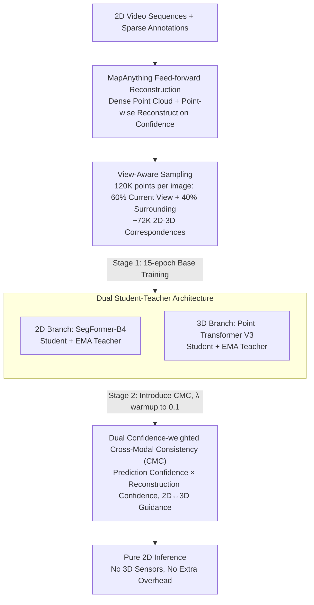

# Rewis3d: Reconstruction Improves Weakly-Supervised Semantic Segmentation

**Conference**: CVPR 2026  
**arXiv**: [2603.06374](https://arxiv.org/abs/2603.06374)  
**Code**: Coming soon  
**Area**: 3D Vision / Semantic Segmentation  
**Keywords**: Weakly-supervised segmentation, 3D reconstruction, Cross-modal consistency, Sparse annotation, Mean Teacher

## TL;DR

The Rewis3d framework is proposed, which for the first time integrates feed-forward 3D scene reconstruction as an auxiliary supervision signal into weakly-supervised semantic segmentation. Through a dual Student-Teacher architecture and dual confidence-weighted cross-modal consistency loss, it improves mIoU by 2-7% under sparse annotations, while using only 2D images during inference.

## Background & Motivation

While semantic segmentation has made significant progress, it remains heavily dependent on dense pixel-level annotations, which are extremely expensive to obtain. Weakly-supervised semantic segmentation (WSSS) aims to reduce the annotation burden by leveraging sparse annotations such as point labels, scribbles, or coarse labels, but a performance gap between WSSS and fully supervised methods persists.

**Limitations of Prior Work**:
1. **Ceiling for pure 2D methods**: Methods like SASFormer and TreeEnergy design specialized architectures and losses to propagate annotation information within the 2D image plane. However, they struggle to sufficiently compensate for the lack of supervision in geometrically complex outdoor scenes.
2. **Underutilization of 3D geometry**: 3D structures naturally provide cross-view consistency constraints. When an object is annotated with a scribble in one view, its 3D structure can propagate this label to all other views where it appears.

**Key Insight**: Recent breakthroughs in feed-forward 3D reconstruction (e.g., MapAnything) enable the recovery of high-fidelity 3D point clouds directly from standard 2D video sequences without specialized sensors like LiDAR. This inspires a new strategy: **leveraging reconstructed 3D geometry as auxiliary supervision to enhance 2D weakly-supervised segmentation** while maintaining a pure 2D inference pipeline.

## Method

### Overall Architecture

Rewis3d utilizes "reconstructed 3D geometry" as auxiliary supervision for 2D weakly-supervised segmentation without impeding deployment—inference remains 2D-only. During the preprocessing stage, MapAnything is used for feed-forward reconstruction of dense point clouds, followed by **View-Aware Sampling** to ensure sufficient 2D-3D correspondences for each image. Three components work in synergy: the 2D segmentation branch uses SegFormer-B4 + Mean Teacher, the 3D segmentation branch uses Point Transformer V3 + Mean Teacher, and Cross-modal Consistency (CMC) allows the teacher of one modality to guide the student of another for bi-directional knowledge transfer. Training is divided into two stages: first, 15 epochs of base training to independently establish the Student-Teacher frameworks for both modalities; then, CMC training is initiated by introducing cross-modal consistency loss with a 5-epoch linear warmup to a maximum weight of $\lambda = 0.1$. Crucially, 3D reconstruction is only used as preprocessing; final inference is entirely in 2D, requiring no 3D sensors or additional inference overhead.

### Key Designs

**1. View-Aware Sampling: Ensuring Sufficient 2D-3D Correspondences**

MapAnything reconstructs dense point clouds and point-wise reconstruction confidence from 2D video sequences in a single forward pass. However, full-scene point clouds are too large (200+ images → 60M+ points) to process directly. Rewis3d generates a dedicated 120K point subsample for each target image with a deliberate mixture: **60% sampled from the current view** (ensuring dense 2D-3D correspondence, ~72K points) and **40% from the surrounding scene** (providing context and maintaining global scene understanding for the 3D branch). This is critical: random sampling yields only ~140 correspondence points per image, which is insufficient for CMC training; view-aware sampling increases this by two orders of magnitude.

**2. Dual Student-Teacher Architecture: Stabilizing Pseudo-labels in Both Modalities**

The 2D and 3D branches each maintain an independent Mean Teacher structure, where teacher weights are updated via EMA of the student:

$$\boldsymbol{\theta}_t^{\text{teacher}} \leftarrow \alpha \boldsymbol{\theta}_{t-1}^{\text{teacher}} + (1-\alpha) \boldsymbol{\theta}_t^{\text{student}}, \quad \alpha = 0.99$$

Each branch utilizes supervised cross-entropy $\mathcal{L}_S$ for annotated regions and unsupervised consistency $\mathcal{L}_U$ (using teacher pseudo-labels) for unannotated regions, accompanied by confidence filtering—only pixels where the teacher's maximum class probability exceeds threshold $\tau$ are retained. Stable teacher pseudo-labels are a prerequisite for preventing cross-modal noise propagation.

**3. Dual Confidence-weighted Cross-Modal Consistency: Reliable Predictions on High-Quality Geometry**

Cross-modal supervision is sensitive to noise, so each CMC signal is filtered by dual confidences. Taking 3D teacher guidance for the 2D student as an example:

$$\mathcal{L}_C^{2D} = -\sum_j w_i \cdot \log(S_{2D}^{y_i}(I_j))$$

The weight is the product of prediction confidence and reconstruction confidence:

$$w_i = \underbrace{\max(\text{softmax}(T_{3D}(p_i)))}_{\text{Prediction Confidence}} \cdot \underbrace{c_i^{\text{rec}}}_{\text{Reconstruction Confidence}}$$

The former is derived from the 3D teacher's output probability, and the latter from MapAnything's point-wise reconstruction quality. This dual filter ensures that supervision primarily originates from "reliable predictions made on high-quality reconstructed geometry." Symmetrically, the 2D teacher guides the 3D student in the same manner ($\mathcal{L}_C^{3D}$).

### Loss & Training

The total loss aggregates the supervised/unsupervised terms of each modality and the bi-directional cross-modal consistency terms:

$$\mathcal{L}_{\text{Total}} = \sum_{m \in \{2D, 3D\}} (\mathcal{L}_S^m + \mathcal{L}_U^m) + \lambda_{2D} \mathcal{L}_C^{2D} + \lambda_{3D} \mathcal{L}_C^{3D}$$

Training details: 2D branch SegFormer-B4 (LR $5 \times 10^{-5}$), 3D branch Point Transformer V3 (LR $10^{-3}$), AdamW optimizer, batch size 12, two H100 GPUs. Training lasts 50 epochs (250 for NYUv2), with the CMC weight $\lambda = 0.1$ linearly warmed up. Students use strong augmentation (Cutout, Blur, AugMix / RandomRotation, RandomScale, RandomJitter), while teachers use weak augmentation.

## Key Experimental Results

### Main Results: Semantic Segmentation with Scribble Labels

| Method | 3D Superv. | Backbone | Waymo mIoU | SS/FS% | KITTI-360 mIoU | SS/FS% | NYUv2 mIoU | SS/FS% |
|------|---------|----------|-----------|--------|---------------|--------|-----------|--------|
| Fully Supervised | — | SegFormer-B4 | 59.0 | — | 68.4 | — | 51.1 | — |
| EMA (Baseline) | — | SegFormer-B4 | 49.4 | 83.7 | 60.3 | 88.2 | 42.9 | 84.0 |
| SASFormer | — | SegFormer-B4 | 37.8 | 64.1 | 46.4 | 67.8 | 44.7 | 87.5 |
| TEL | — | DeepLabV3+ | 42.4 | 71.9 | 59.2 | 86.6 | 38.3 | 75.0 |
| **Ours (Real 3D)** | LiDAR/Depth | SegFormer-B4 | 51.8 | 87.8 | 61.7 | 90.2 | 44.7 | 87.6 |
| **Ours (Recon)** | Reconstruction | SegFormer-B4 | **53.3** | **90.3** | **63.4** | **93.4** | **46.1** | **90.2** |

### Ablation Study (Waymo Dataset)

| Configuration | Confidence Filter | Sampling | 3D Source | mIoU |
|------|-----------|---------|---------|------|
| EMA Baseline (2D Only) | — | — | — | 49.4 |
| No Filter | ❌ | View-Aware | Multi-view Recon | 51.9 |
| + Prediction Conf. | Prediction | View-Aware | Multi-view Recon | 52.7 |
| + Recon Conf. | Recon | View-Aware | Multi-view Recon | 52.1 |
| + Dual Conf. (Ours) | Dual | View-Aware | Multi-view Recon | **53.3** |
| Random Sampling | Dual | Random | Multi-view Recon | 51.9 |
| Single-frame Recon | Dual | View-Aware | Single-frame | 52.1 |

### Generalization across Annotation Types (Cityscapes)

| Method | Point labels | Scribbles | Coarse labels |
|------|--------|------|---------|
| Fully Supervised | 77.6 | 77.6 | 77.6 |
| TEL | 53.1 | 64.4 | 64.9 |
| SASFormer | 42.7 | 55.6 | 42.8 |
| EMA (Baseline) | 50.5 | 61.2 | 66.5 |
| **Ours** | **56.5** (+6.0) | **68.1** (+6.9) | **68.6** (+2.1) |

### Key Findings

1. **Reconstruction 3D outperforms Real 3D**: This counter-intuitive result arises because reconstructed point clouds are often denser and more complete than LiDAR, and dual confidence filtering suppresses reconstruction noise (Real 3D lacks a reconstruction confidence metric).
2. **View-Aware Sampling is crucial**: Compared to random sampling (~140 points/image), view-aware sampling provides ~72K points, yielding a 1.4% mIoU Gain.
3. **Dual confidence is superior to single**: Prediction and reconstruction confidence capture complementary aspects of reliability.
4. **Multi-view reconstruction is better than single-frame**: Multi-view provides richer geometric context and more reliable depth estimation (+1.2 mIoU).
5. **Universal across labels**: Improvements are significant across point, scribble, and coarse labels, with the largest Gain occurring when annotations are most sparse.
6. **Narrowing the supervision gap**: On KITTI-360, it recovers 93.4% of the performance gap between weak and full supervision.

## Highlights & Insights

- **Novelty**: First to use feed-forward 3D reconstruction as an auxiliary signal for WSSS. Unlike using LiDAR or performing 3D segmentation, it enhances 2D segmentation with reconstructed geometry while keeping inference 2D-only.
- **Key Insight**: Reconstructed 3D (from 2D videos) can perform better than real LiDAR/depth due to its density and filterability.
- **Mechanism**: The dual Student-Teacher + dual confidence mechanism ensures reliable cross-modal knowledge transfer without over-relying on a single modality.
- **Experimental Thoroughness**: Extensive validation across 4 datasets (Waymo, KITTI-360, Cityscapes, NYUv2), 3 labels (point/scribble/coarse), and detailed ablations.

## Limitations & Future Work

1. **Dynamic Scene Noise**: Current 3D reconstruction (MapAnything) is not optimized for dynamic content; moving objects introduce geometric noise and depth uncertainty.
2. **Computational Overhead**: While inference is overhead-free, the 3D reconstruction preprocessing during training (200+ images → 60M+ points) is computationally intensive.
3. **Single-frame Limitation**: For datasets like Cityscapes processed frame-by-frame (no video), performance Gain is relatively limited.
4. **Integration of Dynamic-aware Reconstruction**: Explicitly handling dynamic scenes in reconstruction is a clear future direction.
5. **3D Branch Utilization**: A complete 3D branch is trained but unused during inference; its potential is not fully exploited.

## Related Work & Insights

- **MapAnything / DUSt3R**: Advances in feed-forward multi-view reconstruction serve as the infrastructure for Rewis3d.
- **Mean Teacher**: Proved competitive in sparse annotation scenarios; Rewis3d builds on this with 3D geometric supervision.
- **SASFormer / TEL**: Current WSSS SOTAs propagate information within 2D planes, missing geometric consistency.
- **2DPASS**: Distills knowledge from 2D to 3D for LiDAR segmentation—Rewis3d adopts the reverse direction (3D → 2D).
- **Insight**: Cross-modal consistency is a powerful self-supervised signal, especially when modalities (2D appearance vs 3D geometry) provide complementary information.

## Rating

| Dimension | Rating |
|------|------|
| Novelty | ⭐⭐⭐⭐⭐ |
| Theoretical Depth | ⭐⭐⭐⭐ |
| Experimental Thoroughness | ⭐⭐⭐⭐⭐ |
| Value | ⭐⭐⭐⭐ |
| Writing Quality | ⭐⭐⭐⭐⭐ |
| Overall | ⭐⭐⭐⭐⭐ |

<!-- RELATED:START -->

## Related Papers

- [\[CVPR 2026\] Ov3R: Open-Vocabulary Semantic 3D Reconstruction from RGB Videos](ov3r_open-vocabulary_semantic_3d_reconstruction_from_rgb_videos.md)
- [\[CVPR 2026\] Learning 3D Reconstruction with Priors in Test Time](tco_learning_3d_reconstruction_with_priors_in_test_time.md)
- [\[CVPR 2026\] VGG-T3: Offline Feed-Forward 3D Reconstruction at Scale](vgg-t3_offline_feed-forward_3d_reconstruction_at_scale.md)
- [\[CVPR 2026\] tttLRM: Test-Time Training for Long Context and Autoregressive 3D Reconstruction](tttlrm_test-time_training_for_long_context_and_autoregressive_3d_reconstruction.md)
- [\[CVPR 2026\] 3DReflecNet: A Large-Scale Dataset for 3D Reconstruction of Reflective, Transparent, and Low-Texture Objects](3dreflecnet_a_large-scale_dataset_for_3d_reconstruction_of_reflective_transparen.md)

<!-- RELATED:END -->
