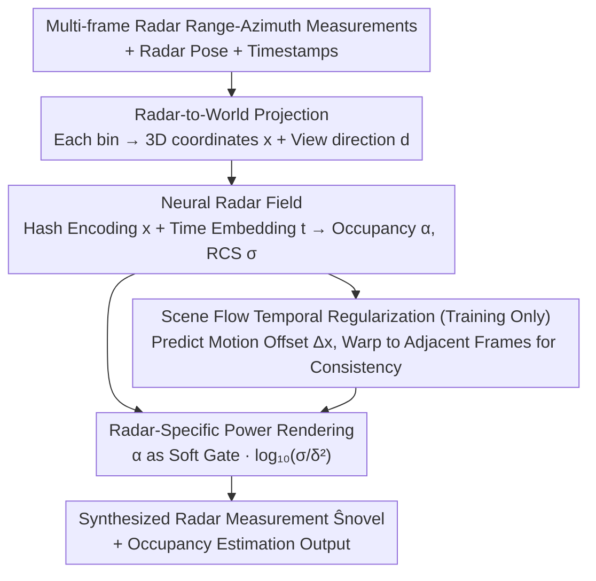

# RF4D: Neural Radar Fields for Novel View Synthesis in Outdoor Dynamic Scenes

**Conference**: CVPR 2026  
**Paper**: [CVF Open Access](https://openaccess.thecvf.com/content/CVPR2026/html/Zhang_RF4DNeural_Radar_Fields_for_Novel_View_Synthesis_in_Outdoor_Dynamic_CVPR_2026_paper.html)  
**Code**: https://zhan0618.github.io/RF4D  
**Area**: 3D Vision / Neural Fields / Perception for Autonomous Driving  
**Keywords**: Radar Neural Fields, Novel View Synthesis, Dynamic Scenes, Scene Flow, Occupancy Estimation

## TL;DR
RF4D integrates mmWave radar into neural fields. By employing a "spatio-temporal radar field + scene flow temporal regularization + physics-informed power rendering," it achieves novel view synthesis (NVS) for radar in outdoor dynamic scenes for the first time. The synthesis and occupancy estimation accuracy significantly outperform Radar Fields on two public radar datasets.

## Background & Motivation

**Background**: Neural fields (NeRF family) have achieved great success in scene reconstruction and Novel View Synthesis (NVS), but the primary inputs are RGB or LiDAR. Radar NVS has been overlooked despite the widespread use of mmWave radar in autonomous driving and its unique advantages in adverse weather, low light, long range, and low cost.

**Limitations of Prior Work**: ① RGB/LiDAR neural fields lack robustness in adverse weather like rain, snow, or fog. ② Traditional radar reconstruction relies heavily on ray tracing or RF propagation modeling, which is hardware-dependent and generalizes poorly, typically restricted to static scenes. ③ Existing works adapting neural fields to radar (e.g., Radar Fields) **only support static scenes**; they fail in dynamic environments (moving vehicles "disappear"). Furthermore, a fundamental **occupancy-reflectivity contradiction** exists: regions with high predicted occupancy often have suppressed reflectivity, violating the physical intuition that occupied regions should produce stronger reflections. These works also rely on external occupancy estimators for supervision, introducing extra dependencies.

**Key Challenge**: Outdoor driving scenes frequently contain dynamic objects, making spatio-temporal modeling crucial for temporally consistent NVS. Existing radar neural fields neither model the temporal dimension nor resolve the physically contradictory decoupled rendering between occupancy and reflection, leading to missing dynamic targets and noisy signals.

**Goal**: To develop a radar neural field for outdoor dynamic scenes that can stably reconstruct moving targets, ensure the relationship between occupancy and reflectivity conforms to radar physics, and eliminate reliance on external occupancy supervision.

**Key Insight**: The scene is represented as a spatio-temporal neural field (position + time). For each spatial point, the model predicts two radar-specific quantities: occupancy $\alpha$ (presence) and Radar Cross Section (RCS) $\sigma$ (reflection intensity of the occupied area). Based on radar imaging physics, a rendering formula is designed where occupancy acts as a "gate" to activate reflection, resolving the contradiction at a physical level.

**Core Idea**: Use a spatio-temporal neural field to explicitly model the time dimension, a scene flow module to predict inter-frame motion offsets for temporal regularization, and a radar power rendering approach where "occupancy acts as a soft gate and RCS acts as reflection intensity" to replace the decoupled rendering of Radar Fields. This enables the synthesis of physically consistent radar measurements in dynamic and adverse weather conditions.

## Method

### Overall Architecture
Given a 3D query point $x$, time $t$, and viewing direction $d$, RF4D projects radar range-azimuth measurements into world coordinates and uses a neural radar field to predict the occupancy $\alpha$ and RCS $\sigma$ at that point. These are synthesized into the received power $\hat{P}_r$ via radar-specific power rendering and supervised by ground truth radar measurements. During training, an additional scene flow module predicts motion offsets to preceding/succeeding frames from the same latent features, warping points to adjacent frames to calculate occupancy. Temporal regularization constrains these values to be consistent, ensuring stable occupancy for dynamic targets. The entire pipeline requires no external occupancy labels; occupancy is learned self-supervised from radar measurements.

### Key Designs

**1. Spatio-Temporal Neural Radar Field: Explicitly encoding time and decoupling occupancy from reflectivity.**

To reconstruct dynamic scenes, the neural field must be "time-aware." RF4D encodes position $x$ using a multi-resolution hash grid $H$ and timestamp $t$ using a learnable embedding network $T$. These are concatenated and passed through an MLP $f_\chi$ to obtain a spatio-temporal latent feature $\chi=f_\chi(H(x),T(t))$. Features are split into two paths: occupancy goes through MLP $f_\alpha$ with a **Gumbel-Sigmoid** activation to force $\alpha$ toward a near-binary soft mask (0=empty, 1=occupied), aligning with the physical semantics of occupancy. Since RCS depends on the radar wave incidence angle, $\chi$ is concatenated with the spherical harmonic encoding of the direction $S(d)$ and passed through $f_\sigma$ to obtain $\sigma=f_\sigma(\chi,S(d))$. Decoupling these two quantities is the prerequisite for occupancy-gated reflection in power rendering.

**2. Scene Flow Temporal Regularization: Predicting inter-frame motion offsets to stabilize dynamic targets.**

Static radar fields cause moving vehicles to "disappear" due to the lack of cross-frame motion constraints. RF4D uses an MLP $f_{\Delta x}$ to predict a 6D motion offset $\Delta x$ from the same latent feature $\chi$: the first 3 dimensions represent the offset to the previous frame $\Delta x_-$, and the last 3 to the next frame $\Delta x_+$. Points are warped to adjacent frames, and their occupancies are computed: $\alpha_{t-\Delta t}=f_\alpha(f_\chi(H(x+\Delta x_-),T(t-\Delta t)))$ and $\alpha_{t+\Delta t}$. During training, a loss $\mathcal{L}_{oc}=\frac{1}{N}\sum_{\delta,\theta}\big[(\hat{\alpha}-\hat{\alpha}^{t-\Delta t})^2+(\hat{\alpha}-\hat{\alpha}^{t+\Delta t})^2\big]$ encourages consistency across these three occupancy values. This allows the model to produce stable and coherent occupancy for moving objects, which is critical for dynamic scene reconstruction.

**3. Radar-Specific Power Rendering: Occupancy as a soft gate to eliminate contradictions and external supervision.**

NeRF's optical volume rendering cannot be directly applied to radar. Starting from radar physics $P_r=\frac{P_t G^2 \sigma}{(4\pi)^3 \delta^2}$, fixed terms like transmit power and antenna gain are omitted, and a base-10 logarithm is used to match the decibel scale common in radar data. Unlike Radar Fields which decouples occupancy and reflectivity, RF4D treats occupancy $\alpha$ as a **soft gating mask**. A radar response is activated only if a point is predicted to physically exist. Thus, the rendered power is $\hat{P}_r=\alpha\cdot\log_{10}(\sigma/\delta^2)$. This achieves three things: ① High occupancy naturally corresponds to strong reflection, resolving the occupancy-reflectivity contradiction. ② The gating mechanism suppresses noise and multipath interference. ③ Occupancy is learned self-supervised from the radar reconstruction loss, **eliminating the need for external occupancy estimators**.

### Loss & Training
The total loss consists of four terms: radar power reconstruction (MSE on sampled range-azimuth bins) $\mathcal{L}_{rt}=\frac{1}{N}\sum_{\delta,\theta}\big(\hat{\alpha}\log_{10}(\hat{\sigma}/\delta^2)-P_{GT}\big)^2$; temporal occupancy consistency $\mathcal{L}_{oc}$; occupancy sparsity regularization $\mathcal{L}_p=\frac{1}{N}\sum\hat{\alpha}$ (to prevent the trivial solution of $\alpha\approx1$ everywhere); and motion offset magnitude regularization $\mathcal{L}_m=\frac{1}{N}\sum(\|\Delta x_-\|^2+\|\Delta x_+\|^2)$. The combined loss is $\mathcal{L}_{total}=\mathcal{L}_{rt}+\lambda_{oc}\mathcal{L}_{oc}+\lambda_p\mathcal{L}_p+\lambda_m\mathcal{L}_m$. Implementation uses PyTorch + tiny-cuda-nn on a single RTX A5000. Each scene is trained for 15,000 iterations, randomly sampling 4 radar scans per iteration.

## Key Experimental Results

> Metrics: **PSNR / SSIM** evaluate radar measurement synthesis (higher is better; SSIM is more sensitive to structure/boundaries); **CD** (Chamfer Distance) / **RCD** (Relative Chamfer Distance) evaluate occupancy estimation against LiDAR references (lower is better).

### Main Results

Oxford Radar RobotCar (including dynamic vehicles, averages across 4 scenes):

| Method | Scene1 SSIM↑ | Scene1 CD↓ | Scene3 SSIM↑ | Scene3 CD↓ |
|------|--------------|------------|--------------|------------|
| D-NeRF | 0.1270 | 80.97 | 0.1620 | 23.84 |
| Hexplane | 0.2674 | 78.99 | 0.3909 | 119.01 |
| Radar Fields | 0.3372 | 18.19 | 0.3498 | 9.54 |
| **RF4D (Ours)** | **0.6103** | **7.34** | **0.6258** | **3.29** |

Boreas (including sun/snow/rain/static, covering adverse weather):

| Method | Sun PSNR↑ | Sun SSIM↑ | Rain PSNR↑ | Rain SSIM↑ | Static SSIM↑ |
|------|-----------|-----------|------------|------------|--------------|
| Radar Fields | 25.39 | 0.3641 | 25.80 | 0.3905 | 0.4331 |
| **RF4D (Ours)** | **26.65** | **0.7001** | **26.21** | **0.6635** | **0.7724** |

Most notably, SSIM nearly doubled (Scene1 0.337→0.610, Sun 0.364→0.700), indicating a significant improvement in the fidelity of structures and dynamic target boundaries. CD also decreased manifold (Scene1 18.19→7.34), showing more accurate occupancy geometry.

### Ablation Study

Adding regularization terms on RobotCar (Scene1 / Scene3):

| $\mathcal{L}_p$ | $\mathcal{L}_{oc}$ | $\mathcal{L}_{m}$ | S1 PSNR↑ | S1 SSIM↑ | S1 CD↓ | S3 CD↓ |
|:---:|:---:|:---:|---------|----------|--------|--------|
| | | | 21.90 | 0.3184 | 80.97 | 23.84 |
| ✓ | | | 23.23 | 0.5662 | 9.23 | 6.51 |
| ✓ | ✓ | | 22.99 | 0.6167 | 7.57 | 5.10 |
| ✓ | ✓ | ✓ | 23.38 | 0.6103 | 7.34 | 3.29 |

### Key Findings
- **Sparsity Regularization $\mathcal{L}_p$ provides the largest contribution**: Adding it alone improved SSIM from 0.318 to 0.566 and slashed CD from 80.97 to 9.23 by suppressing the "occupancy everywhere" degenerate solution.
- **Temporal Consistency $\mathcal{L}_{oc}$ improves structure, while Motion Regularization $\mathcal{L}_m$ improves geometry**: Adding $\mathcal{L}_{oc}$ further increased SSIM to 0.617. Adding $\mathcal{L}_m$ reduced Scene3 CD from 5.10 to 3.29, suggesting that constraining motion magnitude leads to more accurate dynamic geometry.
- **Occupancy estimation outperforms traditional methods without LiDAR supervision**: RF4D's self-supervised occupancy performance (CD/RCD) is generally superior to parameter-tuned CFAR and Bayesian filtering, with a marked advantage in adverse weather.

## Highlights & Insights
- **Identified and fixed the "Occupancy-Reflectivity Contradiction" in Radar Fields**: Integrating occupancy as a soft gate directly into the power rendering formula ($\hat{P}_r=\alpha\log_{10}(\sigma/\delta^2)$) provides physical consistency, noise resistance, and self-supervised occupancy in one elegant design.
- **First use of neural fields for Radar NVS in dynamic scenes**: The spatio-temporal modeling via scene flow and time embedding solves the "missing moving vehicle" problem, filling a modality gap in the NeRF literature.
- **Extensibility**: The "occupancy soft-gating $\times$ physical forward model" approach can be extended to other active sensing modalities like sonar or ToF.

## Limitations & Future Work
- **Lacks cross-scene generalization and real-time performance**: Each scene requires independent training for 15,000 iterations (per-scene optimization) ⚠️, making it unsuitable for immediate online deployment.
- **Evaluation blind spots in extreme weather**: Occupancy ground truth relies on synchronous LiDAR; since LiDAR geometry is unreliable in snow, CD/RCD metrics could not be reported for those conditions.
- **Simplified Multipath Modeling**: RCS uses spherical harmonics to encode view direction, which simplifies complex electromagnetic phenomena like strong multi-path or metallic reflections.
- **Hyperparameter Sensitivity**: The sensitivity to different loss weights ($\lambda_{oc}, \lambda_p, \lambda_m$) is not fully explored.

## Related Work & Insights
- **vs. Radar Fields**: Both are radar neural fields, but Radar Fields only supports static scenes, suffers from occupancy-reflectivity contradictions, and requires external occupancy estimators. RF4D adds spatio-temporal modeling for dynamics and solves physical contradictions via gated rendering.
- **vs. Traditional Radar Simulation**: Traditional methods depend heavily on hardware parameters and generalize poorly. RF4D is a data-driven implicit representation that does not require detailed hardware modeling.
- **vs. RGB Dynamic Neural Fields (D-NeRF / Hexplane)**: These methods are designed for optical volume rendering. When applied directly to radar, their performance is poor (e.g., D-NeRF SSIM is only 0.12). RF4D demonstrates that radar NVS must use physics-informed power rendering.

## Rating
- Novelty: ⭐⭐⭐⭐⭐ First radar neural field for dynamic NVS; precisely fixes physical contradictions of prior work.
- Experimental Thoroughness: ⭐⭐⭐⭐ Two datasets, adverse weather coverage, dual tasks (synthesis + occupancy); however, lacks cross-scene generalization.
- Writing Quality: ⭐⭐⭐⭐⭐ Clear derivation from radar physics to rendering formulas with intuitive diagnostics.
- Value: ⭐⭐⭐⭐ Significant for all-weather autonomous driving simulation/reconstruction, despite per-scene training limitations.

<!-- RELATED:START -->

## Related Papers

- [\[CVPR 2026\] Dynamic-Static Decomposition for Novel View Synthesis of Dynamic Scenes with Spiking Neurons](dynamic-static_decomposition_for_novel_view_synthesis_of_dynamic_scenes_with_spi.md)
- [\[CVPR 2026\] From None to All: Self-Supervised 3D Reconstruction via Novel View Synthesis](from_none_to_all_self-supervised_3d_reconstruction_via_novel_view_synthesis.md)
- [\[CVPR 2026\] GeodesicNVS: Probability Density Geodesic Flow Matching for Novel View Synthesis](geodesicnvs_probability_density_geodesic_flow_matching_for_novel_view_synthesis.md)
- [\[CVPR 2026\] SmokeSVD: Smoke Reconstruction from A Single View via Progressive Novel View Synthesis and Refinement with Diffusion Models](smokesvd_smoke_reconstruction_from_a_single_view_via_progressive_novel_view_synt.md)
- [\[CVPR 2026\] WildRayZer: Self-supervised Large View Synthesis in Dynamic Environments](wildrayzer_self-supervised_large_view_synthesis_in_dynamic_environments.md)

<!-- RELATED:END -->
