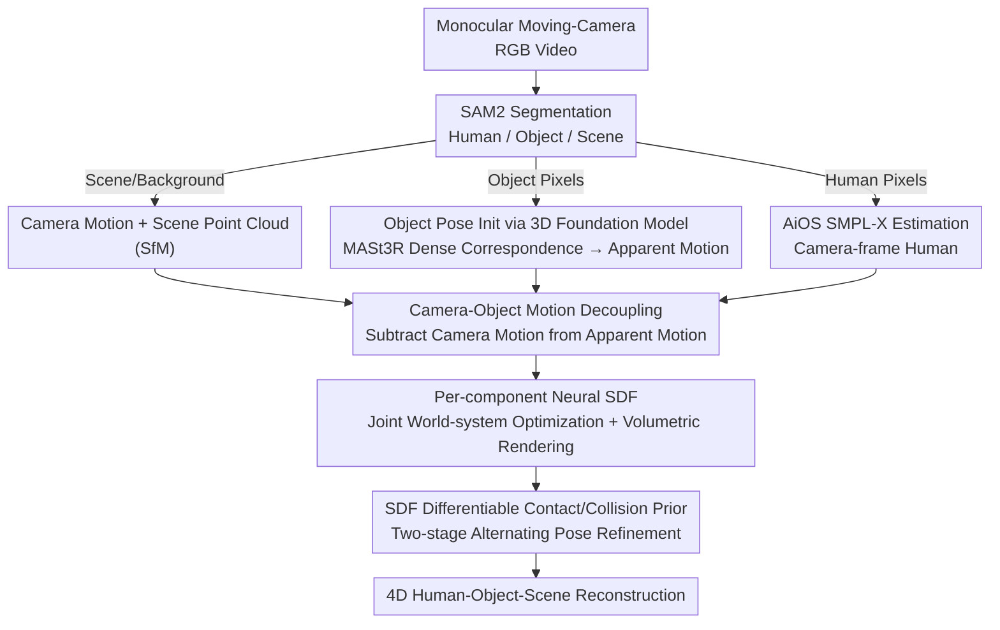

# RHINO: Reconstructing Human Interactions with Novel Objects from Monocular Videos

**Conference**: CVPR 2026  
**arXiv**: [2605.17014](https://arxiv.org/abs/2605.17014)  
**Code**: https://lxxue.github.io/RHINO (Available)  
**Area**: 3D Vision  
**Keywords**: Human-Object Interaction (HOI) Reconstruction, Monocular Video, Neural SDF, Camera-Object Motion Decoupling, Contact Priors

## TL;DR
From a single monocular RGB video with a moving perspective, RHINO reconstructs the "Human + Manipulated Unknown Object + Static Scene" into detailed 4D geometry within a unified world coordinate system. It leverages 3D foundation models to stabilize motion estimation for low-texture objects, decouples true object motion from "apparent motion" via camera motion subtraction, and performs joint optimization using per-component neural SDFs with a differentiable contact prior. It outperforms state-of-the-art baselines in both novel view synthesis and 4D reconstruction.

## Background & Motivation
**Background**: 3D reconstruction from monocular RGB video is a long-standing goal for intelligent systems. However, existing works mostly take a "divide and conquer" approach: either reconstructing human-agnostic static scenes or isolated humans. Only a few methods (like the SotA method HSR) can jointly reconstruct "Human + Scene" in a world coordinate system.

**Limitations of Prior Work**: These methods fail when a human manipulates an object. HSR reconstructs static scenes and walking humans well, but when a person pushes a table, the table reconstruction degrades into a mess (Fig. 2 in the paper). Another category, hand-object reconstruction (HOLD), operates only in the camera coordinate system and excludes the full body or scene. HOI reconstruction methods (e.g., InterTrack) often rely on known object templates, output only sparse point clouds, or generalize poorly to objects outside the training set. Furthermore, many methods assume known object/scene shapes or calibrated cameras, which is impractical.

**Key Challenge**: Moving cameras create a fundamental entanglement—"apparent motion" blends camera and object movement, making them inseparable. Additionally, everyday objects are often low-texture, symmetric, or occupy small image regions, causing traditional sparse keypoints (SuperPoint) and dense matching (LoFTR) to fail in providing consistent correspondences for SfM.

**Goal**: Recover detailed 3D shapes and appearances of the human, an unseen manipulated object, and the static scene from a single monocular video with a moving camera, without pre-scanned templates or camera calibration.

**Key Insight**: Two observations: (1) Recent 3D perception foundation models (MASt3R) treat correspondence as a 3D point-map regression task rather than 2D image matching, making them robust in low-texture regions for object-level SfM. (2) Neural SDFs do more than encode geometry; they provide a continuous, differentiable "signed distance to the surface," which is an ideal signal for reasoning about contacts.

**Core Idea**: "Decouple then Join"—first decouple the human/object/scene using 3D foundation models and camera motion subtraction to align them into a world coordinate system, then恢復 detail via joint optimization with per-component neural SDFs. The same SDF distances are reused to construct differentiable contact losses that "suck" hands toward the object surface while penalizing interpenetration.

## Method

### Overall Architecture
RHINO is a three-stage framework. Given a monocular RGB video of a human manipulating a rigid object, it outputs 4D geometry and appearance for the human, object, and scene in world coordinates. **Stage 1**: Obtain coarse initializations in respective coordinate systems (scene point cloud + camera motion, object apparent motion, camera-frame human). **Stage 2**: Align all three into a unified world coordinate system, using camera motion subtraction to extract true object motion from apparent motion. **Stage 3**: Perform joint volume rendering optimization using per-component neural SDFs and appearance fields to recover details, followed by a two-stage refinement with SDF-based contact/collision losses.

Performing joint optimization in the world coordinate system (rather than individual camera frames) is critical, as it provides multi-frame constraints across all components in a shared space, mitigating errors from per-frame initialization.

### Key Designs

**1. 3D Foundation Model Driven Object Pose Initialization: Saving SfM for Low-texture Objects**

Object reconstruction is difficult because objects in full-body videos are often low-texture, symmetric, occluded, or small. Traditional sparse keypoints (SuperPoint) fail due to non-repeatability, and dense matching (LoFTR) is inconsistent across frames. The authors replace the source of correspondence in SfM with MASt3R, which establishes dense matching on object pixels. By modeling correspondence as point-map regression in 3D rather than 2D, it provides stable results in low-texture regions. Triangulating these reliable matches yields a synthetic camera trajectory $\mathbf{C}_{\text{obj}}$ assuming the object is static. This replacement improves object reconstruction CD from 4.25/3.97 cm (SP/LoFTR) to 1.09 cm, and F1 from 60/63% to 91.4%.

**2. Camera-Object Motion Decoupling: Extracting True Motion from Apparent Motion**

A moving camera makes the object's "apparent motion" a mix of camera and object movement. The authors first compute the true camera trajectory $\mathbf{C}_{\text{scn}}$ from static background pixels via SfM, then align the apparent object trajectory $\mathbf{C}_{\text{obj}}$. The world-frame object pose sequence $\mathbf{P}_{\text{obj}}$ satisfies $\mathbf{T}\cdot\mathbf{S}\cdot\mathbf{C}_{\text{obj}}=\mathbf{C}_{\text{scn}}\cdot\mathbf{P}_{\text{obj}}$, where $\mathbf{S}$ is scale and $\mathbf{T}$ is a rigid transformation. Using RANSAC to find "static object frames" $i'$ (where $\mathbf{P}_{\text{obj}}^{i'}=I$), the equation simplifies to $\mathbf{T}\cdot\mathbf{S}\cdot\mathbf{C}_{\text{obj}}=\mathbf{C}_{\text{scn}}$, allowing for an Umeyama least-squares solution for scale, rotation, and translation:

$$\min_{\mathbf{s},\mathbf{R},\mathbf{t}}\sum_{i'=1}^{n}\|\mathbf{s}\mathbf{R}\mathbf{c}_{\text{obj}}^{i}+\mathbf{t}-\mathbf{c}_{\text{scn}}^{i}\|^{2}$$

The world-frame object pose is then $\mathbf{P}_{\text{obj}}=\mathbf{C}_{\text{scn}}^{-1}\cdot\mathbf{T}\cdot\mathbf{S}\cdot\mathbf{C}_{\text{obj}}$—essentially morphing $\mathbf{C}_{\text{obj}}$ to the true scale/coordinate, then removing the camera motion. Similarly, the camera-frame SMPL-X trajectory is recovered to world-frame perspective using 2D projection and ground contact constraints. This step is vital; without motion decoupling (w/o MD), CD surges from 2.65 to 10.21 cm.

**3. Compositional Joint Optimization: Multi-frame Constraints in Canonical Spaces**

Human $H$, object $O$, and scene $S$ each have a neural SDF $f_{\text{sdf}}^{(\cdot)}$ mapping 3D points to signed distance $\xi^{(\cdot)}$ and geometric feature $\mathbf{z}^{(\cdot)}$. The human field is conditioned on body joints $\boldsymbol{\theta}_b$ to capture pose-dependent deformations like clothing wrinkles. Each component also includes an appearance field $f_{\text{rgb}}^{(\cdot)}$ conditioned on shape features and normals $\mathbf{n}$ (from SDF gradients). The human field is modeled in canonical space using inverse LBS ($\mathbf{x}^H=LBS^{-1}(\mathbf{x}'^{H},\boldsymbol{\theta})$), while the object uses pose mapping ($\mathbf{x}^O=\mathbf{P}_{obj}^{-1}\mathbf{x}'^{O}$). Volume rendering is performed by sampling $N$ points in bounding boxes and sorting them by depth, naturally handling occlusions. A SMPL-X-guided hand-specific SDF loss prevents hand geometry from blurring.

**4. SDF Differentiable Contact Priors + Two-stage Refinement: Fixing Interpenetration**

Depth ambiguity can leave hands floating or intersecting with objects. Using the object's neural SDF, the signed distance $\xi^{O}_{x_c}=f_{sdf}^{O}(x_c)$ for a contact point $x_c$ defines:

$$\mathcal{L}_{\text{contact}}=\alpha_1\tanh(\xi^{O}_{x_c}/\alpha_2)^2\ \ (\xi^{O}_{x_c}\!\geq\!0),\qquad \mathcal{L}_{\text{collision}}=\beta_1\tanh(\xi^{O}_{x_c}/\beta_2)^2\ \ (\xi^{O}_{x_c}\!<\!0)$$

This pulls external points toward the surface and pushes internal points out. Potential contact points are estimated by InteractVLM, but filtered by an object motion cue: only frames where the object moves are considered contact frames. In **Stage 1**, only shape/appearance are optimized. In **Stage 2**, shape/appearance networks are frozen while human/object poses are refined with physical losses, preventing the contact loss from eroding the object's geometric shape.

### Loss & Training
- **Stage 1 (Shape/Appearance Learning)**: Per-pixel RGB loss + mask/depth/normal auxiliary losses + SMPL-X internal/external SDF constraints + Hand-specific SDF loss.
- **Stage 2 (Physical Refinement)**: Freeze shape/appearance networks, optimize human/object poses using $\mathcal{L}_{\text{contact}}$ and $\mathcal{L}_{\text{collision}}$.
- Alternating these stages prevents physical losses from destroying object geometry.

## Key Experimental Results

### Main Results
Evaluated on **BenchRHINO**: Captured in a 4D rig with 106 synchronized cameras (53 RGB/53 IR), including 7 sequences and 6 objects with GT 4D HOI geometry. Metrics include Chamfer Distance (CD), Hausdorff Distance (HD), and F1@2cm.

**Shape Reconstruction (Table 1, CD / HD / F1, Columns H=Human, O=Object, S=Scene)**:

| Method | Recon. H/O/S | CD-H ↓ | CD-O ↓ | F1-H ↑ | F1-O ↑ |
|------|-----------|--------|--------|--------|--------|
| HSR | H, S | 2.69 | — | 55.17 | — |
| HOLD | O | — | 4.41 | — | 33.64 |
| InterTrack | H, O | 4.66 | 11.16 | 29.41 | 16.81 |
| **Ours** | **H, O, S** | **2.65** | **1.21** | **56.16** | **90.42** |

RHINO is the first to reconstruct H/O/S simultaneously. It drastically outperforms HOLD (CD 4.41 cm) and InterTrack (CD 11.16 cm) on object reconstruction with a CD of 1.21 cm and F1 of 90.42%.

**Novel View Synthesis (Table 2, BenchRHINO)**:

| Method | PSNR ↑ | SSIM ↑ | LPIPS ↓ |
|------|--------|--------|---------|
| HSR | 22.65 | 0.791 | 0.246 |
| HOLD | 17.92 | 0.646 | 0.513 |
| **Ours** | **25.80** | **0.832** | **0.212** |

### Ablation Study
| Configuration | Key Metrics | Note |
|------|---------|------|
| Obj Pose: SP+SG | CD 4.25 / F1 60.06 | Traditional keypoints are non-repeatable on low-texture objects |
| Obj Pose: LoFTR | CD 3.97 / F1 62.80 | Correspondences inaccurate under complex motion |
| Obj Pose: **Ours(MASt3R)** | **CD 1.09 / F1 91.38** | Robust point-map correspondences |
| w/o MD (No Decoupling) | CD 10.21 / F1 26.32 | World-system reconstruction collapses |
| **Full RHINO** | **CD 2.65 / F1 56.16** | — |
| w/o Contact Opt | PD 1.088 / Recall 18.39 | Resulting in floating or penetrating hands |
| **Full RHINO** | **PD 0.477 / Recall 63.57** | Penetration depth halved; recall tripled |

> Note: **PD (Penetration Depth, cm)** measures how deep the human body intersects with the object.

## Highlights & Insights
- **"Subtraction" Logic for Decoupling**: Subtracting camera motion from apparent motion using RANSAC to find static frames and Umeyama for closed-form solutions elegantly solves the motion entanglement problem in moving monocular cameras.
- **Multipurpose Neural SDF**: Reusing the SDF as both a geometry representation and a contact distance field avoids explicit contact detection and makes "sticking the hand to the object" a differentiable goal.
- **Denoising Contact with Motion**: Using object movement as a temporal filter for InteractVLM is a simple yet effective engineering insight to suppress false positive contact detections.
- **Two-stage Refinement**: Freezing shape before refining poses with physical losses prevents the common pitfall where contact losses "squash" the reconstructed object shape.
- **BenchRHINO Dataset**: The first benchmark for moving-perspective 4D HOI reconstruction, filling a gap in datasets previously limited to static cameras.

## Limitations & Future Work
- **Single Person/Object**: Currently limited to a single person and one rigid object.
- **Rigidity Assumption**: Cannot handle non-rigid or articulated objects (e.g., opening boxes).
- **Optimization Speed**: Optimization is per-scene and slow; not yet suitable for real-time AR/VR.
- **Observation Dependency**: Performance drops when the object is poorly seen or occluded for extended periods.
- **Foundation Model Dependency**: Reliant on several external models (SAM2, MASt3R, AiOS, etc.), making it vulnerable to upstream failures.

## Related Work & Insights
- **vs HSR**: HSR performs joint H+S reconstruction but fails completely on manipulated dynamic objects. RHINO extends this paradigm by incorporating unknown dynamic objects into the world-system optimization.
- **vs HOLD**: HOLD performs hand-object reconstruction in camera frames and lacks scene/body context. It is also fragile under low texture or fast motion.
- **vs InterTrack**: These methods often rely on synthetic data and generalize poorly to out-of-distribution objects, whereas RHINO is template-free and uses 3D foundation models for robustness.

## Rating
- Novelty: ⭐⭐⭐⭐⭐ First to jointly reconstruct H+O+S in world coordinates from moving monocular video.
- Experimental Thoroughness: ⭐⭐⭐⭐ Solid ablations, though sequence count is relatively small.
- Writing Quality: ⭐⭐⭐⭐⭐ Logical progression; clearly explains the decoupling math.
- Value: ⭐⭐⭐⭐⭐ Provides a strong template-free baseline for 4D HOI capture.

<!-- RELATED:START -->

## Related Papers

- [\[CVPR 2026\] Recovering Physically Plausible Human-Object Interactions from Monocular Videos](recovering_physically_plausible_human-object_interactions_from_monocular_videos.md)
- [\[CVPR 2026\] Scaling4D: Pushing the Frontier of Video Novel View Synthesis through Large-Scale Monocular Videos](scaling4d_pushing_the_frontier_of_video_novel_view_synthesis_through_large-scale.md)
- [\[CVPR 2026\] NeoVerse: Enhancing 4D World Model with in-the-wild Monocular Videos](neoverse_enhancing_4d_world_model_with_in-the-wild_monocular_videos.md)
- [\[CVPR 2026\] FunREC: Reconstructing Functional 3D Scenes from Egocentric Interaction Videos](funrec_reconstructing_functional_3d_scenes_from_egocentric_interaction_videos.md)
- [\[CVPR 2026\] PhysHO: Physics-Based Dynamic 3D Gaussian Human and Object from Monocular Video](physho_physics-based_dynamic_3d_gaussian_human_and_object_from_monocular_video.md)

<!-- RELATED:END -->
