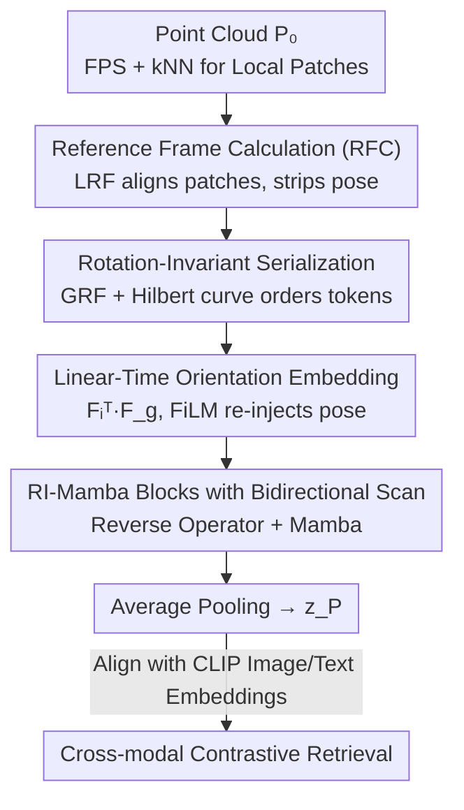

# RI-Mamba: Rotation-Invariant Mamba for Robust Text-to-Shape Retrieval

**Conference**: CVPR 2026  
**Paper**: [CVF Open Access](https://openaccess.thecvf.com/content/CVPR2026/html/Nguyen_RI-Mamba_Rotation-Invariant_Mamba_for_Robust_Text-to-Shape_Retrieval_CVPR_2026_paper.html)  
**Code**: None (ndkhanh360.github.io/project-rimamba for project page)  
**Area**: 3D Vision  
**Keywords**: Text-to-shape retrieval, rotation invariant, state space models, Mamba, point cloud

## TL;DR
Addressing the retrieval challenges of 3D objects with arbitrary orientations and diverse categories in real-world scenarios, this paper proposes RI-Mamba, the first pure-Mamba rotation-invariant point cloud model. It decouples pose from geometry using local and global reference frames, constructs rotation-invariant token sequences via Hilbert curves, and recovers discarded pose information through linear-time orientation embeddings. Combined with cross-modal contrastive learning using automatic triplet generation, it achieves SOTA performance in arbitrary-orientation retrieval across 200+ categories in OmniObject3D.

## Background & Motivation

**Background**: Text-to-shape retrieval allows users to retrieve models from large-scale 3D libraries using natural language. Mainstream approaches (Text2Shape, Parts2Words, SCA3D, etc.) rely on manual caption supervision or even fine-grained part segmentation labels to align text and shapes.

**Limitations of Prior Work**: These methods suffer from two critical flaws. First, they are restricted to small predefined category sets (e.g., Text2Shape only includes tables and chairs; TriCoLo only uses 13 ShapeNet classes) because manual annotations or part labels are only available in small, curated datasets. Second, they **assume all 3D objects are in a canonical pose**. Objects in real-world online 3D libraries are often randomly oriented; once database objects are randomly rotated, the retrieval accuracy of these models drops significantly.

**Key Challenge**: To achieve scalability, the reliance on manual annotation must be replaced with automatic data generation. To ensure robustness, the model must be invariant to arbitrary $SO(3)$ rotations. However, existing rotation-invariant (RI) networks either impose restrictive constraints, lack expressive power, or are computationally expensive—notably, the SOTA RI-Transformer relies on attention mechanisms where complexity is quadratic relative to the number of tokens, making it difficult to apply to retrieval tasks requiring large-scale cross-modal training. Meanwhile, efficient Mamba-based point cloud models have not yet addressed rotation invariance.

**Goal**: (1) Abandon manual annotation and expand training data to 200+ categories; (2) Design a 3D encoder that is both efficient (linear time) and truly rotation-invariant without sacrificing expressive power.

**Key Insight**: The authors observe that Mamba is a unidirectional state space model (SSM) where the update of each token depends on its position in the sequence. To make Mamba rotation-invariant, **both the patch embeddings and the sequence order of tokens must be rotation-invariant**, which is the primary challenge in applying SSMs to RI tasks.

**Core Idea**: Use reference frames to strip pose from geometry to ensure invariance, and then use Hilbert curves within a global reference frame to generate a rotation-invariant token sequence for Mamba. Simultaneously, a linear-time "orientation embedding" is used to re-inject the discarded pose information in a rotation-invariant manner, compensating for the loss of expressive power in typical RI models.

## Method

### Overall Architecture

Given a point cloud $P_0 \in \mathbb{R}^{N\times3}$ (optionally with colors $C_0$), RI-Mamba first uses Farthest Point Sampling (FPS) to select $G$ center points, then uses kNN to cluster local patches around each center. Next, it calculates a **Local Reference Frame (LRF)** for each patch to align it to a canonical orientation, stripping away the pose. A **Rotation-Invariant Serialization** (via Global Reference Frame (GRF) and Hilbert curves) is used to arrange the unordered set of patches into a rotation-robust 1D sequence. Each patch yields geometric embeddings $\text{geo}_i$, positional embeddings $\text{pos}_i$, and orientation embeddings $\text{ori}_i$. These embeddings are passed sequentially into $L$ **RI-Mamba Blocks** (containing FiLM, reverse operators, and Mamba modules) to model long-range geometric relationships. Finally, global features $z_P \in \mathbb{R}^C$ are obtained via average pooling and aligned with CLIP image and text embeddings via **cross-modal contrastive learning**.

### Key Designs

**1. Reference Frame Calculation (RFC): Stripping Pose from Geometry**

This is the foundation of rotation invariance. The authors treat an arbitrary point set $X \in \mathbb{R}^{n\times3}$ as a canonical point set $\hat{X}$ rotated under a reference frame $F \in \mathbb{R}^{3\times3}$: $\hat{X}$ encodes intrinsic geometry, while $F$ encodes orientation. Projecting points into their own reference frame eliminates pose:

$$F = \text{RFC}(X), \quad \hat{X} = X F^{\top}.$$

$F$ is estimated using PCA (taking principal variance directions as orthogonal axes). However, PCA has **sign ambiguity**—either direction of an axis is valid, leading to inconsistent sequence processing. The authors' Reference Frame Disambiguation (RFD) is simple yet effective: points are projected onto each axis, and the side containing the "majority of points" is chosen as the positive direction, ensuring a deterministic and reproducible reference frame. Applying this to each local patch $p_i$ yields its LRF $F_i$, resulting in aligned patches $\hat{p}_i = p_i F_i^{\top}$, which are **rotation-independent, local geometric descriptions**.

**2. Rotation-Invariant Serialization: Ensuring Invariant Token Ordering**

Since Mamba is a unidirectional SSM, information propagation depends heavily on token position. Thus, patch embedding invariance is insufficient—**the ordering itself must also be rotation-invariant**; otherwise, different orientations of the same object would produce different sequences. The authors compute a **Global Reference Frame (GRF)** $F_g = \text{RFC}(P_0)$ for the entire object, project patch centers onto the GRF to get canonical coordinates $\hat{P} = P F_g^{\top}$, and then sort these coordinates using a **Hilbert space-filling curve**: $I_H = \text{Hilbert}(\hat{P})$. The Hilbert curve preserves spatial locality, ensuring that points close in 3D space remain close in the 1D sequence.

Why is it rotation-invariant? Applying a rotation $R$ to the input $P_0^r = P_0 R$ means centers $P^r = PR$ and the GRF $F_g^r = F_g R$. Substituting these:

$$\hat{P}^r = P^r (F_g^r)^{\top} = PR(F_g R)^{\top} = P F_g^{\top} = \hat{P},$$

The canonical coordinates remain unchanged, thus the Hilbert index $I_H$ remains invariant. For the same reason, positional embeddings $\text{pos}_i = \text{MLP}(P_i F_i^{\top})$ and geometric embeddings $\text{geo}_i = \text{PointNet}(p_i F_i^{\top})$ remain invariant.

**3. Linear-Time Orientation Embedding: Recovering Discarded Pose Information**

Aligning every patch to its LRF ensures invariance but **discards patch orientation information**, which prior research suggests weakens expressive power. Simple remedies (encoding LRF with an MLP) fail because the LRF itself rotates with the input. RI-Transformer models relative orientations between all patch pairs, but that has quadratic complexity ($O(N^2)$).

The key observation is that the LRF $F_i$ of a patch and the global GRF $F_g$ **change in the same way** under any global rotation. Therefore, their relative pose $F_i^{\top} F_g$ is rotation-invariant. The authors encode this relative orientation into an embedding:

$$\text{ori}_i = \text{MLP}(F_i^{\top} F_g).$$

This is **patch-wise** rather than pairwise. Each patch computes an embedding independently, making it linear-time and compatible with SSMs, allowing Mamba to capture inter-patch orientation relationships implicitly during sequential processing without quadratic overhead.

**4. RI-Mamba Block Bidirectional Scanning and FiLM Pose Re-injection**

Each RI-Mamba block receives the previous hidden state $h_{l-1}$ and positional/orientation embeddings. It passes through FiLM → Reverse Operator → Mamba. **FiLM (Feature-wise Linear Modulation)** re-injects spatial context: a bottleneck layer reduces dimensions of $\text{pos}$, $\text{ori}$, and their product $\text{pos}\odot\text{ori}$, and an MLP learns channel-wise scaling/shifting $\gamma_l, \beta_l \in \mathbb{R}^C$. The hidden state is modulated as $h'_l = \gamma_l \cdot h_{l-1} + \beta_l$. The **Reverse Operator** addresses the unidirectional limitation of Mamba by alternating the scan direction (left-to-right in odd layers, right-to-left in even layers), enabling bidirectional context flow with zero extra computation.

### Loss & Training

To avoid manual annotation, the authors use **automatic triplet generation**: reusing OpenShape's method to render images from 3D meshes and applying image captioning to obtain "point cloud-image-text" triplets. Training uses the cross-modal contrastive framework of TAMM: global features $z_P$ from RI-Mamba are decoupled into visual attributes $z_I$ and semantic variables $z_T$, aligned with CLIP image and text embeddings respectively. The total loss is the sum of InfoNCE losses in both directions:

$$\mathcal{L} = \mathcal{L}_{P\leftrightarrow I} + \mathcal{L}_{P\leftrightarrow T}.$$

This pipeline expands the training data to a combined ensemble of four datasets (~123K samples), supporting retrieval across 200+ categories.

## Key Experimental Results

### Main Results

**Supervised Retrieval (Text2Shape, Tables/Chairs)**: Under canonical poses, RI-Mamba matches the SOTA models that use part labels (†), despite using no part labels. Under random $SO(3)$ rotations, RI-Mamba leads significantly, whereas prior methods collapse.

| Method | Can. RR@1 | Can. NDCG@5 | SO(3) RR@1 | SO(3) NDCG@5 |
|------|-----------|-------------|------------|--------------|
| Parts2Words† | 12.72 | 23.13 | 1.68 | 3.57 |
| SCA3D† | 13.74 | 24.58 | 2.24 | 4.46 |
| **RI-Mamba** | **13.87** | 24.55 | **13.20** | **23.65** |

**Zero-Shot Retrieval (OmniObject3D, 214 Classes, Ensemble Pre-trained)**: Non-RI models suffer significant performance drops under random rotation. While other RI models are stable, they often underperform on aligned point clouds due to weak expressive power. RI-Mamba achieves the best performance across almost all settings.

| Method | Omni3D RR@1 | Omni3D NDCG@5 | SO(3) RR@1 | SO(3) NDCG@5 |
|------|-------------|---------------|------------|--------------|
| DuoMamba | 15.82 | 29.28 | 7.83 | 17.09 |
| RI-Transformer | 9.67 | 20.89 | 10.39 | 21.24 |
| **RI-Mamba** | **19.02** | **34.39** | **19.34** | **33.76** |

### Ablation Study

Removing components (Omni3D, ShapeNet pre-trained, RR@1 metric):

| Configuration | Metric | Description |
|------|------|------|
| (0) Full Model | 14.7 | Hilbert+RFD+pos+ori+FiLM+Bidirection |
| (1) w/o Hilbert | 13.9 | Remove Hilbert ordering |
| (2) w/o RFD | 14.1 | Remove reference frame disambiguation |
| (3) w/o pos+ori | 8.2 | Remove position + orientation embeddings (drop of 6.5) |
| (4) w/o FiLM | 13.1 | pos+ori present but without FiLM modulation |
| (5) w/o Bidirection | 12.7 | Mamba is unidirectional only |

### Key Findings
- **Pose recovery is critical**: Removing pos+ori drops performance from 14.7 to 8.2, proving that stripping pose for invariance carries a heavy cost that must be compensated.
- **Efficiency over RI-Transformer**: At 2048 tokens, RI-Transformer uses over 20 GB VRAM, while RI-Mamba uses only ~2 GB. FLOPs and runtime scale linearly.
- **Better Generalization**: While RI-Transformer overfits on ModelNet40 due to its attention mechanism, RI-Mamba outperforms it on the more realistic and diverse OmniObject3D dataset.
- **Axis-swap Robustness**: RI-Mamba is highly robust to variations in gravity axis conventions ($y$ vs $z$).

## Highlights & Insights
- **Invariance of sequence order**: Moving RI from "embedding invariance" to "sequence structure invariance" using GRF + Hilbert curves is a novel way to enable SSMs for RI tasks.
- **Ingenious $F_i^{\top}F_g$ relative pose**: Using the relative quantity between local and global reference frames achieves rotation invariance with linear complexity, bypassing the quadratic overhead of pairwise comparisons in Transformers.
- **Automated Pipeline**: The transition from manual labeling to automated "render-caption-triplet" pipelines enables scaling retrieval from a dozen categories to over 200.

## Limitations & Future Work
- Rotation invariance relies on **PCA reference frames**, which may fail for near-symmetrical or degenerate geometries where axis estimation is unstable ⚠️.
- Evaluations use mostly synthetic/curated 3D datasets; robustness to noise, missing data, or occlusion in real-world scans requires further testing.
- Automated triplets are limited by the quality of the image captioning model; fine-grained descriptions of materials or part relationships might be imprecise.

## Related Work & Insights
- **vs RI-Transformer**: Both decouple geometry and orientation, but RI-Mamba uses linear SSMs and patch-wise orientation rather than quadratic pairwise attention, making it much more efficient.
- **vs DuoMamba / PointBERT**: These have high expressive power and scores in canonical poses but collapse under random rotations; RI-Mamba trades off minimal canonical performance for stability across all rotations.
- **vs TriCoLo / SCA3D**: These are limited to small datasets and canonical poses; RI-Mamba scales to 200+ categories and handles arbitrary orientations.

## Rating
- Novelty: ⭐⭐⭐⭐⭐ (First pure-Mamba RI model; novel sequence ordering)
- Experimental Thoroughness: ⭐⭐⭐⭐ (Extensive benchmarks across retrieval and classification)
- Writing Quality: ⭐⭐⭐⭐ (Clear mathematical derivations and logical flow)
- Value: ⭐⭐⭐⭐⭐ (Moves text-to-shape retrieval toward real-world application)

<!-- RELATED:START -->

## Related Papers

- [\[CVPR 2026\] RINO: Rotation-Invariant Non-Rigid Correspondences](rino_rotation-invariant_non-rigid_correspondences.md)
- [\[CVPR 2026\] Mamba Learns in Context: Structure-Aware Domain Generalization for Multi-Task Point Cloud Understanding](mamba_learns_in_context_structure-aware_domain_generalization_for_multi-task_poi.md)
- [\[CVPR 2026\] VIMCAN: Visual-Inertial 3D Human Pose Estimation with Hybrid Mamba-Cross-Attention Network](vimcan_visual-inertial_3d_human_pose_estimation_with_hybrid_mamba-cross-attentio.md)
- [\[CVPR 2025\] Spectral Informed Mamba for Robust Point Cloud Processing](../../CVPR2025/3d_vision/spectral_informed_mamba_for_robust_point_cloud_processing.md)
- [\[CVPR 2026\] AIMDepth: Asymmetric Image-Event Mamba for Monocular Depth Estimation](aimdepth_asymmetric_image-event_mamba_for_monocular_depth_estimation.md)

<!-- RELATED:END -->
