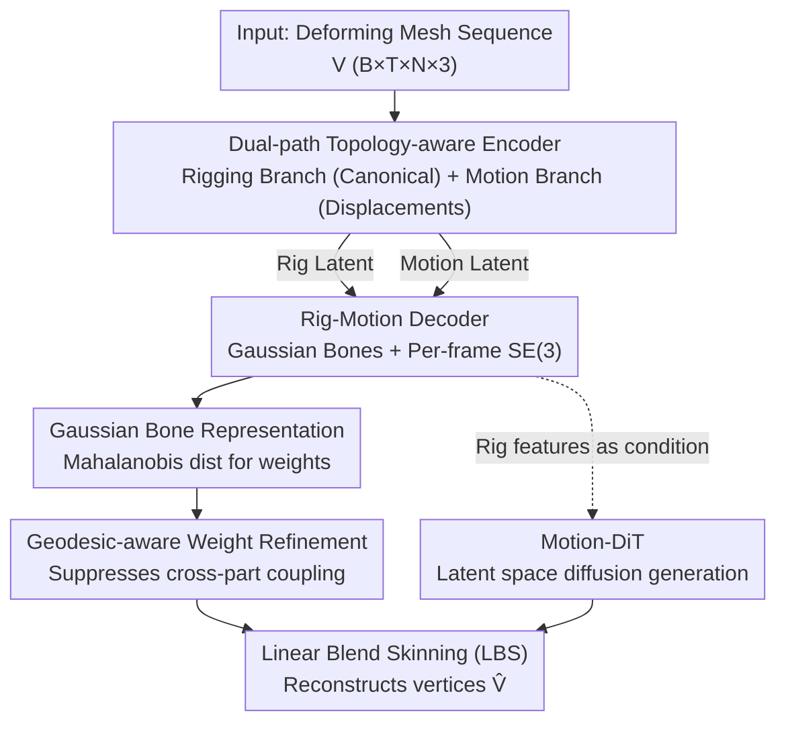

# RigMo: Unifying Rig and Motion Learning for Generative Animation

**Conference**: CVPR 2026  
**Paper**: [CVF Open Access](https://openaccess.thecvf.com/content/CVPR2026/html/Zhang_RigMo_Unifying_Rig_and_Motion_Learning_for_Generative_Animation_CVPR_2026_paper.html)  
**Code**: None (Project page only RigMoPage.github.io)  
**Area**: 3D Vision  
**Keywords**: 4D Generation, Auto-rigging, Skinning Weights, Gaussian Bones, Motion Diffusion

## TL;DR
RigMo unifies "rig" and "motion" into a single feed-forward VAE: it learns a set of Gaussian bones, skinning weights, and per-frame SE(3) transformations directly from raw mesh sequences through self-supervision, eliminating the need for manual skeletal annotations. Coupled with a Motion-DiT operating in its latent space for controllable motion generation, it significantly outperforms existing auto-rigging and deformation baselines in reconstruction accuracy, cross-motion generalization, and inference speed.

## Background & Motivation
**Background**: 4D generation (animated 3D assets) naturally consists of two components: **structure** (the rig, defining how the object can deform) and **motion** (how the structure evolves over time). However, existing pipelines almost always decouple these two. Auto-rigging methods (RigNet, UniRig, MagicArticulate) predict skeletons and skinning weights from static meshes, essentially mimicking human-annotated heuristics. Motion generation methods (e.g., AnyTop) assume a known skeleton and predict joint rotations in pose space. A third category, pure vertex deformation (AnimateAnyMesh, GVFDiffusion), bypasses rigging entirely by directly predicting per-vertex displacements per frame.

**Limitations of Prior Work**: Each paradigm has significant flaws. Auto-rigging **heavily relies on manually annotated skeletons**, making it difficult to maintain consistency or scale across datasets and object categories; furthermore, "guessing skinning from static geometry" is error-prone even for experts. Methods assuming known skeletons **cannot handle arbitrary geometry**, failing if the skeleton does not match. While flexible, pure vertex deformation is **difficult to control, lacks interpretability, and does not produce reusable rigged assets**—the very purpose of rigging. Classic SSDR (Smooth Skinning Decomposition with Rigid bones) can recover rigs from sequences but requires **time-consuming non-linear optimization for each individual sequence**, failing to generalize.

**Key Challenge**: The fundamental problem is that a **robust rig cannot be inferred from static geometry alone; it must be learned from motion**. Looking at a static mesh, it is impossible to determine which vertices belong to the same bone; the structure only emerges naturally when the mesh "moves." However, no existing framework can **simultaneously** learn rig structure and motion dynamics directly from raw mesh sequences without predefined skeletons or per-sequence optimization.

**Core Idea**: Utilize a unified feed-forward VAE to **decouple** per-vertex deformation into two compact latent spaces: a rig latent space decoded into explicit **Gaussian bones + skinning weights**, and a motion latent space decoded into per-frame **SE(3) transformations**. Both are reconstructed into mesh motion via differentiable skinning. The entire process uses **only vertex-level reconstruction loss + KL self-supervision**, completely bypassing the bottleneck of manual rigging annotations.

## Method

### Overall Architecture
RigMo consists of two parts: **RigMo-VAE** (the core, learning rig representations and motion parameters) and **Motion-DiT** (performing downstream controllable motion generation within the VAE latent space).

The data flow of RigMo-VAE is: Input a sequence of deforming meshes $V \in \mathbb{R}^{B\times T\times N\times 3}$ (batch B, frames T, vertices N) → A **dual-path topology-aware encoder** separately encodes "static geometry" and "dynamic motion" (the rigging branch processes the first frame's canonical geometry, while the motion branch processes per-frame displacements) → A **Rig-Motion decoder** extracts Gaussian bone parameters $G=[\Delta c, s, q]$ and local/root SE(3) motions $\{q_{local}, t_{local}, q_{root}, t_{root}\}$ → A **Gaussian Skinning LBS module** calculates skinning weights from Gaussian bones, refines them via geodesic distance, and finally reconstructs per-frame vertices $\hat V$ using Linear Blend Skinning (LBS). The entire network performs feed-forward inference for a sequence of 20 frames with 5K vertices in approximately 40ms on an A100.

After obtaining these structure-aware latent representations, Motion-DiT uses the rig branch output as a condition to perform diffusion in the motion latent space, generating or interpolating new motions, which are then rendered into animations using the VAE decoder.

### Key Designs

**1. Gaussian Bone Rigging: Using Soft Ellipsoids as "Bones" to Decouple Complexity from Resolution**

Traditional skeletons consist of discrete joints and rigid bones, requiring a fixed topology and hard vertex assignments, which are tied to the mesh resolution. RigMo uses a set of **Gaussian bones**: each bone $k$ is defined by $G_k=[c_k, s_k, q_k]$—center $c_k\in\mathbb{R}^3$, anisotropic scale $s_k\in\mathbb{R}^3$, and orientation quaternion $q_k\in\mathbb{R}^4$. Together, they form a 3D Gaussian ellipsoid acting as a **soft bone with spatially varying influence**. The raw skinning weight $w_{ik}$ of vertex $v_i$ for bone $k$ is calculated via **Mahalanobis distance** in the bone's coordinate system and normalized via softmax:

$$w^{raw}_{ik} = \frac{\exp\!\big(-\tfrac{1}{2}\|R_k^\top(v_i-c_k)\oslash s_k\|^2\big)}{\sum_{j=1}^{K}\exp\!\big(-\tfrac{1}{2}\|R_j^\top(v_i-c_j)\oslash s_j\|^2\big)}$$

where $R_k$ is the rotation matrix corresponding to $q_k$ and $\oslash$ denotes element-wise division. The final deformation uses LBS: $\hat v_i = \sum_k w_{ik}\,T_k\,\tilde v_i$, where $T_k = T_{root}\cdot T_{k,local}$ hierarchically combines root and local bone motions. This representation is powerful because it is **continuously defined in 3D space** rather than tied to specific vertex indices, making its complexity dependent on bone count $K$ rather than mesh resolution.

**2. Dual-path Topology-aware Encoder: Decoupling "Structure" and "Motion" at the Encoding Stage**

If the same features handle both structure and motion, rig predictions become unstable and biased by specific motions. RigMo separates them within the encoder. The **rigging branch** processes only canonical geometry (first frame $V_0$), using topology-aware attention $h^\ell = \text{Attn}(\text{LN}(h^{\ell-1}), N)+h^{\ell-1}$ to produce per-vertex embeddings. It uses Farthest Point Sampling (FPS) to select $K$ bone tokens and cross-attention to predict Gaussian parameters. The **motion branch** calculates displacements $V_\Delta = V[:,1:]-V[:,:-1]$, uses spatio-temporal attention, and extracts bone-motion interaction features $A_{motion}$ using **shared bone token coordinates** $C_{bone}$. It then predicts variational posteriors for local/root motions. **Sharing bone token indices** ensures the rig and motion branches refer to the same set of bones, enabling stable structural decoupling.

**3. Geodesic-aware Weight Refinement: Blocking "Cross-talk" via Surface Shortest Paths**

Gaussian weights based solely on Euclidean distance suffer from a common flaw: parts that are spatially close but topologically distant (e.g., an arm touching the torso) get incorrectly coupled to the same bone, causing tearing artifacts during motion. RigMo adds **geodesic refinement**: it calculates the surface geodesic distance $d_g(v_i,a_k)$ from vertex $v_i$ to bone anchor $a_k$. A binary mask $M_{ik}=\mathbb{1}[d_g(v_i,a_k)<\tau]$ is constructed using a threshold $\tau$. Raw weights are masked and re-normalized: $\tilde W_{ik}=W^{raw}_{ik}M_{ik}$, $w_{ik}=\tilde W_{ik}/(\sum_j \tilde W_{ij}+\varepsilon)$. Vertices out of reach of any bone default to one-hot for the nearest bone. This effectively suppresses cross-part influence, resulting in cleaner skinning. Removing this step degrades CD-L1 from 1.73 to 2.37.

**4. Motion-DiT: Diffusion in Structure-Aware Latent Space**

Generating motion directly in vertex space is high-dimensional and difficult to control. Motion-DiT moves generation into RigMo's **motion latent space**. A condition encoder aggregates static rig cues (anchors, Gaussians, skinning features) into anchor tokens $A$ and global tokens $g$, which remain fixed as conditions. Dynamic and root tokens from the VAE are projected to a unified width $H$ and concatenated into a motion latent tensor. Following a configurable **frame mask**, a diffusion Transformer predicts the velocity field $\hat v$ using v-prediction to recover $\hat x_0=\sqrt{\alpha_t}x_t-\sqrt{1-\alpha_t}\hat v$. The backbone consists of 12 **Inter-spatial and Temporal Attention (ISTA) blocks**, alternating spatial attention across bones and temporal attention across frames.

### Loss & Training
RigMo-VAE is trained end-to-end using only two self-supervised objectives: vertex-level reconstruction $L_{recon}=\frac{1}{BTN}\sum\|\hat v-v\|^2$ and KL regularization $L_{KL}$. **No rigging annotations are used**; the bone structure emerges naturally from observing vertex trajectories. Motion-DiT uses a weighted L2 loss across latent space, SO(3) rotations, translations, and vertices.

## Key Experimental Results

### Main Results
Dataset: ~20,000 deforming mesh sequences across DeformingThings4D, TrueBones, and Objaverse-XL.

**Rig Discovery and Cross-Motion Generalization** (DT4D, CD ×10⁻³):

| Method | Train Recon CD-L1 | Cross-Motion CD-L1 | Cross-Motion CD-L2 | Avg CD-L1 |
|------|------|------|------|------|
| Per-Case Optimization | 12.3 | 68.8 | 43.5 | 40.55 |
| UniRig + Opt. | 37.3 | 48.6 | 31.2 | 42.95 |
| MagicArticulate + Opt. | 43.1 | 53.4 | 28.7 | 48.25 |
| **Ours (RigMo)** | **11.1** | **13.82** | **11.83** | **12.46** |

Per-case optimization performs reasonably on training motions (12.3) but collapses on unseen motions (68.8), confirming that rigging cannot be memorized per-sequence. RigMo's cross-motion error is nearly 1/3 that of the strongest baseline.

**Reconstruction Fidelity and Inference Efficiency** (CD ×10⁻²):

| Method | CD-L1 ↓ | CD-L2 ↓ | 20-frame Latency ↓ |
|------|------|------|------|
| AnimateAnyMesh | 1.81 | 1.32 | 2.8s |
| Step1X3D | 3.63 | 2.96 | 22.6s |
| **Ours (RigMo)** | **1.73** | **1.26** | **0.74s** |

RigMo achieves higher reconstruction fidelity than AnimateAnyMesh using fewer tokens (48/128 vs 512) and is significantly faster (0.74s).

### Ablation Study
(DT4D Validation, CD ×10⁻²)

| Configuration | CD-L1 ↓ | CD-L2 ↓ | Note |
|------|------|------|------|
| w/o Geodesic Refinement | 2.37 | 2.07 | Largest performance drop |
| 48 Bone Tokens | 1.91 | 1.48 | Best efficiency/interpretability balance |
| 128 Bone Tokens | 1.73 | 1.26 | Quantitatively optimal |

### Key Findings
- **Geodesic refinement is the most critical module**: Removing it degrades CD-L1 from 1.73 to 2.37, proving that for articulated objects, surface topology is a better constraint than Euclidean distance.
- **Diminishing returns for bone counts**: Increasing tokens from 48 to 128 provides only marginal gains; excessive tokens can fragment coherent anatomical regions.
- **Resolution Independence**: Since Gaussian bones and motion are defined in 3D space, the rig can be applied back to original high-resolution meshes without quality loss.

## Highlights & Insights
- **The insight that "rigs must be learned from motion" is the core contribution**: The failure of per-case optimization on unseen motions proves that rigging cannot be inferred from static geometry alone.
- **Smart Representation**: Using 3D Gaussian ellipsoids as "soft bones" provides a differentiable, continuous, and resolution-independent skinning method that decouples model complexity from mesh resolution.
- **Encoder-level Decoupling**: Sharing bone tokens between the rigging and motion branches is a crucial engineering detail that ensures the self-supervised discovery of semantically consistent bones.

## Limitations & Future Work
- **Data Dependency**: Requires large-scale deforming sequences (~20k) and significant compute (24×A100 for 10 days).
- **Manual K-setting**: The number of bones $K$ (48/128) is a hyperparameter and does not yet adapt to object complexity ⚠️.
- **Motion-DiT Evaluation**: The primary focus is the VAE; quantitative comparisons between Motion-DiT and specialized motion generators are limited in the main text.
- **Geodesic Threshold $\tau$**: The sensitivity of refinement to the threshold $\tau$ requires further analysis ⚠️.

## Related Work & Insights
- **vs. Auto-rigging**: Traditional methods predict skeletons from static meshes and require artist-annotated supervision. RigMo is entirely self-supervised and generalizes better to new motions.
- **vs. Pure Vertex Deformation**: Methods like AnimateAnyMesh lack structural abstraction and fail to produce reusable assets. RigMo provides explicit, interpretable, and resolution-independent rigs.

## Rating
- Novelty: ⭐⭐⭐⭐⭐ First feed-forward framework to jointly learn rig and motion via self-supervision from raw mesh sequences.
- Experimental Thoroughness: ⭐⭐⭐⭐ Solid cross-motion and ablation studies, though Motion-DiT evaluation is slightly thin.
- Writing Quality: ⭐⭐⭐⭐ Clear motivation and well-structured technical descriptions.
- Value: ⭐⭐⭐⭐⭐ Significant paradigm shift from manual/optimized rigging to data-driven, scalable feed-forward rigging.

## Related Papers

- [\[CVPR 2026\] Tracking-Guided 4D Generation: Foundation-Tracker Motion Priors for 3D Model Animation](tracking-guided_4d_generation_foundation-tracker_motion_priors_for_3d_model_anim.md)
- [\[CVPR 2026\] DynamicTree: Interactive Real Tree Animation via Sparse Voxel Spectrum](dynamictree_interactive_real_tree_animation_via_sparse_voxel_spectrum.md)
- [\[CVPR 2026\] AnthroTAP: Learning Point Tracking with Real-World Motion](anthrotap_learning_point_tracking_with_real-world_motion.md)
- [\[CVPR 2026\] ReFlow: Self-correction Motion Learning for Dynamic Scene Reconstruction](reflow_self-correction_motion_learning_for_dynamic_scene_reconstruction.md)
- [\[CVPR 2025\] PhysAnimator: Physics-Guided Generative Cartoon Animation](../../CVPR2025/3d_vision/physanimator_physics-guided_generative_cartoon_animation.md)

<!-- RELATED:END -->

<!-- RELATED:START -->

## Related Papers

- [\[CVPR 2026\] Tracking-Guided 4D Generation: Foundation-Tracker Motion Priors for 3D Model Animation](tracking-guided_4d_generation_foundation-tracker_motion_priors_for_3d_model_anim.md)
- [\[CVPR 2026\] From Feature Learning to Spectral Basis Learning: A Unifying and Flexible Framework for Efficient and Robust Shape Matching](from_feature_learning_to_spectral_basis_learning_a_unifying_and_flexible_framewo.md)
- [\[CVPR 2026\] DynamicTree: Interactive Real Tree Animation via Sparse Voxel Spectrum](dynamictree_interactive_real_tree_animation_via_sparse_voxel_spectrum.md)
- [\[CVPR 2026\] GM-R²: Generative Matching Learning for Unsupervised Geometric Representation and Registration](gm-r2_generative_matching_learning_for_unsupervised_geometric_representation_and.md)
- [\[CVPR 2026\] AnthroTAP: Learning Point Tracking with Real-World Motion](anthrotap_learning_point_tracking_with_real-world_motion.md)

<!-- RELATED:END -->
