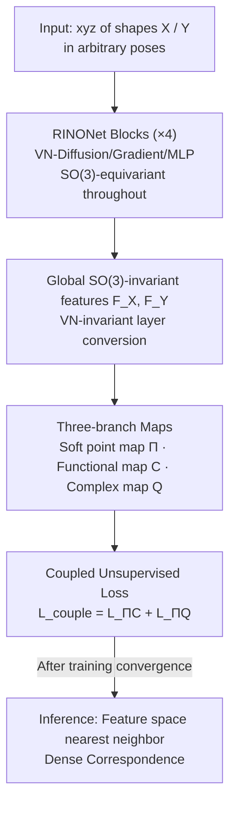

# RINO: Rotation-Invariant Non-Rigid Correspondences

**Conference**: CVPR 2026  
**Paper**: [CVF Open Access](https://openaccess.thecvf.com/content/CVPR2026/html/Gao_RINO_Rotation_Invariant_Non_Rigid_Correspondences_CVPR_2026_paper.html)  
**Code**: None  
**Area**: 3D Vision  
**Keywords**: Non-rigid shape correspondence, rotation-invariant, vector neurons, complex functional maps, unsupervised matching

## TL;DR
RINO utilizes vector neurons to transform DiffusionNet into an end-to-end SO(3)-invariant point feature extractor called RINONet. This is combined with Complex Functional Maps (CFMaps), which encode only orientation-preserving mappings, and a set of coupled unsupervised losses. This allows learning non-rigid shape correspondences directly from raw xyz coordinates without pre-alignment or handcrafted descriptors. It establishes new SOTAs in challenging scenarios such as arbitrary poses, non-isometry, partiality, non-manifold structures, and noise.

## Background & Motivation
**Background**: The mainstream paradigm for dense 3D shape correspondence is Deep Functional Maps, which use a learnable feature extractor (previously ResNet+SHOT, now predominantly DiffusionNet) to compute point-wise descriptors, followed by a functional map framework $C$ to align the feature spaces of two shapes. Recent works have focused on designing losses while the feature extractor remains mostly unchanged from DiffusionNet.

**Limitations of Prior Work**: This approach suffers from two deep-seated issues. First is **shape-pose entanglement**: DiffusionNet directly processes extrinsic xyz coordinates and is SO(3)-variant, necessitating either pre-alignment or the use of handcrafted intrinsic descriptors like WKS/SHOT. However, WKS assumes near-isometry and fails under large deformations, while SHOT is sensitive to mesh connectivity. Second is **intrinsic symmetry flip**: Purely intrinsic methods theoretically cannot distinguish bilateral symmetries (e.g., left vs. right hands), frequently leading to large-scale symmetry flip errors.

**Key Challenge**: Traditional methods split the problem into "rigid matching (estimating global rotation/translation) + non-rigid matching (solving dense correspondence assuming alignment)." However, global transformations and local deformations are inherently coupled—this division is ill-posed when a canonical pose is hard to define (e.g., the same person running vs. sitting). An ideal shape descriptor should simultaneously be robust to noise/topological perturbations, utilize surface geometric priors, and remain independent of the shape's extrinsic orientation. No existing method achieves all three.

**Core Idea**: Instead of handcrafted pose alignment or descriptors, "rotation invariance" is directly integrated into the network architecture. All spatial operators of DiffusionNet are rewritten using vector neurons to create an extractor that learns SO(3)-invariant features end-to-end from raw geometry. This is augmented by CFMaps, which only encode orientation-preserving mappings to eradicate symmetry flips, all trained with unsupervised losses.

## Method

### Overall Architecture
The input to RINO consists of two 3D shapes $X, Y$ in arbitrary poses (vertex coordinates, potentially non-isometric, partial, or non-manifold), and the output is the dense point correspondence between them. The pipeline consists of two layers: the bottom layer is the feature extractor **RINONet**, which maps raw xyz directly to SO(3)-invariant point-wise features $F_X, F_Y$; the top layer is a **three-branch matching framework** that derives three complementary map representations—soft point-wise map $\Pi$, functional map $C$, and complex functional map $Q$—coupled and optimized via unsupervised losses. During inference, a single forward pass followed by a Euclidean nearest neighbor search in the learned feature space yields the correspondence.

RINONet is a Siamese shared network: it first uses VN-EdgeConv to aggregate neighborhood information and lift $V\in\mathbb{R}^{n\times3}$ to vector-valued features $\mathbb{R}^{n\times c\times3}$. These pass through four sequential **RINONet blocks** (maintaining SO(3)-equivariance throughout), followed by a VN-invariant layer to convert equivariant features to invariant features, finally adjusted via VN-linear to the target dimension.

### Key Designs

**1. RINONet Blocks: Rewriting DiffusionNet spatial operators as SO(3)-equivariant using Vector Neurons**

DiffusionNet is rotation-variant when processing xyz; rotation changes the features, necessitating pre-alignment. RINO lifts hidden states from scalar values $\mathbb{R}^{n\times c}$ to vector values $\mathbb{R}^{n\times c\times 3}$ (where 3 is the VN dimension). Using the Vector Neuron (VN) framework, rotation actions are explicitly mapped to the hidden space. VN equivariance stems from the fact that linear layers multiply only the channel dimension and do not touch the VN dimension: $\text{VN-linear}(uR)=(Mu)R=\text{VN-linear}(u)R$, allowing rotation $R$ to "pass through" the network. Equivariance and invariance are related: the network learns equivariant features and converts them to invariant features in the final step.

A RINONet block consists of three modules, each redesigned for equivariance:
- **VN-Diffusion Layer**: Performs surface feature diffusion $h:=H_t(u)$, where diffusion time $t$ is learnable per channel. The key design for equivariance is that **the same $t$ must be applied to all three VN dimensions of the input**, which, combined with the linearity of the diffusion operator, ensures $H_t(uR)=H_t(u)R$.
- **VN-Gradient Layer**: Computes spatial gradients $w:=G(h)$ to learn anisotropic filters, represented as complex numbers in the vertex local frames, passed through a learnable complex matrix $A\in\mathbb{C}^{c\times c}$. Simple aggregation $\text{Re}(\bar{w}\odot Aw)$ does not commute with rotation. The solution is to sum along the VN dimension to obtain invariant features:

$$f := \mathrm{sum}\big(\mathrm{Re}(\bar{w}\odot Aw),\ \dim=1\big)$$

The authors prove (Thm. 1) that $f\in\mathbb{R}^{n\times c}$ is SO(3)-**invariant**. Subsequently, $g:=\tanh(f)$ stabilizes training, followed by element-wise multiplication with normalized equivariant features $h$ as $e:=g\odot h$ to "attach" invariants back to equivariant features.
- **VN-MLP**: Linear layers omit bias (as $M(uR)+b\neq(Mu+b)R$) and ReLU is replaced by its VN version.

The block is defined as $d=\text{VN-MLP}([u,h,e])+u$ (concatenation of input, equivariant diffusion features, and equivariant gradient features followed by MLP with a residual). Thm. 2 states: RINONet blocks are SO(3)-equivariant, and the entire RINONet is SO(3)-invariant.

**2. Eradicating intrinsic symmetry flips with CFMaps without extrinsic pre-alignment**

Invariant features alone are insufficient to distinguish mirror symmetries. RINO introduces **Complex Functional Maps (CFMaps, $Q$)**, built on the complex basis of the Connection Laplacian. These operate on tangent vector fields rather than scalar functions and theoretically **can only encode orientation-preserving mappings**, naturally excluding flips like left-right symmetry. Compared to functional maps $C$, which enforce consistency of features, $Q$ additionally enforces consistency of first-order derivatives (via the gradient operator $\nabla$), providing disambiguation. Crucially, while DUOFM also uses CFMaps, its features are not SO(3)-invariant and rely on extrinsic embeddings, thus still suffering from flips; RINO's invariant base features allow CFMaps to truly perform disambiguation.

**3. Three-branch map representation + Coupling Loss: Unsupervised training of Π, C, and Q**

From the same pair of invariant features $F_X, F_Y$, RINO derives three maps: the soft point-wise map $\Pi_{XY}=\mathrm{Softmax}(F_X F_Y^{\top}/\tau)$ and $C_{XY}$, $Q_{XY}$ solved via non-learnable but differentiable convex optimization blocks. The functional map is solved by minimizing feature preservation and structural regularization:

$$E_{\text{data}}(C)=\lVert C\,\Phi_X^{\dagger}F_X-\Phi_Y^{\dagger}F_Y\rVert_F^2,\qquad C_{XY}=\arg\min_C E_{\text{data}}(C)+\omega E_{\text{reg}}(C)$$

The total loss $L_{\text{total}}$ includes structural loss $L_{\text{struct}}$, contrastive loss $L_{\text{contr}}$, and the core contribution—**Coupling Loss** $L_{\text{couple}}$. It enforces consistency between the soft point-wise map $\Pi$ and its pullbacks through $C$ and $Q$:

$$L_{\text{couple}}=L_{\Pi C}+L_{\Pi Q}$$

While $L_{\Pi C}$ has been previously explored, $L_{\Pi Q}$ is a novel term binding point-wise maps to orientation-preserving complex functional maps. This marks the **first simultaneous coupling of three map representations**.

### Loss & Training
The entire pipeline is unsupervised. For partial matching, a two-stage process is used: pre-training on four complete shape datasets (DT4D/SMAL/FAUST/SCAPE) for 2 epochs, followed by finetuning on SHREC16-Partiality (CUTS and HOLES) for 500 epochs. No post-processing is used during evaluation. Random rotations are applied to all shapes during training and testing for fair evaluation.

## Key Experimental Results

### Main Results

**SO(3)-invariance (SMAL, mGeoErr ↓)**: Four training/testing rotation configurations: I=Aligned, SO(3)=Full random rotation, Y=Rotation around y-axis. The most challenging is I/SO(3) (trained on aligned, tested on random).

| Method | I/I | I/SO(3) | SO(3)/SO(3) | Y/Y |
|------|-----|---------|-------------|-----|
| CnsFM | 5.4 | 58.7 | 9.1 | 5.4 |
| DUOFM | 11.7 | 41.4 | 25.2 | 16.5 |
| URSSM | 4.8 | 62.1 | 24.8 | 7.9 |
| SMS | 4.6 | 58.5 | 57.6 | 39.3 |
| SmpFM | 5.6 | 62.6 | 9.9 | 7.3 |
| HbrFM | 5.6 | 61.8 | 26.4 | 5.3 |
| **Ours (RINO)** | **4.6** | **4.6** | **4.6** | **4.6** |

All baselines perform reasonably in I/I but collapse (40~60) under rotation changes (especially I/SO(3)). RINO remains constant at 4.6 because invariance is architectural, requiring no rotation data augmentation.

**Non-isometric / Raw scan matching (SMAL/DT4D/FSCAN, mGeoErr ↓)**: Using wks vs. xyz input.

| Method | SMAL(xyz) | DT4D(xyz) | FSCAN(xyz) |
|------|-----------|-----------|------------|
| CnsFM | 9.1 | 7.4 | 50.5 |
| URSSM | 24.8 | 59.3 | 24.8 |
| SmpFM | 9.9 | 5.5 | 24.3 |
| HbrFM | 26.4 | 33.8 | 22.1 |
| **Ours (RINO)** | **4.6** | **5.3** | **2.5** |

RINO outperforms others regardless of input type, as processing raw geometry avoids the near-isometry assumptions of WKS.

### Ablation Study

**Intrinsic Symmetry Analysis (FAUST/SCAPE, mGeoErr ↓, #Flips per 400 test pairs)**: E column excludes symmetry-flipped correspondences; ES includes them.

| Method | FAUST-E | FAUST-#Flips | SCAPE-E | SCAPE-#Flips |
|------|---------|--------------|---------|--------------|
| CnsFM | 4.4 | 25 | 27.2 | 249 |
| DUOFM | 28.0 | 204 | 28.3 | 232 |
| URSSM | 30.0 | 240 | 26.9 | 245 |
| SmpFM | 3.0 | 1 | 29.9 | 63 |
| HbrFM | 29.9 | 227 | 27.2 | 236 |
| **Ours (RINO)** | **1.6** | **0** | **2.0** | **0** |

Baselines generally flip on ~200/400 pairs; RINO reduces flips to **0** via CFMaps.

**Partial Shape Matching (SHREC16-Partiality, mGeoErr ↓)**:

| Method | CUTS | HOLES |
|------|------|-------|
| URSSM | 42.1 | 29.8 |
| EchoMatch (Supervised) | 12.7 | 57.1 |
| Wormhole | 48.2 | 26.9 |
| **Ours (RINO)** | **6.7** | **12.09** |

RINO outperforms the supervised EchoMatch on partial matching, demonstrating that the structural ability to handle unaligned partial shapes is critical.

### Key Findings
- **CFMaps are the key switch for symmetry elimination**: Flips are reduced from ~200/400 to 0, provided the underlying features are SO(3)-invariant.
- **Invariance provides "free" robustness**: In unseen rotation configurations (I/SO(3)), baselines collapse while RINO remains stable, saving expensive data augmentation.
- **Noise Robustness**: RINO remains stable under Gaussian noise ($\sigma\approx6\times10^{-3}$) where baselines degrade earlier, attributed to raw xyz processing and regularization from fewer parameters.
- **Feature Transferability**: RINONet used as a backbone for human segmentation yields sharper results than DiffusionNet, indicating potential for broader 3D understanding tasks.

## Highlights & Insights
- **Hard-coding rotation invariance into the architecture**: Rewriting diffusion, gradient, and MLP layers with vector neurons is a clean engineering contribution, especially the summation over VN dimensions to obtain invariants.
- **Synergy of Invariant Features and CFMaps**: Neither component is sufficient alone (invariant features still flip intrinsically; CFMaps flip without invariant features); their combination is the reason RINO succeeds where DUOFM fails.
- **First triple-map (Π/C/Q) coupling**: Aligning point-wise maps with both functional and complex functional maps is a transferable training insight for other spectral matching methods.
- Following the "Bitter Lesson" by reducing handcrafted priors and learning end-to-end from raw geometry.

## Limitations & Future Work
- Vector-valued features currently must be "flattened" for use; the authors aim to develop matching methods that consume vector-valued features directly.
- Computational complexity and detailed ablation of losses/architecture are deferred to the supplementary material.
- Evaluation is primarily compared against unsupervised baselines; systemic comparison with the strongest supervised methods is limited.
- Dependence on LBO/Connection Laplacian spectral bases and differentiable solvers still requires a certain level of mesh quality.

## Related Work & Insights
- **vs DiffusionNet**: RINONet inherits the surface diffusion concept but rewrites all spatial operators with VN to be SO(3)-equivariant, removing the need for pre-alignment or WKS.
- **vs DUOFM**: Both use CFMaps, but DUOFM's features are not rotation-invariant and rely on extrinsic embeddings, leading to symmetry flips under unseen rotations.
- **vs URSSM / CnsFM**: These focus on losses/coupling while using SO(3)-variant feature extractors; they fail to learn meaningful correspondences under random rotations.

## Rating
- Novelty: ⭐⭐⭐⭐⭐ First unsupervised rotation-invariant dense correspondence method.
- Experimental Thoroughness: ⭐⭐⭐⭐ Covers arbitrary pose, asymmetry, partiality, etc., though primary ablations are in the supplement.
- Writing Quality: ⭐⭐⭐⭐⭐ Clearly defined motivations and theorem-supported equivariance.
- Value: ⭐⭐⭐⭐⭐ Provides a reusable feature backbone for rotation-invariant 3D shape understanding.

<!-- RELATED:START -->

## Related Papers

- [\[CVPR 2026\] 4D Local Modeling Toward Dynamic Global Perception for Ambiguity-free Rotation-Invariant Point Cloud Analysis](4d_local_modeling_toward_dynamic_global_perception_for_ambiguity-free_rotation-i.md)
- [\[CVPR 2026\] RI-Mamba: Rotation-Invariant Mamba for Robust Text-to-Shape Retrieval](ri-mamba_rotation-invariant_mamba_for_robust_text-to-shape_retrieval.md)
- [\[CVPR 2026\] Topology-aware Feature Propagation for Unsupervised Non-rigid Point Cloud Correspondence](topology-aware_feature_propagation_for_unsupervised_non-rigid_point_cloud_corres.md)
- [\[AAAI 2026\] Enhancing Rotation-Invariant 3D Learning with Global Pose Awareness and Attention Mechanisms](../../AAAI2026/3d_vision/enhancing_rotation-invariant_3d_learning_with_global_pose_awareness_and_attentio.md)
- [\[CVPR 2025\] 4DTAM: Non-Rigid Tracking and Mapping via Dynamic Surface Gaussians](../../CVPR2025/3d_vision/4dtam_non-rigid_tracking_and_mapping_via_dynamic_surface_gaussians.md)

<!-- RELATED:END -->
