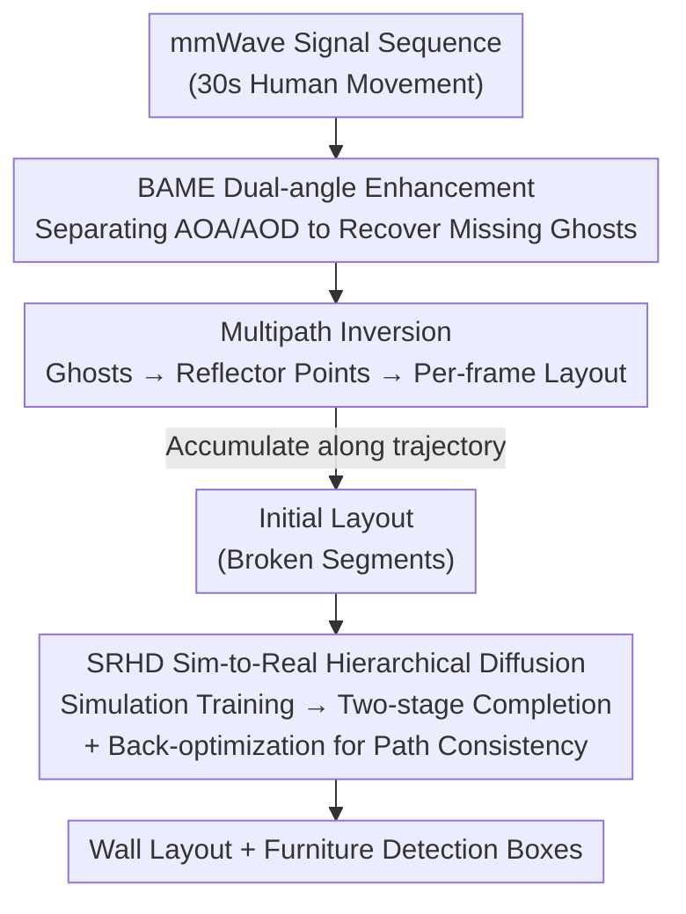

# RISE: Single Static Radar-based Indoor Scene Understanding

**Conference**: CVPR 2026  
**Paper**: [CVF Open Access](https://openaccess.thecvf.com/content/CVPR2026/html/Zhou_RISE_Single_Static_Radar_based_Indoor_Scene_Understanding_CVPR_2026_paper.html)  
**Code**: https://rise-cvpr.github.io  
**Area**: 3D Vision  
**Keywords**: mmWave Radar, Indoor Scene Understanding, Multipath Reflection, Layout Reconstruction, Diffusion Model

## TL;DR
RISE utilizes a single **static** mmWave radar to transform "multipath ghosts"—traditionally discarded as noise—into geometric cues. By integrating Dual-angle Multipath Enhancement (BAME) and Sim-to-Real Hierarchical Diffusion (SRHD), it achieves the first indoor wall layout reconstruction and furniture detection under a single static radar, reducing Chamfer distance by 60% (to 16 cm) compared to the SOTA, with a furniture detection IoU of 58%.

## Background & Motivation
**Background**: Indoor scene understanding has long relied on optical sensors like RGB cameras and LiDAR. While they offer high spatial resolution, they face two critical issues in smart home/office environments: occlusion by walls and furniture (cannot see through) and privacy concerns (constant recording of people). Consequently, research has shifted toward wireless signals (WiFi, mmWave) due to their ability to penetrate common obstacles and their inherent privacy preservation.

**Limitations of Prior Work**: Existing wireless solutions either provide low resolution (reconstructing only fragmented parts of the environment) or require mounting the radar on mobile robots for whole-room scanning, which increases deployment costs. A fundamental physical obstacle is **specularity**: when mmWave signals hit smooth surfaces like walls, they undergo mirror-like reflections rather than diffuse scattering. If the reflected signal does not return to the sensor, the wall remains undetected. Thus, the "visible region" directly observed by a single static radar is extremely sparse (as shown in Fig. 1).

**Key Challenge**: A single static radar aims to retain the advantages of penetration and privacy but is limited by specular reflection—direct reflections only illuminate a small portion of the environment, leaving many walls "invisible." How can the invisible structure be reconstructed without moving the sensor or deploying multiple devices?

**Key Insight**: The authors observe that a **moving human** in a room introduces **multipath effects**. Signals return to the receiver after secondary or multiple reflections, creating "ghost targets" that move with the person (e.g., radar → reflector → human → radar). While traditionally filtered out as noise, the geometric positions of these ghosts actually **encode the location information of walls and reflectors**.

**Core Idea**: Flip multipath ghosts from "noise" to "signal." By analyzing the evolution of ghosts over time, a set of reflector points is inversely solved. A diffusion model then completes these fragmented reflectors into a full layout and objects, allowing a single static radar to "see" the invisible room.

## Method

### Overall Architecture
The input to RISE is a mmWave signal sequence (a person walking for 30s, ~600 frames at 20 Hz), and the output is a wall layout polygon + 2D bounding boxes for furniture. The pipeline consists of three serial stages: **Enhance, Invert, and Generate**. Each frame first passes through **BAME** for dual-angle enhancement to recover "off-diagonal" ghosts missed by conventional beamforming. The enhanced observations are fed into **multipath inversion**, which back-solves ghost geometry into reflector points per frame, accumulating them along the trajectory into a coarse initial layout. This initial layout, composed of broken segments, is finally completed into continuous walls and object masks by **SRHD (Sim-to-Real Hierarchical Diffusion)**. A final back-optimization step ensures the human trajectory does not "pass through walls."

### Key Designs

**1. Multipath Inversion: Back-solving Moving Ghosts into Wall Reflectors**

This is the geometric foundation, addressing the "sparse visible region" of single radars. When a static radar $S$ observes a moving human $H$, multipath effects produce ghosts. The authors focus on first-order and second-order ghosts that remain observable after rapid attenuation, defined as $G_1$ (s→c1→h→s), $G_1'$ (s→h→c1→s), $G_2$, and $G_2'$ (where c1 is the reflector). The identification process uses CFAR to find high-energy clusters in the range-angle map, followed by RANSAC clustering and a four-step rule for ghost assignment. For instance, $H$ is chosen as the cluster with $m_i > \vartheta\max(m_i)$ and minimum distance, while $G_1$ shares the same direction as $H$ but with a slightly larger distance.

Crucially, ghost positions are back-solved into **reflector points** $s_{c1}$ using geometric relationships (Equation (3) in the paper, calculated via $|\vec{sg_1'}|$, $|\vec{sh}|$, and the difference in departure angles $\theta^s_2-\theta^s_1$). These reflector points are clustered using GMM and fitted into dominant linear structures via RANSAC. This step indirectly localizes "invisible walls" through "visible ghosts."

**2. BAME Multipath Enhancement: Salvaging Ghosts Erased by the Diagonal Assumption**

The stability of multipath inversion depends on reliable ghost detection. However, experiments show ghost visibility fluctuates heavily between frames, leading to unstable reflector estimation. The root cause is identified: standard radar beamforming (Equation (2)) merges Tx/Rx antennas into a "virtual array," which **implicitly assumes Angle of Arrival (AOA) = Angle of Departure (AOD)**. While valid for direct reflections, **first-order ghosts like $G_1'$ naturally have different AOA and AOD**. Once they deviate from the AOA=AOD diagonal, they are suppressed or disappear in the range-angle map.

BAME **processes AOA and AOD separately** to reconstruct a full Range–AOA–AOD 3D cube (Equation (4)). The process involves: ① Range FFT; ② Dual-angle beamforming for Tx/Rx dimensions; ③ 3D CFAR detection in the cube; ④ **Ghost Re-integration**—mapping off-diagonal clusters (AOA≠AOD) back to the range-angle map as valid ghosts. This "lights up" multipath components previously erased by the diagonal assumption, providing a robust prior for layout reasoning.

**3. SRHD Sim-to-Real Hierarchical Diffusion: Completing Broken Segments into a Full Room**

The initial layout from BAME consists only of fragmented segments. SRHD addresses both completion and data scarcity (as paired radar-to-layout data is rare).

To generate data, a **Layout Simulation Engine** was built: based on 35,000 real indoor floor plans, each is converted into a 2D skeleton. Virtual radars are placed to shoot rays (retaining only the first intersection to model mmWave physics) and random bounding boxes are inserted as objects. Three augmentations are applied—Random Missing (simulating occlusions), Random Rotation (Equation (6), simulating pose error), and Random Scaling (Equation (7), simulating depth uncertainty)—to bridge the sim-to-real gap.

The completion network is a **two-stage hierarchical diffusion** (Fig. 6): Stage 1 Object Detection Diffusion $f_1$ predicts a binary object map $X_0 = f_1(O, X_{1000}; \theta_1)$ from partial observations $O$; Stage 2 Wall Diffusion $f_2$ uses both $O$ and $X_0$ to reconstruct continuous walls $Y_0 = f_2(O, Y_{1000}, X_0; \theta_2)$. During inference, **Spatial Consistency Back-optimization** is applied: along the human trajectory $T$, the latent noise variables $X_{1000}, Y_{1000}$ are optimized to minimize $L_{overlap}=\sum_{(x_t,y_t)\in T}\left(\mathbb{1}[(x_t,y_t)\in W]+\mathbb{1}[(x_t,y_t)\in B]\right)$. This penalizes layouts where walls $W$ or objects $B$ overlap with the human's path, utilizing the physical common sense that "human passage implies free space."

### Loss & Training
The two-stage diffusion is trained on simulation data using standard denoising objectives. Data augmentations bridge the sim-to-real gap. During inference, diffusion weights are frozen, and $L_{overlap}$ serves as the objective to fine-tune latent variables for online correction without ground truth labels.

## Key Experimental Results
Dataset: RISE-Indoor. A TI MMWCAS-RF-EVM cascaded radar at 1.2m height, with Intel RealSense for ground truth. 11 environments (offices, labs, halls), 5 volunteers, 100+ trajectories (~30s), ~50,000 frames.

### Main Results: Object Detection (IoU / Dice, average across 11 scenes)

| Method | Input | IoU (%) | Dice (%) |
|------|------|---------|----------|
| BRL [22] | Single-frame | 1.17 | 1.82 |
| EMT [9] + SRHD | Multi-frame | 7.70 | 12.66 |
| **Ours (RISE)** | Multi-frame | **57.78** | **69.34** |

Layout Reconstruction: RISE achieves a Chamfer distance of **16.03 cm** vs EMT's 39.06 cm (approx. 60% reduction), and an F1 score (15 cm tolerance) of **83.63** vs 63.43. RISE is the first system to perform both layout reconstruction and furniture detection under a single static radar.

### Ablation Study (Layout Reconstruction)

| Configuration | F1 (%) ↑ | Chamfer (cm) ↓ | Note |
|------|---------|----------------|------|
| Baseline (EMT) | 63.43 | 39.06 | Starting Point |
| + G (BAME Enhancement) | 73.37 | 32.31 | Improved Reflector Visibility |
| + G, D (+ Diffusion) | 78.84 | 19.82 | Generative Completion of Details |
| + G, D, R (Full Model) | **83.63** | **16.32** | Back-optimization for Correction |

### Key Findings
- The three modules are **complementary**: BAME improves initial detection, Diffusion handles global reconstruction, and Back-optimization provides final refinement.
- **Robustness to Trajectory Length**: Even with 40% of the trajectory, RISE's Chamfer distance remains lower than EMT's result using the full trajectory.
- Baselines struggle with furniture (IoU near 0), indicating that object reflectors are extremely difficult to recover from single radar signals without semantic priors and generative completion.

## Highlights & Insights
- **Flipping the Perspective on Noise**: Treating traditionally filtered multipath ghosts as valuable geometric cues is the most significant "aha" moment—reinterpreting the same physical phenomenon transforms a barrier into a resource.
- **Precise Diagnosis of the AOA=AOD Assumption**: BAME traces the engineering issue of "flickering ghosts" to the root cause of 1D virtual array compression, offering a clean signal processing solution applicable to other multipath sensing tasks.
- **Trajectory as a Physical Constraint**: Using the common-sense prior that "human passage indicates free space" as an optimization objective during the generative inference stage is a clever way to correct layout errors like wall-traversal.

## Limitations & Future Work
- The method currently targets **single-person, long-trajectory** scenarios; multi-person movement creates interference and complex multipath patterns yet to be resolved.
- The simulation engine uses 2D skeletons and AABB boxes, which may under-model complex 3D furniture or curved/slanting walls. Reconstructions are primarily 2D top-down layouts.
- It heavily relies on "human movement to induce multipath." In empty rooms or static scenes, the method may fail—this is both its source of strength and its primary operational constraint.

## Related Work & Insights
- **vs EMT [9]**: Both use static radar multipath, but EMT is limited by FoV gaps and inconsistent ghost visibility. RISE mitigates these via BAME and completion via SRHD, extending capabilities to furniture detection.
- **vs Mobile Radar Solutions**: While moving robots provide high accuracy, they involve high deployment costs. RISE targets the **reuse of existing stationary devices** (e.g., routers/APs).
- **vs Optical (RGB/LiDAR)**: Optical sensors have higher resolution but suffer from occlusions and privacy issues; RISE trades resolution for penetration and privacy.

## Rating
- Novelty: ⭐⭐⭐⭐⭐ 
- Experimental Thoroughness: ⭐⭐⭐⭐ 
- Writing Quality: ⭐⭐⭐⭐ 
- Value: ⭐⭐⭐⭐⭐ 

<!-- RELATED:START -->

## Related Papers

- [\[CVPR 2026\] Consistent Instance Field for Dynamic Scene Understanding](consistent_instance_field_for_dynamic_scene_understanding.md)
- [\[CVPR 2026\] CustomTex: High-fidelity Indoor Scene Texturing via Multi-Reference Customization](customtex_high-fidelity_indoor_scene_texturing_via_multi-reference_customization.md)
- [\[CVPR 2026\] PointTPA: Dynamic Network Parameter Adaptation for 3D Scene Understanding](pointtpa_dynamic_network_parameter_adaptation_for_3d_scene_understanding.md)
- [\[CVPR 2026\] Lifting Unlabeled Internet-level Data for 3D Scene Understanding](lifting_unlabeled_internet-level_data_for_3d_scene_understanding.md)
- [\[CVPR 2026\] X-band Radar Non-Line-of-Sight Imaging](x-band_radar_non-line-of-sight_imaging.md)

<!-- RELATED:END -->
