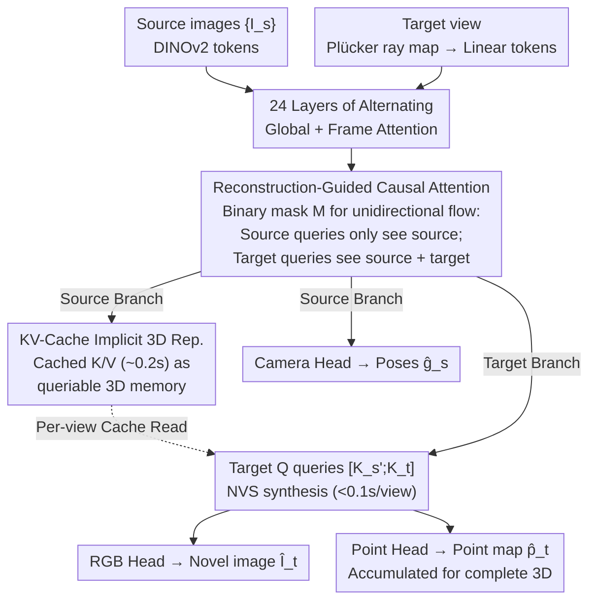

# RnG: A Unified Transformer for Complete 3D Modeling from Partial Observations

**Conference**: CVPR 2026  
**arXiv**: [2603.01194](https://arxiv.org/abs/2603.01194)  
**Code**: [https://npucvr.github.io/RnG](https://npucvr.github.io/RnG)  
**Area**: 3D Vision  
**Keywords**: 3D reconstruction, novel view synthesis, transformer, KV-Cache, feed-forward

## TL;DR

RnG proposes Reconstruction-Guided Causal Attention, reinterpreting the Transformer's KV-Cache as an implicit 3D representation. Using a single feed-forward Transformer, it unifies the reconstruction and generation of complete 3D geometry and appearance from unposed sparse images, achieving speeds over 100x faster than diffusion-based methods.

## Background & Motivation

### Core Problem
Current 3D reconstruction foundation models (e.g., VGGT, DUSt3R) can recover geometric structures of visible regions from a few images but **cannot model unobserved regions**. Novel View Synthesis (NVS) methods can render unknown perspectives but often lack consistent 3D structure or suffer from slow inference due to reliance on known poses or diffusion models.

### Limitations of Prior Work

| Method | Unposed Inference | Camera Control | Generate Unseen Regions | Explicit 3D | Real-time Inference |
|------|:---------:|:-------:|:----------:|:-----:|:-------:|
| VGGT | ✓ | N/A | ✗ | ✓ | ✓ |
| DUSt3R | ✓ | N/A | ✗ | ✓ | ✓ |
| LVSM | ✗ | ✓ | ✓ | ✗ | ✓ |
| LGM | ✗ | ✓ | ✗ | ✓ | ✓ |
| Matrix3D | ✓ | ✓ | ✓ | ✓ | ✗ |
| **RnG (Ours)** | **✓** | **✓** | **✓** | **✓** | **✓** |

Although Matrix3D achieves unified reconstruction and generation, its diffusion-based design requires 27 seconds to generate a single novel view, failing to meet real-time interaction requirements.

### Key Insight
The latent space of 3D reconstruction foundation models may already encode a more complete 3D understanding than just visible geometry. If view-conditioned neural rendering is treated as a query to the model's latent space, reconstruction and generation capabilities can be activated simultaneously. Reversing the conventional direction of "using generative priors to aid reconstruction," RnG demonstrates that **driving generation with reconstruction priors** is equally feasible and highly efficient.

## Method

### Overall Architecture

RnG aims to simultaneously obtain precise geometry for visible regions and plausible generation for unseen regions from unposed sparse images with interactive speed. It reuses the architecture and pre-trained weights of VGGT as a feed-forward Transformer: source images $\{\mathbf{I}_s\}$ are converted to tokens via DINOv2, while target views are encoded using Plücker ray maps and mapped to tokens via linear layers. Both sets of tokens are fed into $L=24$ layers of alternating Global Attention and Frame Attention. Finally, three heads extract the required outputs: source tokens pass through the Camera Head to estimate poses $\{\hat{\mathbf{g}}_s\}$, while target tokens pass through the RGB Head $\mathcal{D}_\text{RGB}$ and Point Head $\mathcal{D}_\text{pmap}$ to resolve novel view images $\hat{\mathbf{I}}_t$ and point maps $\hat{\mathbf{p}}_t$.

To preserve learned knowledge from VGGT, the first source view uses dedicated camera and register tokens, while other source and target views share the same token set. During training, the pose of the first view is fixed to:

$$\hat{\mathbf{g}}_{s=1} = \left[I_{3\times3} \mid [0, 0, -1]^\top\right]$$

This implicitly defines the world coordinate system for reconstruction.

### Key Designs

**1. Reconstruction-Guided Causal Attention: Guiding Generation without Contamination**

Source views are responsible for "perceiving existing content," while target views "hallucinate unseen content." Since both share the same parameters, unrestricted bidirectional attention would allow generative noise to disrupt reconstruction. RnG introduces a binary mask $M$ in the global attention block to enforce unidirectional information flow:

$$M_{i,j} = \begin{cases} 0 & \text{if } i \in \{s\} \text{ and } j \in \{t\} \\ 1 & \text{elsewhere} \end{cases}$$

where $\{s\}$ and $\{t\}$ are indices for source and target tokens. Attention becomes $\text{Out} = \text{softmax}\left(\frac{M \odot QK^\top}{\sqrt{d_k}}\right)V$. Source queries only attend to source keys (reconstruction is unaffected by target views), whereas target queries attend to both (generation leverages reconstruction information). This decouples "perception + localization" from "appearance + geometry synthesis" at the attention level using a simple mask.

**2. KV-Cache as Implicit 3D Representation: Cached Memory for Repeated Queries**

Since the source view attention process is independent of target views, the source keys and values serve as an orientation-independent implicit 3D representation. RnG splits inference into two stages: first, a reconstruction pass caches the keys and values of every global attention layer ($K_s' = \text{Cache}(K_s),\ V_s' = \text{Cache}(V_s)$, ~0.2s). Subsequently, each novel view synthesis bypasses the source branch by reading the cache:

$$\text{Out}_t = \text{softmax}\left(\frac{Q_t \cdot [K_s'; K_t]^\top}{\sqrt{d_k}}\right)[V_s'; V_t]$$

After $L$ layers, two DPT Heads resolve $\hat{\mathbf{I}} = \mathcal{D}_\text{RGB}(\text{Out}_t)$ and $\hat{\mathbf{P}} = \mathcal{D}_\text{pmap}(\text{Out}_t)$ in <0.1s per view. Cumulatively querying point maps from multiple views builds a complete 3D model, acting as a "virtual 3D scanner"—the fundamental reason it is two orders of magnitude faster than diffusion methods.

### Loss & Training

The multi-task loss consists of three components:

$$\mathcal{L} = \mathcal{L}_\text{RGB} + \lambda_\text{pmap}\mathcal{L}_\text{pmap} + \lambda_c\mathcal{L}_\text{cam}$$

The novel view image loss uses MSE + perceptual loss: $\mathcal{L}_\text{RGB} = |\mathbf{I}_t - \hat{\mathbf{I}}_t|_2 + \lambda_p \cdot \text{Perceptual}(\mathbf{I}_t, \hat{\mathbf{I}}_t)$. The point map loss is an uncertainty-weighted aleatoric uncertainty loss, where the Point Head outputs four channels (xyz + uncertainty $\Sigma_t$):

$$\mathcal{L}_\text{pmap} = \|\Sigma_t \odot (\mathbf{P}_t - \hat{\mathbf{P}}_t)\| + \|\Sigma_t \odot (\nabla\mathbf{P}_t - \nabla\hat{\mathbf{P}}_t)\| - \alpha \cdot \log\Sigma_t$$

The camera pose loss uses Huber loss $\mathcal{L}_\text{cam} = \sum_s |\mathbf{g}_s - \hat{\mathbf{g}}_s|_\epsilon$. Hyperparameters are $\lambda_\text{pmap}=0.2, \lambda_c=1, \lambda_p=0.5, \alpha=0.2$. Training utilized Objaverse (LVIS subset + LGM filtered list, 113.5K objects) at $256 \times 256$ resolution, patch size 8, 8 × A800 GPUs, total batch size 96, for 40K steps with bfloat16 and gradient checkpointing.

## Key Experimental Results

### Main Results (GSO Dataset)

| Metric Category | Metric | Matrix3D (unposed) | VGGT | LVSM (posed) | **RnG (Ours)** |
|---------|------|:------------------:|:----:|:------------:|:-------------:|
| Pose | RA@5↑ | 43.77 | 74.24 | — | **85.15** |
| Pose | RT@5↑ | 65.92 | 65.68 | — | **86.02** |
| Pose | AUC@30↑ | 66.39 | 77.23 | — | **86.94** |
| Source Depth | Rel↓ | 9.43 | 5.96 | — | **0.584** |
| Source Depth | a1↑ | 92.26 | 97.72 | — | **99.93** |
| Target Depth | Rel↓ | 9.96 | — | — | **0.717** |
| Target Depth | a1↑ | 90.28 | — | — | **99.85** |
| NVS | PSNR↑ | 18.74 | — | 27.52 | **26.28** |
| NVS | SSIM↑ | 0.786 | — | 0.902 | 0.891 |
| NVS | LPIPS↓ | 0.193 | — | 0.090 | 0.098 |
| Complete 3D | CD↓ | 0.067 | 0.026 | — | **0.0067** |

**Key Findings**:
- RnG significantly outperforms VGGT and Matrix3D in all reconstruction metrics, with pose estimation RA@5 improving from 74.24 to 85.15.
- Source view depth Rel error (0.584) is an order of magnitude lower than VGGT (5.96).
- As an unposed method, RnG's NVS quality (PSNR 26.28) is close to LVSM (27.52), which requires known poses.
- Chamfer Distance (0.0067) is markedly better than all baselines, proving high geometric consistency in multi-view fusion.

### Ablation Study

| Model Variant | RA@5↑ | PSNR↑ | LPIPS↓ | Description |
|---------|:-----:|:-----:|:------:|------|
| LVSM-100K | — | 27.52 | 0.090 | Best LVSM performance (posed) |
| LVSM-40K | — | 24.62 | 0.154 | Equivalent training steps |
| **Ours-40K** | **85.15** | **26.28** | **0.098** | Full model |
| Ours-15K | 81.65 | 24.86 | 0.124 | Smaller dataset |
| Ours-15K-scratch | 8.25 | 20.78 | 0.204 | No pre-trained weights |
| Ours-15K-w/o cam | — | 24.85 | 0.124 | Removed pose supervision |
| Ours-15K-FullAttn | 82.72 | 24.86 | 0.119 | Full bidirectional attention |

**Key Findings**:
1. **Reconstruction Prior is Critical**: Training from scratch leads to a massive performance drop (PSNR decrease of 4), proving VGGT pre-trained weights are the key driver.
2. **Training Efficiency**: Ours-15K outperforms LVSM-40K, highlighting the data efficiency gained from reconstruction priors.
3. **Causal vs. Full Attention**: Replacing causal with bidirectional attention (FullAttn) results in almost no change, proving the causal design achieves architectural advantages without sacrificing precision.
4. **Pose Supervision Compatibility**: Removing the Camera Head does not affect generation quality, indicating that reconstruction and generation do not conflict in multi-task learning.

### Key Findings: Efficiency

KV-Cache significantly accelerates inference: inference time dropped from 213ms to 85ms, and FLOPS from 12.26T to 2.29T. Compared to Matrix3D's 27s/view, RnG is **300+ times faster**.

### Key Findings: Generalization

Though trained on only 4 input images, RnG generalizes to an arbitrary number of inputs. Synthesis quality improves as more source views are added. For objects with symmetric structures, even a single image can yield plausible results.

## Highlights & Insights

- **Unified Framework**: The first feed-forward Transformer to simultaneously achieve unposed 3D reconstruction and novel view synthesis of both geometry and appearance.
- **Causal Attention**: Implements task decoupling via attention masks rather than independent modules, ensuring parameter efficiency and design elegance.
- **KV-Cache Reuse**: Reinterprets the NLP KV-Cache mechanism with new semantics as an implicit 3D representation, allowing efficient multiple queries after a single cache pass.
- **Inverse Knowledge Transfer**: Complements the mainstream "generation priors for reconstruction" trend by exploring the "reconstruction priors for generation" direction.

## Limitations & Future Work

1. **Insufficient Texture Detail**: As a deterministic feed-forward model, it cannot generate the extremely fine textures typical of diffusion models.
2. **World Coordinate Assumption**: Standard data preparation assumes cameras face the world origin; real-world handheld captures must satisfy this assumption.
3. **Multi-view Accumulated Noise**: Building complete 3D requires accumulating point maps from multiple queries, which can introduce noise and geometric conflicts.

## Rating

| Dimension | Score |
|------|:----:|
| Novelty | ⭐⭐⭐⭐ |
| Technical Depth | ⭐⭐⭐⭐⭐ |
| Experimental Thoroughness | ⭐⭐⭐⭐ |
| Writing Quality | ⭐⭐⭐⭐⭐ |
| Value | ⭐⭐⭐⭐ |
| Overall Recommendation | ⭐⭐⭐⭐⭐ |

> Reinterpreting KV-Cache as an implicit 3D representation is an elegant design. The reconstruction-driven generation paradigm provides a real-time, viable path for unified 3D understanding. The experiments are comprehensive, reaching SOTA on several tasks with inference speeds two orders of magnitude faster than diffusion-based methods.

<!-- RELATED:START -->

## Related Papers

- [\[CVPR 2026\] LangRef3DGS: Natural Language-Guided 3D Referential Segmentation from Partial Observations via 3D Gaussian Splatting](langref3dgs_natural_language-guided_3d_referential_segmentation_from_partial_obs.md)
- [\[CVPR 2026\] Complet4R: Geometric Complete 4D Reconstruction](complet4r_geometric_complete_4d_reconstruction.md)
- [\[CVPR 2026\] UniCorrn: Unified Correspondence Transformer Across 2D and 3D](unicorrn_unified_correspondence_transformer_across_2d_and_3d.md)
- [\[CVPR 2026\] SMVRT: Implicit Human 3D Modeling Using Sparse Multi-View Volumetric Reconstruction with Transformer Fusion](smvrt_implicit_human_3d_modeling.md)
- [\[CVPR 2026\] GGPT: Geometry-Grounded Point Transformer](ggpt_geometry_grounded_point_transformer.md)

<!-- RELATED:END -->
