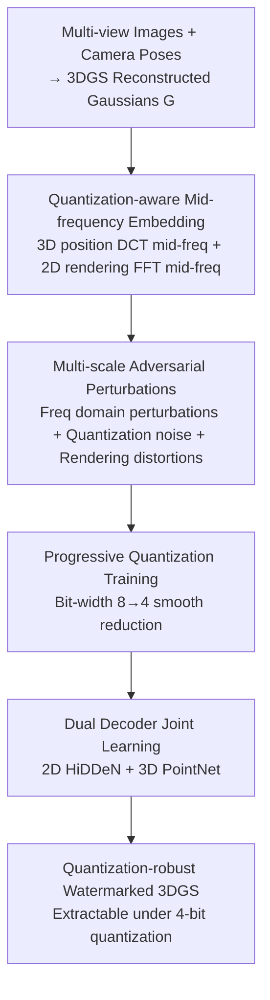

# Robust3DGSW: Toward Robust Watermarking for Quantization-Aware 3D Gaussian Splatting

**Conference**: CVPR 2026  
**Paper**: [CVF Open Access](https://openaccess.thecvf.com/content/CVPR2026/html/Wang_Robust3DGSW_Toward_Robust_Watermarking_for_Quantization-Aware_3D_Gaussian_Splatting_CVPR_2026_paper.html)  
**Code**: To be confirmed  
**Area**: 3D Vision  
**Keywords**: 3D Gaussian Splatting, Digital Watermarking, Quantization-Aware, Mid-frequency Embedding, Adversarial Perturbation

## TL;DR
To address the issues where watermarks are erased and rendering quality collapses after quantizing 3DGS models to low bits, Robust3DGSW proposes a two-stage quantization-aware watermarking framework: the first stage embeds watermarks into the **mid-frequency bands** of 3D Gaussian positions and 2D renderings to resist quantization loss, while the second stage utilizes multi-scale adversarial perturbations and progressive quantization training for dual decoders. This allows for watermark extraction accuracy of $>80\%$ under 4-bit quantization while maintaining high-quality rendering.

## Background & Motivation
**Background**: 3D Gaussian Splatting (3DGS) has become the mainstream for real-time radiance field rendering, leading to a demand for copyright protection of 3D assets. Digital watermarking is recognized as an effective solution. Existing 3DGS watermarking works (GaussianMarker, 3D-GSW, GS-Hider, etc.) can embed hidden information into Gaussian models or their renderings.

**Limitations of Prior Work**: High-quality 3DGS models consist of massive Gaussians with huge parameter files, making model quantization and compression mandatory for deployment on mobile/edge devices. However, existing watermarking methods **completely ignore quantization**, leading to two fatal problems: first, the watermark extraction accuracy drops drastically as quantization becomes more aggressive—3D-GSW's extraction accuracy falls from 98% at 32-bit to 61% at 4-bit, and even lower under various distortion attacks; second, quantization collapses rendering quality, with PSNR dropping from 35 dB at 32-bit to approximately 10 dB at 4-bit.

**Key Challenge**: The root cause is that quantization introduces rounding errors to Gaussian parameters. These errors propagate through alpha-blending layers, destroying both rendering quality and embedded watermark signals. Specifically, existing methods place watermarks in the **spatial domain or high-frequency bands**, but 4-bit rounding preferentially erases high-frequency details. Worse, existing watermark decoders are trained on full-precision models and fail to recognize quantization noise during deployment.

**Goal**: To enable reliable watermark extraction under aggressive quantization (even at 4-bit) without sacrificing rendering quality, split into two sub-problems: "how to embed in a quantization-resistant way" and "how to train decoders capable of decoding under quantization."

**Key Insight**: The authors observe that different frequency bands exhibit varying sensitivities to quantization. Modifying low frequencies disrupts overall appearance (violating perceptual quality), while high frequencies are easily erased by quantization. Only the **mid-frequency** band falls below the Just Noticeable Difference (JND) threshold while maintaining strong resistance to quantization-induced signal loss. This is the "sweet spot" for both image quality and quantization robustness.

**Core Idea**: Embed the watermark into the **dual-modal mid-frequency bands** of 3D Gaussian positions and 2D renderings to resist quantization. Then, utilize "multi-scale adversarial perturbations + progressive bit reduction" to train 2D/3D dual decoders, forcing them to adapt to quantization artifacts. This is the first known 3DGS watermarking method to incorporate quantization into consideration.

## Method

### Overall Architecture
The input to Robust3DGSW consists of multi-view images and camera poses. First, a standard 3DGS reconstruction builds the Gaussian representation. The output is a "watermarked and quantization-robust" 3DGS model, where watermarks can still be extracted from renderings or Gaussian parameters after quantization deployment. The framework consists of two stages: **Stage 1: Quantization-aware Watermark Embedding**—simultaneously injecting watermark noise into the mid-frequency bands of 3D Gaussian positions (via 3D DCT) and 2D renderings (via 2D FFT) to obtain watermarked Gaussians $\tilde G$ and watermarked images $\tilde I_{wm}$. **Stage 2: Quantization-aware Decoder Learning**—jointly training 2D (HiDDeN) and 3D (PointNet) dual decoders while progressively reducing bit-depth (8→4 bit) and applying multi-scale adversarial perturbations to Gaussian features and renderings, optimized by a total loss $L_{total}$. The two stages cooperate to maximize both watermark preservation and rendering capabilities.

### Key Designs

**1. Quantization-aware Mid-frequency Embedding: Placing watermarks in the most "resilient" frequency bands**
The pain point is that spatial/high-frequency watermarks are erased by rounding errors in 4-bit quantization. Robust3DGSW selects the **mid-frequency band** for embedding in both 3D and 2D modalities. For 3D: extract the position matrix $M=[\mu_1,\dots,\mu_N]^T$, apply 1D DCT to each axis $d$ to get frequency coefficients $F^{3D}_{k,d}$, and select the mid-frequency range $k\in[\lfloor N/8\rfloor,\lfloor 3N/8\rfloor]$. Embed noise as $\tilde F^{3D}_{k,d}=F^{3D}_{k,d}+\alpha_{3D}\cdot\mathcal{N}(0,\sigma_{3D}^2)$ (default $\alpha_{3D}=1.0,\sigma_{3D}=0.001$), then IDCT back to update positions. For 2D (Image Quality Enhancement): perform 2D FFT on each color channel, center the DC with fftshift, and add noise to an annular mid-frequency region with radius in $[\tfrac18\min(H,W),\tfrac38\min(H,W)]$, then IFFT back. This is effective because mid-frequencies are below JND and resistant to quantization, while dual-modal embedding provides redundancy.

**2. Multi-scale Adversarial Perturbations: "Rehearsing" quantization and distortion during training**
Decoders trained only on clean data fail under quantization noise and geometric distortions. During decoder training, three types of perturbations are applied to 3D Gaussian features and 2D renderings: frequency domain perturbations, quantization noise, and rendering-level distortions (Gaussian noise, JPEG simulation, blur, random scaling/clipping):

$$\tilde f_{3D}=Q(f_{3D}+\epsilon_{DCT},\,b(p))+\mathcal{N}(0,\sigma_q(b)),\quad \hat I=A_{render}(Q(\tilde I_{wm}+\epsilon_{FFT},\,b(p)))$$

where training progress $p\in[0,1]$, bit scheduler $b(p)=\lceil 8-4p\rceil$ drops from 8 to 4 bits, and quantization noise variance $\sigma_q(b)=0.01\cdot(8-b)/4$ increases as bits decrease. This progressive adversarial strategy allows decoders to learn robust extraction for real-world deployment artifacts.

**3. Progressive Quantization Training: Smooth transition from 8-bit to 4-bit to avoid poor local optima**
Using heavy 4-bit quantization from the start leads to highly non-convex loss surfaces, resulting in poor local optima or divergence. The authors use progressive quantization (scheduled via $b(p)$) with a continuation method to transition smoothly. The optimization objective targets the expectation over the bit-width distribution:

$$\theta^*_{dec}=\arg\min_\theta\ \mathbb{E}_{p\sim U(0,1)}\big[L(\theta;b(p))\big],\quad L(\theta;b(p))=L_{2D}(\hat I)+L_{3D}(\tilde f_{3D})+L_{reg}$$

As a result, decoders gradually adapt to artifacts, avoiding performance plunges. Without this, 4-bit accuracy drops from 87.51% to 67.42%.

**4. Dual Decoder Collaboration: Mutual constraints between 2D image and 3D geometry decoders**
Single modality decoders tend to overfit to domain-specific noise. The authors use HiDDeN as the 2D decoder $D_\chi$ with a linear adapter $A_{adapt}$ for variable watermark lengths $M$, and PointNet as the 3D decoder $D_\phi$ to process the full 14-dimensional Gaussian attributes $f_{3D}\in\mathbb{R}^{N\times14}$. To prevent divergence, a cross-decoder consistency loss $L_{cons}=\|\sigma(w_{2D})-\sigma(w_{3D})\|_2$ is added, forcing both to output the same watermark.

### Loss & Training
Total loss: $L_{total}=\lambda_{2D}L_{2D}+\lambda_{3D}L_{3D}+\lambda_{cons}L_{cons}+L_{rec}$, where weights vary with progress. $L_{2D}$ and $L_{3D}$ are BCE losses. Regularization $L_{rec}=\lambda_{bal}L_{balance}+\lambda_{batch}L_{batch}$ includes a balance loss to maintain 50% activation per bit and a batch consistency loss to ensure stability under small perturbations. Each scene undergoes 2000 progressive quantization-aware iterations.

## Key Experimental Results

### Main Results
Evaluated on Blender, LLFF, and MipNeRF360 datasets against four baselines (GaussianMarker, 3D-GSW, StegaNeRF+3DGS, HiDDeN+3DGS). Without quantization, Robust3DGSW leads across all metrics: bit accuracy is up to 2.37% higher than SOTA, and PSNR/SSIM/LPIPS are significantly better. Under 4-bit quantization, the advantage widens—the proposed method maintains $>80\%$ accuracy under various distortions, while 3D-GSW achieves only ~60%.

| Quantization | Method | Bit Accuracy | Rendering Quality |
|--------------|--------|--------------|-------------------|
| None | 4 Baselines | Lower | Lower PSNR/SSIM |
| None | **Ours** | Highest (+up to 2.37%) | Leading PSNR/SSIM/LPIPS |
| 4-bit | 3D-GSW | ~60% | Significant degradation |
| 4-bit | **Ours** | **>80% (under distortion)** | Significantly higher PSNR |

### Ablation Study
Ablation on MipNeRF360 (averaged over three datasets):

| Configuration | 4-bit Accuracy | Blur Acc. | Crop Acc. | PSNR (dB) |
|---------------|----------------|-----------|-----------|-----------|
| Complete | **87.51** | **82.52** | **82.79** | **20.46** |
| w/o Robustness Enhancement (Mid-freq -> High-freq) | 72.57 | 65.76 | 67.68 | 14.26 |
| w/o Image Quality Enhancement (2D Embedding) | 78.56 | 71.29 | 75.35 | 18.68 |
| w/o Multi-scale Adversarial Perturbation | 71.57 | 67.26 | 65.78 | 19.83 |
| w/o Progressive Quantization Training | 67.42 | 64.59 | 61.47 | 18.67 |
| w/o Decoder Training | 51.78 | 46.59 | 50.13 | 19.36 |

### Key Findings
- **Decoder training is the baseline**: Without it, 4-bit accuracy collapses to 51.78% (near random), proving that exposing the decoder to quantization/perturbations is fundamental.
- **Progressive training is critical for low bits**: Removing it drops 4-bit accuracy from 87.51% to 67.42%.
- **Mid-frequency is a win-win**: Switching back to high-frequencies drops PSNR from 20.46 to 14.26 and lowers accuracy across all distortions.
- **Adversarial perturbations combat distortion**: Removing them causes the largest drops under Crop/Blur (e.g., Crop 82.79→65.78).

## Highlights & Insights
- The first work to explicitly incorporate quantization into 3DGS watermarking design, addressing the real pain point of edge deployment.
- The "Mid-frequency Sweet Spot" insight is highly transferable to other steganography/watermarking tasks requiring resistance to lossy compression.
- Utilizing "Progressive bit reduction + continuation" to solve the non-convexity of quantization-aware training is a clever application of numerical optimization in low-bit 3DGS.
- Dual-modal redundancy (3D geometry + 2D image) allows one channel to provide backup when the other is distorted.

## Limitations & Future Work
- Hyperparameters for embedding strength/noise scale ($\alpha, \sigma$) largely follow default values from prior work [9]; sensitivity analysis is relegated to the appendix.
- Evaluation is limited to three types of static scenes (synthetic, forward-facing, unbounded); dynamic 3DGS or large-scale cityscapes are not addressed.
- The watermark is only 48 bits; the capacity-robustness trade-off for longer payloads is not explored.
- Rendering PSNR still drops significantly under aggressive 2/1-bit quantization.

## Related Work & Insights
- **vs GaussianMarker**: It uses spatial domain embedding on about 70% of Gaussians, making it fragile to local distortions (cropping) and quantization-unaware.
- **vs 3D-GSW**: High-frequency biased and trained at full precision, its 4-bit accuracy collapses. This work's mid-frequency + progressive training recovers accuracy to $>80\%$.
- **vs StegaNeRF / HiDDeN + 3DGS**: These are generic image/NeRF transfers not designed for 3DGS quantization. This work's dual-modal approach is purpose-built for quantized deployment.

## Rating
- Novelty: ⭐⭐⭐⭐⭐ First quantization-aware 3DGS watermark.
- Experimental Thoroughness: ⭐⭐⭐⭐ Extensive datasets/baselines, though primary results are bar charts.
- Writing Quality: ⭐⭐⭐⭐ Clear logical chain from motivation to analysis to method.
- Value: ⭐⭐⭐⭐⭐ Vital for copyright protection in mobile 3D asset deployment.

<!-- RELATED:START -->

## Related Papers

- [\[CVPR 2026\] Mark4D: Temporally-Consistent Watermarking for 4D Gaussian Splatting](mark4d_temporally-consistent_watermarking_for_4d_gaussian_splatting.md)
- [\[CVPR 2026\] HeroGS: Hierarchical Guidance for Robust 3D Gaussian Splatting under Sparse Views](herogs_hierarchical_guidance_for_robust_3d_gaussian_splatting_under_sparse_views.md)
- [\[CVPR 2026\] AERGS-SLAM: Auto-Exposure-Robust Stereo 3D Gaussian Splatting SLAM](aergs-slam_auto-exposure-robust_stereo_3d_gaussian_splatting_slam.md)
- [\[CVPR 2026\] ULF-Loc: Unbiased Landmark Feature for Robust Visual Localization with 3D Gaussian Splatting](ulf-loc_unbiased_landmark_feature_for_robust_visual_localization_with_3d_gaussia.md)
- [\[CVPR 2026\] Part$^{2}$GS: Part-aware Modeling of Articulated Objects using 3D Gaussian Splatting](part2gs_part-aware_modeling_of_articulated_objects_using_3d_gaussian_splatting.md)

<!-- RELATED:END -->
