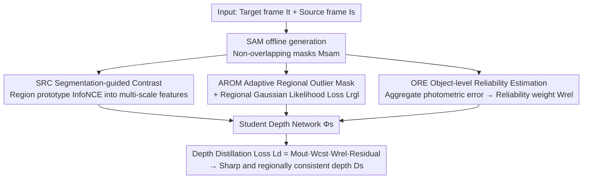

# RoSAMDepth: Robust Self-supervised Depth Estimation Leveraging Segment Anything Model

**Conference**: CVPR 2026  
**Paper**: [CVF Open Access](https://openaccess.thecvf.com/content/CVPR2026/html/Gao_RoSAMDepth_Robust_Self-supervised_Depth_Estimation_Leveraging_Segment_Anything_Model_CVPR_2026_paper.html)  
**Code**: https://github.com/xagao/RoSAMDepth  
**Area**: 3D Vision / Self-supervised Depth Estimation  
**Keywords**: Self-supervised depth estimation, SAM object-level prior, Robust depth, Contrastive representation learning, Pseudo-label reliability

## TL;DR
RoSAMDepth utilizes object-level masks generated offline by SAM as priors, injecting them into a self-supervised monocular depth framework from three perspectives: "representation space contrast," "region-level outlier suppression + Gaussian likelihood smoothing," and "object-level reliability weighting." This allows the model to predict depth with sharper boundaries and better intra-object consistency under adverse conditions such as night and rain.

## Background & Motivation
**Background**: Self-supervised monocular depth estimation replaces expensive ground truth depth with geometric constraints (photometric reconstruction consistency) from stereo pairs or monocular videos. It performs well in standard daytime scenes (e.g., Monodepth2, SfM-Learner).

**Limitations of Prior Work**: In adverse conditions such as night, rain, and fog, the photometric consistency assumption collapses, causing a sharp decline in depth quality. Recent works (md4all, Robust-Depth, Syn2Real-Depth) pursue uniform robustness through GAN-based weather augmentation + teacher-student distillation or synthetic-to-real adaptation. However, they treat degraded areas **uniformly**, ignoring semantic/object-level differences—resulting in divergent depth within objects, blurred boundaries, and even misidentifying background buildings as continuous foreground.

**Key Challenge**: Depth should be "smooth within the same continuous object region" and "allow sharp depth jumps at object edges." Existing methods lack an understanding of object-level spatial relationships and cannot evaluate the reliability of depth cues at the object level. Conventional boundary-aware smoothness losses only generate gradients near image edges and are powerless against regions that are "incorrect but locally smooth." Conventional pixel-level pseudo-label quality metrics also produce "false reliability" because pixels of the same object have similar appearances.

**Goal**: Systematically introduce object-level information into robust self-supervised depth estimation, decomposed into two sub-problems: (1) how to make the feature space object-aware; (2) how to reform supervision signals (smoothness constraints + pseudo-label reliability) using object priors.

**Key Insight**: The authors observe that semantic segmentation is limited by predefined categories, fails to distinguish different instances of the same class, and has poor cross-domain generalization. In contrast, SAM is a universal segmentation model pre-trained on massive diverse data, capable of instance segmentation and demonstrating strong zero-shot robustness to unseen objects and weather. Thus, it is a natural source for object-level priors. Crucially, SAM masks are **all pre-generated offline**, introducing no extra inference overhead during training.

**Core Idea**: Use SAM’s object-level masks to simultaneously reform "representation learning" and "depth supervision"—mask-guided regional prototype contrast makes features object-aware, while regional outlier masks + Gaussian likelihood losses enforce regional smoothness, and object-level reliability estimation focuses distillation supervision on trustworthy regions.

## Method

### Overall Architecture
RoSAMDepth is built upon the "synthetic adaptation → real adaptation" paradigm of Syn2Real-Depth, inheriting its fixed teacher network $\Phi_t$ trained during the synthetic stage. This work only modifies the student network $\Phi_s$ during the real adaptation stage (initialized from the teacher). The inputs are the target frame $I_t$ and adjacent source frames $I_s$, with supervision derived from photometric reprojection consistency. An additional input is the object mask $M_{sam}$ generated offline by SAM in "segment-everything" mode and post-processed for non-overlapping coverage. The entire pipeline revolves around two complementary lines: **object-aware representation learning** (SRC injects segmentation priors into multi-scale decoded features) and **depth learning with object-level priors** (AROM generates outlier suppression masks $M_{out}$ and uses regional Gaussian likelihood loss $L_{rgl}$ for regional smoothness, while ORE estimates object-level reliability to form a weight map $W_{rel}$). Both lines jointly modulate the depth distillation loss $L_d$ to train the student depth $D_s$.

### Key Designs

**1. SRC: Segmentation-guided Representation Contrast: Injecting object-awareness at the feature level rather than the depth level**

Addressing the "lack of object-level spatial understanding," SRC uses SAM masks for region-prototype-based contrastive learning to transfer segmentation priors into the multi-scale feature space of the depth decoder. Specifically, for each scale $s$, the mask is first resized to the resolution of that layer using nearest-neighbor interpolation to obtain $M^{(s)}_{sam}$. Then, channel-normalized pixel features within each segmented region are averaged to obtain region prototypes $pt^{(s)}_i = \frac{1}{|M^{(s)}_{sam,i}|}\sum_{(x,y)\in M^{(s)}_{sam,i}} F^{(s)}_{x,y}$ on a unit hypersphere. An InfoNCE-style loss $L_{src}$ is used to pull each pixel feature closer to its own region prototype and push it away from others, forming compact clusters in the feature space. A critical design choice is placing contrast in the **feature space** rather than directly constraining the final depth. Since SAM often over-segments objects, forcing depth discontinuities at every boundary would introduce erroneous supervision. Feature-space contrast allows the network to **implicitly** learn object-aware representations without explicitly rewriting depth values. Ablation studies (Tab. 5) show that applying SRC directly to predicted depth $D_s$ actually degrades performance (Night AbsRel 0.1694 vs. 0.1667 in Ours), confirming this judgment.

**2. AROM + Regional Gaussian Likelihood Loss: Extending smoothness constraints from "boundaries" to "regions"**

Conventional first-order smoothness loss $L_{sm}=|\partial_x d^*|e^{-|\partial_x I|}+|\partial_y d^*|e^{-|\partial_y I|}$ uses image edges as weights to avoid cross-boundary penalties, but it only generates strong gradients near depth boundaries. For regions that are "incorrectly estimated but locally smooth" (e.g., background buildings misjudged as foreground), $|\partial d^*|$ is small, and the loss fails to respond. AROM re-interprets such errors as "regional outliers within the same object." It first calculates the mean $d_{t,i}$ and standard deviation $\sigma_{t,i}$ of the teacher's inverse depth for each object $M_{sam,i}$ to obtain a dense deviation map $\delta=\sum_i M_{sam,i}\cdot|d_t-d_{t,i}|/\sigma_{t,i}$. Using an **adaptive threshold** $\tau=\sum_i M_{sam,i}(\tau_0+\lambda\sigma_{t,i})$—which relaxes outlier criteria in high-variance regions (e.g., ground, building surfaces) and tightens them in uniform regions—it generates the outlier suppression mask $M_{out}=1-S_\kappa(S(\delta-\tau))$. The accompanying regional Gaussian likelihood loss models the inverse depth of each region as $\mathcal{N}(d_{t,i},\sigma_{t,i})$ and weights it by $1-M_{out}$: $L_{rgl}=(1-M_{out})\cdot\sum_i M_{sam,i}\cdot(d_s-d_{t,i})^2/\sigma^2_{t,i}$. This concentrates supervision on outlier regions, generating strong, non-local gradients in erroneous areas. $M_{out}$ also serves a dual purpose: guiding $L_{rgl}$ and suppressing error propagation caused by outliers in the distillation loss. Ablation (Tab. 4) shows this combination outperforms image-aware or SAM-boundary-aware smoothness losses.

**3. ORE: Object-level Reliability Estimation: Scaling pseudo-label reliability from pixel-level to object-level**

Using pixel-level photometric errors as pseudo-label reliability indicators has a fundamental flaw: similar appearances of pixels within an object can cause "accidental alignment." Even if the overall depth is incorrectly scaled, the internal photometric error remains low, appearing "falsely reliable" (Fig. 4 shows that scaling a car's depth by 0.25–4.0x results in only local changes in pixel error). ORE evaluates reliability at the object level instead. After calculating the standard pixel photometric error $pe=\alpha\cdot L1(I_t,I_{t'})+(1-\alpha)\cdot SSIM(I_t,I_{t'})$, it aggregates them using SAM masks to find the average error $\overline{pe_i}$ for each region. These are compared with the global average error $\overline{pe}$ to obtain a reliability map $R=\sum_i M_{sam,i}\cdot\exp(-\beta\max\{0,\overline{pe_i}-\overline{pe}\}/\overline{pe})$. The final weight map is $W_{rel}=R+\epsilon$ (where $\epsilon$ is a bias to retain weak supervision). The intuition is that objects whose errors deviate significantly from the global mean are judged as low reliability. Thus, an entire incorrectly scaled car is correctly identified as an unreliable region, rather than just marking scattered pixels.

### Loss & Training
The final depth distillation loss is $L_d=M_{out}\cdot W_{cst}\cdot W_{rel}\cdot\frac{D_s-D_t}{D_s}$ ($W_{cst}$ is the consistency re-weighting map from the Syn2Real-Depth baseline). The total loss is $L_{total}=L_d+\lambda_1 L_{src}+\lambda_2 L_{rgl}+L_{ext}$, where $L_{ext}$ includes auxiliary losses from the baseline. The teacher $\Phi_t$ uses the fixed synthetic pre-trained model provided by the baseline. The student $\Phi_s$ is initialized from the teacher and trained for 10 epochs using Adam optimizer with an initial learning rate of $8\times10^{-5}$, decaying by 0.5 every 5 epochs. SAM uses the standard ViT-H model, and all masks are generated offline prior to training.

## Key Experimental Results

### Main Results
On nuScenes (covering Day-Clear, Night, and Day-Rain), Ours achieves an average relative gain of AbsRel 2.8% / SqRel 2.7% / RMSE 0.6% / $\delta_1$ 0.9% over the strongest baseline Syn2Real-Depth. Below are single-frame results for Night and Day-Rain:

| Dataset/Condition | Metric | Ours (Single) | Syn2Real-Depth | md4all-DD |
|--------|------|------|----------|------|
| nuScenes Night | AbsRel↓ | **0.1742** | 0.1792 | 0.1921 |
| nuScenes Night | $\delta_1$↑ | **72.52** | 71.08 | 71.07 |
| nuScenes Day-Rain | AbsRel↓ | **0.1298** | 0.1331 | 0.1414 |
| nuScenes Day-Rain | RMSE↓ | **6.801** | 6.926 | 7.228 |

On Oxford RobotCar (Single-frame testing only), Ours shows gains over Syn2Real-Depth of AbsRel 4.4% / SqRel 7.6% / RMSE 4.7% / $\delta_1$ 0.9%:

| Condition | Metric | Ours | Syn2Real-Depth | md4all-DD |
|------|------|------|----------|------|
| RobotCar Day | AbsRel↓ | **0.1006** | 0.1063 | 0.1128 |
| RobotCar Night | AbsRel↓ | **0.1066** | 0.1103 | 0.1219 |
| RobotCar Night | $\delta_1$↑ | **87.03** | 86.15 | 84.86 |

> Note: AbsRel/SqRel/RMSE are depth errors (lower is better); $\delta_1$ is the threshold accuracy percentage (higher is better). Ground truth evaluation range: 0.1–80 m for nuScenes, 0.1–50 m for RobotCar.

### Ablation Study
Component-wise ablation (nuScenes Night):

| Config (SRC / AROM / Lrgl / ORE) | AbsRel↓ | $\delta_1$↑ | Description |
|------|---------|-----|------|
| ORE only | 0.1734 | 73.14 | Single component |
| SRC only | 0.1725 | 73.21 | Single component |
| AROM only | 0.1711 | 73.24 | Single component |
| AROM+Lrgl | 0.1699 | 73.67 | Smoothing combo |
| AROM+Lrgl+ORE | 0.1673 | 73.89 | With reliability |
| Full (All four) | **0.1667** | **73.95** | Full model |

Specific Ablations: Smoothness Loss (Tab. 4, Night AbsRel) — Image-edge-aware 0.1735 / SAM-boundary-aware 0.1732 / Ours AROM+$L_{rgl}$ **0.1699**; SRC position (Tab. 5) — On depth $D_s$ 0.1694 / On features (Ours) **0.1667**.

### Key Findings
- SRC has limited benefits when used alone but is crucial when combined with other components: feature-level enhancement only becomes effective as the predicted depth aligns with SAM masks. Direct depth constraints were hampered by noise from SAM over-segmentation.
- AROM and $L_{rgl}$ are mutually indispensable: without AROM, the distillation loss cannot suppress pseudo-label outliers; without $L_{rgl}$, regional smoothness supervision is missing. Removing either degrades performance.
- Object-level reliability (ORE) outperforms pixel-level metrics in identifying objects that are "globally incorrectly scaled but internally falsely reliable," focusing distillation on truly trustworthy regions.

## Highlights & Insights
- Re-diagnosing "smoothness failure" as a "regional outlier" problem within objects is an elegant perspective shift: while conventional losses fail in regions that are incorrect but locally smooth, AROM explicitly identifies these regions using regional statistics and adaptive thresholds to provide strong gradients.
- ORE uses a clear counter-example (scaling total car depth while pixel error remains nearly unchanged) to point out the fundamental flaw of pixel-level pseudo-label metrics, solving it by comparing regional aggregated errors to the global mean. This idea is transferable to any self-supervised task relying on photometric consistency as a reliability proxy.
- Using SAM entirely as an **offline prior** avoids introducing SAM forward passes during training or inference, achieving nearly zero extra inference overhead, which is highly practical.
- $M_{out}$'s dual use (driving $L_{rgl}$ and suppressing distillation error propagation) is an efficient design choice.

## Limitations & Future Work
- Strong dependency on SAM mask quality and the offline generation pipeline; SAM’s over-segmentation is the root cause for placing SRC in the feature space. If SAM performs poorly (e.g., extreme low light or severe degradation), the object prior itself might be unreliable.
- The method is built on the Syn2Real-Depth paradigm and its fixed teacher, inheriting dependencies on synthetic data and teacher quality. Ours only modifies the real adaptation stage. ⚠️ Details on the synthetic stage and pose network training are not expanded in the main text and require supplementary materials.
- Validated only on autonomous driving datasets (nuScenes, Oxford RobotCar); generalization to indoor or general scenes is untested. Gains in the RMSE dimension are relatively smaller compared to AbsRel (only 0.6% on nuScenes).
- Several hyperparameters ($\tau_0, \lambda, \kappa, \beta, \epsilon, \lambda_1, \lambda_2$) lack sensitivity analysis, making tuning costs for practical deployment unknown.

## Related Work & Insights
- **vs. Syn2Real-Depth (Baseline)**: Both follow the synthetic-to-real adaptation and teacher-student distillation. Ours injects SAM object-level priors (SRC/AROM/ORE) during real adaptation, consistently surpassing the baseline across almost all metrics and conditions. The core difference is "object-level vs. uniform degradation handling."
- **vs. md4all / Robust-Depth / WeatherDepth**: These rely on GAN weather augmentation + teacher-student frameworks for robustness but still process all regions uniformly. Ours refines representations and supervision signals using object-level priors, yielding sharper boundaries and better consistency.
- **vs. Depth methods using semantic segmentation**: Semantic segmentation cannot distinguish instances of the same class, has a fixed category set, and generalizes poorly across domains. SAM is instance-aware, zero-shot robust, and more stable across weather conditions, providing a superior source for object priors.

## Rating
- Novelty: ⭐⭐⭐⭐ Systematically applying offline SAM masks to robust self-supervised depth for the first time, with independent insights from three angles (notably the regional outlier view of AROM and object-level reliability of ORE).
- Experimental Thoroughness: ⭐⭐⭐⭐ Solid results across multiple conditions on two driving datasets with detailed component/loss/position ablations; lacks hyperparameter sensitivity and indoor generalization.
- Writing Quality: ⭐⭐⭐⭐ Motivations are clearly explained using counter-examples in Fig. 3/Fig. 4, with clear mapping between formulas and components.
- Value: ⭐⭐⭐⭐ Deep robustness in adverse conditions is practical for autonomous driving; the offline SAM prior approach is easily reusable.

<!-- RELATED:START -->

## Related Papers

- [\[CVPR 2026\] Depth Any Panoramas: A Foundation Model for Panoramic Depth Estimation](depth_any_panoramas_a_foundation_model_for_panoramic_depth_estimation.md)
- [\[NeurIPS 2025\] Jasmine: Harnessing Diffusion Prior for Self-Supervised Depth Estimation](../../NeurIPS2025/3d_vision/jasmine_harnessing_diffusion_prior_for_self-supervised_depth_estimation.md)
- [\[CVPR 2026\] SAMosaic3D: Modular Scene Assembly for Real-Time 3D Segment Anything](samosaic3d_modular_scene_assembly_for_real-time_3d_segment_anything.md)
- [\[CVPR 2026\] SCAPO: Self-Supervised Category-Level Articulated Pose Estimation from a Single 3D Observation](scapo_self-supervised_category-level_articulated_pose_estimation_from_a_single_3.md)
- [\[CVPR 2026\] SeeGroup: Multi-Layer Depth Estimation of Transparent Surfaces via Self-Determined Grouping](seegroup_multi-layer_depth_estimation_of_transparent_surfaces_via_self-determine.md)

<!-- RELATED:END -->
